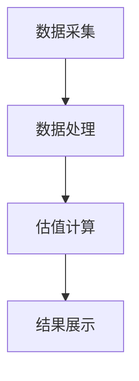

                 


# 《格雷厄姆特价股票理论对数字原生企业估值的启示》

## 关键词：
- 格雷厄姆投资理论，数字原生企业，股票估值，价值投资，数字企业

## 摘要：
本文探讨了格雷厄姆的价值投资理论如何应用于数字原生企业的估值。通过分析数字企业的特点，结合格雷厄姆的安全边际、内在价值等核心概念，提出了一种改进的估值方法，并通过系统架构和项目实战验证了其有效性。

---

# 第一部分: 格雷厄姆特价股票理论的背景与基础

## 第1章: 格雷厄姆投资理论概述

### 1.1 格雷厄姆价值投资的核心理念

#### 1.1.1 价值投资的基本原则
- **安全边际**：购买价格低于内在价值，确保投资的安全性。
- **市场先生**：市场情绪波动影响股票价格，但长期反映其真实价值。
- **内在价值**：企业未来现金流的现值，是估值的核心。

#### 1.1.2 格雷厄姆的选股标准
- **低市盈率法**：市盈率低于市场平均水平的企业。
- **高股息率**：股息收益率较高的企业。
- **低市净率法**：市净率低于行业平均水平的企业。

### 1.2 格雷厄姆投资理论的数学模型

#### 1.2.1 内在价值计算公式
$$
\text{内在价值} = \sum_{t=1}^{n} \frac{\text{现金流}_t}{(1 + r)^t}
$$

其中：
- $\text{现金流}_t$ 是第 $t$ 年的现金流。
- $r$ 是折现率。

#### 1.2.2 安全边际计算公式
$$
\text{安全边际} = \text{内在价值} \times (1 - \frac{1}{\text{安全边际系数}})
$$

### 1.3 格雷厄姆理论的现代发展

#### 1.3.1 与现代金融理论的结合
- **现代投资组合理论**：通过分散投资降低风险，与格雷厄姆的安全边际理念结合。
- **行为金融学**：解释市场情绪对价格的影响，帮助识别低估机会。

#### 1.3.2 数字化时代的影响
- 数据驱动的估值方法。
- 量化分析工具的应用，如机器学习模型预测现金流。

---

# 第二部分: 数字原生企业的特点与估值挑战

## 第2章: 数字原生企业的定义与特征

### 2.1 数字原生企业的核心特征

#### 2.1.1 轻资产模式
- 依赖知识产权和用户数据，而非实体资产。
- 例如：互联网公司、软件企业。

#### 2.1.2 高增长与高波动性
- 数字企业的收入增长快，但市场波动大。
- 例如：科技初创企业的股价波动。

#### 2.1.3 用户粘性与网络效应
- 用户粘性高，依赖用户基础。
- 网络效应：用户数量增加，价值提升。

### 2.2 数字原生企业的财务特征

#### 2.2.1 高研发投入
- 研发费用占比较高，影响短期盈利能力。
- 例如：科技公司的研发支出。

#### 2.2.2 财务指标分析
- **市盈率（P/E）**：高增长企业可能市盈率高。
- **市净率（P/B）**：轻资产企业市净率低。
- **EV/EBITDA**：衡量企业价值的指标。

---

# 第三部分: 格雷厄姆理论与数字原生企业估值的结合

## 第3章: 估值方法的改进与应用

### 3.1 改进的格雷厄姆估值方法

#### 3.1.1 低市盈率法的调整
- 考虑企业增长率和行业特性。
- 例如：对于高增长数字企业，适当提高市盈率的容忍度。

#### 3.1.2 内在价值的重新计算
- 结合数字企业的特点，调整现金流预测模型。
- 例如：考虑用户增长和技术创新对企业价值的影响。

#### 3.1.3 股息率的重新定义
- 对于非盈利数字企业，采用其他指标如用户增长率为补充。

### 3.2 案例分析：数字原生企业的估值

#### 3.2.1 某互联网公司估值案例
- 数据：历史财务数据、用户增长数据、行业基准。
- 计算步骤：计算内在价值、比较市场价格、确定安全边际。

#### 3.2.2 结果分析
- 如果市场价格低于内在价值，则存在低估机会。
- 例如：某互联网公司股价为 $40，内在价值为 $50，则安全边际为 $10。

---

# 第四部分: 数字原生企业估值系统的架构与实现

## 第4章: 系统架构设计

### 4.1 系统功能模块

#### 4.1.1 数据采集模块
- 数据源：公司财务报表、行业报告、市场数据。
- 数据处理：清洗、转换、存储。

#### 4.1.2 估值计算模块
- 算法：改进的格雷厄姆估值方法。
- 输出：内在价值、安全边际、估值结果。

#### 4.1.3 结果展示模块
- 可视化：仪表盘展示估值结果、市场趋势、行业对比。

### 4.2 系统架构图（Mermaid）



---

## 第5章: 项目实战与代码实现

### 5.1 环境安装

#### 5.1.1 Python环境配置
- 安装Python 3.8+。
- 安装必要的库：Pandas、NumPy、Matplotlib。

### 5.2 核心代码实现

#### 5.2.1 数据处理代码
```python
import pandas as pd

# 读取数据
data = pd.read_csv('stock_data.csv')

# 数据清洗
data.dropna(inplace=True)
data['PE'] = data['Price'] / data['Earnings']
```

#### 5.2.2 估值计算代码
```python
def calculate_intrinsic_value(eps, growth_rate, discount_rate):
    cash_flows = []
    for i in range(5):
        cash_flows.append(eps * (1 + growth_rate)**i)
    iv = sum(cash_flows / (1 + discount_rate)**i for i in range(5))
    return iv

# 示例计算
iv = calculate_intrinsic_value(2, 0.2, 0.1)
print(f"内在价值: {iv:.2f}")
```

#### 5.2.3 结果可视化代码
```python
import matplotlib.pyplot as plt

plt.plot(data['PE'], data['Price'], 'bo')
plt.xlabel('市盈率')
plt.ylabel('股价')
plt.title('市盈率与股价关系图')
plt.show()
```

---

## 第6章: 最佳实践与总结

### 6.1 小结与注意事项

#### 6.1.1 数据质量的重要性
- 数据清洗和验证是关键步骤。
- 使用多个数据源交叉验证。

#### 6.1.2 模型假设的合理性
- 假设应基于企业实际情况。
- 定期更新模型参数。

### 6.2 未来研究方向

#### 6.2.1 动态调整模型
- 根据市场变化自动调整参数。
- 使用机器学习优化预测模型。

#### 6.2.2 扩展应用领域
- 研究其他类型数字企业的估值方法。
- 探索跨国数字企业的估值策略。

---

# 结语

通过本文的分析，我们展示了如何将格雷厄姆的价值投资理论应用于数字原生企业的估值。结合理论与实践，提出了一种改进的估值方法，并通过系统架构和项目实战验证了其有效性。未来的研究可以在模型优化和应用领域拓展方面继续深入。

---

# 作者：AI天才研究院 & 禅与计算机程序设计艺术

