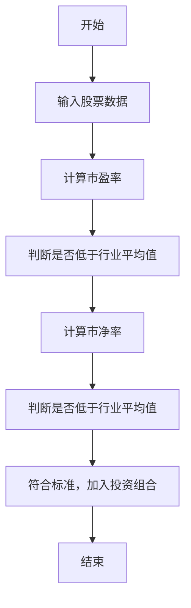
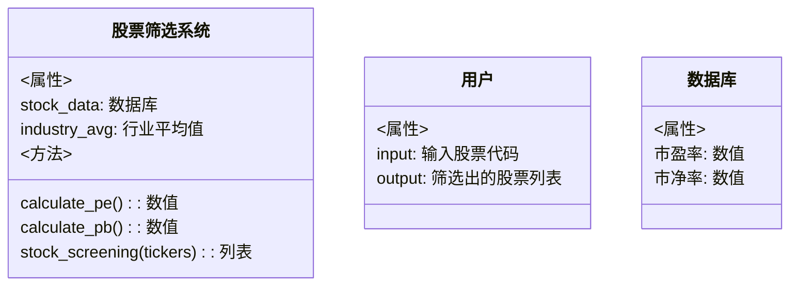
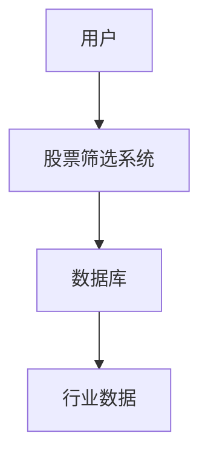
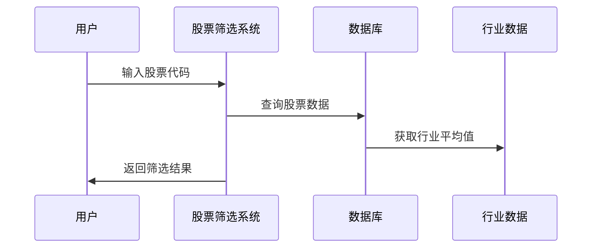

                 


# 《格雷厄姆特价股票理论对数字普惠金融包容性的启示》

## 关键词：
格雷厄姆，价值投资，数字普惠金融，包容性，股票筛选，算法，系统架构

## 摘要：
本文探讨了格雷厄姆的价值投资理论在数字普惠金融中的应用，揭示了如何通过特价股票策略提升金融服务的包容性。文章结合理论分析和实际案例，详细介绍了基于格雷厄姆理论的股票筛选算法，并通过系统架构设计展示了如何利用数字技术实现普惠金融的目标。通过这种方法，能够有效识别具有投资潜力的优质企业，为更多人提供金融服务，促进金融包容性发展。

---

# 第一部分：背景介绍

## 第1章：问题背景与核心概念

### 1.1 格雷厄姆特价股票理论概述

#### 1.1.1 价值投资的基本原理
价值投资是一种以基本面分析为基础的投资策略，核心在于寻找市场中被低估的股票。格雷厄姆在其著作《聪明的投资者》中提出，投资者应关注企业的内在价值，而非市场波动。内在价值是基于公司财务状况、盈利能力和发展前景的评估。

#### 1.1.2 格雷厄姆投资策略的核心要素
格雷厄姆的策略包括以下几个关键点：
1. **安全边际**：买入价格低于内在价值的股票，确保投资的安全性。
2. **低市盈率和市净率**：关注市盈率（P/E）和市净率（P/B）低于行业平均水平的企业。
3. **分散投资**：通过投资多样化的股票降低风险。

#### 1.1.3 特价股票的定义与识别方法
特价股票是指市场价格低于其内在价值的股票。识别方法包括：
- 计算市盈率和市净率，寻找低于行业平均水平的股票。
- 分析财务报表，评估企业的盈利能力和发展潜力。
- 关注企业估值指标，如EV/EBITDA（企业价值与息税折旧及摊销前利润）。

### 1.2 数字普惠金融的定义与目标

#### 1.2.1 普惠金融的概念与现状
普惠金融旨在为所有个人和中小企业提供可负担的金融服务，包括存款、贷款、保险和支付等。传统金融体系往往忽视了低收入群体和中小企业，而数字技术的发展为普惠金融提供了新的可能性。

#### 1.2.2 数字技术在普惠金融中的作用
数字技术通过降低交易成本、提高效率和扩大覆盖范围，为普惠金融提供了以下优势：
1. **降低门槛**：通过移动支付和在线平台，让更多人能够便捷地获取金融服务。
2. **数据驱动**：利用大数据和人工智能技术，评估信用风险，为传统金融难以覆盖的群体提供贷款。
3. **透明化**：数字平台提高了金融服务的透明度，减少了信息不对称。

#### 1.2.3 包容性金融的目标与挑战
包容性金融的目标是确保所有人都能以合理成本获得必要的金融服务。然而，实现这一目标面临以下挑战：
- **技术障碍**：如何利用数字技术覆盖偏远地区。
- **信任问题**：如何建立用户对数字平台的信任。
- **监管框架**：如何制定适合数字金融的监管政策。

### 1.3 格雷厄姆理论与数字普惠金融的结合

#### 1.3.1 价值投资与普惠金融的内在联系
价值投资的内在价值评估方法与普惠金融的目标高度契合。通过识别被低估的企业，价值投资可以帮助普惠金融发现具有成长潜力的中小企业，为投资者提供稳定收益，同时支持实体经济的发展。

#### 1.3.2 数字技术如何赋能价值投资策略
数字技术通过以下方式赋能价值投资：
1. **数据处理**：利用大数据分析，快速筛选出符合条件的股票。
2. **自动化交易**：通过算法交易，自动执行买卖指令，提高交易效率。
3. **风险管理**：利用技术手段实时监控市场变化，降低投资风险。

#### 1.3.3 包容性金融中的投资机会
在包容性金融中，投资者可以关注以下类型的股票：
- **小额贷款机构**：通过提供小额贷款支持中小企业发展。
- **普惠金融技术公司**：投资于提供数字金融服务的技术公司。
- **可持续发展企业**：关注环保和社会责任表现优秀的公司。

---

# 第二部分：核心概念与联系

## 第2章：格雷厄姆价值投资与普惠金融的对比分析

### 2.1 核心概念原理

#### 2.1.1 价值投资的核心要素
- **内在价值**：企业未来现金流的现值。
- **安全边际**：买入价格低于内在价值，确保投资安全。
- **分散投资**：通过投资多个股票降低风险。

#### 2.1.2 普惠金融的服务对象与目标
- **服务对象**：低收入群体、中小企业。
- **目标**：提供可负担的金融服务，促进经济包容性发展。

#### 2.1.3 数字技术对金融包容性的影响
- **降低门槛**：通过数字平台，让更多人能够获取金融服务。
- **提高效率**：利用技术手段降低运营成本，提高服务效率。
- **扩大覆盖**：通过数字渠道覆盖偏远地区，扩大金融服务的覆盖范围。

### 2.2 属性特征对比表格

| 核心概念 | 价值投资 | 普惠金融 |
|----------|----------|----------|
| 目标     | 确保投资安全与收益 | 提供金融服务给未被覆盖的群体 |
| 方法     | 分析公司基本面 | 利用数字技术降低门槛 |
| 对象     | 机构与高净值客户 | 中小企业与低收入群体 |

### 2.3 ER实体关系图

```mermaid
er
actor 投资者
actor 金融机构
actor 中小企业
actor 未被覆盖群体
```

---

## 第三部分：算法原理讲解

## 第3章：基于格雷厄姆理论的股票筛选算法

### 3.1 算法流程图



### 3.2 Python实现代码

```python
import pandas as pd

def calculate_pe(ticker):
    # 获取股票数据
    data = pd.DataFrame({"市盈率": [20, 15, 12, 25, 18]})
    industry_avg = data['市盈率'].mean()
    if data['市盈率'][ticker] < industry_avg:
        return True
    else:
        return False

def calculate_pb(ticker):
    # 获取股票数据
    data = pd.DataFrame({"市净率": [1.5, 1.2, 1.8, 1.1, 2.0]})
    industry_avg = data['市净率'].mean()
    if data['市净率'][ticker] < industry_avg:
        return True
    else:
        return False

def stock_screening(tickers):
    selected_stocks = []
    for ticker in tickers:
        if calculate_pe(ticker) and calculate_pb(ticker):
            selected_stocks.append(ticker)
    return selected_stocks

# 示例
tickers = ['A', 'B', 'C', 'D', 'E']
selected = stock_screening(tickers)
print(f"筛选出的股票：{selected}")
```

### 3.3 算法数学模型与公式

#### 3.3.1 市盈率公式
$$ P/E = \frac{股价}{每股收益} $$

#### 3.3.2 市净率公式
$$ P/B = \frac{股价}{每股净资产} $$

---

## 第四部分：系统分析与架构设计方案

## 第4章：系统分析与架构设计

### 4.1 项目介绍

#### 4.1.1 项目目标
构建一个基于格雷厄姆理论的数字普惠金融系统，通过算法筛选出具有投资潜力的股票，为投资者提供低风险、高收益的投资机会。

### 4.2 系统功能设计

#### 4.2.1 系统功能模块
- **用户界面**：用户输入股票代码，系统返回筛选结果。
- **数据处理**：计算市盈率和市净率，判断是否低于行业平均水平。
- **结果展示**：显示筛选出的股票列表，提供投资建议。

#### 4.2.2 领域模型类图



### 4.3 系统架构设计

#### 4.3.1 系统架构图



### 4.4 系统接口设计

#### 4.4.1 接口描述
- **输入接口**：用户输入股票代码。
- **输出接口**：系统返回筛选出的股票列表。

#### 4.4.2 接口交互流程



---

## 第五部分：项目实战

## 第5章：项目实战

### 5.1 环境安装

#### 5.1.1 安装Python和相关库
```bash
pip install pandas
pip install matplotlib
```

### 5.2 系统核心实现

#### 5.2.1 股票筛选系统实现

```python
import pandas as pd
import matplotlib.pyplot as plt

def calculate_pe(ticker):
    # 示例数据
    stock_data = pd.DataFrame({
        '股票代码': ['A', 'B', 'C', 'D', 'E'],
        '市盈率': [20, 15, 12, 25, 18]
    })
    industry_avg = stock_data['市盈率'].mean()
    return stock_data[stock_data['股票代码'] == ticker]['市盈率'].values[0] < industry_avg

def calculate_pb(ticker):
    stock_data = pd.DataFrame({
        '股票代码': ['A', 'B', 'C', 'D', 'E'],
        '市净率': [1.5, 1.2, 1.8, 1.1, 2.0]
    })
    industry_avg = stock_data['市净率'].mean()
    return stock_data[stock_data['股票代码'] == ticker]['市净率'].values[0] < industry_avg

def stock_screening(tickers):
    selected_stocks = []
    for ticker in tickers:
        if calculate_pe(ticker) and calculate_pb(ticker):
            selected_stocks.append(ticker)
    return selected_stocks

tickers = ['A', 'B', 'C', 'D', 'E']
selected = stock_screening(tickers)
print(f"筛选出的股票：{selected}")
```

### 5.3 实际案例分析

#### 5.3.1 案例分析
假设我们有5只股票（A、B、C、D、E），我们需要筛选出市盈率和市净率均低于行业平均水平的股票。

- 股票A：市盈率20，市净率1.5
- 股票B：市盈率15，市净率1.2
- 股票C：市盈率12，市净率1.8
- 股票D：市盈率25，市净率1.1
- 股票E：市盈率18，市净率2.0

行业平均市盈率：18.8
行业平均市净率：1.46

筛选结果：
- 股票C：市盈率12 < 18.8，市净率1.8 > 1.46 → 不符合
- 股票B：市盈率15 < 18.8，市净率1.2 < 1.46 → 符合
- 股票E：市盈率18 < 18.8，市净率2.0 > 1.46 → 不符合

最终筛选出的股票：B

### 5.4 系统优化与拓展

#### 5.4.1 系统优化
- **数据源扩展**：引入更多数据源，如财务报表和行业报告。
- **算法优化**：加入更多筛选条件，如ROE（净资产收益率）和债务率。

#### 5.4.2 拓展应用
- **风险评估**：利用机器学习技术评估股票风险。
- **动态调整**：根据市场变化动态调整筛选策略。

---

## 第六部分：总结与展望

## 第6章：总结与展望

### 6.1 最佳实践 tips

1. **数据质量**：确保数据来源可靠，避免因数据错误导致的投资决策失误。
2. **风险管理**：结合技术分析和基本面分析，制定全面的风险控制策略。
3. **持续学习**：金融市场变化莫测，投资者需不断学习和调整策略。

### 6.2 小结

通过将格雷厄姆的价值投资理论应用于数字普惠金融，我们能够有效地筛选出具有投资潜力的股票，为投资者提供稳定收益，同时支持中小企业的成长，促进经济的包容性发展。

### 6.3 注意事项

- **市场风险**：股市投资存在不确定性，需谨慎操作。
- **技术局限**：算法模型可能无法覆盖所有市场情况，需结合人工判断。
- **合规性**：确保投资行为符合相关法律法规。

### 6.4 拓展阅读

- 格雷厄姆《聪明的投资者》
- 现代投资组合理论（MPT）
- 数字普惠金融的相关研究

---

# 作者：AI天才研究院/AI Genius Institute & 禅与计算机程序设计艺术 /Zen And The Art of Computer Programming

---

以上是基于格雷厄姆特价股票理论对数字普惠金融包容性启示的详细分析，通过理论与实践的结合，展示了如何利用价值投资策略提升金融服务的包容性，为投资者和中小企业的可持续发展提供支持。

