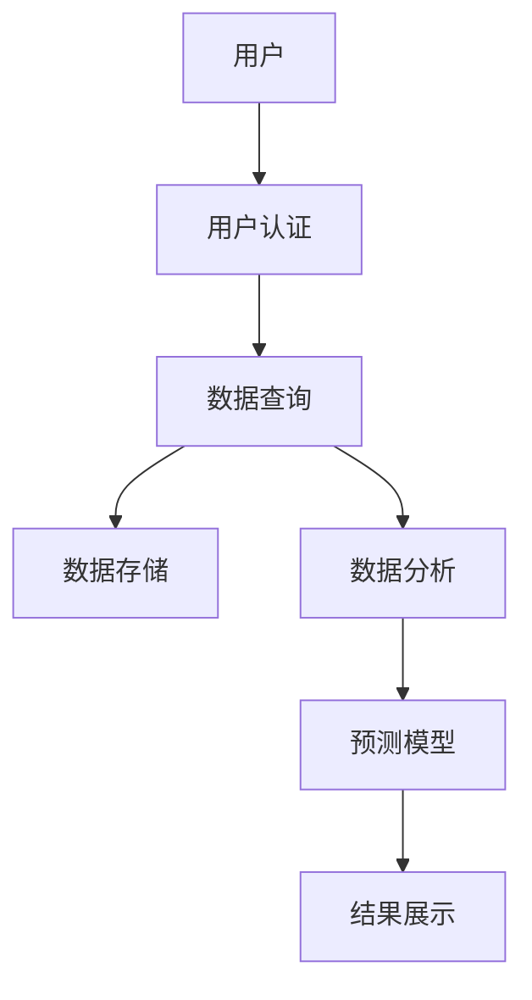
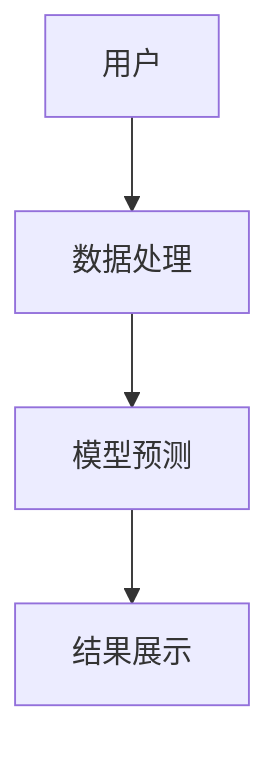
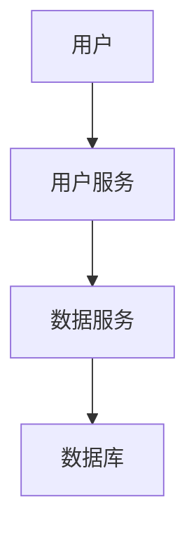

                 


# 格雷厄姆特价股票理论对普惠金融科技的启示

## 关键词：
- 格雷厄姆投资理论
- 普惠金融科技
- 价值投资
- 人工智能
- 金融系统架构

## 摘要：
本文探讨格雷厄姆的价值投资理论如何启发普惠金融科技的发展。通过分析格雷厄姆的安全边际和低市盈率策略，结合现代技术如大数据和AI，优化普惠金融模式，解决传统金融的不足。文章详细阐述理论与技术的结合，系统设计，项目实现，并总结启示。

---

# 引言

## 格雷厄姆投资理论的核心
- **价值投资**：购买低于内在价值的股票。
- **安全边际**：买入价远低于内在价值，降低风险。
- **低市盈率股票**：选择市盈率低的公司，降低投资风险。

## 普惠金融科技的背景
- **普惠金融**：让所有人获得金融服务。
- **传统金融的局限**：难以覆盖低收入者。
- **科技的推动**：利用技术解决普惠问题。

## 结合的意义
- **理论与技术结合**：利用格雷厄姆的策略优化金融科技。
- **技术创新**：大数据和AI提升普惠金融服务效率。

---

# 第1章: 格雷厄姆特价股票理论概述

## 格雷厄姆投资理论的核心概念

### 1.1 价值投资的基本原则
- **内在价值**：资产的公平市场价值。
- **市场价格波动**：短期波动不影响长期价值。
- **安全边际**：买入价低于内在价值。

### 1.2 格雷厄姆投资策略的特点
- **低市盈率**：选择市盈率低于市场平均的股票。
- **高质量企业**：财务健康，盈利稳定。
- **分散投资**：降低风险。

### 1.3 格雷厄姆理论的现代应用
- **量化分析**：利用技术分析股票。
- **风险管理**：控制投资组合风险。
- **长期视角**：投资长期回报。

---

# 第2章: 普惠金融科技的定义与发展

## 2.1 普惠金融的背景与目标

### 2.1.1 传统金融的局限性
- **覆盖不足**：低收入者难以获得服务。
- **成本高**：传统银行服务成本高。
- **效率低**：流程繁琐，耗时长。

### 2.1.2 普惠金融的核心理念
- **包容性**：服务所有人。
- **技术驱动**：利用科技降低门槛。
- **可持续性**：长期提供服务。

### 2.1.3 数字技术的作用
- **移动支付**：普及金融服务。
- **云计算**：降低存储成本。
- **大数据**：精准客户定位。

## 2.2 金融科技的定义与技术基础

### 2.2.1 金融科技的定义
- **定义**：利用技术提升金融服务。
- **技术基础**：大数据、AI、区块链。

### 2.2.2 大数据与AI的应用
- **数据收集**：分析用户行为。
- **AI预测**：预测市场趋势。
- **智能风控**：识别风险。

### 2.2.3 云计算与移动互联网
- **云计算**：高效存储与处理。
- **移动互联网**：随时随地服务。

## 2.3 普惠金融科技的挑战与解决方案

### 2.3.1 信息不对称
- **问题**：投资者获取信息难。
- **解决方案**：公开透明的信息平台。

### 2.3.2 技术风险
- **问题**：系统漏洞与数据泄露。
- **解决方案**：加强安全措施。

### 2.3.3 监管框架
- **问题**：传统监管不适应新技术。
- **解决方案**：创新监管模式。

---

# 第3章: 格雷厄姆理论与普惠金融科技的结合

## 3.1 格雷厄姆理论在普惠金融中的应用

### 3.1.1 价值投资与普惠金融的契合点
- **长期回报**：普惠金融注重长期服务。
- **低市盈率**：选择可持续发展的企业。

### 3.1.2 投资策略的调整
- **分散投资**：降低风险。
- **质量企业**：选择稳定的金融科技公司。

## 3.2 大数据与AI在普惠金融中的应用

### 3.2.1 数据分析
- **数据收集**：收集用户行为数据。
- **预测模型**：预测客户信用风险。

### 3.2.2 AI算法
- **机器学习**：识别市场趋势。
- **自然语言处理**：分析财务报告。

## 3.3 系统架构设计

### 3.3.1 系统功能设计
- **用户模块**：注册、登录、查询。
- **数据模块**：数据收集、分析、存储。
- **AI模块**：预测、推荐、监控。

### 3.3.2 系统架构图



---

# 第4章: 大数据与AI在普惠金融中的应用

## 4.1 数据分析与预测模型

### 4.1.1 数据分析
- **数据收集**：用户行为、交易数据。
- **数据清洗**：去除无效数据。
- **数据建模**：使用回归分析预测风险。

### 4.1.2 AI算法
- **机器学习**：训练分类模型识别欺诈。
- **自然语言处理**：分析合同文本。

## 4.2 系统设计

### 4.2.1 系统功能设计
- **用户交互**：用户提交申请。
- **数据处理**：处理用户数据。
- **模型预测**：预测信用风险。

### 4.2.2 系统架构图



---

# 第5章: 系统架构与设计

## 5.1 系统架构设计

### 5.1.1 分层架构
- **表现层**：用户界面。
- **业务逻辑层**：处理请求。
- **数据访问层**：访问数据库。

### 5.1.2 微服务架构
- **服务拆分**：用户服务、数据服务。
- **服务通信**：使用API。

### 5.1.3 架构图



## 5.2 接口设计

### 5.2.1 HTTP接口
- **RESTful API**：标准接口设计。

### 5.2.2 接口文档
- **Swagger**：记录接口信息。

---

# 第6章: 项目实战

## 6.1 环境安装

### 6.1.1 安装Python
- **安装命令**：`python --version`

### 6.1.2 安装依赖
- **安装命令**：`pip install requests`

## 6.2 核心代码实现

### 6.2.1 数据处理
```python
import pandas as pd

# 读取数据
data = pd.read_csv('data.csv')

# 清洗数据
data.dropna(inplace=True)
```

### 6.2.2 模型训练
```python
from sklearn.model import LinearRegression

model = LinearRegression()
model.fit(X_train, y_train)
```

## 6.3 案例分析
- **案例**：预测客户违约风险。
- **分析**：使用模型评估风险等级。

## 6.4 项目总结
- **总结**：项目实现了普惠金融的系统，提高了效率。

---

# 第7章: 总结与启示

## 7.1 核心观点总结
- **价值投资**：长期视角选择企业。
- **技术驱动**：大数据和AI提升效率。

## 7.2 理论与技术结合的启示
- **互补优势**：理论指导技术应用。
- **创新驱动**：技术创新推动普惠金融发展。

## 7.3 未来展望
- **技术进步**：AI在金融中的应用深化。
- **模式创新**：新的普惠金融模式出现。

---

# 附录

## 术语表
- **格雷厄姆理论**：价值投资理论。
- **普惠金融**：为所有人提供金融服务。
- **大数据**：海量数据的处理和分析。

## 参考文献
1. 格雷厄姆《聪明的投资者》
2. 现代金融科技书籍

## 扩展阅读
- 《大数据时代》
- 《人工智能入门》

---

# 作者
作者：AI天才研究院 & 禅与计算机程序设计艺术

---

这篇文章详细探讨了格雷厄姆的价值投资理论如何启示普惠金融科技的发展，结合了理论与技术，提供了系统的分析与实战案例，为读者提供了全面的理解和实践指导。

