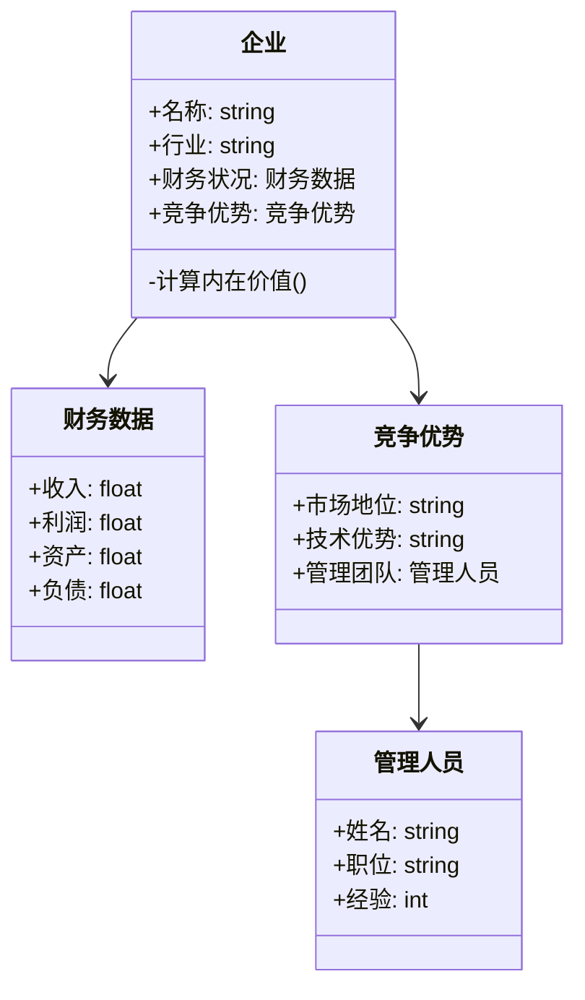
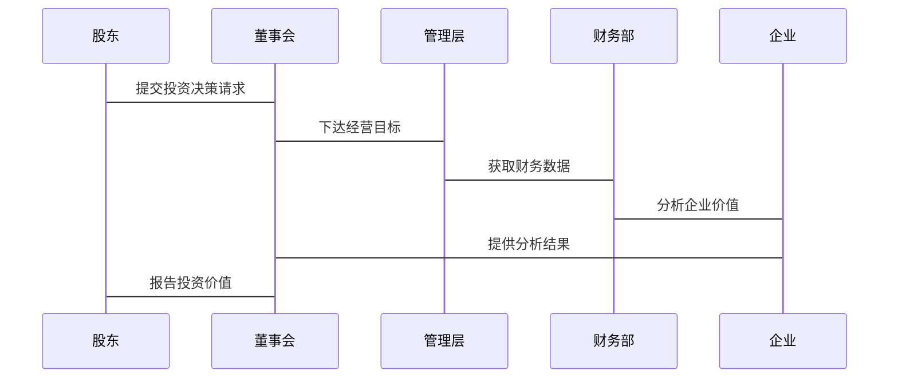

                 


# 《格雷厄姆特价股票理论对现代公司治理的启示》

---

## 关键词：

- 价值投资，公司治理，本·格雷厄姆，特价股票理论，安全边际，内在价值，投资策略

---

## 摘要：

本篇文章深入探讨了本·格雷厄姆的特价股票理论及其对现代公司治理的启示。通过对价值投资的核心理念、安全边际、内在价值等关键概念的分析，结合实际案例，揭示了格雷厄姆理论在公司治理中的实践意义。文章还通过数学模型和系统架构的分析，展示了如何将价值投资理念融入现代公司治理结构中，以实现长期稳定的价值增长。

---

## 正文：

### # 第一部分：引言

#### ## 1.1 价值投资与公司治理的关联

##### ### 1.1.1 价值投资的核心理念

价值投资是一种以基本面分析为基础的投资策略，强调通过深入研究企业的财务状况、行业地位和竞争优势，寻找市场价格低于其内在价值的股票进行投资。其核心理念是“买 cheap, 卖 dear”，即以低于内在价值的价格买入优质资产。

##### ### 1.1.2 公司治理的基本概念

公司治理是指通过董事会、管理层和股东之间的有效制衡机制，确保公司战略目标的实现、风险的控制以及股东价值的最大化。良好的公司治理能够提升企业透明度，增强投资者信心，从而促进企业长期稳定发展。

##### ### 1.1.3 价值投资与公司治理的结合点

价值投资关注企业的内在价值和长期发展潜力，而公司治理则是实现企业价值最大化的重要保障。两者的结合点在于通过优化公司治理结构，提升企业内在价值，从而为价值投资者提供更多的投资机会。

---

#### ## 1.2 本·格雷厄姆与特价股票理论

##### ### 1.2.1 本·格雷厄姆的生平简介

本·格雷厄姆（Ben Graham）是20世纪最具影响力的投资者之一，被誉为“价值投资之父”。他早年在哥伦比亚大学教授金融学，并在职业生涯中管理过多个投资组合，取得了卓越的业绩。他的投资理念深刻影响了后来的投资者，如沃伦·巴菲特。

##### ### 1.2.2 特价股票理论的提出背景

20世纪20年代至30年代，格雷厄姆在华尔街经历了多次市场泡沫和崩盘，这使他认识到市场波动性和投资者情绪对企业价值的短期影响。他提出特价股票理论，旨在通过分析企业的基本面，寻找市场价格低于其内在价值的股票。

##### ### 1.2.3 理论的核心观点与实践意义

格雷厄姆的理论强调安全边际和内在价值的计算。他认为，投资者应关注企业的盈利能力、财务状况和行业地位，而不是市场的短期波动。这种投资理念为现代价值投资奠定了基础，也为公司治理提供了重要的启示。

---

### # 第二部分：价值投资的核心要素

#### ## 2.1 内在价值与市场价值

##### ### 2.1.1 内在价值的定义与计算

内在价值是指企业在正常经营条件下未来现金流的现值。格雷厄姆的计算公式如下：

$$
\text{内在价值} = \sum_{t=1}^{n} \frac{\text{现金流}_t}{(1 + r)^t}
$$

其中，\( r \) 是折现率，\( n \) 是评估周期。

##### ### 2.1.2 市场价值的波动性分析

市场价值受投资者情绪和市场波动影响，经常偏离内在价值。格雷厄姆认为，这种偏离为价值投资者提供了机会。

##### ### 2.1.3 内在价值与市场价值的动态关系

内在价值是企业的真实价值，而市场价值是内在价值的映射。两者的动态关系可以通过以下公式表示：

$$
\text{市场价值} = \text{内在价值} + \text{市场情绪影响}
$$

---

#### ## 2.2 安全边际的重要性

##### ### 2.2.1 安全边际的定义与作用

安全边际是指市场价格低于内在价值的部分，用于缓冲市场波动带来的风险。其计算公式为：

$$
\text{安全边际} = \text{内在价值} - \text{市场价格}
$$

##### ### 2.2.2 安全边际的计算方法

通过分析企业的财务数据，计算内在价值，并与市场价格比较，确定安全边际的大小。

##### ### 2.2.3 安全边际在投资决策中的应用

安全边际为投资者提供了风险控制的工具。当安全边际较大时，投资风险较低，适合买入。

---

#### ## 2.3 财务报表分析与价值评估

##### ### 2.3.1 财务报表分析的基本方法

财务报表分析包括利润表、资产负债表和现金流量表的分析。重点关注企业的盈利能力、偿债能力和发展能力。

##### ### 2.3.2 核心财务指标与价值评估

核心财务指标包括市盈率（P/E）、市净率（P/B）和股息率（Dividend Yield）。其公式分别为：

$$
\text{市盈率} = \frac{\text{股价}}{\text{每股收益}}
$$

$$
\text{市净率} = \frac{\text{股价}}{\text{每股净资产}}
$$

$$
\text{股息率} = \frac{\text{每股股息}}{\text{股价}}
$$

##### ### 2.3.3 财务报表分析在价值投资中的应用

通过财务报表分析，识别具有长期竞争优势和良好财务状况的企业，作为投资标的。

---

### # 第三部分：价值投资与公司治理的结合

#### ## 3.1 公司治理的基本框架

##### ### 3.1.1 公司治理的定义与目标

公司治理是通过董事会、管理层和股东之间的制衡机制，确保公司战略目标的实现和股东价值的最大化。

##### ### 3.1.2 股东、董事会与管理层的关系

股东是公司的所有者，董事会是股东的受托人，管理层是董事会的执行者。三者之间的关系需要通过制衡机制来实现有效治理。

##### ### 3.1.3 公司治理的外部影响因素

外部因素包括法律法规、市场环境和行业竞争格局等，这些因素会影响公司的治理结构和经营策略。

---

#### ## 3.2 价值投资视角下的公司治理

##### ### 3.2.1 从价值投资者的角度看公司治理

价值投资者关注企业的长期价值，因此对公司的治理结构有较高的要求。他们倾向于投资治理透明、管理层稳定、股东权益保护良好的企业。

##### ### 3.2.2 公司治理与股东

良好的公司治理能够保护股东权益，提升企业透明度，从而增强投资者信心。

##### ### 3.2.3 格雷厄姆理论对现代公司治理的启示

格雷厄姆的理论强调了企业内在价值的重要性，这启示现代公司治理应注重企业的长期价值创造和股东权益保护。

---

### # 第四部分：系统分析与架构设计方案

#### ## 4.1 系统功能设计

##### ### 4.1.1 领域模型（Mermaid 类图）



##### ### 4.1.2 系统架构设计（Mermaid 架构图）

```mermaid
archi
    title 公司治理系统架构
    网络 -> 数据库: 数据存储
    数据库 -> 企业: 数据持久化
    企业 -> 财务部: 财务数据处理
    财务部 -> 董事会: 战略决策
    董事会 -> 管理层: 执行决策
    管理层 -> 股东: 报告与沟通
```

##### ### 4.1.3 系统接口设计

系统接口包括：

1. 财务数据接口：提供企业的财务数据，供投资者分析。
2. 竞争优势接口：提供企业的市场地位和技术优势信息。
3. 股东接口：提供股东权益保护机制。

##### ### 4.1.4 系统交互设计（Mermaid 序列图）



---

### # 第五部分：项目实战

#### ## 5.1 环境安装

为了进行价值投资分析，需要以下工具和环境：

1. 数据分析工具：Python、Pandas、NumPy
2. 绘图工具：Matplotlib、Seaborn
3. 公司财务数据：通过股票市场数据接口获取

#### ## 5.2 核心实现源代码

以下是计算内在价值和安全边际的Python代码示例：

```python
import pandas as pd
import numpy as np

# 假设我们有以下财务数据
data = {
    '现金流': [100, 120, 150, 180],
    '折现率': 0.08
}

# 计算内在价值
cf = data['现金流']
r = data['折现率']
n = len(cf)

内在价值 = sum([cf[i] / (1 + r) ** i for i in range(n)])
安全边际 = 内在价值 - 市场价格

print(f"内在价值: {内在价值}")
print(f"安全边际: {安全边际}")
```

#### ## 5.3 代码应用解读与分析

通过上述代码，我们可以计算企业的内在价值和安全边际，从而判断是否值得投资。例如，假设市场价格为80，则安全边际为20，说明该股票具有较高的投资价值。

#### ## 5.4 实际案例分析

以某公司为例，假设其财务数据如下：

- 现金流：100, 120, 150, 180（单位：万元）
- 折现率：8%
- 市场价格：80元

计算得：

$$
\text{内在价值} = \frac{100}{1.08} + \frac{120}{1.08^2} + \frac{150}{1.08^3} + \frac{180}{1.08^4} \approx 333 \text{元}
$$

$$
\text{安全边际} = 333 - 80 = 253 \text{元}
$$

---

### # 第六部分：总结与启示

#### ## 6.1 最佳实践 tips

- **长期视角**：价值投资者应关注企业的长期价值，而非短期波动。
- **安全边际**：在投资决策中，始终考虑安全边际，以降低投资风险。
- **持续学习**：市场环境不断变化，投资者需要持续学习和调整投资策略。

#### ## 6.2 小结

格雷厄姆的特价股票理论为现代公司治理提供了重要的启示。通过深入分析企业的内在价值和财务状况，投资者可以更好地评估企业的长期发展潜力。同时，良好的公司治理结构能够保障企业的稳定发展，为投资者提供更多的价值。

#### ## 6.3 注意事项

- 投资者应结合市场环境和企业实际情况，灵活运用格雷厄姆的理论。
- 需要定期更新和调整投资策略，以应对市场变化。

#### ## 6.4 拓展阅读

- 《The Intelligent Investor》 by Benjamin Graham
- "公司治理与股东价值" by 王小明

---

## 作者：AI天才研究院/AI Genius Institute & 禅与计算机程序设计艺术 /Zen And The Art of Computer Programming

