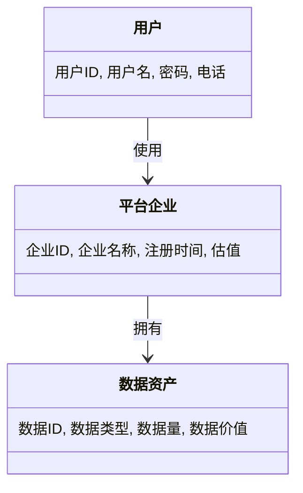
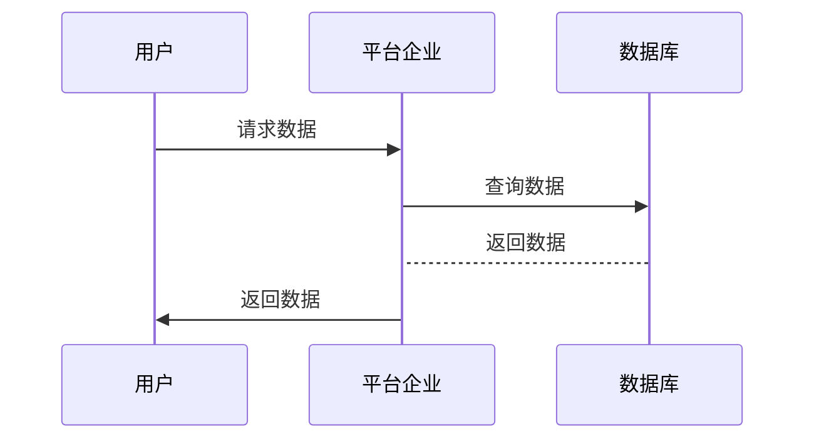

                 


# 格雷厄姆特价股票理论对现代平台经济的启示

**关键词：** 格雷厄姆投资理论、平台经济、价值投资、安全边际、内在价值、投资策略

**摘要：**  
本文探讨了格雷厄姆的价值投资理论如何为现代平台经济提供启示。通过分析格雷厄姆理论的核心概念，如安全边际和内在价值，并结合平台经济的商业模式和特点，本文提出了将格雷厄姆理论应用于平台经济投资的策略。文章还详细介绍了平台经济的价值评估模型、技术分析方法以及风险管理策略，并通过案例分析展示了格雷厄姆理论在实际投资中的应用。

---

# 第一部分: 格雷厄姆特价股票理论与现代平台经济的背景介绍

## 第1章: 格雷厄姆投资理论概述

### 1.1 格雷厄姆投资理论的核心概念

#### 1.1.1 价值投资的定义与核心理念
- **价值投资**：通过深入分析企业的基本面，寻找市场价格低于内在价值的股票进行投资。
- **核心理念**：市场短期是投票器，长期是称重机。投资者应关注企业的内在价值，而非短期市场波动。

#### 1.1.2 安全边际的概念与重要性
- **安全边际**：指股票市场价格与内在价值之间的差距，用于降低投资风险。
- **重要性**：通过安全边际，投资者可以避免因市场波动导致的短期亏损。

#### 1.1.3 内在价值的计算方法
- **内在价值公式**：
  $$ \text{内在价值} = \frac{\text{未来自由现金流的现值}}{\text{折现率}} $$
- **自由现金流**：企业在偿还了所有负债后的剩余现金流。

### 1.2 现代平台经济的基本特征

#### 1.2.1 平台经济的定义与模式
- **平台经济**：通过互联网平台连接供需双方，提供撮合交易或信息服务的商业模式。
- **主要模式**：双边市场（如淘宝、滴滴）和多边市场（如微信生态）。

#### 1.2.2 平台经济的核心要素与参与者
- **核心要素**：
  - 用户：平台的参与者，包括消费者和供应商。
  - 数据：平台的核心资产，用于优化匹配和提升效率。
  - 技术：支撑平台运行的基础，包括人工智能和大数据。
- **参与者**：
  - 平台提供者：如淘宝、滴滴等。
  - 用户：包括个人消费者和企业。
  - 第三方开发者：为平台提供服务或应用。

#### 1.2.3 平台经济的商业模式与盈利机制
- **商业模式**：
  - 佣金模式：收取交易佣金（如淘宝）。
  - 广告模式：通过广告收入盈利（如Google、 Facebook）。
  - 订阅模式：提供会员服务收费（如Netflix）。
- **盈利机制**：通过数据驱动的精准匹配和规模效应降低成本，提升利润。

### 1.3 格雷厄姆理论与平台经济的结合点

#### 1.3.1 价值投资在平台经济中的适用性
- **适用性**：平台经济的商业模式与格雷厄姆的价值投资理念高度契合，尤其是其长期价值和网络效应。

#### 1.3.2 平台经济的长期价值评估
- **长期价值**：平台经济的网络效应和数据资产使其具有较高的长期价值。
- **网络效应**：用户数量的增加会提升平台的整体价值（如微信、支付宝）。

#### 1.3.3 平台经济中的安全边际概念
- **安全边际**：在平台经济中，安全边际可以通过用户增长、数据资产和网络效应来衡量。
- **案例**：以滴滴为例，其安全边际可以通过用户规模和市场份额来评估。

---

## 第2章: 平台经济的价值评估与投资策略

### 2.1 平台经济的价值评估模型

#### 2.1.1 内在价值的计算公式
- **公式**：
  $$ \text{内在价值} = \frac{\text{未来自由现金流的现值}}{\text{折现率}} $$
- **自由现金流**：平台企业通过核心业务产生的现金流。

#### 2.1.2 可比公司法的应用
- **可比公司法**：通过比较类似平台企业的市盈率、市净率等指标，估算目标企业的内在价值。

#### 2.1.3 股权自由现金流模型
- **模型**：用于评估企业整体价值，考虑了企业的资本结构和税率因素。

### 2.2 格雷厄姆投资策略在平台经济中的应用

#### 2.2.1 高质量企业的筛选标准
- **筛选标准**：
  - 高用户增长率。
  - 强大的网络效应。
  - 高质量的管理团队。

#### 2.2.2 安全边际的确定方法
- **方法**：
  - 通过对比市场价格与内在价值，确定安全边际。
  - 考虑平台企业的用户粘性和数据资产。

#### 2.2.3 长期持有与分散投资的策略
- **长期持有**：平台企业的价值通常需要较长时间才能体现，因此适合长期持有。
- **分散投资**：通过投资不同行业的平台企业，降低风险。

### 2.3 平台经济中的风险管理与投资组合优化

#### 2.3.1 风险评估与控制
- **风险来源**：市场波动、政策风险、技术风险。
- **控制方法**：通过多元化投资和动态调整投资组合降低风险。

#### 2.3.2 投资组合的分散化策略
- **策略**：将资金分配到不同平台企业，避免过度集中。

#### 2.3.3 估值误差的应对方法
- **应对方法**：定期复盘，调整投资组合，避免估值误差。

---

## 第3章: 平台经济中的技术分析与投资决策

### 3.1 技术分析的基本原理

#### 3.1.1 K线图的解读
- **K线图**：通过收盘价、开盘价、最高价和最低价绘制的图表，反映市场的供需关系。

#### 3.1.2 技术指标的应用
- **技术指标**：
  - 移动平均线（MA）：用于判断趋势。
  - 相对强弱指数（RSI）：用于判断超买超卖。
  - 布林格带（Bollinger Bands）：用于判断价格波动范围。

#### 3.1.3 技术分析的优缺点
- **优点**：能够捕捉短期市场趋势。
- **缺点**：忽视了企业的基本面因素。

### 3.2 平台经济中的技术分析案例

#### 3.2.1 案例：滴滴出行的技术分析
- **K线图分析**：通过分析滴滴的股价走势，判断其短期趋势。
- **技术指标**：使用RSI和布林格带判断超买超卖和价格波动范围。

### 3.3 平台经济中的技术与基本面结合策略

#### 3.3.1 结合策略
- **策略**：将技术分析与基本面分析结合，做出更准确的投资决策。

#### 3.3.2 案例分析
- **案例**：以阿里巴巴为例，通过技术分析判断短期走势，结合基本面分析评估长期价值。

---

## 第4章: 平台经济中的系统分析与架构设计

### 4.1 系统分析

#### 4.1.1 问题场景介绍
- **问题场景**：如何通过系统分析，评估一家平台企业的投资价值。

#### 4.1.2 项目介绍
- **项目目标**：通过系统分析，确定平台企业的投资价值。

### 4.2 系统功能设计

#### 4.2.1 领域模型设计


#### 4.2.2 系统架构设计


### 4.3 系统接口设计

#### 4.3.1 HTTP接口设计
- **接口1**：获取用户信息。
  ```http
  GET /api/users/{id}
  ```

- **接口2**：获取企业信息。
  ```http
  GET /api/companies/{id}
  ```

### 4.4 系统交互设计

#### 4.4.1 交互流程图


---

## 第5章: 项目实战与案例分析

### 5.1 项目实战

#### 5.1.1 环境安装
- **工具安装**：安装Python、Jupyter Notebook、Matplotlib。

#### 5.1.2 核心代码实现
```python
def calculate_intrinsic_value(free_cash_flow, discount_rate):
    return free_cash_flow / discount_rate

# 示例数据
free_cash_flow = 100  # 单位：万元
discount_rate = 0.10  # 十分之十

intrinsic_value = calculate_intrinsic_value(free_cash_flow, discount_rate)
print(f"内在价值：{intrinsic_value} 万元")
```

#### 5.1.3 代码应用解读
- **代码功能**：计算平台企业的内在价值。
- **应用案例**：以某平台企业为例，计算其内在价值，并与市场价格进行对比。

### 5.2 案例分析

#### 5.2.1 案例1：滴滴出行的价值评估
- **内在价值计算**：
  $$ \text{内在价值} = \frac{100}{0.10} = 1000 \text{万元} $$
- **市场价格对比**：假设市场价格为800万元，具有20%的安全边际。

#### 5.2.2 案例2：阿里巴巴的技术分析
- **K线图分析**：通过K线图判断短期趋势。
- **技术指标分析**：使用RSI和布林格带判断超买超卖。

---

## 第6章: 总结与展望

### 6.1 总结
- **总结**：格雷厄姆的价值投资理论为现代平台经济提供了重要的启示，尤其是在长期价值评估和风险管理方面。
- **投资策略**：通过安全边际和内在价值的计算，选择高质量的平台企业进行长期投资。

### 6.2 展望
- **未来研究方向**：进一步研究人工智能和大数据在平台经济中的应用，优化价值评估模型。
- **发展趋势**：平台经济将更加依赖数据和技术，价值投资理论也将不断演变。

### 6.3 投资建议
- **长期持有**：平台企业的价值通常需要较长时间才能体现，因此适合长期持有。
- **分散投资**：通过投资不同行业的平台企业，降低风险。

### 6.4 注意事项
- **风险管理**：定期复盘，调整投资组合，避免估值误差。
- **技术与基本面结合**：将技术分析与基本面分析结合，做出更准确的投资决策。

---

**作者：AI天才研究院/AI Genius Institute & 禅与计算机程序设计艺术 /Zen And The Art of Computer Programming**

