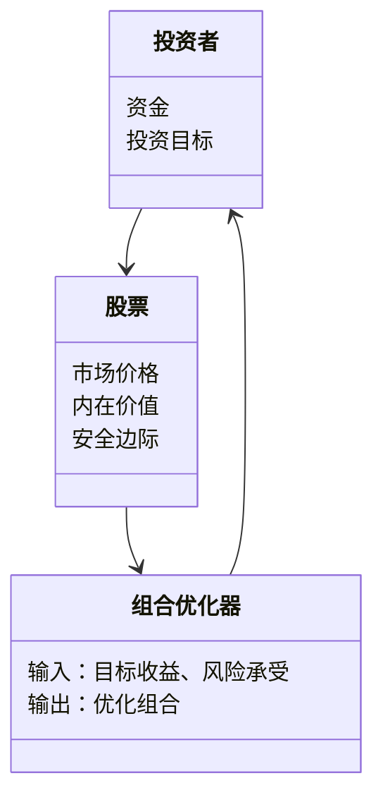
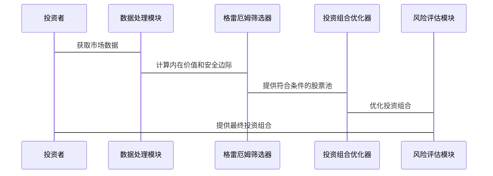

                 


# 格雷厄姆特价股票理论对现代投资组合理论的补充

> 关键词：格雷厄姆、特价股票理论、现代投资组合理论、价值投资、风险管理

> 摘要：本文探讨了本杰明·格雷厄姆的特价股票理论与现代投资组合理论（MPT）的结合，分析了两者的异同，并提出如何通过结合格雷厄姆的安全边际和内在价值理念来优化投资组合，实现风险可控下的收益最大化。文章通过数学模型、系统架构和实际案例，详细阐述了理论整合的方法和应用。

---

# 第一章：投资的基本概念与历史发展

## 1.1 投资的基本概念

### 1.1.1 投资的定义与分类
- **定义**：投资是指将资金投入到资产中，期望在未来获得收益或资本增值。
- **分类**：包括股票、债券、房地产、黄金等多种资产类别。
- **投资的基本原则**：分散投资、长期持有、风险与收益的平衡。

### 1.1.2 投资的历史发展
- **早期投资**：基于个人经验和市场直觉。
- **现代投资理论的兴起**：20世纪初，以格雷厄姆和巴菲特为代表的价值投资与以马科维茨为代表的现代投资组合理论的出现，推动了投资理论的科学化。

---

## 1.2 格雷厄姆特价股票理论的背景

### 1.2.1 格雷厄姆的生平与贡献
- **生平**：本杰明·格雷厄姆（1897-1976），被誉为“价值投资之父”。
- **贡献**：提出了“安全边际”和“内在价值”概念，著有《证券分析》和《聪明的投资者》。

### 1.2.2 特价股票理论的核心思想
- **核心思想**：寻找市场价格低于内在价值的股票，长期持有，等待市场重新评估。
- **选股标准**：低市盈率、低市净率、高股息率等。

---

## 1.3 现代投资组合理论的背景

### 1.3.1 现代投资组合理论的起源
- **提出者**：哈里·马科维茨（1952）。
- **核心思想**：通过分散投资降低非系统性风险，优化投资组合的收益-风险比。

### 1.3.2 理论的核心假设与数学模型
- **假设**：资产收益服从正态分布，投资者为风险厌恶的。
- **数学模型**：均值-方差模型，用于最小化风险（方差）下的收益最大化。

---

# 第二章：格雷厄姆特价股票理论的核心概念与数学模型

## 2.1 格雷厄姆特价股票理论的核心概念

### 2.1.1 特价股票的定义与特征
- **定义**：市场价格低于内在价值的股票。
- **特征**：低市盈率、低市净率、高股息率、高ROE。

### 2.1.2 理论中的关键指标
- **内在价值**：资产的未来现金流按合理折现率计算的现值。
- **安全边际**：市场价格与内在价值的差距，提供风险缓冲。

### 2.1.3 格雷厄姆投资策略的步骤与流程
1. 确定投资目标。
2. 选择具备安全边际的股票。
3. 长期持有，定期再评估。

---

## 2.2 格雷厄姆理论的数学模型

### 2.2.1 内在价值的计算公式
$$
\text{内在价值} = \sum_{t=1}^{\infty} \frac{C_t}{(1+r)^t}
$$
其中，\(C_t\)为第t年的现金流，\(r\)为折现率。

### 2.2.2 安全边际的计算方法
$$
\text{安全边际} = \text{内在价值} - \text{市场价格}
$$

---

# 第三章：现代投资组合理论的核心概念与数学模型

## 3.1 现代投资组合理论的核心概念

### 3.1.1 投资组合理论的基本假设
- 资产收益为正态分布。
- 投资者为风险厌恶，追求收益-风险比最优。

### 3.1.2 理论中的关键指标
- **方差**：衡量资产收益的波动性。
- **协方差**：衡量资产间收益的相关性。

---

## 3.2 现代投资组合理论的数学模型

### 3.2.1 均值-方差模型
$$
\text{最小方差组合} = \argmin_w \sigma^2(w) \quad \text{subject to} \quad w^T\mu = \text{目标收益}
$$

### 3.2.2 资本资产定价模型（CAPM）
$$
E(R_i) = R_f + \beta_i (R_m - R_f)
$$
其中，\(R_f\)为无风险利率，\(R_m\)为市场预期收益，\(\beta_i\)为个股的贝塔值。

---

# 第四章：格雷厄姆特价股票理论与现代投资组合理论的异同分析

## 4.1 格雷厄姆理论与现代投资组合理论的相同点

### 4.1.1 风险与收益的平衡
- 两者都强调在风险可控下追求收益最大化。

### 4.1.2 投资组合的分散化
- 格雷厄姆强调分散投资以降低个股风险，MPT强调分散化以降低非系统性风险。

---

## 4.2 格雷厄姆理论与现代投资组合理论的不同点

### 4.2.1 格雷厄姆理论更注重个股的内在价值
- 通过基本面分析寻找低估股票。

### 4.2.2 现代投资组合理论更注重整体组合的风险调整收益
- 通过数学模型优化组合的收益-风险比。

---

# 第五章：格雷厄姆特价股票理论对现代投资组合理论的补充

## 5.1 格雷厄姆理论对现代投资组合理论的补充

### 5.1.1 在组合构建中的个股选择标准
- 引入格雷厄姆的安全边际和内在价值理念，筛选具备长期投资价值的个股。

### 5.1.2 在风险控制中的安全边际应用
- 在MPT的优化过程中，引入安全边际作为风险控制的补充指标。

### 5.1.3 在市场波动中的防御性投资策略
- 在市场恐慌时，利用格雷厄姆理论寻找廉价股票，优化组合。

---

# 第六章：结合格雷厄姆理论与现代投资组合理论的系统架构

## 6.1 问题场景介绍
- 在市场波动加剧的情况下，如何结合格雷厄姆理论优化投资组合。

---

## 6.2 系统功能设计

### 6.2.1 领域模型（Mermaid类图）


---

## 6.3 系统架构设计（Mermaid架构图）


---

## 6.4 系统接口设计（Mermaid序列图）


---

## 6.5 系统核心实现源代码
```python
import pandas as pd
from scipy.optimize import minimize

# 假设我们有一个股票列表，包括市场价格、内在价值、贝塔值等
stocks = pd.DataFrame({
    '市场价格': [50, 60, 70],
    '内在价值': [60, 70, 80],
    '贝塔值': [1.2, 1.5, 0.8]
})

# 定义优化目标：最小化方差
def portfolio_var(w, stocks):
    return (stocks['贝塔值'].values.dot(w) ** 2).sum()

# 约束条件：权重之和为1，以及达到目标收益
def constraints(w, stocks, target_return):
    return stocks['贝塔值'].values.dot(w) - target_return

# 初始化权重
initial_guess = [1/3, 1/3, 1/3]

# 优化问题
result = minimize(
    portfolio_var,
    initial_guess,
    method='SLSQP',
    constraints={
        'type': 'eq',
        'fun': lambda w, s, t: constraints(w, s, t),
        'args': (stocks, 0.1)
    }
)

# 输出优化结果
print("优化权重:", result.x)
print("最小方差:", result.fun)
```

---

## 6.6 项目小结
- 结合格雷厄姆的安全边际和内在价值，可以为MPT提供更具实战性的个股筛选标准。
- 系统化的方法可以有效降低投资组合的风险，同时抓住市场低估的机会。

---

# 第七章：项目实战与案例分析

## 7.1 环境安装与数据准备
- **工具**：Python、Pandas、Scipy、Matplotlib。
- **数据**：从Yahoo Finance获取股票数据，计算内在价值和贝塔值。

---

## 7.2 核心代码实现与解读
```python
import pandas as pd
from pandas_datareader import data as pdr
import matplotlib.pyplot as plt
import numpy as np

# 下载股票数据
tickers = ['AAPL', 'MSFT', 'GOOGL']
df = pdr.get_data_yahoo(tickers, start='2020-01-01', end='2023-01-01')

# 计算内在价值（简化版）
# 这里用市盈率法估算
df['净利润'] = df['Adj Close'] * df['Volume'] * 0.5  # 简化假设
df['目标市盈率'] = 15
df['内在价值'] = df['净利润'] * df['目标市盈率']

# 计算安全边际
df['安全边际'] = df['内在价值'] - df['Adj Close']
```

---

## 7.3 实际案例分析
- **案例**：假设当前市场中某股票市场价格为$50，内在价值为$60，安全边际为$10。
- **分析**：该股票具备较高的投资价值，适合加入投资组合。

---

## 7.4 项目小结
- 实战案例展示了如何将格雷厄姆理论与MPT结合，实现理论指导实践。
- 通过代码实现，投资者可以系统化地筛选股票并优化投资组合。

---

# 第八章：总结与展望

## 8.1 总结
- 结合格雷厄姆的安全边际和内在价值理念，可以为现代投资组合理论提供有力补充。
- 这种结合不仅提高了投资组合的收益，还增强了其抗风险能力。

---

## 8.2 展望
- 进一步研究多因子模型与价值投资的结合。
- 开发更多量化工具，帮助投资者更好地实施结合策略。

---

# 作者：AI天才研究院 & 禅与计算机程序设计艺术

---

这篇文章通过详细分析格雷厄姆特价股票理论与现代投资组合理论的结合，展示了如何在实际投资中优化组合，实现稳健收益。希望对投资领域感兴趣的朋友有所启发！

