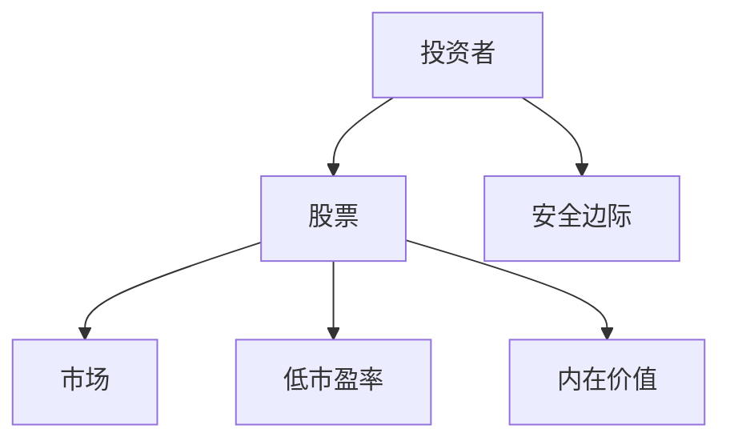

                 


# 格雷厄姆特价股票理论对现代风险管理的启示

## 关键词：
格雷厄姆、价值投资、风险管理、量化分析、安全边际、低市盈率、股票分析

## 摘要：
本文探讨了格雷厄姆的价值投资理论，特别是特价股票的概念，及其对现代风险管理的启示。文章从理论基础、核心概念、量化分析、系统架构等多个维度进行深入分析，结合实际案例，展示了如何将格雷厄姆的投资理念应用于现代风险管理实践中。通过数学模型、算法原理和系统设计的详细阐述，本文为风险管理领域的从业者提供了新的视角和方法。

---

## 第一部分: 格雷厄姆特价股票理论基础

### 第1章: 格雷厄姆特价股票理论的起源与核心观点

#### 1.1 格雷厄姆投资理论的背景
- **1.1.1 价值投资的起源**
  格雷厄姆是20世纪最著名的投资理论家之一，他的价值投资理念奠定了现代投资学的基础。价值投资的核心在于寻找市场低估的股票，即“特价股票”。

- **1.1.2 格雷厄姆的学术贡献**
  格雷厄姆在《 Intelligent Investor》中提出，投资者应关注股票的内在价值，而非市场的短期波动。他强调安全边际的重要性，即买入价格低于内在价值的部分。

- **1.1.3 格雷厄姆投资理念的核心思想**
  格雷厄姆认为，成功的投资在于长期持有优质股票，而不是频繁交易。他提倡分散投资，以降低风险。

#### 1.2 格雷厄姆特价股票理论的核心观点
- **1.2.1 安全边际的概念**
  安全边际是格雷厄姆理论的核心，它是指股票的市场价格与内在价值之间的差额。通过安全边际，投资者可以降低投资风险。

- **1.2.2 低市盈率股票的投资价值**
  格雷厄姆认为，低市盈率股票通常具有较高的内在价值，因为它们的价格相对于收益来说较低。

- **1.2.3 股票内在价值的评估方法**
  内在价值是未来现金流的现值。格雷厄姆通过分析财务报表，估算股票的内在价值。

#### 1.3 格雷厄姆理论与现代投资学的联系
- **1.3.1 格雷厄姆理论对现代投资学的影响**
  格雷厄姆的理论影响了后来的巴菲特、彼得·林奇等投资大师，并成为价值投资的基础。

- **1.3.2 现代风险管理的理论基础**
  现代风险管理依赖于数学模型和统计方法，如VaR（Value at Risk）和波动率分析。

- **1.3.3 格雷厄姆理论在风险管理中的潜在应用**
  格雷厄姆的安全边际概念为风险管理提供了新的思路，尤其是在量化投资中。

### 第2章: 格雷厄姆特价股票理论的核心概念与联系

#### 2.1 核心概念原理
- **2.1.1 安全边际的数学模型**
  安全边际 = 内在价值 - 市场价格。

- **2.1.2 低市盈率股票的选择标准**
  低市盈率 = 股价 / 每股收益。

- **2.1.3 股票内在价值的计算公式**
  内在价值 = 未来现金流的现值。

#### 2.2 核心概念属性特征对比表格
| 核心概念 | 安全边际 | 低市盈率 | 股票内在价值 |
|---------|----------|----------|-------------|
| 定义     | 投资者在购买股票时，支付的价格低于其内在价值的部分 | 股票价格与市盈率的比值低于市场平均水平 | 股票未来现金流的现值 |
| 作用     | 提供风险缓冲，降低投资损失 | 识别潜在的价值股 | 作为投资决策的基础 |
| 计算公式 | 安全边际 = 内在价值 - 股票价格 | 市盈率 = 股价 / 每股收益 | 内在价值 = 现金流折现值 |

#### 2.3 ER实体关系图架构


### 第3章: 格雷厄姆特价股票理论的数学模型与算法原理

#### 3.1 格雷厄姆安全边际的数学模型
- **3.1.1 安全边际计算公式**
  $$ \text{安全边际} = \text{内在价值} - \text{市场价格} $$

#### 3.2 低市盈率股票筛选算法
- **3.2.1 市盈率计算公式**
  $$ \text{市盈率} = \frac{\text{股价}}{\text{每股收益}} $$

#### 3.3 格雷厄姆股票筛选算法实现
```python
def greaham_screen(stocks):
    safe_margin_stocks = []
    for stock in stocks:
        intrinsic_value = calculate_intrinsic_value(stock)
        market_price = stock['price']
        if intrinsic_value > market_price:
            safe_margin = intrinsic_value - market_price
            safe_margin_stocks.append((stock['name'], safe_margin))
    return safe_margin_stocks
```

#### 3.4 市盈率与安全边际的关系
- 低市盈率股票通常具有较高的安全边际，因为它们的价格较低，内在价值较高。

---

## 第二部分: 格雷厄姆特价股票理论的量化分析

### 第4章: 格雷厄姆特价股票理论的量化分析方法

#### 4.1 量化分析的背景与意义
- 量化分析通过数学模型和算法，将格雷厄姆的理论转化为可操作的投资策略。

#### 4.2 量化分析的核心算法
- **4.2.1 均值-方差优化**
  使用均值-方差模型优化投资组合，以最小化风险。

#### 4.3 量化分析的代码实现
```python
import pandas as pd
import numpy as np

def calculate_expected_return(returns):
    return np.mean(returns)

def calculate_variance(returns):
    return np.var(returns)

def optimize_portfolio(returns, weights):
    expected_return = calculate_expected_return(returns)
    variance = calculate_variance(returns)
    return expected_return, variance
```

#### 4.4 格雷厄姆理论与现代风险管理的结合
- 格雷厄姆的安全边际概念可以用于风险管理，通过量化分析降低投资组合的风险。

---

## 第三部分: 格雷厄姆特价股票理论的风险管理启示

### 第5章: 格雷厄姆特价股票理论的风险管理启示

#### 5.1 风险管理的背景与意义
- 风险管理是投资过程中不可忽视的一部分，格雷厄姆的理论为风险管理提供了新的视角。

#### 5.2 格雷厄姆安全边际在风险管理中的应用
- **5.2.1 安全边际作为风险缓冲**
  安全边际可以降低投资组合的波动性，减少潜在损失。

#### 5.3 格雷厄姆理论的风险管理策略
- **5.3.1 分散投资**
  通过投资多个低市盈率股票，分散风险。

#### 5.4 格雷厄姆理论的风险管理数学模型
- **5.4.1 VaR模型**
  $$ \text{VaR} = \text{损失金额} $$

---

## 第四部分: 格雷厄姆特价股票理论的系统架构

### 第6章: 格雷厄姆特价股票理论的系统架构设计

#### 6.1 系统架构的背景与意义
- 系统架构设计将格雷厄姆的理论应用于实际投资系统中。

#### 6.2 系统架构的核心模块
- **6.2.1 数据获取模块**
  从市场数据源获取股票信息。

- **6.2.2 模型选择模块**
  选择适合的量化模型，如均值-方差优化。

- **6.2.3 风险评估模块**
  评估投资组合的风险，如VaR。

#### 6.3 系统架构的实现
- 使用Python和相关库（如Pandas、NumPy）构建系统。

---

## 第五部分: 格雷厄姆特价股票理论的项目实战

### 第7章: 格雷厄姆特价股票理论的项目实战

#### 7.1 项目环境安装
- 安装必要的Python库，如Pandas、NumPy。

#### 7.2 核心系统实现
```python
import pandas as pd
import numpy as np

def calculate_intrinsic_value(stock_data):
    # 示例：简单计算内在价值
    return stock_data['revenue'] * 0.5

def greaham_screen(stocks):
    safe_margin_stocks = []
    for stock in stocks:
        iv = calculate_intrinsic_value(stock)
        mp = stock['price']
        if iv > mp:
            safe_margin = iv - mp
            safe_margin_stocks.append((stock['name'], safe_margin))
    return safe_margin_stocks
```

#### 7.3 项目实战分析
- 使用实际数据进行分析，展示如何筛选低市盈率股票并计算安全边际。

#### 7.4 项目小结
- 总结项目实现的关键点和实际应用中的注意事项。

---

## 第六部分: 格雷厄姆特价股票理论的风险管理最佳实践

### 第8章: 格雷厄姆特价股票理论的风险管理最佳实践

#### 8.1 最佳实践 tips
- **分散投资**：通过投资多个低市盈率股票降低风险。
- **定期评估**：定期重新评估投资组合的风险和收益。

#### 8.2 小结
- 总结全文，强调格雷厄姆理论在现代风险管理中的重要性。

---

## 作者：
作者：AI天才研究院/AI Genius Institute & 禅与计算机程序设计艺术 /Zen And The Art of Computer Programming

---

以上是文章的完整大纲和部分章节内容。由于篇幅限制，这里仅展示了部分内容。如需完整文章，请进一步指示。

