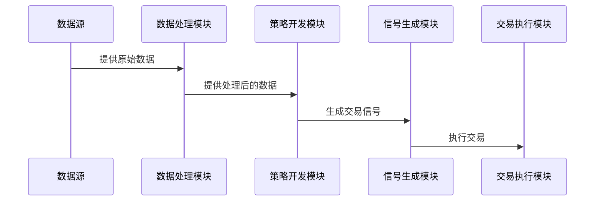

                 


# 格雷厄姆特价股票理论对算法交易的影响

> 关键词：格雷厄姆投资理论、算法交易、价值投资、股票筛选、量化分析

> 摘要：本文探讨了格雷厄姆特价股票理论如何影响算法交易。通过分析格雷厄姆的价值投资理念与算法交易的结合，展示了如何利用算法快速识别低估股票并优化交易策略。文章详细介绍了策略开发、系统架构和实战案例，帮助读者理解理论与实践的结合。

---

# 引言

格雷厄姆是价值投资的鼻祖，他的理论强调寻找市场低估的股票进行投资。算法交易则通过计算机程序自动执行交易，追求高效和精确。本文将探讨格雷厄姆理论如何影响算法交易，特别是在策略开发和系统设计方面。

---

## 第一部分：格雷厄姆投资理论的背景与基础

### 第1章：格雷厄姆投资理论概述

#### 1.1 格雷厄姆投资理论的核心概念

- **价值投资**：寻找市场价格低于内在价值的股票。
- **特价股票**：市盈率、市净率等指标低于行业平均水平的股票。
- **安全边际**：买入价格低于内在价值，以降低风险。

#### 1.2 格雷厄姆投资理论的历史发展

- 格雷厄姆的投资实践和学术研究奠定了价值投资的基础。
- 《聪明的投资者》系统阐述了价值投资理念。
- 现代投资者对格雷厄姆理论的继承与创新。

#### 1.3 格雷厄姆理论与现代投资理论的联系

- 对比现代资产定价模型（CAPM）与价值投资。
- 格雷厄姆理论在机构投资中的应用。
- 格雷厄姆理论的局限性与改进方向。

---

### 第2章：算法交易的基本原理

#### 2.1 算法交易的定义与分类

- **算法交易**：利用计算机程序自动执行交易决策。
- **类型**：高频交易、统计套利、动量策略等。
- **与传统交易的对比**：速度快、效率高、依赖数学模型。

#### 2.2 算法交易的核心要素

- **数据采集与处理**：实时数据获取与清洗。
- **策略开发与优化**：数学模型构建与回测。
- **系统设计与实现**：交易平台搭建与接口开发。

#### 2.3 算法交易的数学模型与公式

- **均值回归模型**：假设价格回归均值。
- **时间序列分析**：使用ARIMA模型预测价格。
- **机器学习算法**：如随机森林用于分类预测。

---

## 第二部分：格雷厄姆理论与算法交易的结合

### 第3章：格雷厄姆理论在算法交易中的应用

#### 3.1 格雷厄姆理论与算法交易的结合点

- **低市盈率与低市净值股票的识别**：算法筛选符合条件的股票。
- **市场恐慌与低估股票的捕捉**：利用波动性指标寻找机会。
- **算法对格雷厄姆选股策略的优化**：提高筛选效率和准确性。

#### 3.2 算法交易中的格雷厄姆策略实现

- **策略逻辑的设计**：基于格雷厄姆的选股标准开发算法。
- **数据源的选择与处理**：获取历史数据并进行清洗。
- **策略的回测与优化**：通过回测验证策略的有效性。

#### 3.3 算法交易中的风险管理

- **风险控制**：设置止损点和止盈点。
- **仓位管理**：根据策略表现调整投资比例。
- **市场风险**：监控市场波动对策略的影响。

---

### 第4章：基于格雷厄姆理论的算法交易系统架构

#### 4.1 系统功能设计

- **数据采集模块**：实时获取股票数据。
- **策略开发模块**：实现格雷厄姆选股策略。
- **信号生成模块**：根据策略输出交易信号。
- **交易执行模块**：自动执行交易指令。

#### 4.2 系统架构设计


#### 4.3 系统接口设计

- **API调用**：通过API获取数据和执行交易。
- **模块接口**：数据处理模块与策略开发模块的交互。

#### 4.4 系统交互流程



---

## 第三部分：项目实战与分析

### 第5章：格雷厄姆策略的算法实现

#### 5.1 环境搭建

- **工具安装**：安装Python、Pandas、NumPy等库。
- **数据源获取**：使用Yahoo Finance获取股票数据。

#### 5.2 格雷厄姆策略的核心代码实现

```python
import pandas as pd
import numpy as np

def graham_strategy(prices, book_value, eps):
    # 计算市盈率和市净率
    pe = prices / eps
    pb = prices / book_value
    
    # 格雷厄姆选股标准：市盈率 < 15，市净率 < 1.5
    mask = (pe < 15) & (pb < 1.5)
    return mask
```

#### 5.3 策略回测与分析

- **回测结果**：计算策略的收益率和风险指标。
- **优化调整**：根据回测结果优化策略参数。

---

## 第四部分：总结与展望

### 6.1 核心观点总结

- 格雷厄姆理论为算法交易提供了选股标准。
- 算法交易提高了策略执行的效率和准确性。

### 6.2 未来展望

- 结合大数据和机器学习优化策略。
- 探讨人工智能在价值投资中的应用。

---

## 参考文献

- 格雷厄姆的《聪明的投资者》
- 现代投资组合理论相关文献
- 算法交易的经典书籍和论文

---

## 作者

作者：AI天才研究院/AI Genius Institute & 禅与计算机程序设计艺术 /Zen And The Art of Computer Programming

---

通过以上结构，文章系统地介绍了格雷厄姆理论与算法交易的结合，从理论到实践，层层递进，帮助读者理解如何在现代算法交易中应用传统投资理念。

