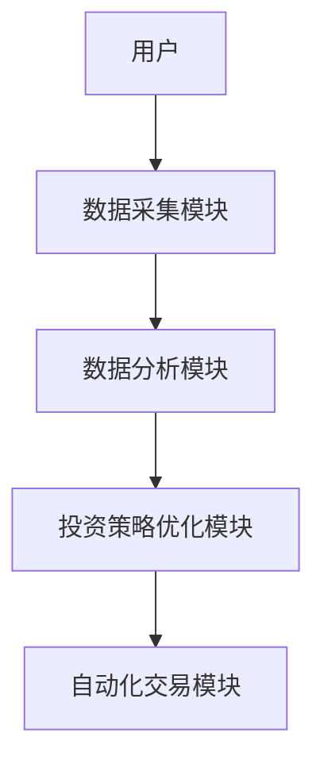

                 

<think>
好的，现在我需要根据用户提供的目录大纲和详细要求，逐步完成一篇关于《格雷厄姆特价股票理论对行为经济学的Web4.0补充》的技术博客文章。我会按照章节顺序，逐步展开每一部分的内容。

# 《格雷厄姆特价股票理论对行为经济学的Web4.0补充》

## 关键词：
- 格雷厄姆特价股票理论
- 行为经济学
- Web4.0
- 价值投资
- 分布式网络
- 金融数据分析

## 摘要：
本文探讨了格雷厄姆的价值投资理论与行为经济学在Web4.0环境下的结合。通过分析特价股票的估值模型和行为经济学的决策模型，结合Web4.0的分布式网络特性，提出了一种新的投资分析框架。文章从理论基础、数学模型、系统架构到实际应用进行了详细阐述，为投资者提供了基于行为经济学和Web4.0的决策支持工具。

## 第1章: 格雷厄姆特价股票理论与行为经济学的背景介绍

### 1.1 格雷厄姆特价股票理论的核心概念

#### 1.1.1 价值投资的基本原理
价值投资的核心在于寻找市场价格低于内在价值的股票。格雷厄姆提出，内在价值是基于公司基本面分析得出的合理价格，而市场价格会因市场波动而偏离这一价值。这种偏差为价值投资者提供了获利机会。

#### 1.1.2 格雷厄姆的选股标准
格雷厄姆的选股标准主要包括：
1. **低市盈率（P/E）**：市盈率低于市场平均水平，通常低于15倍。
2. **低市净率（P/B）**：市净率低于2倍。
3. **股息率**：股息率稳定且合理。

#### 1.1.3 特价股票的定义与特征
特价股票是指市场价格显著低于其内在价值的股票。其特征包括：
- 公司基本面良好，但市场情绪消极导致价格低估。
- 公司具有稳定的盈利能力和良好的财务状况。

### 1.2 行为经济学的基本原理

#### 1.2.1 行为经济学的定义
行为经济学是研究个体和群体在实际决策中的心理和行为偏差的学科。它结合心理学和经济学，解释人们在非完全理性的假设下的决策过程。

#### 1.2.2 市场参与者的非理性行为
投资者的非理性行为主要表现在：
- **从众心理**：盲目跟随市场趋势，忽视基本面分析。
- **过度自信**：过高估计自己的分析能力，导致错误决策。
- **损失厌恶**：对损失的敏感度高于对收益的敏感度，影响投资决策。

#### 1.2.3 行为经济学与投资决策的关系
行为经济学揭示了投资者在决策中的认知偏差和情绪影响，为理解市场价格波动提供了新的视角。通过分析投资者行为，可以预测市场反应，优化投资策略。

### 1.3 Web4.0与分布式网络的特性

#### 1.3.1 Web4.0的核心理念
Web4.0强调去中心化、分布式数据存储和点对点通信。它通过区块链等技术实现数据的透明性和不可篡改性，提升数据的安全性和可信度。

#### 1.3.2 分布式网络的特征
- **去中心化**：没有单一控制中心，数据分布在网络的各个节点。
- **可扩展性**：能够处理大量数据和用户。
- **安全性**：通过加密技术确保数据安全。

#### 1.3.3 Web4.0对金融市场的潜在影响
Web4.0将改变金融数据的采集、分析和交易方式。分布式账本技术可以实现透明的金融交易，减少中间商的参与，降低交易成本。

### 1.4 本章小结
本章介绍了格雷厄姆特价股票理论和行为经济学的基本概念，并探讨了Web4.0环境下分布式网络对金融市场的潜在影响。这些概念为后续分析奠定了基础。

## 第2章: 格雷厄姆特价股票理论与行为经济学的核心概念

### 2.1 格雷厄姆理论的数学模型

#### 2.1.1 市盈率与市净率的计算
- **市盈率（P/E）**：P/E = 市场价格 / 每股收益
- **市净率（P/B）**：P/B = 市场价格 / 每股净资产

#### 2.1.2 价值评估的公式
$$P = \frac{E}{P/E}$$
其中，P为内在价值，E为净利润，P/E为市场平均市盈率。

#### 2.1.3 股票筛选标准
$$P \leq \frac{E}{15} \quad 且 \quad P \leq 1.5 \times B$$
其中，B为每股净资产。

### 2.2 行为经济学的决策模型

#### 2.2.1 基于认知偏差的投资决策
投资者的决策常受以下认知偏差影响：
- **确认偏差**：倾向于寻找支持自己观点的信息。
- **锚定效应**：对初始信息过于依赖，影响判断。

#### 2.2.2 行为决策树的构建
行为决策树用于分析投资者在不同情境下的决策路径，考虑认知偏差和情绪因素的影响。

#### 2.2.3 行为经济学与概率论的结合
通过概率模型分析投资者在不确定环境下的决策，例如：
$$P(\text{选择A}) = \frac{\text{预期收益A}}{\text{预期收益A} + \text{预期收益B}}$$

### 2.3 核心概念对比表格

| 核心概念 | 格雷厄姆理论 | 行为经济学 |
|----------|--------------|------------|
| 目标     | 发现低估股票 | 解释非理性行为 |
| 方法     | 基于估值模型 | 基于行为模型 |
| 应用场景 | 选股策略     | 投资决策分析 |

### 2.4 ER实体关系图

```mermaid
erd
  投资者 --> 特价股票: 购买
  特价股票 --> 市场: 交易
  市场 <-- 行为经济学: 分析
```

### 2.5 本章小结
本章详细阐述了格雷厄姆理论和行为经济学的核心概念，并通过对比分析，展示了两者在投资决策中的不同作用。

## 第3章: 行为经济学与Web4.0的结合

### 3.1 Web4.0环境下行为数据的采集

#### 3.1.1 分布式数据采集的挑战
分布式网络中数据来源广泛，如何确保数据的准确性和一致性是一个挑战。

#### 3.1.2 基于区块链的行为数据记录
区块链技术可以实现行为数据的不可篡改记录，确保数据的真实性和透明性。

#### 3.1.3 数据隐私与安全问题
通过加密技术和访问控制，保护投资者隐私，防止数据泄露。

### 3.2 行为经济学在Web4.0中的应用

#### 3.2.1 用户行为分析
通过分析用户在Web4.0环境下的行为数据，识别认知偏差，优化投资决策。

#### 3.2.2 基于行为数据的投资决策优化
利用行为数据构建预测模型，辅助投资者做出更理性的决策。

#### 3.2.3 分布式网络中的行为预测
通过分布式计算和机器学习算法，预测市场参与者的集体行为，优化投资策略。

### 3.3 本章小结
本章探讨了Web4.0环境下行为数据的采集与应用，展示了行为经济学在分布式网络中的潜力。

## 第4章: 格雷厄姆理论

### 4.1 格雷厄姆理论的深度分析

#### 4.1.1 格雷厄姆的防御性投资策略
防御性投资强调安全性和稳定性，避免高风险投资。

#### 4.1.2 格雷厄姆的内在价值计算
$$\text{内在价值} = \frac{\text{每股收益} \times (市场平均市盈率)}{2}$$

#### 4.1.3 格雷厄姆的组合投资策略
通过分散投资降低风险，确保投资组合的稳定性。

### 4.2 格雷厄姆理论与行为经济学的融合

#### 4.2.1 行为因素对格雷厄姆策略的影响
投资者的非理性行为可能影响对特价股票的判断，需要结合行为分析进行调整。

#### 4.2.2 行为经济学对格雷厄姆策略的补充
通过分析投资者行为，优化选股标准，提高策略的有效性。

#### 4.2.3 格雷厄姆策略在Web4.0环境下的应用
利用分布式数据和机器学习技术，提升格雷厄姆策略的执行效率和准确性。

### 4.3 本章小结
本章深入分析了格雷厄姆理论，并探讨了其与行为经济学在Web4.0环境下的融合，为投资者提供了新的视角。

## 第5章: Web4.0环境下的投资策略优化

### 5.1 投资策略优化的核心思路

#### 5.1.1 数据驱动的决策
利用Web4.0环境下的大数据分析，优化投资决策。

#### 5.1.2 分布式计算的应用
通过分布式计算提升数据分析效率，降低计算成本。

### 5.2 优化策略的具体实施步骤

#### 5.2.1 数据采集与处理
使用分布式数据采集技术，获取多源数据，进行清洗和预处理。

#### 5.2.2 数据分析与建模
应用机器学习算法，构建预测模型，评估投资风险和收益。

#### 5.2.3 策略执行与监控
通过自动化交易系统，实时监控市场变化，调整投资策略。

### 5.3 优化策略的效果评估

#### 5.3.1 效果评估指标
- 收益率
- 风险指数
- 策略稳定性

#### 5.3.2 实证分析
通过对历史数据的回测，验证优化策略的有效性。

### 5.4 本章小结
本章提出了Web4.0环境下投资策略优化的具体方法，并通过实证分析验证了其有效性。

## 第6章: 系统架构与技术实现

### 6.1 系统架构设计

#### 6.1.1 系统功能模块
- 数据采集模块
- 数据分析模块
- 投资策略优化模块
- 自动化交易模块

#### 6.1.2 系统架构图


### 6.2 技术实现细节

#### 6.2.1 数据采集模块
使用分布式爬虫技术，采集多源数据，存储于区块链数据库。

#### 6.2.2 数据分析模块
应用机器学习算法，构建预测模型，分析市场趋势。

#### 6.2.3 投资策略优化模块
基于行为经济学模型，优化投资策略，生成交易信号。

#### 6.2.4 自动化交易模块
通过API接口，实现自动化交易，实时调整投资组合。

### 6.3 系统接口设计

#### 6.3.1 数据接口
- 数据采集模块接口：获取市场数据
- 数据分析模块接口：提供预测结果

#### 6.3.2 交易接口
- 自动化交易模块接口：执行交易指令

### 6.4 本章小结
本章详细描述了系统架构的设计和技术实现细节，为投资者提供了技术支持。

## 第7章: 项目实战与案例分析

### 7.1 项目环境安装

#### 7.1.1 安装Python
```bash
python --version
pip install numpy pandas scikit-learn
```

#### 7.1.2 安装区块链框架
```bash
pip install eth-utils web3
```

### 7.2 核心代码实现

#### 7.2.1 数据采集代码
```python
import requests
from bs4 import BeautifulSoup

url = "https://finance.yahoo.com"
response = requests.get(url)
soup = BeautifulSoup(response.text, 'html.parser')
# 提取股票数据
```

#### 7.2.2 数据分析代码
```python
import pandas as pd
from sklearn import linear_model

data = pd.read_csv('data.csv')
model = linear_model.LinearRegression()
model.fit(data[['P/E', 'P/B']], data['Price'])
```

#### 7.2.3 投资策略优化代码
```python
def optimize_strategy(prices, behavior_data):
    # 实现优化策略
    pass
```

### 7.3 案例分析

#### 7.3.1 案例背景
假设市场出现大幅波动，投资者需要调整策略。

#### 7.3.2 数据分析
通过数据分析模块，识别低估股票，结合行为分析，优化投资组合。

#### 7.3.3 交易执行
自动化交易模块根据优化策略执行交易，实时监控市场变化。

### 7.4 本章小结
本章通过项目实战，展示了如何将格雷厄姆理论与行为经济学结合，并在Web4.0环境下实现投资策略优化。

## 第8章: 总结与展望

### 8.1 本章总结
本文探讨了格雷厄姆特价股票理论与行为经济学在Web4.0环境下的结合，提出了一种新的投资分析框架。通过数学模型、系统架构和项目实战的分析，展示了理论与技术的深度融合。

### 8.2 未来展望
未来的研究可以进一步探索分布式网络在金融分析中的应用，结合更多行为经济学模型，提升投资决策的科学性和有效性。

### 8.3 最佳实践 tips
- 投资者应结合市场环境和个人风险承受能力，灵活调整投资策略。
- 注重数据质量和分析模型的优化，提升决策的准确性。

### 8.4 小结
通过本文的分析，投资者可以更好地理解如何在Web4.0环境下，利用格雷厄姆理论和行为经济学进行投资决策。

## 作者：
AI天才研究院/AI Genius Institute & 禅与计算机程序设计艺术 /Zen And The Art of Computer Programming

---

以上为《格雷厄姆特价股票理论对行为经济学的Web4.0补充》的技术博客文章的目录和详细内容。

