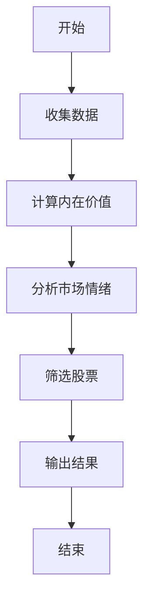
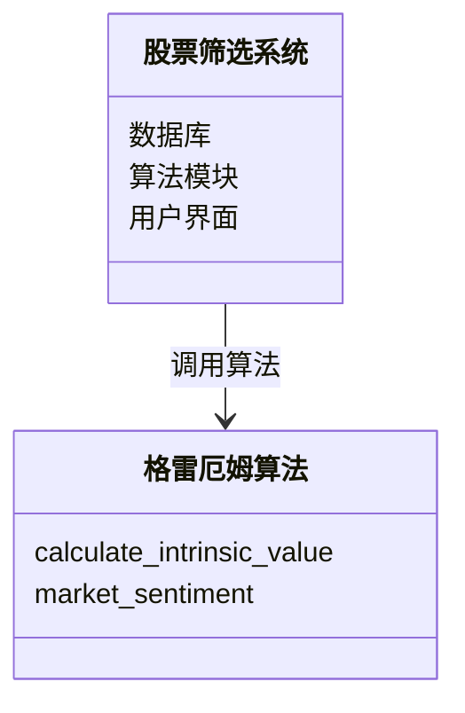
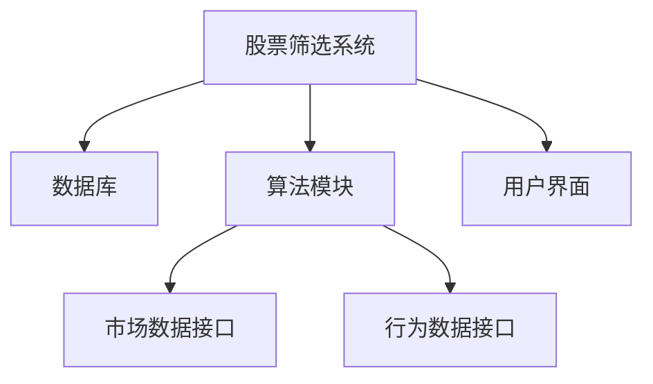

                 


# 格雷厄姆特价股票理论对行为经济学的数字化补充

> 关键词：格雷厄姆投资理论，行为经济学，股票筛选算法，数学模型，系统架构设计

> 摘要：本文探讨了如何将格雷厄姆的特价股票理论与行为经济学相结合，通过数字化方法补充传统投资理论，构建更有效的股票筛选模型。文章从理论背景、核心概念、算法实现、系统架构到项目实战，详细阐述了如何利用行为经济学模型优化股票投资决策。

---

## 第1章：背景与基础

### 1.1 格雷厄姆特价股票理论概述

#### 1.1.1 格雷厄姆投资理论的核心概念
格雷厄姆是价值投资的鼻祖，其理论强调寻找市场低估的股票。核心概念包括：
- **内在价值**：企业未来现金流的现值，与市场价格比较决定投资价值。
- **安全边际**：买入价格低于内在价值，以降低风险。

#### 1.1.2 特价股票的定义与筛选标准
格雷厄姆推荐的筛选标准包括：
- 低市盈率（P/E < 15）
- 低市净率（P/B < 1.5）
- 高股息率（股息率 > 5%）
- 强大的财务状况（如债务/资本 < 0.5）

#### 1.1.3 格雷厄姆理论在现代投资中的应用
现代投资者利用格雷厄姆理论结合技术分析和大数据，筛选出具有长期投资价值的股票。

### 1.2 行为经济学基础

#### 1.2.1 行为经济学的基本概念
行为经济学研究心理因素如何影响经济决策，认为市场参与者并非完全理性。

#### 1.2.2 市场参与者心理偏差对投资决策的影响
常见偏差包括：
- **过度自信**：投资者高估自己判断市场的能力。
- **羊群效应**：跟随市场趋势而非独立判断。

#### 1.2.3 行为经济学与传统经济学的对比
行为经济学更关注实际心理因素，而传统经济学假设参与者完全理性。

---

## 第2章：核心概念与联系

### 2.1 格雷厄姆特价股票理论的核心原理

#### 2.1.1 价值投资的核心要素
- 独特的估值方法
- 安全边际的构建

#### 2.1.2 股票内在价值的计算方法
$$ V = \frac{E}{P} $$
其中，V为内在价值，E为净利润，P为贴现率。

#### 2.1.3 市场情绪对股票价格的影响
市场情绪波动导致股票价格偏离内在价值。

### 2.2 行为经济学模型与股票投资

#### 2.2.1 基于行为经济学的投资者决策模型
- **有限理性模型**：投资者基于有限信息做出决策。
- ** prospect theory**：损失厌恶导致投资者风险偏好变化。

#### 2.2.2 心理账户理论在投资中的应用
投资者将资金分成多个心理账户，影响投资决策。

#### 2.2.3 社会认同对投资行为的影响
社会认同影响投资者的决策，如跟随市场趋势。

### 2.3 核心概念对比与ER图

#### 2.3.1 格雷厄姆理论与行为经济学的对比分析
| 核心概念      | 格雷厄姆理论          | 行为经济学        |
|---------------|---------------------|------------------|
| 主要关注点     | 内在价值与安全边际    | 心理因素与行为偏差  |
| 分析方法       | 量化分析             | 定性与定量结合      |

#### 2.3.2 实体关系图（ER图）展示
```mermaid
er
  actor 投资者
  actor 市场
  actor 理财顾问
  database 股票数据库
  database 行为数据
  database 市场数据
  relationship 投资者-股票数据库: 查询股票信息
  relationship 市场-股票数据库: 更新市场数据
  relationship 理财顾问-股票数据库: 提供分析报告
```

---

## 第3章：算法原理与数学模型

### 3.1 基于行为经济学的股票筛选算法

#### 3.1.1 算法原理概述
结合市场情绪和股票基本面进行筛选。

#### 3.1.2 算法流程图（mermaid）


#### 3.1.3 算法实现代码
```python
import pandas as pd
from sklearn.linear_model import LinearRegression

def calculate_intrinsic_value(financials):
    return financials['净利润'] / (1 + financials['贴现率'])

def market_sentiment(index_prices):
    model = LinearRegression()
    model.fit(pd.DataFrame(index_prices), range(len(index_prices)))
    return model.coef_

# 示例数据
financials = pd.DataFrame({'净利润': [100, 200], '贴现率': [0.1, 0.15]})
index_prices = [100, 110, 105]

# 计算
iv = calculate_intrinsic_value(financials)
sentiment = market_sentiment(index_prices)
print("内在价值:", iv)
print("市场情绪:", sentiment)
```

### 3.2 数学模型与公式

#### 3.2.1 内在价值计算公式
$$ V = \frac{E}{P} $$
其中，V为内在价值，E为净利润，P为贴现率。

#### 3.2.2 市场情绪指数计算
$$ S = \sum_{i=1}^{n} w_i \cdot m_i $$
其中，S为市场情绪指数，w_i为权重，m_i为指标值。

---

## 第4章：系统架构设计

### 4.1 系统功能设计

#### 4.1.1 领域模型（mermaid类图）


### 4.2 系统架构设计（mermaid架构图）


---

## 第5章：项目实战

### 5.1 环境安装
安装Python和相关库：
```bash
pip install pandas scikit-learn
```

### 5.2 核心代码实现

#### 5.2.1 数据收集
```python
import pandas as pd
import requests

def get_stock_data(tickers):
    data = []
    for t in tickers:
        response = requests.get(f'https://api.example.com/{t}')
        data.append(response.json())
    return pd.DataFrame(data)
```

#### 5.2.2 算法实现
```python
from sklearn.model_selection import train_test_split

def train_model(data):
    X = data[['市盈率', '市净率']]
    y = data['目标价格']
    X_train, X_test, y_train, y_test = train_test_split(X, y, test_size=0.2)
    model = LinearRegression()
    model.fit(X_train, y_train)
    return model
```

---

## 第6章：应用与优化

### 6.1 系统实际应用

#### 6.1.1 投资组合管理
通过系统筛选，构建多元化投资组合，分散风险。

#### 6.1.2 动态调整参数
根据市场变化，定期更新筛选标准和权重。

### 6.2 优化方向

#### 6.2.1 结合其他模型
如机器学习中的深度学习模型，提升预测精度。

#### 6.2.2 实时数据处理
利用流数据处理技术，实时更新市场情绪分析。

---

## 第7章：总结与展望

### 7.1 总结

本文通过数字化方法，将格雷厄姆理论与行为经济学结合，构建了有效的股票筛选系统。系统结合内在价值计算和市场情绪分析，帮助投资者做出更科学的决策。

### 7.2 未来展望

未来研究方向包括：
- 结合更多行为经济学模型，如损失厌恶模型。
- 利用大数据和人工智能技术，提升预测精度。
- 实时监控市场变化，优化投资策略。

---

## 注意事项

- 本文提供的代码和模型仅供参考，实际投资需谨慎。
- 数据来源需确保可靠，避免因数据错误导致决策失误。

---

## 拓展阅读

- 《The Intelligent Investor》 by Benjamin Graham
- "Behavioral Economics" by Daniel Kahneman

---

作者：AI天才研究院/AI Genius Institute & 禅与计算机程序设计艺术 /Zen And The Art of Computer Programming

