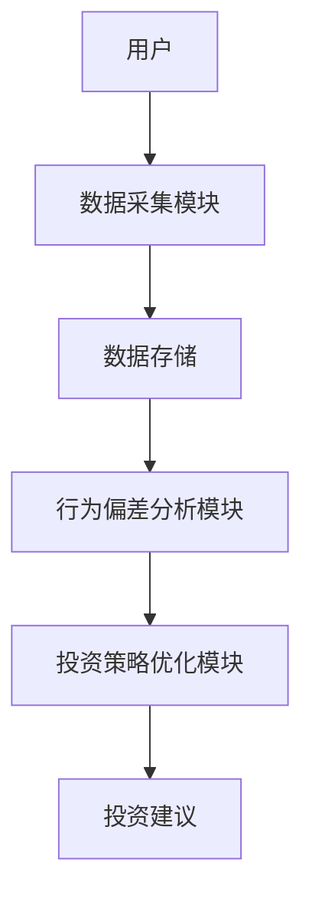
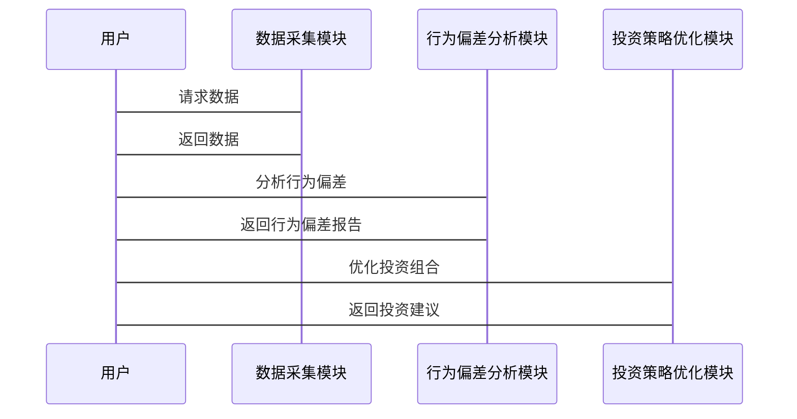

                 


# 格雷厄姆特价股票理论对行为金融学的补充

## 关键词：格雷厄姆投资理论，行为金融学，价值投资，市场情绪，股票分析

## 摘要：  
本文探讨了格雷厄姆的特价股票理论如何与行为金融学相结合，以提供更全面的投资分析。通过分析行为偏差和市场情绪对投资决策的影响，本文提出了一种结合两者理论的股票价值评估算法，并展示了如何构建一个集成的投资分析系统。文章详细解释了理论联系实际的方法，为投资者提供了新的视角和工具。

---

## 第1章：格雷厄姆特价股票理论概述

### 1.1 格雷厄姆投资理论的核心概念

#### 1.1.1 价值投资的定义与核心原则
- 价值投资是寻找市场价格低于其内在价值的股票的投资策略。
- 格雷厄姆的核心原则包括：
  - 安全边际：购买价格低于内在价值，以降低风险。
  - 股票作为企业所有权的一部分：投资于企业的长期价值。

#### 1.1.2 特价股票的定义与特征
- 特价股票：市场价格显著低于其内在价值的股票。
- 特征：
  - 低市盈率（P/E比率）。
  - 高市净率（P/B比率）。
  - 高股息率。

#### 1.1.3 格雷厄姆投资策略的历史背景
- 20世纪30年代经济大萧条期间，格雷厄姆发展出价值投资理论。
- 影响：为投资者提供了在市场低迷时期寻找机会的方法。

### 1.2 格雷厄姆投资理论的数学模型

#### 1.2.1 市盈率与内在价值的计算公式
- 市盈率（P/E）= 股价 / 每股收益。
- 内在价值计算：基于未来现金流的现值。

#### 1.2.2 股票安全边际的数学分析
- 安全边际 = 内在价值 - 市场价格。
- 边际安全系数：安全边际占市场价格的比例。

#### 1.2.3 投资组合优化的数学模型
- 现代投资组合理论（MPT）：通过分散投资降低风险。
- 格雷厄姆的策略：集中投资于少数高质量股票。

---

## 第2章：行为金融学基础

### 2.1 行为金融学的核心概念

#### 2.1.1 理性与非理性决策的定义
- 理性决策：基于完全理性和信息的决策。
- 非理性决策：受情绪、认知偏差影响的决策。

#### 2.1.2 行为偏差对投资决策的影响
- 常见偏差：确认偏差、过度自信、从众心理等。
- 影响：导致非理性投资决策。

#### 2.1.3 行为金融学的理论基础
- 基于心理学的研究，解释市场参与者的决策行为。

### 2.2 行为金融学与传统金融学的对比

#### 2.2.1 理论假设的差异
- 传统金融学：假设投资者理性。
- 行为金融学：考虑投资者的非理性行为。

#### 2.2.2 分析方法的对比
- 传统方法：基于假设价格反映所有信息。
- 行为方法：分析价格波动中的情绪因素。

#### 2.2.3 应用领域的差异
- 传统金融学：广泛应用于资产定价。
- 行为金融学：关注投资者行为对市场的影响。

---

## 第3章：格雷厄姆理论与行为金融学的结合

### 3.1 格雷厄姆理论中的行为因素

#### 3.1.1 投资者心理与价值评估的关系
- 投资者情绪影响市场价格，进而影响价值评估。
- 市场恐慌时，优质股票可能被低估。

#### 3.1.2 行为偏差对安全边际的影响
- 过度自信的投资者可能忽略安全边际。
- 认可偏差导致低估风险。

#### 3.1.3 市场情绪与内在价值的互动
- 市场情绪波动影响股票价格，但内在价值稳定。
- 投资者应关注长期价值而非短期情绪。

### 3.2 行为金融学对格雷厄姆理论的补充

#### 3.2.1 行为偏差对投资策略的影响
- 认识行为偏差，避免情绪化决策。
- 在投资策略中加入行为分析。

#### 3.2.2 市场情绪与价值评估的结合
- 利用市场情绪指标筛选被低估股票。
- 结合市场情绪和内在价值进行投资决策。

#### 3.2.3 行为金融学视角下的安全边际
- 行为偏差可能导致市场低估某些股票。
- 抓住市场情绪低点，投资具有安全边际的股票。

---

## 第4章：基于行为金融学的股票价值评估算法

### 4.1 算法原理

#### 4.1.1 行为偏差分析模块
- 识别投资者常见行为偏差。
- 评估偏差对股票价格的影响。

#### 4.1.2 市场情绪指标构建
- 使用技术指标（如RSI）和新闻情绪分析。
- 指标计算：情绪强度 = （正面情绪 - 负面情绪）/总情绪。

#### 4.1.3 投资组合优化
- 结合价值评估和市场情绪，优化投资组合。
- 示例：使用动态资产分配策略。

### 4.2 数学模型

#### 4.2.1 行为偏差对股票价格的影响
- 模型：P = V + E，其中E为情绪影响。
- V为内在价值，E为情绪偏差。

#### 4.2.2 市场情绪与股票价值的关系
- 情绪强度与股票超额收益相关。
- 情绪强度高的股票可能被高估或低估。

#### 4.2.3 基于行为金融学的多因子模型
- 因子包括：价值因子、动量因子、情绪因子。
- 模型：收益预测 = α + β1*价值因子 + β2*情绪因子 + ε。

---

## 第5章：行为金融学视角下的投资系统架构

### 5.1 系统功能设计

#### 5.1.1 数据采集模块
- 数据来源：股票市场数据、新闻数据、社交媒体数据。
- 数据预处理：清洗和特征提取。

#### 5.1.2 行为偏差分析模块
- 分析投资者行为偏差。
- 生成行为偏差报告。

#### 5.1.3 投资策略优化模块
- 优化投资组合。
- 输出投资建议。

### 5.2 系统架构设计

#### 5.2.1 系统架构图


#### 5.2.2 系统交互序列图


---

## 第6章：项目实战

### 6.1 环境配置

```python
# 安装依赖
pip install pandas numpy sklearn
```

### 6.2 核心实现

#### 6.2.1 数据预处理
```python
import pandas as pd
data = pd.read_csv('stock_data.csv')
```

#### 6.2.2 行为偏差分析
```python
from sklearn.decomposition import PCA
pca = PCA(n_components=3)
pca.fit(data)
```

#### 6.2.3 投资策略优化
```python
from sklearn.model_selection import train_test_split
X_train, X_test, y_train, y_test = train_test_split(X, y, test_size=0.2)
```

### 6.3 案例分析
- 数据来源：某股票的历史价格和市场情绪数据。
- 分析结果：该股票在市场情绪低点时具有较高的安全边际。

---

## 第7章：总结与展望

### 7.1 总结
- 格雷厄姆理论与行为金融学的结合提供了新的投资视角。
- 行为偏差和市场情绪对投资决策有重要影响。

### 7.2 展望
- 进一步研究行为金融学与技术分析的结合。
- 开发更智能的投资决策支持系统。

---

## 作者：AI天才研究院 & 禅与计算机程序设计艺术

---

通过以上目录和内容，文章详细探讨了格雷厄姆理论与行为金融学的结合，提供了理论分析和实际应用的指导，帮助投资者更好地理解和应用这些理论。

