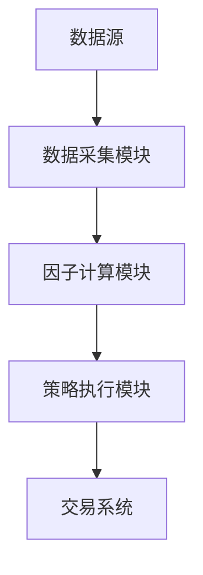

                 


# 格雷厄姆特价股票理论对量化投资的启示

> 关键词：格雷厄姆理论，量化投资，股票定价，价值投资，因子模型

> 摘要：本文深入探讨了格雷厄姆特价股票理论对量化投资的启示，分析了如何将格雷厄姆的安全边际概念与现代量化方法相结合，构建有效的投资模型。通过详细阐述理论基础、量化模型构建、算法实现及系统架构，本文为投资者提供了从传统价值投资到量化投资的桥梁，展示了如何利用格雷厄姆理论提升量化投资的效率和准确性。

---

# 第1章 格雷厄姆特价股票理论概述

## 1.1 格雷厄姆投资理论的背景与发展

### 1.1.1 投资理论的演变
- **传统投资理论**：基于市场有效性和资产组合理论。
- **价值投资的兴起**：本杰明·格雷厄姆提出“安全边际”概念，强调寻找市场低估的股票。
- **量化投资的崛起**：大数据和算法驱动的投资方式。

### 1.1.2 格雷厄姆的安全边际理论
- **定义**：安全边际=内在价值-市场价格。
- **投资策略**：买入市场价格低于内在价值的股票。
- **核心思想**：价格波动是投资机会的来源。

### 1.1.3 格雷厄姆理论的核心要素
| 核心要素 | 描述 |
|----------|------|
| 内在价值 | 股票的真实价值，基于基本面分析 |
| 安全边际 | 价格与内在价值的差异，提供风险缓冲 |
| 选股标准 | 市盈率、市净率、股息率等指标 |

## 1.2 格雷厄姆理论与现代投资理论的结合

### 1.2.1 格雷厄姆理论的现代视角
- **价值发现**：通过大数据分析寻找被低估的股票。
- **风险管理**：利用量化方法控制投资组合风险。

### 1.2.2 格雷厄姆理论对量化投资的启示
- **因子化**：将安全边际转化为可量化的因子。
- **系统化**：构建自动化交易策略。

---

# 第2章 量化投资的基本概念与工具

## 2.1 量化投资的核心概念

### 2.1.1 量化投资的定义
- **定义**：基于数学模型和算法的投资方式。
- **特点**：数据驱动、系统化、自动化。

### 2.1.2 量化投资的主要工具
- **数据处理**：清洗、特征提取。
- **算法交易**：高频交易、统计套利。
- **风险管理**：VaR、夏普比率。

## 2.2 数据分析与特征提取

### 2.2.1 数据来源
- **股票数据**：历史价格、成交量。
- **财务数据**：收入、利润、现金流。
- **文本数据**：新闻、财报。

### 2.2.2 数据清洗与预处理
- **数据清洗**：处理缺失值、异常值。
- **特征提取**：使用PCA进行降维。

## 2.3 量化投资中的数学模型

### 2.3.1 回归分析
- **线性回归**：预测股票价格。
- **逻辑回归**：分类市场状态。

### 2.3.2 时间序列分析
- **ARIMA模型**：预测股票价格趋势。

---

# 第3章 格雷厄姆量化模型的构建

## 3.1 格雷厄姆量化模型的核心要素

### 3.1.1 内在价值的量化
- **公式**：$V = \frac{E}{P} + \text{安全边际}$。
- **实现**：使用Python计算内在价值。

### 3.1.2 安全边际的量化
- **公式**：$Margin = V - P$。
- **实现**：筛选$Margin > 0$的股票。

## 3.2 格雷厄姆量化模型的因子选择

### 3.2.1 核心因子
| 因子 | 描述 | 公式 |
|------|------|------|
| 市盈率 | PE = P/EPS | |
| 市净率 | PB = P/BPS | |
| 股息率 | Dividend Yield = D/P | |

### 3.2.2 因子权重分配
- **加权方法**：使用等权重或市值加权。

## 3.3 格雷厄姆量化模型的实现步骤

### 3.3.1 数据收集与预处理
```python
import pandas as pd
data = pd.read_csv('stock_data.csv')
data = data.dropna()
```

### 3.3.2 因子计算与特征选择
```python
data['PE'] = data['Price'] / data['EPS']
data['PB'] = data['Price'] / data['BPS']
```

### 3.3.3 模型训练与回测
```python
from sklearn.linear_model import LinearRegression
model = LinearRegression()
model.fit(X, y)
```

---

# 第4章 格雷厄姆量化模型的算法实现

## 4.1 因子模型的实现

### 4.1.1 因子选择
- **代码示例**：
```python
def calculate_margin(price, eps):
    return price / eps - 1
```

### 4.1.2 因子组合
- **代码示例**：
```python
factors = ['PE', 'PB', 'Dividend']
```

## 4.2 风险管理与回测

### 4.2.1 风险管理策略
- **止损**：设定最大回撤。
- **止盈**：设定最大盈利。

### 4.2.2 回测分析
- **收益-风险比**：夏普比率。
- **稳定性分析**：最大回撤。

---

# 第5章 系统架构与项目实战

## 5.1 系统架构设计

### 5.1.1 系统功能模块
- **数据采集**：接口获取实时数据。
- **因子计算**：计算格雷厄姆因子。
- **策略执行**：根据因子结果生成交易信号。

### 5.1.2 系统架构图


## 5.2 项目实战分析

### 5.2.1 环境安装
```bash
pip install pandas numpy
```

### 5.2.2 核心代码实现
```python
import pandas as pd
import numpy as np

def calculate_margin(price, eps):
    return price / eps - 1

data = pd.read_csv('stock_data.csv')
data['Margin'] = calculate_margin(data['Price'], data['EPS'])
data.to_csv('result.csv')
```

---

# 第6章 总结与展望

## 6.1 格雷厄姆理论的量化投资启示
- **理论价值**：安全边际提供风险控制的量化标准。
- **实践意义**：为量化投资提供新的因子和策略。

## 6.2 未来展望
- **智能投顾**：结合AI优化因子模型。
- **多因子策略**：整合更多因子提升收益。

## 6.3 注意事项
- **数据质量**：确保数据准确。
- **模型风险**：避免过度拟合。

---

# 作者：AI天才研究院/AI Genius Institute & 禅与计算机程序设计艺术 /Zen And The Art of Computer Programming

