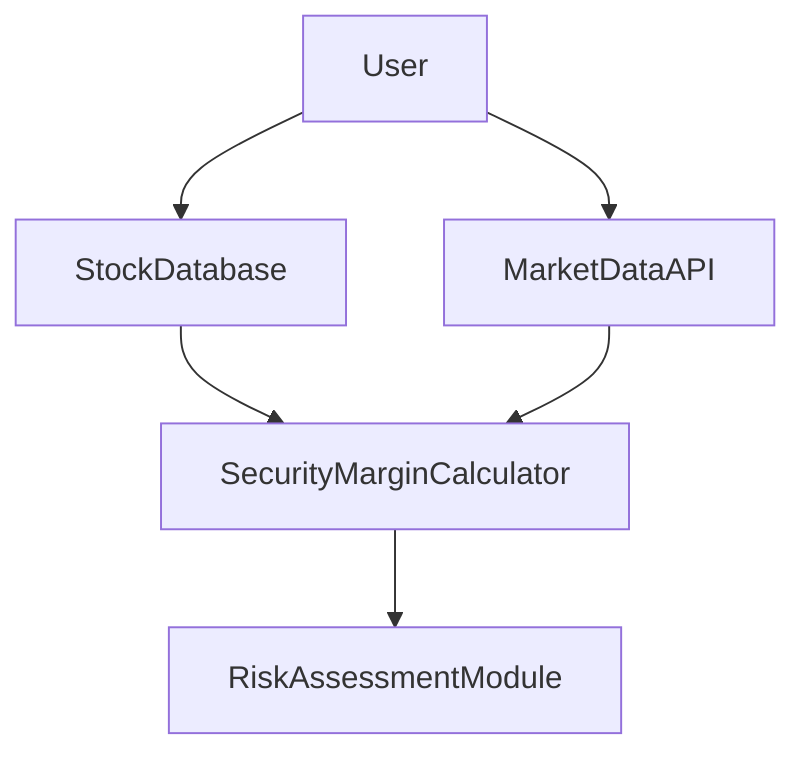
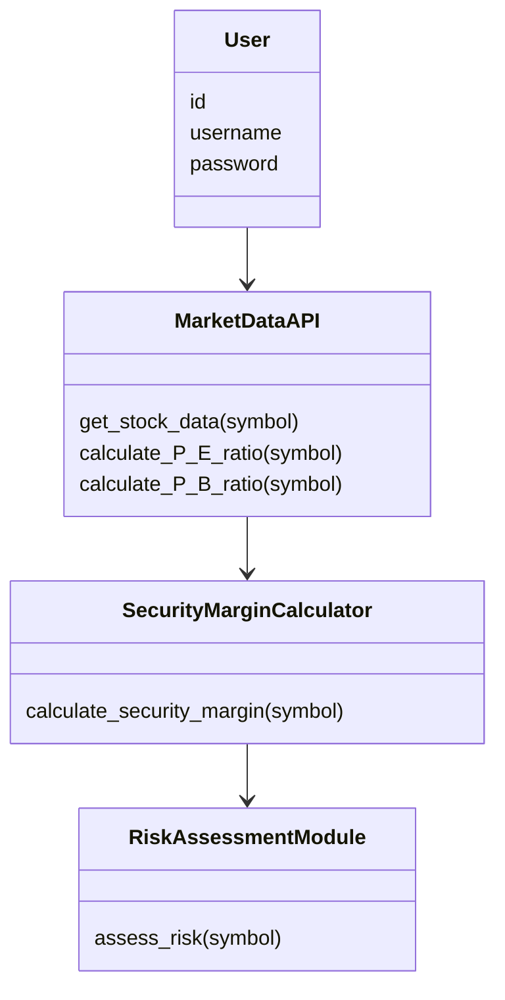

                 


# 《格雷厄姆特价股票理论对金融普惠的启示》

---

## 关键词：  
格雷厄姆投资理论、特价股票、金融普惠、价值投资、安全边际、市盈率、市净率

---

## 摘要：  
本文从格雷厄姆的特价股票理论出发，探讨其对金融普惠的启示。通过分析安全边际、低市盈率和低市净率等核心概念，结合数学模型和系统架构设计，揭示如何通过价值投资实现金融资源的公平分配。本文不仅提供理论支持，还通过Python代码实现和实际案例分析，为读者提供可操作的金融普惠实践方案。

---

# 第一部分：背景介绍

## 第1章：格雷厄姆特价股票理论的理论基础

### 1.1 价值投资的起源与发展

#### 1.1.1 价值投资的起源  
价值投资作为一种投资策略，起源于20世纪初。本杰明·格雷厄姆（Benjamin Graham）是该领域的先驱，他提出了“安全边际”和“内在价值”等核心概念，为价值投资奠定了理论基础。

#### 1.1.2 格雷厄姆的学术贡献  
格雷厄姆不仅是价值投资的创始人之一，还与戴维·多德（David Dodd）共同开发了基本面分析方法。他的著作《股票分析的艺术》和《聪明的投资者》成为投资领域的经典。

#### 1.1.3 特价股票理论的核心思想  
格雷厄姆提出的特价股票理论强调以低于内在价值的价格购买股票，通过安全边际来降低投资风险。他认为，市场的短期波动性为投资者提供了以折扣价买入优质股票的机会。

---

## 第2章：金融普惠的概念与意义

### 2.1 金融普惠的定义

#### 2.1.1 金融普惠的内涵  
金融普惠是指通过降低门槛和提高可及性，让更多人能够享受到金融服务和投资机会。它强调公平和包容性，旨在缩小贫富差距。

#### 2.1.2 金融普惠的目标  
金融普惠的目标是让所有人都能以合理成本获得必要的金融服务，包括储蓄、信贷、保险和投资。

#### 2.1.3 金融普惠的实现路径  
通过技术创新、政策支持和教育普及，降低金融门槛，扩大金融服务的覆盖范围。

---

## 第3章：格雷厄姆特价股票理论与金融普惠的联系

### 3.1 特价股票理论如何促进金融普惠

#### 3.1.1 通过低估值股票降低投资门槛  
格雷厄姆的理论强调买入低于内在价值的股票，这为小投资者提供了以较低成本进入市场的机会。

#### 3.1.2 提供小投资者的价值发现工具  
通过分析市盈率和市净率，小投资者可以识别被低估的股票，从而在市场中找到投资机会。

#### 3.1.3 帮助实现财富的公平分配  
特价股票理论通过强调安全边际和长期价值，帮助小投资者避免盲目跟风，实现财富的稳定增长。

---

# 第二部分：核心概念与联系

## 第4章：格雷厄姆特价股票理论的核心概念

### 4.1 安全边际的概念与计算

#### 4.1.1 安全边际的定义  
安全边际是指股票的市场价格低于其内在价值的部分，用于缓冲市场波动带来的风险。

#### 4.1.2 安全边际的计算公式  
$$ \text{安全边际} = \text{内在价值} - \text{市场价格} $$

#### 4.1.3 安全边际与投资风险的关系  
安全边际越高，投资风险越低。通过安全边际，投资者可以在市场波动中保持稳健的投资回报。

### 4.2 低市盈率与低市净率的比较

#### 4.2.1 市盈率与市净率的定义  
- 市盈率（P/E）= 股价 / 每股净利润  
- 市净率（P/B）= 股价 / 每股净资产  

#### 4.2.2 低市盈率与低市净率的优缺点对比  

| 指标 | 优点 | 缺点 |
|------|------|------|
| 市盈率 | 反映盈利能力 | 受行业和企业规模影响较大 |
| 市净率 | 反映资产质量 | 受资产重企业影响较大 |

#### 4.2.3 低市盈率与低市净率的适用场景  
- 低市盈率适用于盈利稳定的成熟企业。  
- 低市净率适用于资产密集型行业，如银行和制造业。

---

# 第三部分：理论分析与数学模型

## 第5章：格雷厄姆特价股票理论的数学模型

### 5.1 安全边际的数学公式

#### 5.1.1 内在价值的估算  
$$ \text{内在价值} = \frac{\text{净利润} \times (1 + g)}{r - g} $$  
其中，$g$为净利润增长率，$r$为折现率。

#### 5.1.2 安全边际的计算  
$$ \text{安全边际} = \frac{\text{内在价值}}{\text{市场价格}} $$

### 5.2 市盈率与市净率的比较公式

#### 5.2.1 市盈率与市净率的对比  
$$ \text{P/E} < \text{行业平均P/E} \quad \text{且} \quad \text{P/B} < \text{行业平均P/B} $$

---

# 第四部分：系统分析与架构设计

## 第6章：金融普惠信息平台的设计与实现

### 6.1 项目介绍

#### 6.1.1 项目背景  
本项目旨在通过技术手段实现金融普惠，帮助小投资者利用格雷厄姆的特价股票理论进行投资。

### 6.2 系统功能设计

#### 6.2.1 功能模块  
- 用户界面：股票筛选、数据查询、投资建议。  
- 数据处理：市盈率、市净率计算，安全边际评估。  
- 风险评估：基于安全边际的风险等级划分。

#### 6.2.2 实体关系图  


---

## 第7章：系统架构设计

### 7.1 架构设计

#### 7.1.1 技术选型  
- 前端：React.js  
- 后端：Django  
- 数据库：PostgreSQL  

#### 7.1.2 架构图  


---

# 第五部分：项目实战

## 第8章：环境安装与代码实现

### 8.1 环境安装

#### 8.1.1 Python环境  
- 安装Python 3.8及以上版本。  
- 安装依赖：pip install numpy pandas matplotlib。

### 8.2 核心代码实现

#### 8.2.1 股票筛选系统

```python
import pandas as pd
import numpy as np

def calculate_intrinsic_value(eps, growth_rate, discount_rate):
    return eps * (1 + growth_rate) / (discount_rate - growth_rate)

def calculate_security_margin(intrinsic_value, market_price):
    return intrinsic_value / market_price

# 示例数据
data = {
    'symbol': ['AAPL', 'GOOGL', 'MSFT'],
    'eps': [4.09, 31.01, 6.09],
    'growth_rate': [0.05, 0.03, 0.04],
    'discount_rate': [0.08, 0.07, 0.09]
}

df = pd.DataFrame(data)

# 计算内在价值和安全边际
df['intrinsic_value'] = df.apply(lambda x: calculate_intrinsic_value(x['eps'], x['growth_rate'], x['discount_rate']), axis=1)
df['market_price'] = df['symbol'].apply(lambda x: get_market_price(x))  # 假设get_market_price函数已实现
df['security_margin'] = df.apply(lambda x: calculate_security_margin(x['intrinsic_value'], x['market_price']), axis=1)

print(df)
```

---

## 第9章：代码解读与案例分析

### 9.1 代码解读

#### 9.1.1 核心函数  
- `calculate_intrinsic_value`：计算内在价值。  
- `calculate_security_margin`：计算安全边际。

#### 9.1.2 数据处理  
通过数据框存储股票信息，计算内在价值和市场价，最终得出安全边际。

### 9.2 实际案例分析

#### 9.2.1 案例背景  
以苹果公司（AAPL）为例，假设其市盈率为15，市净率为3，净利润为4.09美元。

#### 9.2.2 计算过程  
$$ \text{内在价值} = \frac{4.09 \times (1 + 0.05)}{0.08 - 0.05} = 140.33 $$  
$$ \text{市场价} = 150 $$  
$$ \text{安全边际} = \frac{140.33}{150} = 0.9355 $$  

#### 9.2.3 投资建议  
由于安全边际为93.55%，建议买入。

---

# 第六部分：小结与注意事项

## 第10章：总结与展望

### 10.1 小结  
格雷厄姆的特价股票理论通过强调安全边际和低估值股票，为金融普惠提供了理论支持和技术实现路径。通过系统架构设计和代码实现，我们可以将理论应用于实际投资中。

### 10.2 投资建议  
- 选择具有较高安全边际的股票。  
- 长期投资，避免短期波动影响。  
- 结合宏观经济环境进行投资决策。

### 10.3 风险管理注意事项  
- 设定止损点，控制风险敞口。  
- 定期复盘，调整投资组合。  
- 关注行业动态，避免行业黑天鹅事件。

### 10.4 拓展阅读  
推荐阅读格雷厄姆的《聪明的投资者》和彼得·林奇的《战胜市场的艺术》。

---

## 作者：  
AI天才研究院（AI Genius Institute） & 禅与计算机程序设计艺术（Zen And The Art of Computer Programming）

