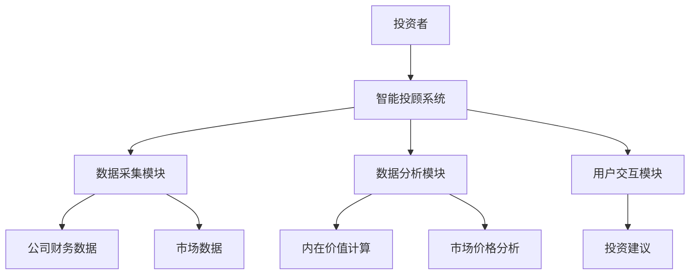
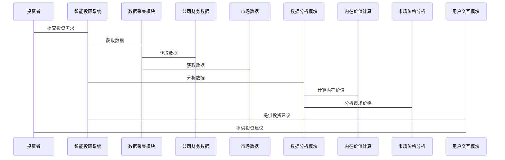

                 


# 《格雷厄姆特价股票理论对金融科技的启示》

**关键词：** 格雷厄姆投资理论，金融科技，价值投资，智能投顾，量化交易，大数据分析，人工智能

**摘要：**  
本文从格雷厄姆特价股票理论的核心思想出发，结合金融科技领域的最新发展，深入探讨了该理论在金融数据分析、智能投顾、量化交易等领域的应用潜力。通过数学模型、算法流程图和系统架构设计等技术手段，展示了如何将格雷厄姆的价值投资理念与现代科技相结合，为金融科技的创新提供新的思路和实践方案。

---

## 第一部分: 格雷厄姆特价股票理论的背景与核心思想

### 第1章: 格雷厄姆特价股票理论概述

#### 1.1 格雷厄姆投资理论的背景
格雷厄姆是价值投资的鼻祖，他的投资理念强调以低于内在价值的价格买入优质股票，从而实现长期稳定的收益。这种投资策略的核心在于寻找市场低估的股票，并通过安全边际来降低投资风险。

##### 1.1.1 价值投资的起源与发展
价值投资起源于20世纪20年代，格雷厄姆与大卫·多德共同提出的“安全分析”理论奠定了价值投资的基础。该理论强调通过基本面分析，寻找市场价格低于内在价值的股票进行投资。

##### 1.1.2 格雷厄姆的投资理念与方法
格雷厄姆提出的核心理念是“买入便宜的东西”。他认为，股票的内在价值可以通过对公司财务状况的分析来估算，而市场价格则会因市场波动而偏离其内在价值。因此，投资者应寻找市场价格低于内在价值的股票。

##### 1.1.3 特价股票理论的核心思想
特价股票理论的核心思想是：  
1. 股票的价值可以通过对企业未来现金流的折现来评估。  
2. 市场价格受情绪和短期波动影响，往往偏离其内在价值。  
3. 投资者应通过分析发现市场价格低于内在价值的股票，并长期持有以实现收益。

#### 1.2 格雷厄姆投资理论的数学模型
格雷厄姆的内在价值计算公式为：  
$$ V = \frac{E}{P} $$  
其中，$V$ 表示内在价值，$E$ 表示每股收益，$P$ 表示市盈率。

安全边际的概念与公式：  
$$ S = V - P $$  
其中，$S$ 表示安全边际，$V$ 表示内在价值，$P$ 表示市场价格。

##### 核心要素对比
| 对比维度 | 传统投资 | 格雷厄姆理论 |
|----------|----------|-------------|
| 核心目标 | 资本增值 | 价值发现与低估投资 |
| 投资策略 | 短期交易 | 长期持有 |
| 风险控制 | 高风险 | 低风险 |

---

## 第二部分: 金融科技的现状与发展趋势

### 第2章: 金融科技的核心技术与应用

#### 2.1 金融科技的主要技术
##### 2.1.1 大数据技术在金融领域的应用
大数据技术可以帮助投资者快速分析海量数据，发现市场低估的股票。例如，通过分析公司财务数据、行业趋势和市场情绪，可以筛选出符合格雷厄姆价值投资理念的股票。

##### 2.1.2 人工智能与机器学习在金融中的应用
人工智能和机器学习可以用于股票筛选、风险评估和投资组合优化。例如，使用机器学习算法训练模型，识别符合格雷厄姆价值投资理念的股票。

##### 2.1.3 区块链技术的金融创新
区块链技术可以用于金融交易的透明化和去中心化，提高金融系统的安全性。

#### 2.2 金融科技的典型应用场景
##### 2.2.1 智能投顾
智能投顾通过算法和大数据分析，为投资者提供个性化的投资建议。格雷厄姆的价值投资理念可以融入智能投顾系统，帮助投资者发现低估股票。

##### 2.2.2 量化交易
量化交易利用算法和数学模型进行交易决策。格雷厄姆的内在价值计算公式可以作为量化交易的参考模型。

##### 2.2.3 金融风险管理
金融科技可以帮助投资者实时监控市场风险，优化投资组合，降低投资风险。

#### 2.3 金融科技的发展趋势
##### 2.3.1 数字化转型
金融机构正在加速数字化转型，利用新技术提升服务效率和客户体验。

##### 2.3.2 人工智能的深度应用
人工智能在金融领域的应用将更加广泛，从股票筛选到风险评估，都将更加智能化。

##### 2.3.3 去中心化金融（DeFi）的发展
区块链技术推动了去中心化金融的发展，为金融创新提供了新的可能性。

---

## 第三部分: 格雷厄姆理论与金融科技的结合

### 第3章: 格雷厄姆理论在金融科技中的应用

#### 3.1 价值投资与大数据分析的结合
##### 3.1.1 数据驱动的股票筛选
通过大数据分析，可以快速筛选出符合格雷厄姆价值投资理念的股票。例如，分析公司财务数据，计算市盈率、市净率等指标，识别市场价格低于内在价值的股票。

##### 3.1.2 通过大数据挖掘发现低估股票
利用大数据技术，分析市场情绪、行业趋势和公司基本面，发现市场低估的股票。

##### 3.1.3 机器学习在股票估值中的应用
机器学习算法可以训练模型，预测股票的内在价值和市场价格，识别符合格雷厄姆价值投资理念的股票。

#### 3.2 格雷厄姆理论与智能投顾
##### 3.2.1 智能投顾的定义与特点
智能投顾是利用算法和大数据分析，为投资者提供个性化的投资建议。

##### 3.2.2 格雷厄姆理论在智能投顾中的应用
将格雷厄姆的价值投资理念融入智能投顾系统，帮助投资者发现低估股票，实现长期稳定的收益。

##### 3.2.3 案例
例如，智能投顾系统可以通过分析市场数据，识别符合格雷厄姆价值投资理念的股票，为投资者提供投资建议。

#### 3.3 格雷厄姆理论与量化交易
##### 3.3.1 量化交易的定义与特点
量化交易是利用算法和数学模型进行交易决策。

##### 3.3.2 格雷厄姆理论在量化交易中的应用
将格雷厄姆的内在价值计算公式作为量化交易的参考模型，识别市场价格低于内在价值的股票进行投资。

#### 3.4 系统架构设计
##### 3.4.1 系统功能设计
- 数据采集模块：采集公司财务数据、市场数据等。
- 数据分析模块：计算股票的内在价值和市场价格，识别符合格雷厄姆价值投资理念的股票。
- 用户交互模块：为投资者提供个性化的投资建议。

##### 3.4.2 系统架构设计


---

## 第四部分: 金融科技与格雷厄姆理论的系统分析与架构设计

### 第4章: 金融科技与格雷厄姆理论的系统分析

#### 4.1 问题场景介绍
格雷厄姆的价值投资理念需要结合现代技术，实现自动化、智能化的投资决策。

#### 4.2 系统功能设计
- 数据采集模块：采集公司财务数据、市场数据等。
- 数据分析模块：计算股票的内在价值和市场价格，识别符合格雷厄姆价值投资理念的股票。
- 用户交互模块：为投资者提供个性化的投资建议。

#### 4.3 系统架构设计


#### 4.4 系统接口设计
- 数据接口：与数据源对接，获取公司财务数据和市场数据。
- 用户接口：与投资者交互，提供投资建议。

#### 4.5 系统交互设计


---

## 第五部分: 金融科技与格雷厄姆理论的项目实战

### 第5章: 项目实战

#### 5.1 环境安装
- 安装Python和必要的数据分析库（如Pandas、NumPy、Scikit-learn）。

#### 5.2 核心实现
##### 5.2.1 格雷厄姆价值投资模型的实现
```python
import pandas as pd
import numpy as np

# 计算内在价值
def calculate_intrinsic_value(earnings_per_share, price_to_earnings_ratio):
    return earnings_per_share / price_to_earnings_ratio

# 计算安全边际
def calculate_margin_of_safety(intrinsic_value, market_price):
    return intrinsic_value - market_price

# 示例数据
data = {
    '公司': ['公司A', '公司B', '公司C'],
    '每股收益': [1.5, 2.0, 1.8],
    '市盈率': [15, 20, 18]
}

df = pd.DataFrame(data)
df['内在价值'] = df.apply(lambda x: calculate_intrinsic_value(x['每股收益'], x['市盈率']), axis=1)
df['市场价格'] = [10, 15, 12]
df['安全边际'] = df.apply(lambda x: calculate_margin_of_safety(x['内在价值'], x['市场价格']), axis=1)

print(df)
```

##### 5.2.2 机器学习算法在股票筛选中的应用
```python
from sklearn.linear_model import LinearRegression

# 训练模型
model = LinearRegression()
X = df[['市盈率', '每股收益']]
y = df['内在价值']
model.fit(X, y)

# 预测内在价值
new_data = [[16, 1.6]]
predicted_value = model.predict(new_data)
print(predicted_value)
```

#### 5.3 案例分析与解读
通过上述代码，我们可以筛选出市场价格低于内在价值的股票，实现格雷厄姆价值投资理念的自动化应用。

---

## 第六部分: 总结与展望

### 第6章: 总结与展望

#### 6.1 本章总结
本文通过分析格雷厄姆价值投资理论，结合金融科技的发展趋势，探讨了如何将价值投资理念与现代技术相结合，实现智能化的投资决策。

#### 6.2 未来展望
未来，随着人工智能和大数据技术的进一步发展，格雷厄姆价值投资理论将在金融科技领域得到更广泛的应用，为投资者提供更精准的投资决策支持。

---

**作者：AI天才研究院/AI Genius Institute & 禅与计算机程序设计艺术 /Zen And The Art of Computer Programming**

