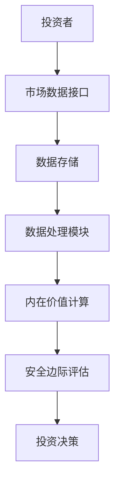

                 


# 格雷厄姆特价股票理论的局限性探讨

## 关键词：格雷厄姆特价股票理论, 价值投资, 安全边际, 内在价值, 投资策略, 市场变化

## 摘要：本文探讨格雷厄姆特价股票理论在现代市场环境下的局限性，分析其核心概念、算法原理及系统架构，结合实际案例，揭示其在面对快速变化的市场环境时的不足，并提出优化建议。

---

## 第一部分: 格雷厄姆特价股票理论的背景与核心概念

### 第1章: 格雷厄姆特价股票理论的发展历程

#### 1.1 价值投资的起源与背景

- **价值投资的起源**：价值投资的概念起源于20世纪初，本杰明·格雷厄姆是该领域的先驱。他通过分析市场波动和投资者心理，提出了安全边际和内在价值的概念。
- **学术与实践经历**：格雷厄姆在哥伦比亚大学任教，培养了包括巴菲特在内的众多投资大师，其实践经验和理论研究为价值投资奠定了基础。
- **理论提出背景**：20世纪30年代的大萧条时期，格雷厄姆观察到市场的恐慌性和非理性，促使他提出了寻找廉价股票的策略。

#### 1.2 格雷厄姆的核心思想

- **安全边际**：安全边际是指股票的市场价格低于其内在价值的部分，确保投资的安全性。
- **内在价值计算**：通过分析公司基本面，如市盈率、市净率等指标，估算股票的真正价值。
- **市场先生理论**：投资者应忽视市场的短期波动，专注于长期价值。

#### 1.3 特价股票理论的实践基础

- **早期成功案例**：格雷厄姆的学生巴菲特在实践中取得了巨大成功，证明了价值投资的有效性。
- **理论的适用环境**：适用于市场波动较大、股票价格被低估的时期。

---

### 第2章: 格雷厄姆特价股票理论的核心观点

#### 2.1 价值投资的核心理念

- **安全边际**：通过购买价格远低于内在价值的股票，降低投资风险。
- **内在价值评估**：分析公司的财务状况、盈利能力，计算其真实价值。
- **市场非理性**：市场短期波动不可预测，投资者应关注长期价值。

#### 2.2 格雷厄姆筛选法的步骤与要点

- **第一步：筛选低估股票的标准**：市盈率低于行业平均水平，市净率低于历史平均水平。
- **第二步：财务指标分析**：关注ROE、ROA等指标，评估公司的盈利能力。
- **第三步：买入与卖出策略**：在价格低于内在价值时买入，高于时卖出。

---

## 第二部分: 格雷厄姆特价股票理论的局限性分析

### 第5章: 格雷厄姆理论的核心概念与联系

#### 5.1 核心概念的定义与属性

- **安全边际**：确保投资的本金安全，减少市场波动的影响。
- **内在价值**：公司未来现金流的现值，反映其真实价值。
- **市场波动**：短期市场波动无法预测，但长期趋势可分析。

#### 5.2 核心概念的属性对比表格

| 概念         | 描述                                                                 |
|--------------|----------------------------------------------------------------------|
| 安全边际     | 股票价格低于内在价值的部分，提供额外保护。                        |
| 内在价值     | 股票基于公司基本面计算的真正价值。                              |
| 市场波动     | 价格短期波动，受投资者情绪影响，无法预测。                       |

#### 5.3 实体关系图（ER图）

```mermaid
erdiagram
actor 投资者 {
  <资产>
  <负债>
  <所有者权益>
}
```

---

### 第6章: 格雷厄姆理论的系统分析与架构设计

#### 6.1 系统架构设计



#### 6.2 系统功能设计

- **数据采集**：获取公司财务数据和市场数据。
- **数据分析**：计算市盈率、市净率等指标。
- **内在价值计算**：评估股票的真正价值。
- **安全边际评估**：确定购买价格的安全空间。

---

### 第7章: 格雷厄姆理论的项目实战

#### 7.1 环境安装

- 安装Python和相关库（pandas、numpy）。
- 配置Jupyter Notebook。

#### 7.2 核心代码实现

```python
import pandas as pd
import numpy as np

def calculate_intrinsic_value(revenue, profit_margin, discount_rate):
    # 计算自由现金流
    free_cash_flow = revenue * profit_margin
    # 计算终值
    terminal_value = free_cash_flow / (discount_rate - growth_rate)
    # 计算内在价值
    intrinsic_value = (free_cash_flow + terminal_value) / (discount_rate - growth_rate)
    return intrinsic_value

# 示例数据
revenue = 1000000
profit_margin = 0.1
discount_rate = 0.08
growth_rate = 0.05

iv = calculate_intrinsic_value(revenue, profit_margin, discount_rate)
print(f"内在价值: ${iv:.2f}")
```

#### 7.3 代码解读与分析

- 通过财务数据计算公司现金流和终值，评估内在价值。
- 结合市场价与内在价值，确定安全边际。

#### 7.4 实际案例分析

- 案例：分析某公司的财务数据，计算其内在价值，判断是否低估。

---

### 第8章: 格雷厄姆理论的最佳实践

#### 8.1 小结

- 格雷厄姆理论在长期投资中有效，但在现代市场中需调整策略。

#### 8.2 注意事项

- 定期评估模型假设，适应市场变化。
- 结合技术分析，优化投资策略。

#### 8.3 拓展阅读

- 推荐书籍：《投资学基础》、《证券分析》。

---

## 结语

格雷厄姆特价股票理论虽然在长期投资中表现出色，但在现代市场环境下面临诸多挑战。通过分析其局限性，投资者可以更好地结合市场变化，优化投资策略。

---

## 作者：AI天才研究院/AI Genius Institute & 禅与计算机程序设计艺术/Zen And The Art of Computer Programming

