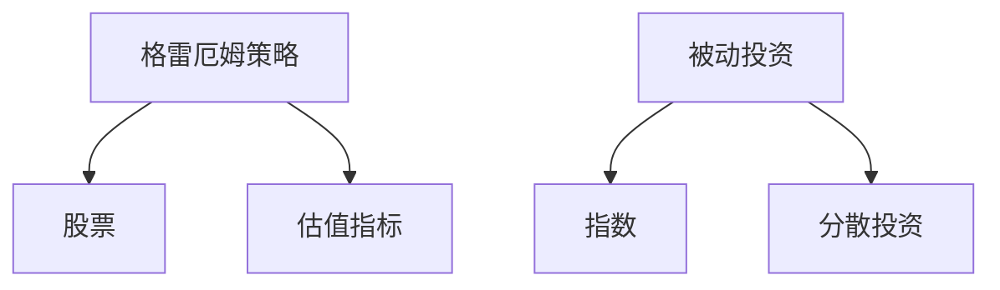
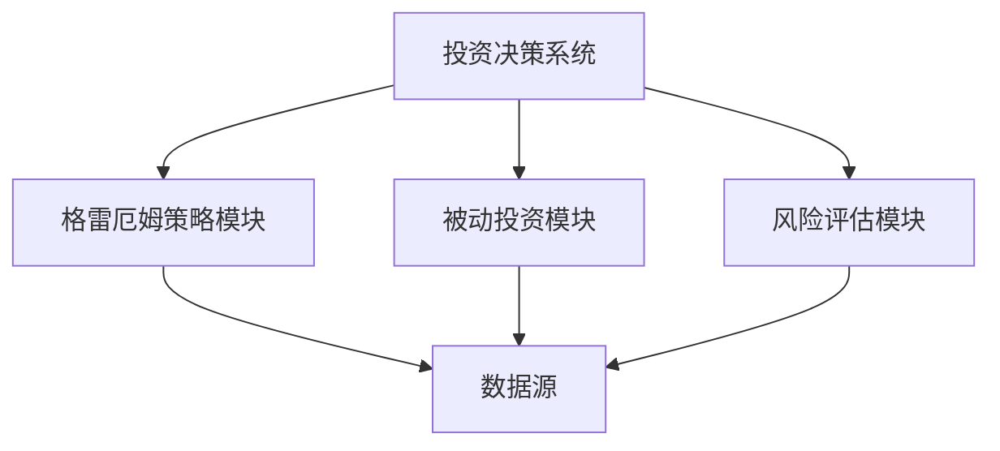

                 


# 格雷厄姆特价股票策略与被动投资的比较

## 关键词：价值投资、被动投资、格雷厄姆、指数基金、股票策略

## 摘要：本文将详细比较格雷厄姆特价股票策略与被动投资在核心概念、数学模型、系统架构和实际案例等方面的异同，帮助投资者理解两种策略的特点和适用场景。

---

# 第一部分: 格雷厄姆特价股票策略与被动投资的背景与核心概念

## 第1章: 格雷厄姆特价股票策略与被动投资的背景介绍

### 1.1 格雷厄姆特价股票策略的背景与问题背景
#### 1.1.1 价值投资的起源与发展
价值投资起源于20世纪初，本杰明·格雷厄姆是该领域的先驱。他认为市场在短期内是情绪化的，但长期来看会回归其内在价值。格雷厄姆的学生彼得·林奇进一步发展了这一理念。

#### 1.1.2 格雷厄姆投资理念的核心思想
格雷厄姆强调安全边际，即以低于内在价值的价格买入股票，以避免市场波动带来的损失。他认为，通过分析公司的财务报表，特别是市盈率（P/E）、市净率（P/B）等指标，可以找到被低估的股票。

#### 1.1.3 特价股票策略的定义与目标
特价股票策略的目标是通过识别市场低估的股票，长期持有，等待其价值回归。格雷厄姆建议投资者关注那些市盈率低于行业平均水平、股息率稳定且公司财务状况健康的公司。

### 1.2 被动投资的兴起与问题背景
#### 1.2.1 被动投资的定义与特点
被动投资是指通过跟踪指数（如标普500）来构建投资组合，避免频繁交易。其特点是费用低、风险分散，适合长期投资。

#### 1.2.2 被动投资的兴起背景
随着机构投资者的兴起和指数基金的普及，被动投资在20世纪末逐渐成为主流。其低成本和分散化的优势使其成为许多投资者的首选。

#### 1.2.3 被动投资与主动投资的对比
主动投资需要选股，费用较高，风险较大；被动投资则通过分散化降低风险，费用低，但收益受限于指数表现。

## 第2章: 格雷厄姆特价股票策略与被动投资的核心概念对比

### 2.1 核心概念原理
#### 2.1.1 格雷厄姆特价股票策略的核心原理
格雷厄姆策略基于基本面分析，寻找低估的股票。其核心在于通过安全边际确保投资的安全性。

#### 2.1.2 被动投资的核心原理
被动投资通过分散化降低风险，利用市场的长期上涨趋势获得收益。

#### 2.1.3 两者的共同点与差异点
两者都注重长期投资，但格雷厄姆策略强调选股，被动投资强调分散。

### 2.2 核心概念属性特征对比表格
| 特性 | 格雷厄姆特价股票策略 | 被动投资 |
|------|----------------------|----------|
| 投资目标 | 寻找被低估的股票 | 按指数权重配置资产 |
| 投资策略 | 主动选股，长期持有 | 按照指数成分股配置 |
| 风险控制 | 严格估值筛选 | 通过分散投资降低风险 |
| 交易频率 | 低频交易 | 仅在市场波动时调整 |

### 2.3 ER实体关系图


---

# 第二部分: 格雷厄姆特价股票策略与被动投资的数学模型与算法原理

## 第3章: 格雷厄姆特价股票策略的数学模型

### 3.1 格雷厄姆选股公式
#### 3.1.1 市盈率（P/E）计算公式
$$ P/E = \frac{\text{股价}}{\text{每股收益}} $$

#### 3.1.2 市净率（P/B）计算公式
$$ P/B = \frac{\text{股价}}{\text{每股净资产}} $$

### 3.2 格雷厄姆的“安全边际”计算
$$ \text{内在价值} = \text{未来现金流的现值} $$

## 第4章: 被动投资的数学模型

### 4.1 指数基金的收益计算
$$ \text{收益} = \sum_{i=1}^{n} w_i \times r_i $$
其中，\( w_i \) 是第 \( i \) 只股票的权重，\( r_i \) 是其收益率。

---

# 第三部分: 系统分析与架构设计方案

## 第5章: 格雷厄姆特价股票策略与被动投资的系统分析

### 5.1 问题场景介绍
投资者需要在市场波动中选择合适的投资策略。格雷厄姆策略适合长期价值投资者，被动投资适合风险偏好较低的投资者。

### 5.2 项目介绍
构建一个投资决策系统，帮助投资者选择适合的策略。

### 5.3 系统功能设计
- 格雷厄姆策略模块：筛选低估股票。
- 被动投资模块：跟踪指数表现。
- 风险评估模块：计算投资组合的风险。

### 5.4 系统架构设计


---

# 第四部分: 项目实战

## 第6章: 格雷厄姆特价股票策略的项目实战

### 6.1 环境安装
使用Python和Pandas进行数据分析，安装相关库。

### 6.2 核心实现源代码
```python
import pandas as pd

def calculate_pe(ticker):
    # 示例代码，实际需要获取股价和EPS数据
    pe = df['股价'] / df['EPS']
    return pe

# 示例：筛选P/E低于市场平均水平的股票
market_pe = df['P/E'].mean()
selected_stocks = df[df['P/E'] < market_pe]
```

## 第7章: 被动投资的项目实战

### 7.1 指数基金配置
根据指数权重分配投资比例。

### 7.2 实际案例分析
分析过去十年指数基金的表现，比较格雷厄姆策略的收益。

---

# 第五部分: 总结与最佳实践

## 第8章: 格雷厄姆特价股票策略与被动投资的总结与比较

### 8.1 核心内容总结
- 格雷厄姆策略适合长期价值投资者，被动投资适合分散投资。
- 两者的优缺点互补，可以根据市场环境选择。

### 8.2 最佳实践 tips
- 结合市场环境选择策略。
- 定期评估投资组合。

---

# 作者

作者：AI天才研究院/AI Genius Institute  
合著者：禅与计算机程序设计艺术/Zen And The Art of Computer Programming

