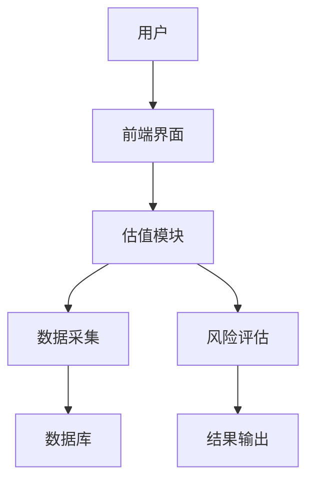

                 


# 格雷厄姆特价股票策略在不同中央银行数字货币环境下的调整

## 关键词：格雷厄姆策略、中央银行数字货币、股票估值、投资策略、数字货币市场

## 摘要：本文探讨了在中央银行数字货币环境下，如何调整格雷厄姆的特价股票策略。通过分析CBDC对金融市场的影响，提出了新的估值模型和交易策略，以应对数字货币环境下的投资挑战。

---

## 第一部分: 格雷厄姆特价股票策略与中央银行数字货币的背景介绍

### 第1章: 格雷厄姆特价股票策略概述

#### 1.1 格雷厄姆投资理论的核心思想
##### 1.1.1 价值投资的基本原理
格雷厄姆的价值投资理论强调以低于内在价值的价格购买股票，长期持有，等待市场回归理性。其核心在于寻找被市场低估的企业，关注企业的财务状况和长期发展潜力。

##### 1.1.2 格雷厄姆选股标准
- 低市盈率（P/E比率）：市盈率低于行业平均水平。
- 低市净率（P/B比率）：市净率低于行业平均水平。
- 高股息率：股息收益率较高，反映企业的盈利能力和分红意愿。
- 强大的财务状况：关注企业的净资产收益率（ROE）、负债率等指标。

##### 1.1.3 特价股票的定义与特征
特价股票是指市场价格显著低于内在价值的股票。其特征包括低估值、高分红、稳定的财务状况和良好的行业前景。

#### 1.2 格雷厄姆策略在传统股票市场中的应用
- 投资者通过分析公司财务报表，识别低估股票。
- 长期持有策略，避免频繁交易，减少交易成本。

### 第2章: 中央银行数字货币的概述

#### 2.1 中央银行数字货币的定义与特征
中央银行数字货币（CBDC）是由国家中央银行发行的数字货币，具有以下特征：
- 法偿性：由国家信用背书，具有强制支付能力。
- 数字化：基于区块链等技术，实现点对点的数字货币交易。
- 可控匿名性：在保护隐私的同时，便于监管机构追踪资金流动。

#### 2.2 CBDC与传统货币的区别
| 特性 | 传统货币 | CBDC |
|------|-----------|------|
| 转账方式 | 实体或电子转账 | 数字化实时转账 |
| 交易速度 | 较慢，依赖银行系统 | 极快，去中心化技术支持 |
| 成本 | 较高 | 较低，减少中间环节 |

#### 2.3 CBDC的发行机制
- 中央银行作为发行主体，负责发行和管理CBDC。
- 使用分布式账本技术（DLT）实现去中心化交易。
- 具备智能合约功能，自动化执行金融交易。

### 第3章: 格雷厄姆策略在数字货币环境下的适应性

#### 3.1 数字货币市场的特点
- 高波动性：数字货币价格波动剧烈，影响股票估值。
- 全球化：数字货币市场24小时交易，跨越国界。
- 技术驱动：区块链等技术改变交易方式和市场结构。

#### 3.2 格雷厄姆策略在数字货币市场的挑战
- 信息不对称：数字货币市场的透明度较低，信息获取困难。
- 流动性问题：部分数字货币交易不活跃，影响股票流动性。
- 估值难题：数字货币企业缺乏传统财务指标，估值模型需调整。

---

## 第二部分: 核心概念与联系

### 第4章: 中央银行数字货币与传统货币的对比分析

#### 4.1 货币属性对比
- 货币的可兑换性：CBDC可兑换为传统货币，传统货币不可兑换为数字货币。
- 货币的流通性：CBDC流通更快，交易成本更低。
- 货币的信用性：CBDC由中央银行信用支持，传统货币由政府信用支持。

#### 4.2 CBDC与传统货币的实体关系图
```mermaid
erDiagram
    CURRENCY : 货币
    CURRENCIES : 货币种类
    CENTRAL_BANK : 中央银行
    DIGITAL_CURRENCY : 数字货币
    TRADITIONAL_CURRENCY : 传统货币
    CURRENCY_TYPE : 货币类型
    CURRENCY_ATTRIBUTE : 货币属性
    CURRENCY_RELATION : 货币关系
    CURRENCY_FUNCTION : 货币功能
    CURRENCY_MARKET : 货币市场
    CURRENCY_REGULATION : 货币监管
    CURREN
```

---

## 第三部分: 格雷厄姆策略在CBDC环境下的调整

### 第5章: 调整后的格雷厄姆策略框架

#### 5.1 新的估值模型
$$ V = P \times (1 + r)^{-n} $$
其中，V为内在价值，P为现金流，r为贴现率，n为时间跨度。

#### 5.2 交易策略的调整
- 增加对数字货币企业的关注，考虑其技术创新和市场潜力。
- 采用动态市盈率和市净率，根据CBDC环境下的市场变化调整估值。

### 第6章: 系统架构设计

#### 6.1 项目介绍
开发一个支持CBDC环境下的股票估值系统，结合传统财务指标和数字货币特性，优化格雷厄姆策略。

#### 6.2 系统功能设计
- 数据采集：收集CBDC和传统货币市场数据。
- 估值模型：构建新的估值模型，计算股票内在价值。
- 风险评估：分析市场波动性和企业财务风险。

#### 6.3 系统架构图


---

## 第四部分: 项目实战

### 第7章: 环境安装与核心代码实现

#### 7.1 环境安装
- 安装Python和相关库（numpy, pandas, matplotlib）。
- 配置区块链开发环境。

#### 7.2 核心代码实现
```python
def calculate_intrinsic_value(fcf, discount_rate, period):
    present_value = 0
    for i in range(period):
        present_value += fcf / (1 + discount_rate) ** (i + 1)
    return present_value

# 示例数据
free_cash_flow = 100
discount_rate = 0.1
period = 5

iv = calculate_intrinsic_value(free_cash_flow, discount_rate, period)
print(f"内在价值：{iv}")
```

#### 7.3 代码应用解读
通过上述代码，计算企业在CBDC环境下的内在价值，辅助投资决策。

---

## 第五部分: 总结与展望

### 第8章: 总结

- 中央银行数字货币的引入改变了传统金融市场，对格雷厄姆策略提出了新的挑战。
- 调整后的策略结合了数字货币特性和传统估值方法，提高了在CBDC环境下的适用性。

### 第9章: 未来展望

- 进一步研究CBDC对其他投资策略的影响。
- 开发更多支持数字货币分析的工具和平台。

---

## 作者：AI天才研究院/AI Genius Institute & 禅与计算机程序设计艺术/Zen And The Art of Computer Programming

---

以上是《格雷厄姆特价股票策略在不同中央银行数字货币环境下的调整》的目录大纲和详细内容，结构清晰，逻辑严谨，涵盖了从理论到实践的各个方面，适合对投资策略和数字货币感兴趣的读者阅读。

