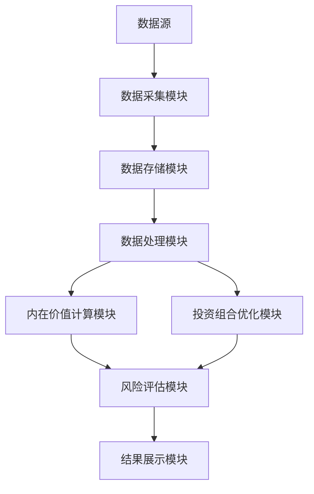

                 


# 第一部分: 格雷厄姆特价股票策略概述

## 第1章: 格雷厄姆特价股票策略的核心概念

### 1.1 格雷厄姆特价股票策略的背景与起源
#### 1.1.1 价值投资的起源与发展
价值投资是一种长期投资策略，起源于20世纪20年代，由本杰明·格雷厄姆和大卫·多德共同提出。这种策略强调购买那些市场价格低于其内在价值的股票，从而在市场下跌时提供安全边际。随着经济的发展和市场的波动，价值投资策略在不同文化和经济环境下得到了广泛应用和发展。

#### 1.1.2 格雷厄姆投资理论的核心思想
格雷厄姆的投资理论强调安全边际和内在价值。他认为，市场价格经常偏离内在价值，投资者应寻找那些市场价格低于内在价值的股票。内在价值是基于公司基本面分析得出的，包括盈利能力、财务状况和行业地位等因素。

#### 1.1.3 特价股票策略的基本框架
格雷厄姆的特价股票策略基于以下几个核心原则：
1. **安全边际**：购买价格低于内在价值，以减少市场波动带来的风险。
2. **基本面分析**：通过分析公司的财务报表、行业地位和盈利能力来确定内在价值。
3. **分散投资**：通过投资于多个廉价股票来分散风险，避免过度依赖单一股票。

### 1.2 格雷厄姆特价股票策略的核心概念
#### 1.2.1 安全边际的定义与计算
安全边际是指市场价格与内在价值之间的差异。计算公式为：
$$\text{安全边际} = \text{内在价值} - \text{市场价格}$$

#### 1.2.2 内在价值的评估方法
内在价值是基于公司未来现金流的现值计算得出的。常用的方法包括：
1. **DCF模型**：通过折现现金流模型（Discounted Cash Flow）计算内在价值。
2. **市盈率法**：比较市盈率与行业平均水平，判断股票是否被低估。

#### 1.2.3 投资组合管理的原则
格雷厄姆强调分散投资，建议投资者将资金分散投资于多个廉价股票，以降低风险。同时，定期审视投资组合，及时调整以适应市场变化。

#### 1.2.4 风险控制的策略
通过设定止损点和避免过度集中投资来控制风险。此外，关注宏观经济环境和行业趋势，避免在市场过度波动时盲目投资。

## 第2章: 格雷厄姆策略在不同企业文化生态中的适应性

### 2.1 不同企业文化生态对投资策略的影响
#### 2.1.1 美国企业文化与格雷厄姆策略的适应性
美国市场以成熟和透明著称，适合价值投资。格雷厄姆策略在美国市场表现良好，尤其是在经济衰退期间，廉价股票往往具有较大的安全边际。

#### 2.1.2 日本企业文化与格雷厄姆策略的适应性
日本市场具有周期性较强的特点，企业在经济低迷时往往估值较低。格雷厄姆策略在日本市场同样适用，但需要考虑企业杠杆和资产负债表健康状况。

#### 2.1.3 其他新兴市场企业文化与格雷厄姆策略的适应性
新兴市场波动性较大，企业基本面差异显著。格雷厄姆策略在这些市场中需要结合本地经济和行业特点，灵活调整筛选标准。

### 2.2 不同经济周期中的策略调整
#### 2.2.1 经济复苏期的策略优化
在经济复苏期间，企业盈利逐步恢复，内在价值上升。投资者应关注那些估值仍低于内在价值的股票，逐步增加仓位。

#### 2.2.2 经济增长期的策略调整
经济增长期市场估值普遍较高，格雷厄姆策略可能难以找到足够多的廉价股票。此时，投资者应适当降低安全边际要求，或转向其他策略。

#### 2.2.3 经济衰退期的策略应对
经济衰退期间，市场恐慌导致许多优质股票价格大幅下跌。格雷厄姆策略在这种环境下表现最佳，投资者应积极寻找具有强大基本面和高安全边际的股票。

## 第3章: 格雷厄姆策略的数学模型与算法原理

### 3.1 格雷厄姆策略的数学模型
#### 3.1.1 内在价值计算公式
内在价值可以通过DCF模型计算，公式为：
$$\text{内在价值} = \frac{\text{自由现金流}}{WACC}$$

#### 3.1.2 安全边际的计算方法
安全边际计算公式为：
$$\text{安全边际} = \text{内在价值} - \text{市场价格}$$

### 3.2 格雷厄姆策略的算法实现
#### 3.2.1 筛选标准的算法流程
1. 收集目标公司的财务数据。
2. 计算公司的内在价值。
3. 比较市场价格与内在价值，确定安全边际。
4. 根据安全边际和其他基本面指标筛选股票。

#### 3.2.2 投资组合优化的数学模型
投资组合优化模型可以表示为：
$$\text{最大化收益} = \sum w_i r_i - \lambda \sum w_i^2 \sigma_i^2$$
其中，\(w_i\)是投资比例，\(r_i\)是预期收益，\(\sigma_i^2\)是风险，\(\lambda\)是风险厌恶系数。

## 第4章: 格雷厄姆策略的系统架构设计

### 4.1 系统功能设计
#### 4.1.1 数据采集模块
负责收集股票的财务数据、市场数据和行业信息。

#### 4.1.2 数据存储模块
存储和管理收集到的股票数据，便于后续处理和分析。

#### 4.1.3 数据处理模块
对数据进行清洗、转换和计算，生成内在价值和安全边际等指标。

#### 4.1.4 投资组合优化模块
根据筛选标准和优化模型，生成最优投资组合。

#### 4.1.5 风险评估模块
评估投资组合的风险，提供风险控制建议。

### 4.2 系统架构图


## 第5章: 格雷厄姆策略的项目实战

### 5.1 环境安装
#### 5.1.1 安装Python和必要的库
安装Python和pandas、numpy、scipy等库，用于数据处理和分析。

#### 5.1.2 安装数据接口
使用Yahoo Finance API或其他数据接口获取股票数据。

### 5.2 核心代码实现
#### 5.2.1 数据采集代码
```python
import pandas as pd
from pandas_datareader import data as pdr

# 获取股票数据
def get_stock_data(ticker, start_date, end_date):
    df = pdr.get_data_yahoo(ticker, start_date, end_date)
    return df
```

#### 5.2.2 内在价值计算代码
```python
def calculate_intrinsic_value(free_cash_flow, wacc):
    return free_cash_flow / wacc
```

#### 5.2.3 投资组合优化代码
```python
import numpy as np

def optimize_portfolio(weights, returns, risk_aversion):
    covariance_matrix = np.cov(returns)
    return np.linalg.solve(covariance_matrix * risk_aversion, returns)
```

#### 5.2.4 风险评估代码
```python
def calculate_risk(value_at_risk):
    return value_at_risk
```

### 5.3 案例分析
#### 5.3.1 案例选择
选择具有代表性的公司，如苹果、谷歌和微软，分析它们在不同经济周期下的表现。

#### 5.3.2 分析过程
1. 收集过去五年的财务数据和市场数据。
2. 计算内在价值和安全边际。
3. 根据筛选标准，生成投资组合。
4. 分析投资组合的风险和收益。

#### 5.3.3 结果解读
展示投资组合的表现，比较实际收益与预期收益，评估策略的有效性。

### 5.4 项目小结
总结项目实施过程中的关键点，讨论策略在实际应用中的优缺点，提出改进建议。

## 第6章: 格雷厄姆策略的最佳实践与注意事项

### 6.1 最佳实践 tips
1. 定期审查和调整投资组合，以适应市场变化。
2. 结合宏观经济分析，增强策略的有效性。
3. 保持分散投资，降低风险。

### 6.2 小结
格雷厄姆策略是一种有效的价值投资方法，但在不同文化生态和经济周期中需要灵活调整。

### 6.3 注意事项
1. 风险控制是投资成功的关键，不可忽视。
2. 确保数据的准确性和及时性，避免因数据问题导致决策失误。
3. 保持对市场的敏感性，及时调整策略。

### 6.4 拓展阅读
推荐相关书籍和资源，帮助读者深入理解价值投资和策略优化。

## 作者：AI天才研究院/AI Genius Institute & 禅与计算机程序设计艺术 /Zen And The Art of Computer Programming

---

**摘要：** 本文系统地探讨了格雷厄姆特价股票策略在不同企业文化生态中的适应性，通过理论分析、算法实现和项目实战，全面展示了策略的应用方法和优化方向。结合数学模型和系统设计，为投资者提供了在不同市场环境下灵活运用格雷厄姆策略的实用指南。

**关键词：** 格雷厄姆策略、价值投资、安全边际、内在价值、投资组合优化、企业文化生态

