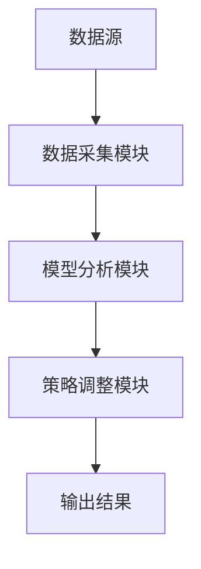

                 


# 格雷厄姆特价股票策略在不同公司治理文化下的适应

## 关键词：
格雷厄姆特价股票策略、公司治理文化、价值投资、安全边际、投资策略、文化差异

## 摘要：
本文探讨格雷厄姆特价股票策略在全球不同公司治理文化下的适应性。首先介绍格雷厄姆策略的核心原理，包括安全边际和内在价值的计算方法。接着分析不同文化背景下的公司治理特点，如西方的股东至上与东方的家族企业模式。然后详细阐述格雷厄姆策略在不同文化下的调整方法，包括算法优化和系统架构设计。最后通过实际案例验证策略的有效性，并总结最佳实践。文章结合理论与实践，为投资者提供跨文化背景下的投资策略参考。

---

# 正文

## 第一章: 格雷厄姆特价股票策略概述

### 1.1 格雷厄姆投资理论的核心概念

格雷厄姆的价值投资理论以“安全边际”和“内在价值”为核心。安全边际是指股票价格低于其内在价值的程度，确保投资的安全性。内在价值是基于公司基本面分析得出的合理估值。

#### 格雷厄姆策略的关键术语：
- **安全边际**：$ \text{安全边际} = \text{内在价值} - \text{市场价格} $
- **内在价值**：$ \text{内在价值} = \frac{\text{未来现金流}}{\text{折现率}} $

### 1.2 公司治理文化的基本概念

公司治理涉及股东、董事会和管理层之间的权力分配与责任。不同文化背景下的公司治理模式差异显著：

- **西方模式**：强调股东至上，短期业绩压力大，管理层激励机制以股票期权为主。
- **东方模式**：倾向于家族企业或内部人控制，决策更注重长期稳定性，管理层激励更多依赖奖金而非股票。

### 1.3 问题背景与研究意义

格雷厄姆策略在西方市场表现优异，但在东方或其他文化背景下可能面临挑战。文化差异影响公司的财务透明度、管理决策和投资者行为，进而影响策略的有效性。

---

## 第二章: 格雷厄姆策略的核心原理与数学模型

### 2.1 格雷厄姆策略的数学模型

#### 内在价值计算公式：
$$
\text{内在价值} = \sum_{t=1}^{\infty} \frac{\text{现金流}_t}{(1 + r)^t}
$$
其中，$r$ 是折现率，$\text{现金流}_t$ 是第 $t$ 年的现金流。

#### 安全边际计算公式：
$$
\text{安全边际} = \text{内在价值} - \text{市场价格}
$$

#### 代码实现：
```python
def calculate_intrinsic_value(cash_flows, discount_rate):
    present_value = 0
    for t, cf in enumerate(cash_flows, 1):
        present_value += cf / (1 + discount_rate) ** t
    return present_value

def calculate_margin_of_safety(intrinsic_value, market_price):
    return intrinsic_value - market_price
```

### 2.2 核心概念对比分析

#### 格雷厄姆策略与现代量化投资的对比表格：
| 属性             | 格雷厄姆策略       | 现代量化投资       |
|------------------|-------------------|-------------------|
| 投资目标         | 价值低估股票       | 短期价格波动       |
| 分析方法         | 基本面分析         | 量化模型与算法     |
| 持股期限         | 长期              | 短期或中长期       |
| 风险控制         | 安全边际           | 严格的风险模型     |

---

## 第三章: 公司治理文化对投资策略的影响

### 3.1 不同公司治理文化的特征分析

#### 西方公司治理文化：
- 股东至上：公司决策以股东利益为核心，管理层压力较大。
- 短期导向：注重季度业绩，可能影响长期投资策略。

#### 东方公司治理文化：
- 家族企业模式：决策集中，内部人控制，可能影响财务透明度。
- 长期导向：更注重企业稳定性，管理层激励机制多样化。

#### 案例对比：
- **美国公司A**：管理层激励基于股票期权，注重短期股价。
- **日本公司B**：管理层激励基于奖金，注重长期企业稳定性。

### 3.2 公司治理文化对投资策略的影响

不同文化背景下的公司治理影响企业的财务健康和投资价值：

- **西方企业**：管理层压力大，可能导致短期行为，影响内在价值。
- **东方企业**：内部人控制可能影响财务透明度，需调整内在价值计算。

---

## 第四章: 格雷厄姆策略在不同文化下的适应性分析

### 4.1 西方文化下的策略调整

#### 算法优化：
$$
\text{调整后内在价值} = \text{内在价值} \times \text{治理调整系数}
$$
其中，治理调整系数基于公司治理评分，评分越高，系数越大。

#### 代码实现：
```python
def adjust_intrinsic_value(intrinsic_value, governance_score):
    adjustment_factor = (governance_score / 100) + 1
    return intrinsic_value * adjustment_factor
```

### 4.2 东方文化下的策略调整

#### 治理模式对策略的影响：
- 东方企业更注重长期稳定性，需调整安全边际计算。
- 家族企业可能影响财务透明度，需增加对公司治理的审查。

#### 案例分析：
- **日本企业C**：调整后安全边际更高，投资策略更保守。

---

## 第五章: 系统架构与项目实战

### 5.1 系统架构设计

#### 系统功能模块：
- 数据采集模块：收集公司财务数据和治理信息。
- 模型分析模块：计算内在价值和安全边际。
- 策略调整模块：根据公司治理文化调整策略。

#### 系统架构图：


### 5.2 项目实战

#### 数据采集：
- 使用Yahoo Finance API获取股票数据。
- 使用公司治理评分API获取治理信息。

#### 核心代码实现：
```python
import yfinance as yf
from company_governance_api import get_governance_score

def main():
    ticker = "AAPL"
    data = yf.download(ticker)
    governance_score = get_governance_score(ticker)
    # 计算内在价值和安全边际
    intrinsic_value = calculate_intrinsic_value(data, 0.1)
    margin_of_safety = calculate_margin_of_safety(intrinsic_value, data['Adj Close'][-1])
    # 根据治理评分调整策略
    adjusted_margin = adjust_intrinsic_value(intrinsic_value, governance_score)
    print(f"Adjusted Margin of Safety: {adjusted_margin}")

if __name__ == "__main__":
    main()
```

---

## 第六章: 总结与展望

### 6.1 总结

格雷厄姆策略在不同公司治理文化下的适应性分析表明，文化差异显著影响投资策略的有效性。通过调整算法和系统架构，可以提高策略在不同文化背景下的适用性。

### 6.2 展望

未来研究可以进一步探讨其他文化背景下的策略适应性，结合更多因素（如经济政策和市场结构）优化策略。

---

## 作者：AI天才研究院/AI Genius Institute & 禅与计算机程序设计艺术 /Zen And The Art of Computer Programming

---

以上是《格雷厄姆特价股票策略在不同公司治理文化下的适应》的完整目录和正文内容，涵盖了从理论到实践的各个方面，结合了技术分析和实际案例，为投资者提供了跨文化背景下的策略调整方法。

