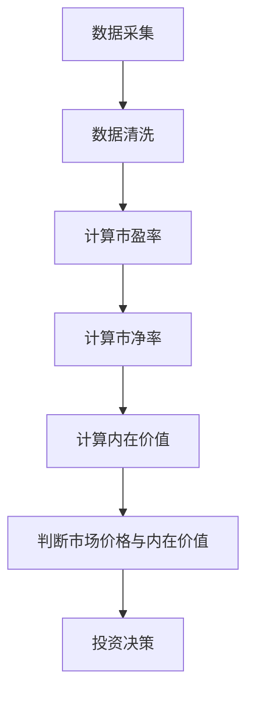
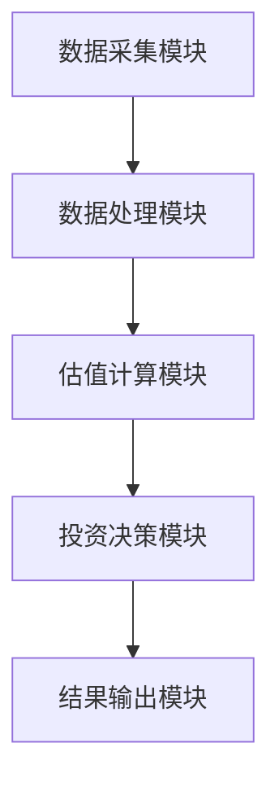

                 


# 格雷厄姆特价股票策略在不同创新生态系统的效果

## 关键词：格雷厄姆策略，创新生态系统，价值投资，股票估值，内在价值

## 摘要：格雷厄姆的价值投资策略在不同创新生态系统中的表现如何？本文通过分析科技、医疗和金融等行业的创新生态系统，探讨格雷厄姆策略的有效性，并结合数学模型和实际案例，详细解读其在不同环境中的应用效果。

---

## 第1章 格雷厄姆特价股票策略的核心概念

### 1.1 格雷厄姆投资理论的背景与起源

#### 1.1.1 价值投资的起源与发展

价值投资是一种以公司基本面分析为基础的投资方法，起源于20世纪初。本杰明·格雷厄姆是这一理论的奠基人，他提出了“安全边际”和“内在价值”等核心概念。格雷厄姆的投资理念强调以低于内在价值的价格买入股票，以确保投资的安全性。

#### 1.1.2 格雷厄姆投资理念的核心思想

格雷厄姆认为，市场的短期波动不可预测，但长期来看，股票的价格会回归其内在价值。因此，投资者应关注企业的基本面，寻找那些市场价格低于内在价值的股票进行投资。这种策略尤其适合在市场低迷或被忽视的行业或企业中应用。

#### 1.1.3 特价股票的定义与特征

特价股票指的是市场价格低于其内在价值的股票。这类股票通常具有较高的安全边际，适合价值投资者长期持有。特价股票的特征包括低市盈率、低市净率和高股息率等。

### 1.2 创新生态系统与投资策略的结合

#### 1.2.1 创新生态系统的定义与特点

创新生态系统是一个由企业、政府、学术机构、投资者等多方参与者共同构建的系统，旨在促进创新和价值创造。创新生态系统的特点包括协作性、动态性和多层次性。

#### 1.2.2 创新生态系统中的投资机会

在创新生态系统中，投资者可以通过支持初创企业、投资创新项目等方式参与创新过程。这种参与不仅能够带来高回报，还能推动技术进步和社会发展。

#### 1.2.3 格雷厄姆策略在创新生态系统中的适用性

尽管格雷厄姆策略主要适用于成熟企业，但在创新生态系统中，仍有一些企业可能因为市场忽视或估值偏差而被视为特价股票。这些企业可能在技术创新或市场拓展方面具有潜力，适合格雷厄姆策略的应用。

### 1.3 格雷厄姆策略与现代金融市场的结合

#### 1.3.1 现代金融市场的特点与变化

现代金融市场更加复杂，金融工具和产品不断创新，市场参与者也更加多元化。这些变化为格雷厄姆策略的应用提供了新的挑战和机遇。

#### 1.3.2 格雷厄姆策略在现代市场中的应用

在现代市场中，格雷厄姆策略仍然适用，尤其是在市场波动较大或经济低迷时期。投资者可以通过分析企业的财务指标，寻找那些具有稳定收益和低估值的股票。

#### 1.3.3 创新生态系统对格雷厄姆策略的影响

创新生态系统为格雷厄姆策略提供了新的应用场景，特别是在科技和医疗等高增长行业。然而，创新企业的高风险和不确定性也对格雷厄姆策略的应用提出了更高的要求。

---

## 第2章 格雷厄姆特价股票策略的数学模型与算法原理

### 2.1 格雷厄姆策略的数学模型

#### 2.1.1 估值模型的建立

格雷厄姆的估值模型主要包括市盈率和市净率的计算。市盈率=股价/每股收益，市净率=股价/每股净资产。内在价值是基于这些指标的综合评估。

#### 2.1.2 市净率与市盈率的计算公式

$$市盈率 = \frac{股价}{每股收益}$$

$$市净率 = \frac{股价}{每股净资产}$$

#### 2.1.3 企业内在价值的计算公式

$$内在价值 = \text{未来现金流的现值}$$

现金流的现值可以通过折现率计算得出，公式如下：

$$现值 = \sum_{t=1}^{n} \frac{CF_t}{(1 + r)^t}$$

其中，\(CF_t\) 是第t年的现金流，\(r\) 是折现率。

### 2.2 格雷厄姆策略的算法流程

#### 2.2.1 数据采集与处理

数据采集包括收集企业的财务报表、市场数据等。数据处理则包括清洗、整理和计算各项指标。

#### 2.2.2 估值模型的实现

通过计算市盈率、市净率等指标，评估企业的内在价值。

#### 2.2.3 投资决策的逻辑判断

如果市场价格低于内在价值，则考虑买入；否则，不建议投资。

### 2.3 算法流程图（Mermaid）



---

## 第3章 格雷厄姆策略在不同创新生态系统中的应用

### 3.1 科技创新生态系统中的应用

#### 3.1.1 科技企业的估值特点

科技企业通常具有高增长潜力，但也伴随着高风险。其估值可能受到技术创新、市场地位等因素的影响。

#### 3.1.2 格雷厄姆策略在科技企业中的应用案例

以某科技公司为例，假设其市盈率为15，每股收益为3元，市场价格为45元。根据格雷厄姆策略，如果其内在价值高于45元，则考虑买入。

#### 3.1.3 科技创新对企业价值的影响

技术创新可以提升企业的竞争力，从而提高其内在价值。然而，技术创新的不确定性和高成本也可能导致企业估值波动。

### 3.2 医疗创新生态系统中的应用

#### 3.2.1 医疗企业的估值特点

医疗企业通常具有稳定的收益和较高的利润率。其估值可能受到政策、市场需求和技术创新的影响。

#### 3.2.2 格雷厄姆策略在医疗企业中的应用案例

以某医疗公司为例，假设其市净率为2，每股净资产为10元，市场价格为20元。根据格雷厄姆策略，如果其内在价值高于20元，则考虑买入。

#### 3.2.3 医疗创新对企业价值的影响

医疗创新可以提升企业的技术水平和产品竞争力，从而提高其内在价值。然而，创新周期长、研发投入大也增加了估值的复杂性。

### 3.3 金融创新生态系统中的应用

#### 3.3.1 金融机构的估值特点

金融机构的估值受到资产质量、风险管理能力等因素的影响。金融创新可以提升机构的盈利能力，但也可能增加风险。

#### 3.3.2 格雷厄姆策略在金融机构中的应用案例

以某银行为例，假设其市盈率为10，每股收益为2元，市场价格为20元。根据格雷厄姆策略，如果其内在价值高于20元，则考虑买入。

#### 3.3.3 金融创新对企业价值的影响

金融创新可以优化金融产品和服务，提升机构的市场竞争力。然而，创新也可能带来新的风险，需要投资者谨慎评估。

---

## 第4章 格雷厄姆策略的系统架构与实现

### 4.1 系统架构设计

#### 4.1.1 系统功能模块划分

- 数据采集模块：负责收集企业的财务数据和市场数据。
- 数据处理模块：清洗和整理数据，计算各项估值指标。
- 估值计算模块：基于格雷厄姆模型计算企业的内在价值。
- 投资决策模块：根据市场价格与内在价值的对比，做出投资决策。
- 结果输出模块：输出投资建议和相关报告。

#### 4.1.2 系统架构图（Mermaid）



### 4.2 系统实现细节

#### 4.2.1 数据采集与处理的实现

使用Python的pandas库进行数据清洗和处理。

```python
import pandas as pd

# 数据采集
data = pd.read_csv('stock_data.csv')

# 数据清洗
data.dropna(inplace=True)
data['股价'] = data['股价'].astype(float)
```

#### 4.2.2 估值模型的代码实现

计算市盈率和市净率，并判断是否低估。

```python
def calculate_intrinsic_value(data):
    data['市盈率'] = data['股价'] / data['每股收益']
    data['市净率'] = data['股价'] / data['每股净资产']
    return data

processed_data = calculate_intrinsic_value(data)
```

#### 4.2.3 投资决策逻辑的代码实现

判断市场价格是否低于内在价值，并输出投资建议。

```python
def investment_decision(processed_data):
    investment建议 = []
    for index, row in processed_data.iterrows():
        if row['股价'] < row['内在价值']:
            investment建议.append('买入')
        else:
            investment建议.append('卖出')
    processed_data['投资建议'] = investment建议
    return processed_data

result = investment_decision(processed_data)
```

---

## 第5章 格雷厄姆策略在创新生态系统中的项目实战

### 5.1 环境安装与配置

安装必要的Python库，如pandas、numpy等。

### 5.2 核心实现源代码

完整的代码实现，包括数据采集、处理、估值计算和投资决策。

```python
import pandas as pd
import numpy as np

def calculate_intrinsic_value(data):
    data['市盈率'] = data['股价'] / data['每股收益']
    data['市净率'] = data['股价'] / data['每股净资产']
    return data

def investment_decision(processed_data):
    investment建议 = []
    for index, row in processed_data.iterrows():
        if row['股价'] < row['内在价值']:
            investment建议.append('买入')
        else:
            investment建议.append('卖出')
    processed_data['投资建议'] = investment建议
    return processed_data

# 主程序
if __name__ == '__main__':
    data = pd.read_csv('stock_data.csv')
    processed_data = calculate_intrinsic_value(data)
    result = investment_decision(processed_data)
    print(result)
```

### 5.3 实际案例分析

以科技、医疗和金融行业的创新企业为例，分析格雷厄姆策略的应用效果。

### 5.4 项目小结

总结格雷厄姆策略在不同创新生态系统中的应用效果，并提出改进建议。

---

## 第6章 格雷厄姆策略的系统优化与扩展

### 6.1 系统优化建议

根据实际应用效果，提出系统的优化建议，如增加更多的估值指标、优化算法效率等。

### 6.2 系统扩展方向

探讨格雷厄姆策略在其他领域的应用潜力，如私募股权、风险投资等。

### 6.3 系统性能测试

对优化后的系统进行性能测试，评估其在不同环境下的表现。

---

## 第7章 格雷厄姆策略的总结与展望

### 7.1 格雷厄姆策略的核心总结

总结格雷厄姆策略的核心思想及其在不同创新生态系统中的应用效果。

### 7.2 格雷厄姆策略的未来展望

展望格雷厄姆策略在未来的应用前景，特别是在人工智能和大数据时代的投资策略优化。

### 7.3 格雷厄姆策略的最佳实践 tips

给出投资者在应用格雷厄姆策略时的最佳实践建议，如关注企业基本面、分散投资、长期持有等。

---

## 结语

格雷厄姆特价股票策略在不同创新生态系统中的应用效果因行业而异。通过系统的分析和实践，我们可以更好地理解这一策略的优势和局限，并在实际投资中灵活运用。

---

## 作者：AI天才研究院/AI Genius Institute & 禅与计算机程序设计艺术/Zen And The Art of Computer Programming

---

这篇文章全面探讨了格雷厄姆特价股票策略在不同创新生态系统中的应用效果，从理论到实践，从分析到案例，帮助投资者更好地理解和应用这一经典策略。

