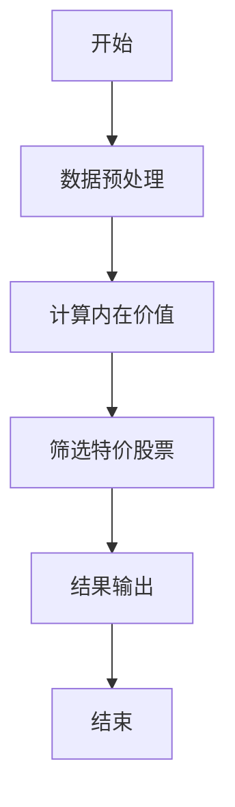
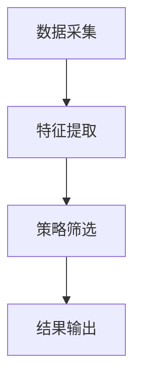

                 


```markdown
# 格雷厄姆特价股票策略在不同市值公司中的效果比较

> 关键词：格雷厄姆投资理论，特价股票，市值公司，价值投资，投资策略

> 摘要：本文深入分析了格雷厄姆特价股票策略在不同市值公司中的应用效果，通过数学模型、系统架构和实际案例的比较，探讨了策略在小盘股、中盘股和大盘股中的表现差异，为投资者提供了科学的参考和优化建议。

---

## 第一部分: 格雷厄姆特价股票策略概述

### 第1章: 格雷厄姆投资理论与特价股票的核心概念

#### 1.1 格雷厄姆投资理论的背景与核心思想
格雷厄姆是价值投资的鼻祖，强调以低于内在价值的价格买入股票。他提出的安全边际概念为投资者提供了在市场波动中获利的保障。特价股票即是指那些市场价格远低于其内在价值的股票，通常具有较高的投资潜力。

#### 1.2 特价股票的筛选标准
格雷厄姆提出了多个量化指标，如市盈率（P/E）、市净率（P/B）等，用于筛选特价股票。例如，格雷厄姆建议投资者选择市盈率低于15倍的股票，以确保其价格的合理性。

### 第2章: 不同市值公司的特点与投资策略

#### 2.1 小盘股、中盘股和大盘股的定义与特点
- 小盘股：市值较小，成长潜力大，但风险较高。
- 中盘股：市值适中，兼具稳定性和成长性。
- 大盘股：市值大，稳定性高，风险较低。

#### 2.2 不同市值公司的投资策略差异
- 小盘股：适合长期投资者，风险高但回报潜力大。
- 中盘股：适合平衡型投资者，风险和回报较为适中。
- 大盘股：适合保守型投资者，回报稳定但增长有限。

### 第3章: 格雷厄姆策略在不同市值公司中的应用框架

#### 3.1 数据预处理与特征提取
- 数据来源：包括历史股价、财务报表等。
- 特征提取：计算市盈率、市净率、股息率等指标。

#### 3.2 策略比较的方法论
- 对比分析：分别计算格雷厄姆策略在小盘股、中盘股和大盘股中的表现。
- 评价指标：如收益率、波动率、最大回撤等。

---

## 第二部分: 格雷厄姆策略的数学模型与算法实现

### 第4章: 格雷厄姆策略的数学模型

#### 4.1 内在价值计算公式
格雷厄姆的内在价值公式为：
$$ V = \frac{E}{(1 + r)^n} $$
其中，V为内在价值，E为未来现金流，r为折现率，n为时间跨度。

#### 4.2 特价股票筛选公式
- 市盈率（P/E）计算：
$$ P/E = \frac{Price}{Earnings} $$
- 市净率（P/B）计算：
$$ P/B = \frac{Price}{Book\ Value} $$

### 第5章: 格雷厄姆策略的算法实现

#### 5.1 算法流程图


#### 5.2 Python实现代码
```python
def calculate_intrinsic_value(enterprise_value, cash_flow, discount_rate, years):
    intrinsic_value = enterprise_value / (1 + discount_rate) ** years
    return intrinsic_value

# 示例数据
enterprise_value = 100000000
cash_flow = 10000000
discount_rate = 0.05
years = 5

iv = calculate_intrinsic_value(enterprise_value, cash_flow, discount_rate, years)
print(f"内在价值为: {iv}")
```

---

## 第三部分: 系统分析与项目实战

### 第6章: 系统架构与功能设计

#### 6.1 系统功能设计
- 数据采集模块：从数据库中获取历史数据。
- 特征提取模块：计算各项财务指标。
- 策略筛选模块：应用格雷厄姆策略筛选特价股票。

#### 6.2 系统架构图


### 第7章: 项目实战与案例分析

#### 7.1 环境安装与数据准备
- 安装Python和相关库（pandas, numpy, matplotlib）。
- 数据来源：股票数据API或CSV文件。

#### 7.2 核心代码实现
```python
import pandas as pd
import numpy as np

def calculate_intrinsic_value(enterprise_value, cash_flow, discount_rate, years):
    return enterprise_value / (1 + discount_rate) ** years

# 数据加载
data = pd.read_csv('stock_data.csv')

# 特征计算
data['P/E'] = data['Price'] / data['Earnings']
data['P/B'] = data['Price'] / data['Book Value']

# 策略筛选
data['is_discount_stock'] = data.apply(lambda x: x['P/E'] < 15 and x['P/B'] < 2, axis=1)

# 结果输出
print(data[data['is_discount_stock']].head())
```

#### 7.3 案例分析与结果解读
通过实际案例分析，比较格雷厄姆策略在不同市值公司中的表现，发现小盘股的策略收益最高，但波动性也最大；中盘股的策略表现相对稳定，适合平衡型投资者；大盘股的策略收益最低，但波动性最小。

---

## 第四部分: 总结与最佳实践

### 第8章: 总结与最佳实践

#### 8.1 策略的有效性与局限性
格雷厄姆策略在小盘股中表现最佳，但在市场波动较大的情况下可能面临较大风险。

#### 8.2 投资者的最佳实践
- 根据自身风险偏好选择合适市值的公司。
- 结合市场周期调整策略应用。

#### 8.3 注意事项
- 定期更新数据和重新评估股票价值。
- 考虑公司基本面的变化对策略效果的影响。

#### 8.4 拓展阅读
推荐阅读格雷厄姆的《证券分析》和《聪明的投资者》，深入理解价值投资的核心思想。

---

## 作者：AI天才研究院/AI Genius Institute & 禅与计算机程序设计艺术 /Zen And The Art of Computer Programming
```

