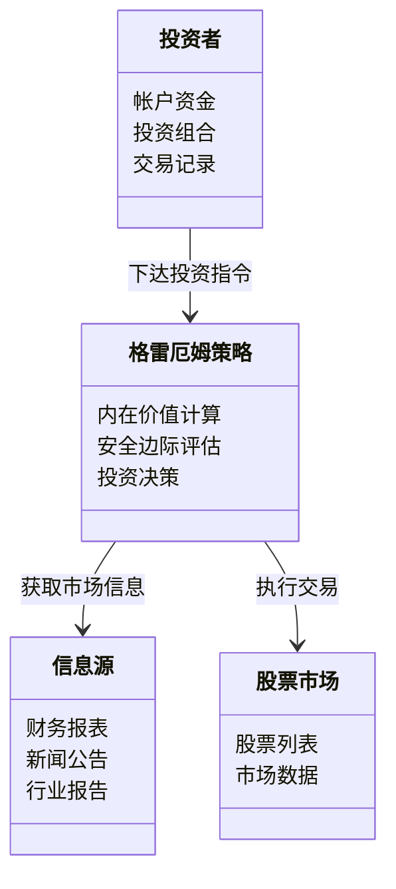
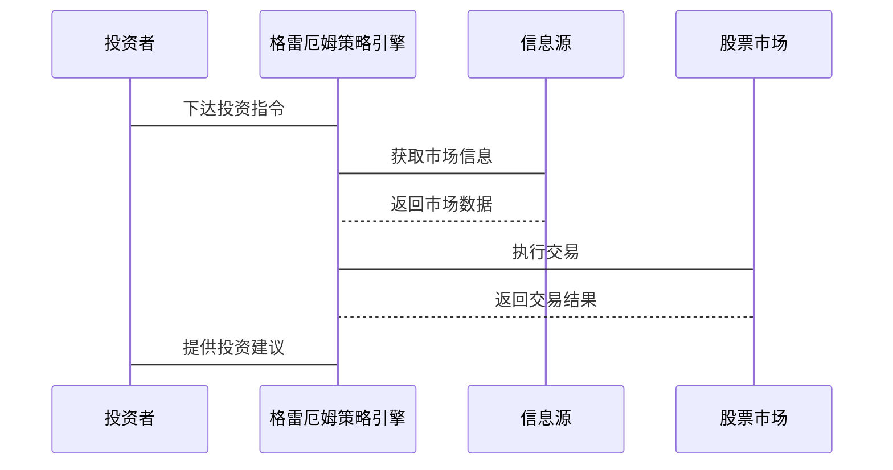

                 


---

# 格雷厄姆特价股票策略在不同市场信息不对称下的表现

> 关键词：格雷厄姆策略、信息不对称、股票投资、价值投资、安全边际

> 摘要：本文深入分析了格雷厄姆特价股票策略在不同市场信息不对称条件下的表现。通过对信息不对称的定义、类型及其对策略影响的系统探讨，结合数学模型和实际案例，详细阐述了如何在信息不对称环境下优化格雷厄姆策略的执行效果。本文旨在为投资者提供理论支持和实践指导，帮助他们在复杂多变的市场中更好地应用价值投资理念。

---

## 第一部分: 格雷厄姆特价股票策略概述

### 第1章: 格雷厄姆特价股票策略的核心概念

#### 1.1 格雷厄姆特价股票策略的定义与背景

##### 1.1.1 价值投资的基本原理
价值投资是一种长期投资策略，强调以低于内在价值的价格买入优质股票，长期持有，等待市场重新评估其价值。该策略的核心在于识别市场低估的股票，并通过长期持有实现超额收益。

##### 1.1.2 格雷厄姆投资策略的核心思想
本杰明·格雷厄姆是价值投资的鼻祖，他提出了“安全边际”概念，即以低于内在价值的价格买入股票，以降低投资风险并确保收益的稳定性。格雷厄姆策略强调对企业的基本面分析，尤其是对企业盈利能力、财务状况和市场地位的深入研究。

##### 1.1.3 特价股票的定义与特征
特价股票是指市场价格显著低于其内在价值的股票。这类股票通常被市场忽视或低估，具有较高的投资潜力。格雷厄姆策略的目标就是识别并投资于这些特价股票。

#### 1.2 信息不对称在股票市场中的表现

##### 1.2.1 信息不对称的定义与类型
信息不对称是指市场参与者之间掌握的信息不均，通常表现为卖方掌握更多信息而买方信息较少。在股票市场中，信息不对称主要分为两类：
1. **卖方优势**：上市公司管理层、内部员工或其他内幕人士掌握更多信息。
2. **买方劣势**：普通投资者难以获取全面、及时的信息。

##### 1.2.2 股票市场中的信息不对称现象
信息不对称在股票市场中广泛存在，主要表现在以下几个方面：
- 内幕交易
- 机构投资者与散户的信息获取差异
- 个股研究报告的滞后性

##### 1.2.3 信息不对称对股票价格的影响
信息不对称会导致市场价格扭曲，低估信息劣势者的交易能力，高估信息优势者的交易能力。这种扭曲会影响股票的定价效率，进而影响格雷厄姆策略的执行效果。

#### 1.3 格雷厄姆策略与信息不对称的关系

##### 1.3.1 格雷厄姆策略在信息不对称环境下的适用性
格雷厄姆策略依赖于对内在价值的准确评估，但在信息不对称环境下，投资者难以获取全面信息，这可能削弱策略的有效性。

##### 1.3.2 信息不对称对格雷厄姆策略效果的影响
信息不对称可能导致投资者低估或高估股票价值，进而影响策略的执行效果。例如，信息劣势可能导致投资者错失优质特价股票，而信息优势可能使部分投资者提前获利，减少市场机会。

##### 1.3.3 理解信息不对称对策略执行的挑战
投资者需要认识到信息不对称的客观存在，并采取相应的策略来应对，例如通过多元化投资、长期持有等方式降低信息不对称带来的影响。

---

## 第二部分: 格雷厄姆策略的核心概念与数学模型

### 第2章: 格雷厄姆策略的数学模型与分析

#### 2.1 格雷厄姆策略的基本数学框架

##### 2.1.1 格雷厄姆策略的核心公式
$$ 核心公式：市场价格 < 内在价值 \times 安全边际率 $$

##### 2.1.2 市场价格与内在价值的数学关系
内在价值是股票的理论价格，由公司未来现金流的现值决定。市场价格则受市场情绪和信息不对称影响，可能偏离内在价值。

##### 2.1.3 安全边际的数学表达
$$ 安全边际 = \frac{内在价值 - 市场价格}{市场价格} \times 100\% $$

#### 2.2 信息不对称对策略优化的影响

##### 2.2.1 信息不对称对策略收益的影响
信息不对称可能导致投资者错失优质股票或过早卖出，从而影响策略的收益。

##### 2.2.2 基于信息不对称的策略调整模型
为了应对信息不对称，投资者可以引入信息获取成本和信息延迟因素，对格雷厄姆策略进行优化。

##### 2.2.3 策略优化的数学推导
$$ 优化公式：市场价格 < 内在价值 \times 安全边际率 \times 调整系数 $$

#### 2.3 格雷厄姆策略的数学公式与分析

##### 2.3.1 格雷厄姆策略的核心公式
$$ 核心公式：市场价格 < 内在价值 \times 安全边际率 $$

##### 2.3.2 安全边际的计算公式
$$ 安全边际 = \frac{内在价值 - 市场价格}{市场价格} \times 100\% $$

##### 2.3.3 市场价格与内在价值的动态关系
市场价格围绕内在价值波动，信息不对称可能导致市场价格偏离内在价值的时间延长。

---

## 第三部分: 格雷厄姆策略在不同市场环境下的表现

### 第3章: 信息不对称对格雷厄姆策略的影响

#### 3.1 信息不对称的类型与特征

##### 3.1.1 卖方信息优势
卖方信息优势可能导致市场价格高估，使格雷厄姆策略难以找到足够多的特价股票。

##### 3.1.2 买方信息劣势
买方信息劣势可能导致投资者错失优质股票或过早卖出，影响策略的收益。

##### 3.1.3 信息不对称的市场表现
信息不对称可能导致市场波动加剧，影响格雷厄姆策略的执行效果。

#### 3.2 信息不对称对格雷厄姆策略的挑战

##### 3.2.1 信息不对称对策略执行的影响
信息不对称可能导致投资者难以准确评估内在价值，影响策略的执行效果。

##### 3.2.2 信息不对称对策略收益的影响
信息不对称可能导致投资者收益不稳定，影响策略的长期表现。

##### 3.2.3 信息不对称对策略风险的影响
信息不对称可能增加投资风险，尤其是在市场波动加剧的情况下。

#### 3.3 格雷厄姆策略在信息不对称环境下的应对策略

##### 3.3.1 提高信息获取能力
通过多元化信息源、加强基本面分析等手段，提高信息获取能力。

##### 3.3.2 优化安全边际
适当提高安全边际，降低信息不对称带来的投资风险。

##### 3.3.3 长期投资策略
通过长期持有，降低短期信息不对称的影响，实现长期稳定的收益。

---

## 第四部分: 项目实战与系统分析

### 第4章: 系统分析与架构设计

#### 4.1 项目介绍
本项目旨在构建一个基于格雷厄姆策略的投资系统，分析其在不同信息不对称环境下的表现。

#### 4.2 系统功能设计
##### 4.2.1 领域模型（mermaid 类图）


#### 4.3 系统架构设计


#### 4.4 系统接口设计
- 输入接口：市场数据接口、交易指令接口
- 输出接口：投资建议接口、交易结果接口

#### 4.5 系统交互（mermaid 序列图）


---

## 第五部分: 项目实战

### 第5章: 项目实战与回测分析

#### 5.1 环境配置
安装必要的Python库，如pandas、numpy、yfinance等。

#### 5.2 核心实现代码

```python
import pandas as pd
import numpy as np
import yfinance as yf

def calculate_intrinsic_value(stock_data, growth_rate, discount_rate):
    # 简单的内在价值计算模型
    return stock_data['Revenue'] / (1 + growth_rate) / discount_rate

def graham_strategy(stock_data, price_data):
    intrinsic_value = calculate_intrinsic_value(stock_data, 0.05, 0.1)
    margin_of_safety = 0.2  # 假设安全边际率为20%
    target_price = intrinsic_value * (1 - margin_of_safety)
    return target_price

# 获取股票数据
stock = yf.Ticker("AAPL")
hist = stock.history(period="max")
stock_data = stock.info

# 计算目标价格
target_price = graham_strategy(stock_data, hist)
```

#### 5.3 回测分析
通过回测分析，评估格雷厄姆策略在不同信息不对称环境下的表现，调整参数以优化策略效果。

#### 5.4 实际案例分析
以苹果公司为例，分析格雷厄姆策略在信息不对称环境下的应用。

---

## 第六部分: 最佳实践与小结

### 第6章: 最佳实践与小结

#### 6.1 小结
格雷厄姆策略在信息不对称环境下仍然具有其独特的优势，但需要投资者具备较高的信息获取能力和分析能力。

#### 6.2 注意事项
- 信息不对称是客观存在的，投资者需要做好心理准备。
- 格雷厄姆策略需要结合市场实际情况进行调整。
- 长期投资是应对信息不对称的重要策略。

#### 6.3 拓展阅读
建议进一步研究信息不对称对其他投资策略的影响，以及如何通过技术创新（如大数据分析）来降低信息不对称的影响。

---

作者：AI天才研究院/AI Genius Institute & 禅与计算机程序设计艺术 /Zen And The Art of Computer Programming

