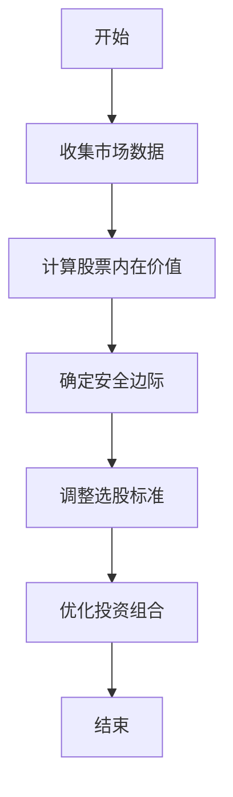

                 


# 格雷厄姆特价股票策略在不同市场周期中的动态调整

## 关键词：格雷厄姆策略，市场周期，动态调整，价值投资，安全边际

## 摘要：本文深入探讨了格雷厄姆特价股票策略在不同市场周期中的应用，分析了如何根据市场周期的特点动态调整投资策略，以实现长期稳定的收益。文章结合理论与实践，通过实际案例分析，详细阐述了策略的动态调整方法，并提出了优化建议。

---

## 第1章: 格雷厄姆特价股票策略的核心理念

### 1.1 格雷厄姆投资理论的起源与发展

#### 1.1.1 价值投资的起源
价值投资起源于20世纪初，由本杰明·格雷厄姆和戴维德·多德共同提出。他们主张以低于内在价值的价格买入股票，长期持有，等待市场重新评估其价值。

#### 1.1.2 格雷厄姆的投资理念
格雷厄姆提出的核心理念是“安全边际”。他认为，投资者应该以低于内在价值的价格买入股票，这样即使市场波动，也能保证投资的安全性。内在价值的计算方法包括市盈率、市净率等指标。

#### 1.1.3 特价股票的定义与特点
特价股票是指市场价格低于内在价值的股票。这类股票通常被市场忽视或低估，具有较高的投资潜力。

### 1.2 格雷厄姆策略的核心原则

#### 1.2.1 安全边际的概念
安全边际是格雷厄姆策略的核心。它是指买入价格与内在价值之间的差距。例如，如果一只股票的内在价值为100元，而买入价格为80元，安全边际为20元。

#### 1.2.2 股票内在价值的计算
内在价值可以通过多种方法计算，如股息贴现模型（DDM）和 discounted cash flow（DCF）模型。格雷厄姆更倾向于使用市盈率和市净率等简单指标。

#### 1.2.3 价值陷阱的识别与规避
价值陷阱是指某些股票价格看似低于内在价值，但实际上公司基本面恶化，难以恢复。识别价值陷阱需要分析公司的财务状况、行业地位和管理层能力。

### 1.3 格雷厄姆策略与现代投资理论的联系

#### 1.3.1 现代投资组合理论与格雷厄姆策略的异同
现代投资组合理论强调分散投资和风险调整后的收益，而格雷厄姆策略更注重个股的选择和安全边际。两者结合可以优化投资组合的风险收益比。

#### 1.3.2 格雷厄姆策略在量化投资中的应用
量化投资可以通过算法筛选出符合格雷厄姆标准的股票，并根据市场周期动态调整投资组合。例如，使用大数据分析技术筛选低市盈率、低市净率的股票。

#### 1.3.3 格雷厄姆策略的局限性与改进方向
格雷厄姆策略在新兴市场或成长型股票较少适用。改进方向包括引入更多动态因素，如行业周期和宏观经济指标。

### 1.4 本章小结

#### 1.4.1 格雷厄姆策略的核心思想
价值投资，寻找被低估的股票，强调安全边际。

#### 1.4.2 格雷厄姆策略的适用场景
适用于稳定增长的企业，尤其在熊市或市场低谷期。

#### 1.4.3 格雷厄姆策略的未来发展趋势
结合量化分析和大数据技术，动态调整策略，适应不同市场环境。

---

## 第2章: 市场周期的定义与分类

### 2.1 市场周期的基本概念

#### 2.1.1 经济周期的定义与特征
经济周期包括复苏、繁荣、衰退、萧条四个阶段，每个阶段对股市有不同的影响。

#### 2.1.2 股市周期的定义与阶段划分
股市周期分为牛市、熊市、震荡市。牛市中股票价格上涨，熊市中价格下跌，震荡市中价格波动较大。

#### 2.1.3 不同市场周期对投资策略的影响
牛市中适合成长型投资，熊市中适合价值投资，震荡市中需要谨慎选择。

### 2.2 市场周期的类型与特点

#### 2.2.1 牛市、熊市、震荡市的定义与特征
- **牛市**：市场情绪高涨，价格被高估。
- **熊市**：市场情绪低落，价格被低估。
- **震荡市**：市场不确定性高，价格波动大。

#### 2.2.2 不同市场周期中的投资者行为分析
牛市中投资者风险偏好高，熊市中风险偏好低，震荡市中投资者行为趋于保守。

#### 2.2.3 市场周期与股票估值的关系
牛市中估值可能偏高，熊市中估值可能偏低，震荡市中估值波动大。

### 2.3 市场周期的分析方法

#### 2.3.1 基本面分析法
分析宏观经济指标、行业状况和公司财务数据。

#### 2.3.2 技术分析法
通过价格走势、成交量等技术指标预测市场走势。

#### 2.3.3 综合分析法
结合基本面和技术分析，全面评估市场周期。

### 2.4 本章小结

#### 2.4.1 市场周期的基本概念
经济和股市周期对投资策略有重要影响。

#### 2.4.2 不同市场周期的特点
牛市、熊市、震荡市的特征和对投资策略的影响。

#### 2.4.3 市场周期分析方法的总结
基本面分析、技术分析和综合分析法的优缺点。

---

## 第3章: 格雷厄姆策略在不同市场周期中的动态调整

### 3.1 市场周期对格雷厄姆策略的影响

#### 3.1.1 牛市中的策略调整
牛市中股票价格可能被高估，格雷厄姆策略需要更加严格筛选，提高安全边际要求。

#### 3.1.2 熊市中的策略调整
熊市中股票价格被低估，适合买入符合格雷厄姆标准的股票，放宽安全边际。

#### 3.1.3 震荡市中的策略调整
震荡市中需要更加灵活，动态调整投资组合，避免过度集中。

### 3.2 格雷厄姆策略的动态调整方法

#### 3.2.1 根据市场周期调整选股标准
- **牛市**：提高安全边际要求，选择市盈率和市净率更低的股票。
- **熊市**：放宽安全边际要求，选择市盈率和市净率更低的股票。
- **震荡市**：动态调整标准，保持灵活性。

#### 3.2.2 动态调整安全边际
根据市场周期和个股情况，动态调整安全边际的计算方式。

#### 3.2.3 优化投资组合的构成
根据市场周期，调整投资组合中个股的比例，分散风险。

### 3.3 实际案例分析

#### 3.3.1 牛市中的策略调整案例
2000年互联网泡沫期间，格雷厄姆策略帮助投资者避免了高估股票的风险。

#### 3.3.2 熊市中的策略调整案例
2008年金融危机期间，格雷厄姆策略帮助投资者找到低估股票，实现长期收益。

#### 3.3.3 震荡市中的策略调整案例
2020年新冠疫情初期，格雷厄姆策略帮助投资者在震荡市中找到稳定收益。

### 3.4 本章小结

#### 3.4.1 市场周期对格雷厄姆策略的影响
不同市场周期中，策略需要灵活调整。

#### 3.4.2 格雷厄姆策略的动态调整方法
根据市场周期调整选股标准、安全边际和投资组合。

#### 3.4.3 实际案例分析的重要性
通过实际案例，验证策略的有效性。

---

## 第4章: 格雷厄姆策略的动态调整算法与系统实现

### 4.1 动态调整算法

#### 4.1.1 算法原理
根据市场周期，动态调整选股标准和投资组合。算法包括数据收集、计算内在价值、确定安全边际、调整权重等步骤。

#### 4.1.2 算法流程图


#### 4.1.3 数学公式
股票内在价值 \( V \) 可以通过股息贴现模型计算：
$$ V = \frac{D}{r - g} $$
其中，\( D \) 是股息，\( r \) 是期望回报率，\( g \) 是股息增长率。

### 4.2 系统实现

#### 4.2.1 系统架构
系统包括数据采集模块、计算模块、策略调整模块和投资组合优化模块。

#### 4.2.2 系统接口设计
- 数据接口：从数据库或API获取股票数据。
- 计算接口：计算内在价值和安全边际。
- 调整接口：根据市场周期调整选股标准和投资组合。

#### 4.2.3 系统实现代码
```python
def calculate_intrinsic_value(stock_data):
    # 示例代码，计算股票的内在价值
    pass

def dynamic_adjustment(current_market_phase):
    # 根据当前市场阶段调整策略
    pass
```

### 4.3 本章小结

#### 4.3.1 动态调整算法的核心思想
根据市场周期，动态调整选股标准和投资组合。

#### 4.3.2 系统实现的关键模块
数据采集、计算、策略调整和投资组合优化。

#### 4.3.3 算法与系统的结合
通过系统实现，自动化执行格雷厄姆策略的动态调整。

---

## 第5章: 格雷厄姆策略在实际投资中的应用与挑战

### 5.1 实际应用案例

#### 5.1.1 牛市中的应用
2021年科技股牛市中，格雷厄姆策略帮助投资者选择低市盈率的股票，避免泡沫风险。

#### 5.1.2 熊市中的应用
2008年金融危机期间，格雷厄姆策略帮助投资者找到低估股票，实现长期收益。

#### 5.1.3 震荡市中的应用
2022年全球经济不确定性中，格雷厄姆策略帮助投资者在震荡市中保持稳定。

### 5.2 格雷厄姆策略的挑战

#### 5.2.1 市场周期的不确定性
市场周期难以准确预测，影响策略的有效性。

#### 5.2.2 价值陷阱的风险
部分股票看似低估，实则存在财务问题，增加投资风险。

#### 5.2.3 短期波动的影响
短期市场波动可能影响策略的实施效果。

### 5.3 应对挑战的策略

#### 5.3.1 加强市场周期分析
通过多指标分析，提高市场周期判断的准确性。

#### 5.3.2 优化选股标准
引入更多指标，如ROE、ROA等，降低价值陷阱的风险。

#### 5.3.3 灵活调整投资组合
根据市场变化，动态调整投资组合，分散风险。

### 5.4 本章小结

#### 5.4.1 格雷厄姆策略的实际应用
通过实际案例，验证策略的有效性。

#### 5.4.2 格雷厄姆策略的挑战
市场周期不确定性、价值陷阱和短期波动的风险。

#### 5.4.3 应对挑战的策略
优化选股标准、加强市场周期分析、灵活调整投资组合。

---

## 第6章: 结论与展望

### 6.1 结论

#### 6.1.1 格雷厄姆策略的核心思想
价值投资，寻找被低估的股票，强调安全边际。

#### 6.1.2 动态调整策略的重要性
根据市场周期，动态调整策略，优化投资效果。

#### 6.1.3 技术与策略的结合
量化分析和大数据技术为格雷厄姆策略的实施提供了新的可能性。

### 6.2 未来展望

#### 6.2.1 技术进步对策略的影响
人工智能和大数据技术将进一步提升格雷厄姆策略的实施效果。

#### 6.2.2 市场周期研究的深入
未来研究将更加关注市场周期的细分阶段，优化策略的动态调整。

#### 6.2.3 策略的全球化应用
随着全球市场的互联互通，格雷厄姆策略将被更多投资者应用于国际投资。

### 6.3 本章小结

#### 6.3.1 格雷厄姆策略的总结
价值投资的核心思想和动态调整策略的重要性。

#### 6.3.2 未来展望
技术进步和全球化将推动格雷厄姆策略的进一步发展。

---

## 参考文献

（此处列出相关书籍、论文和在线资源）

---

## 作者：AI天才研究院 & 禅与计算机程序设计艺术

---

以上是关于《格雷厄姆特价股票策略在不同市场周期中的动态调整》的技术博客文章的详细目录和内容大纲。希望这篇博客能为读者提供深入的理论和实践指导，帮助他们在不同市场周期中灵活运用格雷厄姆策略，实现稳健的投资收益。

