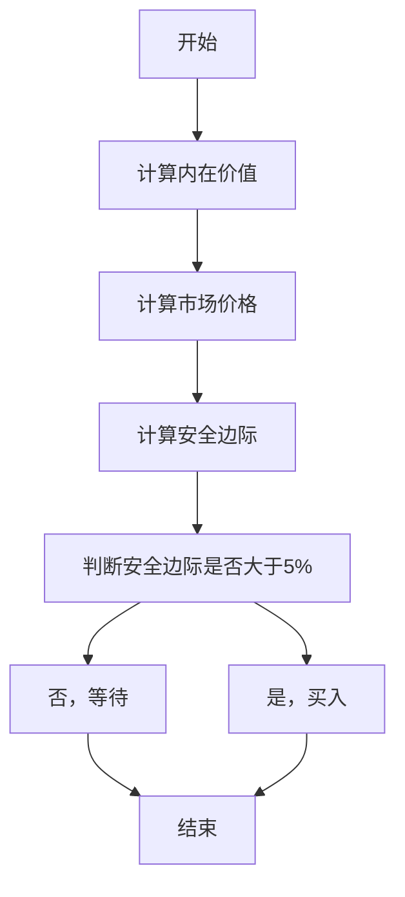
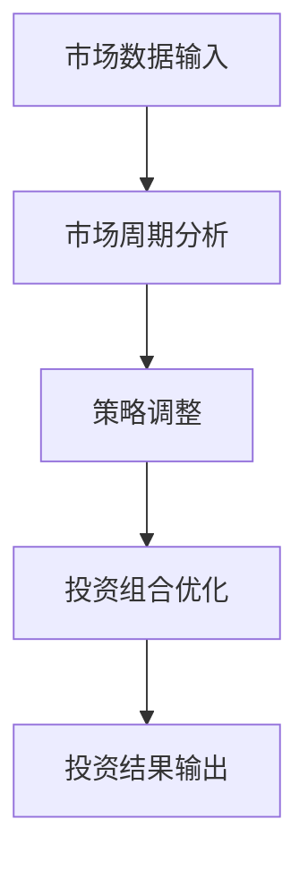

                 


# 格雷厄姆特价股票策略在不同市场周期中的动态调整

> **关键词**: 格雷厄姆, 特价股票, 市场周期, 动态调整, 价值投资, 投资策略

> **摘要**: 本文深入探讨了格雷厄姆价值投资策略在不同市场周期中的应用，分析了如何根据市场环境动态调整投资策略，以实现长期稳定的收益。通过数学模型、系统架构和实战案例的详细阐述，本文为投资者提供了实用的指导和建议。

---

## 第一章: 格雷厄姆投资理论的核心概念

### 1.1 格雷厄姆投资理论的核心思想

格雷厄姆是价值投资的鼻祖，他提出的核心思想是寻找市场低估的股票，通过安全边际实现长期稳定的收益。以下是其理论的核心要素：

- **价值投资**: 买入被市场低估的股票，长期持有，等待市场回归其真实价值。
- **安全边际**: 买入价格远低于内在价值的股票，以降低投资风险。
- **长期视角**: 投资者应关注企业的内在价值，而非短期市场波动。

### 1.2 格雷厄姆特价股票策略的定义

格雷厄姆的特价股票策略是指在市场中寻找那些价格远低于其内在价值的股票。以下是其主要特点：

- **低市盈率（P/E）**: 买入市盈率低于市场平均水平的股票。
- **低市净率（P/B）**: 买入市净率低于市场平均水平的股票。
- **高股息率**: 买入股息率较高的股票，以获取稳定的现金流。

---

## 第二章: 市场周期对格雷厄姆策略的影响

### 2.1 市场周期的定义与分类

市场周期是指证券市场在不同时间阶段的波动模式，通常分为以下几个阶段：

1. **牛市**: 市场情绪乐观，股价上涨，投资者信心增强。
2. **熊市**: 市场情绪悲观，股价下跌，投资者信心下降。
3. **震荡市**: 市场波动较大，投资者情绪不稳定。

### 2.2 不同市场周期中的格雷厄姆策略调整

在不同市场周期中，格雷厄姆策略需要进行动态调整，以适应市场环境的变化。

- **牛市中的调整**: 在牛市中，市场情绪高涨，股价可能被高估。此时，投资者应减少进攻性投资，增加防御性投资，如买入低市盈率和低市净率的股票。
- **熊市中的调整**: 在熊市中，市场情绪低落，股价可能被低估。此时，投资者应增加进攻性投资，如买入高股息率和低市盈率的股票。
- **震荡市中的调整**: 在震荡市中，市场波动较大，投资者应保持灵活性，根据市场变化动态调整投资组合。

---

## 第三章: 格雷厄姆策略的数学模型与算法

### 3.1 格雷厄姆策略的数学模型

以下是格雷厄姆策略的核心数学模型：

1. **内在价值计算公式**:
   $$ V = \frac{E}{P} $$
   其中，\( V \) 表示内在价值，\( E \) 表示企业未来现金流的现值，\( P \) 表示折现率。

2. **安全边际计算公式**:
   $$ \text{安全边际} = \frac{\text{内在价值} - \text{市场价格}}{\text{市场价格}} $$

### 3.2 格雷厄姆策略的算法流程图



---

## 第四章: 格雷厄姆策略在市场周期中的动态调整

### 4.1 市场周期识别的数学模型

以下是市场周期识别的数学模型：

1. **牛市识别指标**:
   - 市盈率（P/E）高于市场平均水平。
   - 市净率（P/B）高于市场平均水平。
   
2. **熊市识别指标**:
   - 市盈率（P/E）低于市场平均水平。
   - 市净率（P/B）低于市场平均水平。

### 4.2 动态调整策略的实现步骤

1. **市场周期分析**: 根据市场周期识别指标，判断当前市场所处的周期阶段。
2. **策略调整**: 根据市场周期阶段，调整投资策略：
   - **牛市**: 减少进攻性投资，增加防御性投资。
   - **熊市**: 增加进攻性投资，减少防御性投资。
   - **震荡市**: 保持灵活性，根据市场变化动态调整投资组合。

---

## 第五章: 格雷厄姆策略的系统架构与实现

### 5.1 系统架构设计

以下是格雷厄姆策略的系统架构设计：



### 5.2 系统功能设计

1. **市场数据输入**: 获取市场数据，包括市盈率、市净率等。
2. **市场周期分析**: 根据市场数据，判断当前市场周期阶段。
3. **策略调整**: 根据市场周期阶段，调整投资策略。
4. **投资组合优化**: 根据调整后的策略，优化投资组合。
5. **投资结果输出**: 输出投资结果，包括买入和卖出的股票。

---

## 第六章: 格雷厄姆策略的实战应用与案例分析

### 6.1 实战环境安装

以下是实战环境安装步骤：

1. **安装Python**: 下载并安装Python编程语言。
2. **安装数据分析库**: 安装Pandas和NumPy等数据分析库。
3. **安装可视化库**: 安装Matplotlib和Seaborn等可视化库。

### 6.2 核心实现代码

以下是格雷厄姆策略的核心实现代码：

```python
import pandas as pd
import numpy as np

# 计算内在价值
def calculate_intrinsic_value(enterprise_value, discount_rate):
    return enterprise_value / discount_rate

# 计算安全边际
def calculate_margin_of_safety(intrinsic_value, market_price):
    return (intrinsic_value - market_price) / market_price

# 计算市盈率
def calculate_pe_ratio(price, earnings):
    return price / earnings

# 计算市净率
def calculate_pb_ratio(price, book_value):
    return price / book_value
```

---

## 第七章: 总结与展望

### 7.1 核心观点总结

格雷厄姆特价股票策略在不同市场周期中的动态调整，是实现长期稳定收益的关键。投资者应根据市场环境的变化，灵活调整投资策略，以应对不同的市场周期。

### 7.2 未来研究方向

1. **人工智能在投资策略中的应用**: 研究如何利用人工智能技术，优化格雷厄姆策略在不同市场周期中的应用。
2. **大数据分析**: 利用大数据技术，分析更多的市场数据，提高市场周期识别的准确性。

---

## 作者信息

作者：AI天才研究院/AI Genius Institute  
联系邮箱：contact@aitaishu.org  
个人网站：https://www.zenandart.com

