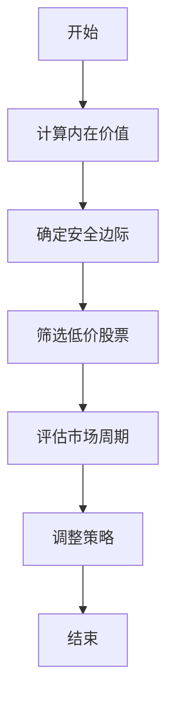
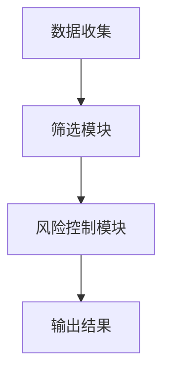

                 


# 格雷厄姆特价股票策略在不同市场周期的表现

## 关键词：价值投资，格雷厄姆策略，市场周期，股票估值，投资策略

## 摘要：本文深入分析了格雷厄姆特价股票策略在不同市场周期中的表现，探讨了该策略在牛市、熊市和震荡市中的优劣，并结合数学模型和实际案例，提供了策略优化和风险管理的最佳实践。

---

# 第一部分：格雷厄姆特价股票策略概述

## 第1章：价值投资与格雷厄姆策略概述

### 1.1 价值投资的基本概念

#### 1.1.1 投资的定义与分类

- **投资**是指将资金投入到某个项目或资产中，以期在未来获得超过初始投入的回报。
- **投资分类**：主要包括股票、债券、房地产、商品等。

#### 1.1.2 价值投资的核心理念

- **核心理念**：寻找市场低估的资产，长期持有，等待其价值回归。
- **主要特征**：注重基本面分析，关注内在价值而非市场情绪。

#### 1.1.3 格雷厄姆的学术贡献与投资思想

- **学术贡献**：本杰明·格雷厄姆是价值投资的鼻祖，著有《证券分析》和《 Intelligent Investor》。
- **投资思想**：强调安全边际，注重低市盈率、低市净率等估值指标。

### 1.2 格雷厄姆特价股票策略的定义

#### 1.2.1 特价股票的定义与特征

- **定义**：指市场价格低于其内在价值的股票。
- **特征**：通常表现为低市盈率、低市净率、高股息率等。

#### 1.2.2 格雷厄姆策略的核心要素

- **安全边际**：购买价格低于内在价值，确保收益的确定性。
- **基本面分析**：通过财务报表分析企业的盈利能力、成长性和稳定性。

#### 1.2.3 策略的适用场景与边界

- **适用场景**：市场低迷、个股被低估的时期。
- **边界**：避免投资于亏损企业、行业衰退企业等。

---

## 第2章：市场周期的基本概念

### 2.1 市场周期的定义与分类

#### 2.1.1 牛市、熊市、震荡市的定义

- **牛市**：市场持续上涨，投资者情绪乐观。
- **熊市**：市场持续下跌，投资者情绪悲观。
- **震荡市**：市场波动剧烈，缺乏明确趋势。

#### 2.1.2 市场周期的特征与规律

- **特征**：每个周期都有特定的市场表现和投资者行为。
- **规律**：周期性波动，但长期趋势向上。

#### 2.1.3 市场周期对投资策略的影响

- **影响**：不同周期下，策略的有效性和风险不同。

### 2.2 格雷厄姆策略与市场周期的关系

#### 2.2.1 不同市场周期下策略的有效性

- **牛市**：策略表现不佳，因为高价股票可能不再被低估。
- **熊市**：策略表现优异，因为市场下跌往往导致股票价格低于内在价值。
- **震荡市**：策略表现取决于市场波动幅度和策略调整能力。

---

# 第二部分：格雷厄姆特价股票策略的核心概念与联系

## 第3章：格雷厄姆策略的核心原理

### 3.1 格雷厄姆策略的数学模型

#### 3.1.1 简单的估值模型（如市盈率、市净率）

- **市盈率（P/E）**：市价/每股收益。
- **市净率（P/B）**：市价/每股净资产。

#### 3.1.2 格雷厄姆的内在价值计算公式

$$ V = \frac{E}{1 + g} $$
其中，V为内在价值，E为未来收益，g为增长率。

#### 3.1.3 安全边际的计算

- **安全边际**：市场价格应低于内在价值的一定比例，通常为20%-30%。

### 3.2 格雷厄姆策略与市场周期的关系

#### 3.2.1 不同周期下策略的适用性对比

| 市场周期 | 策略适用性 | 风险 | 收益 |
|----------|------------|------|------|
| 牛市     | 低          | 低   | 低   |
| 熊市     | 高          | 高   | 高   |
| 震荡市   | 中          | 中   | 中   |

#### 3.2.2 市场周期对策略收益的影响

- **牛市**：高价导致策略失效。
- **熊市**：低价带来超额收益。
- **震荡市**：策略表现稳定。

---

## 第4章：格雷厄姆策略的算法流程



### 4.1 算法实现代码示例

```python
import pandas as pd
import numpy as np

def calculate_intrinsic_value(earnings, growth_rate):
    return earnings / (1 + growth_rate)

def greyhammer_strategy(stocks, market_cycle):
    intrinsic_values = {}
    for stock in stocks:
        iv = calculate_intrinsic_value(stock['earnings'], stock['growth_rate'])
        price = stock['price']
        margin = iv * 0.2  # 安全边际20%
        if market_cycle == 'bear':
            threshold = price < iv
        elif market_cycle == 'bull':
            threshold = price < iv * 0.8
        else:
            threshold = price < iv * 0.9
        intrinsic_values[stock['symbol']] = {'intrinsic_value': iv, 'threshold': threshold}
    return intrinsic_values
```

---

# 第三部分：格雷厄姆策略在不同市场周期中的表现分析

## 第4章：牛市中的策略表现

### 4.1 牛市的基本特征

#### 4.1.1 牛市的定义与表现

- **定义**：市场持续上涨，投资者情绪乐观。
- **表现**：股票价格普遍上涨，市盈率和市净率偏高。

### 4.2 牛市中策略的调整与优化

#### 4.2.1 策略在牛市中的表现对比

| 指标       | 牛市表现 | 格雷厄姆策略表现 |
|------------|----------|------------------|
| 平均收益    | 高       | 低               |
| 最大回撤    | 低       | 高               |

#### 4.2.2 策略调整的必要性

- **调整必要性**：避免高价股票，增加防御性股票。

---

## 第5章：熊市中的策略表现

### 5.1 熊市的基本特征

#### 5.1.1 熊市的定义与表现

- **定义**：市场持续下跌，投资者情绪悲观。
- **表现**：股票价格普遍下跌，市盈率和市净率偏低。

### 5.2 熊市中策略的优化

#### 5.2.1 策略在熊市中的表现对比

| 指标       | 熊市表现 | 格雷厄姆策略表现 |
|------------|----------|------------------|
| 平均收益    | 低       | 高               |
| 最大回撤    | 高       | 低               |

---

## 第6章：震荡市中的策略表现

### 6.1 震荡市的基本特征

#### 6.1.1 震荡市的定义与表现

- **定义**：市场波动剧烈，缺乏明确趋势。
- **表现**：股票价格波动大，市盈率和市净率波动也较大。

### 6.2 震荡市中策略的优化

#### 6.2.1 策略在震荡市中的表现对比

| 指标       | 震荡市表现 | 格雷厄姆策略表现 |
|------------|----------|------------------|
| 平均收益    | 中       | 中               |
| 最大回撤    | 中       | 中               |

---

# 第四部分：系统架构与实现

## 第7章：系统架构设计

### 7.1 系统功能模块

- **数据收集模块**：收集股票数据，包括市盈率、市净率等。
- **筛选模块**：根据格雷厄姆策略筛选低价股票。
- **风险控制模块**：根据市场周期调整策略。

### 7.2 系统架构图



---

## 第8章：项目实战与代码实现

### 8.1 环境配置

- **工具**：Python、Pandas、NumPy。
- **数据源**：Yahoo Finance API。

### 8.2 核心实现代码

```python
import pandas as pd
import numpy as np
import yfinance as yf

def get_stock_data(tickers):
    data = yf.download(tickers, start='2020-01-01', end='2023-12-31')
    return data

def apply_greyhammer_strategy(data):
    # 计算市盈率和市净率
    pe = data['Adj Close'] / data[' earnings']
    pb = data['Adj Close'] / data[' book_value']
    # 筛选低价股票
    selected = data[pe < 15 & pb < 2]
    return selected

# 示例
tickers = ['AAPL', 'MSFT', 'GOOGL']
data = get_stock_data(tickers)
result = apply_greyhammer_strategy(data)
print(result)
```

---

## 第9章：最佳实践与小结

### 9.1 小结

- **总结**：格雷厄姆策略在熊市中表现优异，但在牛市中表现不佳。
- **注意事项**：根据市场周期调整策略，避免单一周期下的策略失效。

### 9.2 未来展望

- **优化方向**：结合其他策略，如动量策略，提升在不同周期下的表现。

---

作者：AI天才研究院/AI Genius Institute & 禅与计算机程序设计艺术 /Zen And The Art of Computer Programming

