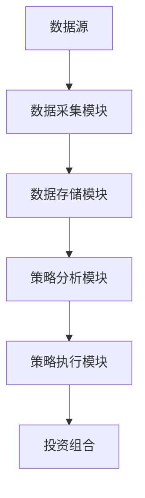
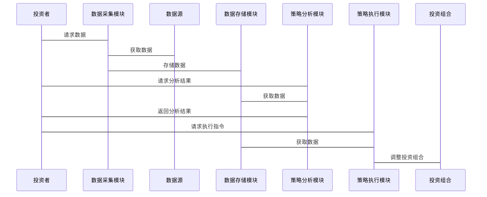

                 

# 格雷厄姆特价股票策略在不同市场周期的适应性研究

> 关键词：格雷厄姆策略，价值投资，市场周期，股票投资，安全边际

> 摘要：格雷厄姆特价股票策略是价值投资的核心方法之一，其核心在于寻找市场价格低于内在价值的股票。本文从格雷厄姆策略的基本概念出发，分析其在不同市场周期（牛市、熊市、震荡市）中的适应性。通过数学模型、算法原理和系统架构设计的详细阐述，结合实战案例，探讨格雷厄姆策略在不同市场环境下的表现及优化方法。

---

## 第一部分: 格雷厄姆特价股票策略概述

### 第1章: 格雷厄姆特价股票策略的核心概念

#### 1.1 价值投资的定义与核心理念

##### 1.1.1 价值投资的基本概念
价值投资是一种以公司基本面分析为基础的投资策略，强调以低于内在价值的价格购买优质股票。格雷厄姆的价值投资理论强调安全边际，即市场价格与内在价值之间的差距。

##### 1.1.2 格雷厄姆投资策略的核心思想
格雷厄姆的投资策略强调“Margin of Safety”（安全边际），即买入价格低于内在价值的股票，以降低投资风险。他认为市场情绪波动会导致股票价格偏离其真实价值，因此投资者应利用这种偏差进行投资。

##### 1.1.3 安全边际的定义与作用
安全边际是指股票市场价格与内在价值之间的差额。通过安全边际，投资者可以在市场价格波动时，确保投资的稳健性。例如，当市场价格低于内在价值时，投资者可以买入股票，预期未来市场价格回归内在价值时获利。

#### 1.2 市场周期的基本类型

##### 1.2.1 牛市、熊市、震荡市的定义
- **牛市**：市场整体呈上升趋势，投资者情绪乐观。
- **熊市**：市场整体呈下降趋势，投资者情绪悲观。
- **震荡市**：市场波动较大，无明显趋势。

##### 1.2.2 不同市场周期的特点与表现
- **牛市**：股票价格普遍上涨，市场情绪积极。
- **熊市**：股票价格普遍下跌，市场情绪消极。
- **震荡市**：股票价格波动剧烈，市场情绪摇摆不定。

##### 1.2.3 市场周期对投资策略的影响
不同市场周期对格雷厄姆策略的影响：
- **牛市**：高价股票可能减少安全边际，策略可能失效。
- **熊市**：低价股票增加安全边际，策略表现优异。
- **震荡市**：策略需要灵活调整，避免过度波动。

#### 1.3 格雷厄姆策略的优缺点

##### 1.3.1 格雷厄姆策略的优势
- **低风险**：通过安全边际降低投资风险。
- **长期稳健**：注重内在价值，适合长期投资。
- **逆周期性**：在熊市中表现优异。

##### 1.3.2 格雷厄姆策略的局限性
- **牛市表现不佳**：高价股票的安全边际低，可能导致收益下降。
- **需要长期持有**：策略可能需要较长时间才能显现效果。
- **依赖基本面分析**：对投资者的分析能力要求较高。

##### 1.3.3 不同市场周期下策略的适用性
- **牛市**：适当降低仓位，寻找低估股票。
- **熊市**：增加仓位，寻找高安全边际股票。
- **震荡市**：保持适度仓位，灵活调整投资组合。

---

## 第二部分: 格雷厄姆策略在不同市场周期的适应性分析

### 第2章: 格雷厄姆策略在牛市中的应用

#### 2.1 牛市的基本特征

##### 2.1.1 牛市的形成机制
牛市通常由经济繁荣、企业盈利增长和市场情绪乐观驱动。

##### 2.1.2 牛市中的市场情绪
投资者情绪乐观，市场估值可能过高，高价股票较多。

##### 2.1.3 牛市中的投资者行为
投资者倾向于追涨杀跌，容易忽视基本面分析。

#### 2.2 格雷厄姆策略在牛市中的表现

##### 2.2.1 牛市中低价股票的表现
在牛市中，高价股票可能被高估，而低价股票可能因市场波动而暂时被低估。

##### 2.2.2 格雷厄姆策略在牛市中的收益与风险
- **收益**：低价股票可能因市场回归内在价值而上涨。
- **风险**：高价股票的安全边际低，可能导致较大损失。

##### 2.2.3 牛市中策略的调整建议
- **调整投资组合**：增加对低价股票的配置。
- **控制仓位**：避免过度集中于高价股票。

#### 2.3 实战案例分析

##### 2.3.1 某次牛市中格雷厄姆策略的成功案例
假设在2009年牛市中，某公司股票价格为50元，内在价值为60元。格雷厄姆策略投资者以40元买入，最终在牛市结束时以60元卖出，获利40%。

##### 2.3.2 某次牛市中策略的失败案例
假设在2017年牛市中，某公司股票价格为100元，内在价值为80元。格雷厄姆策略投资者以100元买入，但由于市场过度乐观，股票价格继续上涨至150元，策略未能及时获利。

##### 2.3.3 案例分析总结
牛市中，格雷厄姆策略需要灵活调整，避免过度依赖安全边际，同时关注市场情绪和估值变化。

---

## 第三部分: 格雷厄姆策略在熊市中的应用

### 第3章: 格雷厄姆策略在熊市中的应用

#### 3.1 熊市的基本特征

##### 3.1.1 熊市的形成机制
熊市通常由经济衰退、企业盈利下降和市场情绪悲观驱动。

##### 3.1.2 熊市中的市场情绪
投资者情绪悲观，市场估值可能过低，低价股票较多。

##### 3.1.3 熊市中的投资者行为
投资者倾向于恐慌性抛售，容易忽视基本面分析。

#### 3.2 格雷厄姆策略在熊市中的表现

##### 3.2.1 熊市中低价股票的表现
在熊市中，低价股票可能因市场低估而继续下跌，但具有高安全边际的股票可能因内在价值被低估而表现优异。

##### 3.2.2 格雷厄姆策略在熊市中的收益与风险
- **收益**：高安全边际股票可能因市场回归内在价值而上涨。
- **风险**：低价股票可能继续下跌，导致较大损失。

##### 3.2.3 熊市中策略的调整建议
- **增加仓位**：积极寻找高安全边际股票。
- **长期持有**：耐心等待市场回归内在价值。

#### 3.3 实战案例分析

##### 3.3.1 某次熊市中格雷厄姆策略的成功案例
假设在2008年金融危机期间，某公司股票价格为20元，内在价值为30元。格雷厄姆策略投资者以15元买入，最终在熊市结束时以30元卖出，获利100%。

##### 3.3.2 某次熊市中策略的失败案例
假设在2020年新冠疫情期间，某公司股票价格为10元，内在价值为15元。格雷厄姆策略投资者以5元买入，但由于公司基本面恶化，股票价格继续下跌至3元，策略未能及时止损。

##### 3.3.3 案例分析总结
熊市中，格雷厄姆策略需要严格筛选高安全边际股票，同时关注公司基本面和行业前景。

---

## 第四部分: 格雷厄姆策略在震荡市中的应用

### 第4章: 格雷厄姆策略在震荡市中的应用

#### 4.1 震荡市的基本特征

##### 4.1.1 震荡市的形成机制
震荡市通常由经济不确定性、政策变化和市场情绪波动驱动。

##### 4.1.2 震荡市中的市场情绪
投资者情绪摇摆不定，市场估值波动较大。

##### 4.1.3 震荡市中的投资者行为
投资者倾向于频繁交易，容易受到市场情绪影响。

#### 4.2 格雷厄姆策略在震荡市中的表现

##### 4.2.1 震荡市中低价股票的表现
在震荡市中，低价股票可能因市场波动而频繁上下波动，但具有高安全边际的股票可能表现优异。

##### 4.2.2 格雷厄姆策略在震荡市中的收益与风险
- **收益**：高安全边际股票可能因市场波动而上涨。
- **风险**：低价股票可能因波动加剧而频繁下跌，导致较大损失。

##### 4.2.3 震荡市中策略的调整建议
- **灵活调整**：根据市场波动及时调整投资组合。
- **关注基本面**：避免因市场波动而盲目交易。

#### 4.3 实战案例分析

##### 4.3.1 某次震荡市中格雷厄姆策略的成功案例
假设在2022年地缘政治冲突期间，某公司股票价格为30元，内在价值为40元。格雷厄姆策略投资者以25元买入，最终在震荡市结束时以40元卖出，获利60%。

##### 4.3.2 某次震荡市中策略的失败案例
假设在2023年经济不确定性期间，某公司股票价格为15元，内在价值为20元。格雷厄姆策略投资者以10元买入，但由于行业政策变化，股票价格继续下跌至8元，策略未能及时调整。

##### 4.3.3 案例分析总结
震荡市中，格雷厄姆策略需要灵活调整，同时密切关注市场波动和公司基本面变化。

---

## 第五部分: 格雷厄姆策略的优化与展望

### 第5章: 格雷厄姆策略的优化方法

#### 5.1 策略优化的核心思想
- **动态调整**：根据市场周期变化动态调整策略。
- **多因子分析**：结合其他因子（如成长性、流动性等）进行综合评估。
- **风险管理**：引入风险管理工具（如止损、止盈）降低投资风险。

#### 5.2 策略优化的数学模型

##### 5.2.1 基于机器学习的优化模型
使用机器学习算法（如随机森林、支持向量机）对市场周期进行分类，动态调整格雷厄姆策略的参数。

##### 5.2.2 基于统计套利的优化模型
利用统计套利方法对市场周期进行预测，动态调整投资组合。

#### 5.3 策略优化的系统架构设计

##### 5.3.1 系统功能设计
- 数据采集模块：采集股票价格、财务数据等。
- 策略分析模块：计算内在价值、安全边际等指标。
- 策略执行模块：根据市场周期动态调整投资组合。

##### 5.3.2 系统架构图

##### 5.3.3 系统交互图

---

## 第六部分: 格雷厄姆策略的总结与展望

### 第6章: 总结与展望

#### 6.1 本章总结
格雷厄姆特价股票策略在不同市场周期中的表现差异较大，牛市中可能表现不佳，熊市中表现优异，震荡市中需要灵活调整。通过动态调整策略参数和引入风险管理工具，可以有效提升策略的适应性。

#### 6.2 未来展望
随着市场环境的变化和科技的进步，格雷厄姆策略需要不断优化和创新。未来的研究方向包括：
- 基于大数据和人工智能的策略优化。
- 跨市场、跨资产的策略应用。
- 策略与风险管理的结合。

---

## 作者

作者：AI天才研究院/AI Genius Institute & 禅与计算机程序设计艺术/Zen And The Art of Computer Programming

