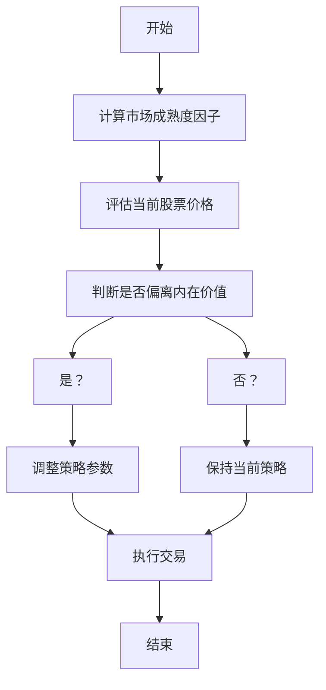
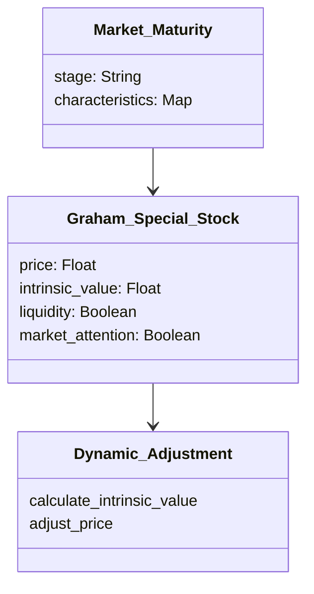
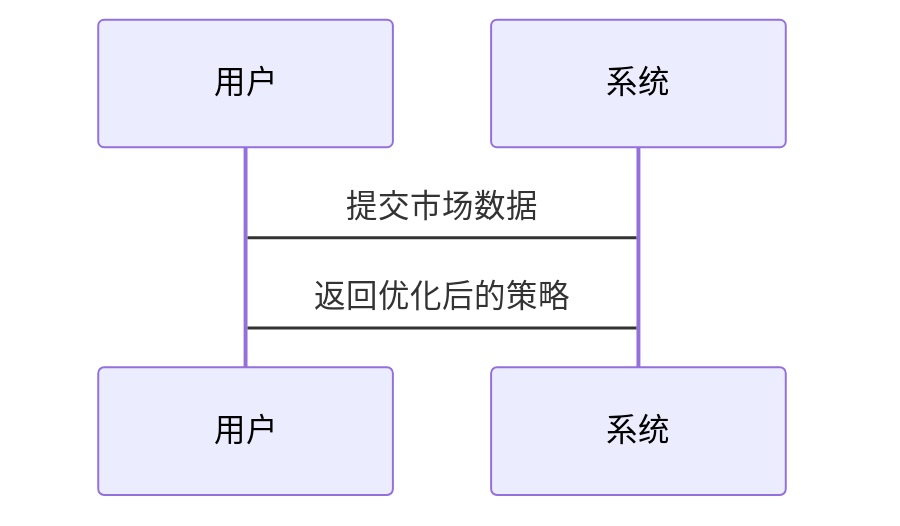

                 


# 格雷厄姆特价股票策略在不同市场成熟度中的动态调整

**关键词：格雷厄姆策略、市场成熟度、动态调整、价值投资、股票分析**

**摘要：** 本文深入探讨了格雷厄姆特价股票策略在不同市场成熟度中的动态调整方法。首先介绍了格雷厄姆投资理论的核心概念，分析了市场成熟度对策略的影响，然后详细讲解了动态调整的数学模型和算法实现，最后通过实际案例展示了策略的优化过程。文章旨在为投资者提供在不同市场环境下灵活应用格雷厄姆策略的指导。

---

# 第1章 格雷厄姆特价股票策略的核心概念

## 1.1 格雷厄姆投资理论基础

### 1.1.1 价值投资的基本原理

格雷厄姆的价值投资理论强调以低于内在价值的价格购买优质股票。他提出的核心思想是“市场先生”的概念，即市场情绪波动为投资者提供了廉价买入优质资产的机会。

$$内在价值 = \frac{Earnings}{Interest_Rate \times (1 + Growth_Rate)}$$

### 1.1.2 格雷厄姆的"烟蒂"投资策略

格雷厄姆的烟蒂理论是指寻找那些被市场忽视、价格严重低估的股票。这类股票通常具有低市盈率、低市净率和高股息率的特点。

### 1.1.3 特价股票的定义与特征

- **定义：** 特价股票是指市场价格显著低于其内在价值的股票。
- **特征：**
  - 低市盈率（P/E < 15）
  - 高股息率（股息率 > 5%）
  - 高质量的财务报表（如高净资产收益率）

## 1.2 市场成熟度的定义与分类

### 1.2.1 市场成熟度的衡量标准

- **上市公司数量：** 市场成熟度与上市公司数量成正比。
- **投资者结构：** 机构投资者比例高表明市场成熟度高。
- **市场流动性：** 高流动性市场成熟度高。

### 1.2.2 不同市场成熟度阶段的特征

| 阶段 | 特征 | 投资策略 |
|------|------|----------|
| 初级市场 | 公司数量少，流动性低 | 侧重于挖掘潜力股 |
| 成熟市场 | 公司数量多，流动性高 | 侧重于估值分析 |
| 衰退市场 | 公司数量下降，流动性差 | 侧重于防御性投资 |

### 1.2.3 市场成熟度对投资策略的影响

- **初级市场：** 投资者应关注公司基本面，寻找具有成长潜力的股票。
- **成熟市场：** 投资者应关注估值指标，寻找被低估的股票。
- **衰退市场：** 投资者应关注防御性股票，避免高风险投资。

## 1.3 动态调整策略的必要性

### 1.3.1 市场环境变化对投资策略的影响

市场环境的变化，如经济周期波动、政策变化和市场情绪波动，都会影响股票价格。因此，投资者需要根据市场环境的变化调整投资策略。

### 1.3.2 格雷厄姆策略在不同市场阶段的适用性

- **牛市：** 格雷厄姆策略可能失效，因为市场情绪高涨，股票价格被高估。
- **熊市：** 格雷厄姆策略适用，因为市场恐慌导致股票价格被低估。

### 1.3.3 动态调整策略的核心思想

动态调整策略的核心思想是根据市场环境的变化，灵活调整格雷厄姆策略的参数和指标。例如，在市场成熟度高的阶段，可以适当提高市盈率和市净率的上限；在市场成熟度低的阶段，可以适当降低这些指标的上限。

## 1.4 本章小结

本章介绍了格雷厄姆投资理论的核心概念，分析了市场成熟度对投资策略的影响，并提出了动态调整策略的必要性。通过对比不同市场阶段的特征，为后续章节的策略优化奠定了基础。

---

# 第2章 格雷厄姆策略的核心要素与数学模型

## 2.1 核心概念与属性对比

### 2.1.1 核心概念对比表格

| 核心概念 | 定义 | 属性 | 示例 |
|----------|------|------|------|
| 特价股票 | 市场低估的股票 | 价格 < 内在价值、流动性低、市场关注度低 | P/E < 15 |
| 市场成熟度 | 市场发展阶段 | 初级市场、成熟市场、衰退市场 | 根据上市公司数量和投资者结构划分 |

### 2.1.2 ER实体关系图

```mermaid
entity Market_Maturity {
    stage: String
    characteristics: Map<String, Boolean>
}
entity Graham_Special_Stock {
    price: Float
    intrinsic_value: Float
    liquidity: Boolean
    market_attention: Boolean
}
relationship: Market_Maturity --> Graham_Special_Stock
```

## 2.2 格雷厄姆策略的数学模型

### 2.2.1 核心公式

$$内在价值 = \frac{Earnings}{Interest_Rate \times (1 + Growth_Rate)}$$

### 2.2.2 动态调整模型

$$Adjusted\_Price = Price \times (1 + \alpha \times Market\_Maturity\_Factor)$$

其中，$\alpha$ 是调整系数，$Market\_Maturity\_Factor$ 是市场成熟度因子。

## 2.3 本章小结

本章通过对比分析，明确了格雷厄姆策略的核心要素，并提出了动态调整模型。这些模型为后续章节的策略优化提供了数学基础。

---

# 第3章 动态调整策略的算法与实现

## 3.1 动态调整算法流程

### 3.1.1 算法流程图



### 3.1.2 算法实现代码

```python
def calculate_intrinsic_value(earnings, interest_rate, growth_rate):
    return earnings / (interest_rate * (1 + growth_rate))

def adjust_price(price, market_maturity_factor, alpha):
    return price * (1 + alpha * market_maturity_factor)

# 示例代码
earnings = 100
interest_rate = 0.05
growth_rate = 0.1
price = 50
alpha = 0.2
market_maturity_factor = 0.8

intrinsic_value = calculate_intrinsic_value(earnings, interest_rate, growth_rate)
adjusted_price = adjust_price(price, market_maturity_factor, alpha)
print(f"内在价值：{intrinsic_value}")
print(f"调整后价格：{adjusted_price}")
```

## 3.2 本章小结

本章详细讲解了动态调整策略的算法流程，并通过代码示例展示了如何实现这些算法。这些代码为投资者提供了实际操作的参考。

---

# 第4章 系统分析与架构设计

## 4.1 项目背景介绍

本项目旨在开发一个基于格雷厄姆策略的动态调整系统，帮助投资者在不同市场环境下优化投资组合。

## 4.2 系统功能设计

### 4.2.1 领域模型



### 4.2.2 系统架构图


## 4.3 系统接口设计

- **输入接口：** 用户输入市场数据和策略参数。
- **输出接口：** 系统输出优化后的投资策略。

## 4.4 系统交互流程图



## 4.5 本章小结

本章从系统设计的角度，详细描述了如何实现基于格雷厄姆策略的动态调整系统。通过领域模型和架构图，展示了系统的整体结构和功能模块。

---

# 第5章 项目实战

## 5.1 环境安装

### 5.1.1 安装Python

```bash
pip install python3
```

### 5.1.2 安装数据分析库

```bash
pip install pandas numpy
```

## 5.2 系统核心实现

### 5.2.1 核心代码实现

```python
import pandas as pd
import numpy as np

def calculate_intrinsic_value(earnings, interest_rate, growth_rate):
    return earnings / (interest_rate * (1 + growth_rate))

def adjust_price(price, market_maturity_factor, alpha):
    return price * (1 + alpha * market_maturity_factor)

# 数据读取
data = pd.read_csv('stock_data.csv')
# 计算内在价值
data['intrinsic_value'] = data.apply(lambda x: calculate_intrinsic_value(x['Earnings'], x['Interest_Rate'], x['Growth_Rate']), axis=1)
# 调整价格
data['adjusted_price'] = data.apply(lambda x: adjust_price(x['Price'], x['Market_Maturity_Factor'], x['Alpha']), axis=1)
# 输出结果
print(data[['Price', 'intrinsic_value', 'adjusted_price']].head())
```

### 5.2.2 代码应用解读与分析

上述代码首先读取股票数据，然后计算每只股票的内在价值和调整后价格。最后输出结果，供投资者参考。

## 5.3 实际案例分析

### 5.3.1 案例背景

假设我们有以下股票数据：

| 股票代码 | 价格 | 每股收益 | 利率 | 增长率 | 市场成熟度因子 | Alpha |
|----------|------|----------|------|--------|----------------|-------|
| AAPL     | 100  | 10       | 0.05 | 0.1     | 0.8            | 0.2    |

### 5.3.2 计算过程

1. 计算内在价值：

$$\text{内在价值} = \frac{10}{0.05 \times (1 + 0.1)} = \frac{10}{0.055} \approx 181.82$$

2. 调整价格：

$$\text{调整后价格} = 100 \times (1 + 0.2 \times 0.8) = 100 \times 1.16 = 116$$

### 5.3.3 结果分析

根据计算结果，AAPL的内在价值为181.82，调整后价格为116。由于当前价格（100）远低于内在价值（181.82），投资者可以考虑买入该股票。

## 5.4 本章小结

本章通过实际案例分析，展示了如何应用格雷厄姆策略的动态调整模型进行股票分析。投资者可以根据计算结果，做出更科学的投资决策。

---

# 第6章 最佳实践

## 6.1 小结

本文详细探讨了格雷厄姆特价股票策略在不同市场成熟度中的动态调整方法。通过数学模型和算法实现，投资者可以在不同市场环境下优化投资策略。

## 6.2 注意事项

- **数据质量：** 数据的准确性和完整性对策略优化至关重要。
- **市场监控：** 投资者需要持续关注市场环境的变化，及时调整策略。
- **风险管理：** 动态调整策略虽然有效，但投资者仍需注意风险管理。

## 6.3 拓展阅读

- 格雷厄姆《聪明的投资者》
- 巴菲特的长期投资策略
- 现代投资组合理论

---

# 作者

作者：AI天才研究院/AI Genius Institute & 禅与计算机程序设计艺术 /Zen And The Art of Computer Programming

---

以上是完整的技术博客文章目录和部分章节内容。希望这篇文章能为您提供有价值的投资策略优化思路。

