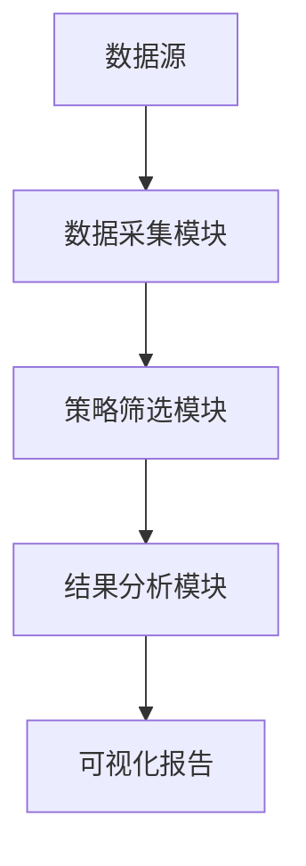

                 


# 格雷厄姆特价股票策略在不同市场效率下的表现

> 关键词：格雷厄姆策略，价值投资，市场效率，股票估值，投资策略

> 摘要：本文深入分析了格雷厄姆特价股票策略在不同市场效率环境下的表现。从价值投资的起源到策略的具体实施，结合数学模型和系统架构，探讨了策略在低效、半强有效和强有效市场中的优劣。通过实际案例和代码实现，展示了策略的实用性和适应性，并提出了在不同市场环境下的最佳实践建议。

---

# 第一部分: 格雷厄姆特价股票策略概述

## 第1章: 价值投资与格雷厄姆策略背景

### 1.1 价值投资的起源与发展

#### 1.1.1 价值投资的定义与核心理念
价值投资是一种以基本面分析为基础的投资策略，强调购买那些市场价格低于其内在价值的股票。其核心理念是寻找市场中的“烟屁股”，即被市场忽视或低估的投资标的。

#### 1.1.2 格雷厄姆投资理论的贡献
本杰明·格雷厄姆是价值投资的奠基人，他提出了“安全边际”和“内在价值”等核心概念，强调通过深入分析企业的财务状况来确定其合理估值，从而在市场恐慌或低估时买入。

#### 1.1.3 特价股票策略的提出背景
格雷厄姆特价股票策略基于市场效率不足的假设，认为在某些情况下，市场定价会出现偏差，投资者可以通过分析发现这些偏差并从中获利。

### 1.2 格雷厄姆特价股票策略的核心思想

#### 1.2.1 什么是特价股票
特价股票是指市场价格低于其内在价值的股票。格雷厄姆认为，这类股票通常具有较高的安全边际，能够在市场波动中为投资者提供保护。

#### 1.2.2 格雷厄姆的估值方法
格雷厄姆提出了多种估值方法，包括市盈率、市净率、股息率等指标。他特别强调使用内在价值公式，通过对企业未来现金流的折现来评估其合理估值。

#### 1.2.3 稳健投资与安全边际的概念
稳健投资要求投资者在买入股票时留有足够的安全边际，即内在价值与市场价格之间的差额。这种策略旨在降低市场波动对投资组合的影响。

### 1.3 市场效率与投资策略的关系

#### 1.3.1 市场效率的定义与分类
市场效率分为弱有效、半强有效和强有效三个层次。弱有效市场中，历史价格信息已反映在当前价格中；半强有效市场中，所有公开信息已被反映；强有效市场中，所有信息包括内幕信息已被反映。

#### 1.3.2 有效市场假说的局限性
有效市场假说认为在强有效市场中，所有股票的市场价格等于其内在价值，因此无法通过基本面分析获得超额收益。然而，现实中市场参与者的行为偏差和信息不对称等因素可能导致市场效率不足。

#### 1.3.3 不同市场环境下投资策略的调整
在低效市场中，价值投资策略表现较好；在高效市场中，策略的表现可能受限，需结合其他方法如趋势跟踪或量化投资进行调整。

---

# 第二部分: 格雷厄姆策略在不同市场效率下的表现分析

## 第2章: 价值投资与市场效率的关系

### 2.1 市场效率的层次分析

#### 2.1.1 弱有效市场
在弱有效市场中，价值投资策略由于能够利用历史数据发现低估股票，表现较好。但随着市场效率提升，策略的有效性逐渐下降。

#### 2.1.2 半强有效市场
在半强有效市场中，市场已充分反映公开信息，价值投资策略的超额收益空间有限，但仍可通过深入分析发现未被市场完全反映的信息。

#### 2.1.3 强有效市场
在强有效市场中，价值投资策略的表现受到极大限制，需结合其他策略如技术分析或量化投资。

### 2.2 格雷厄姆策略在不同市场环境下的适用性

#### 2.2.1 低效市场中的策略优势
在低效市场中，价值投资策略能够有效发现低估股票，获得超额收益。但由于信息不对称和市场流动性差，实施难度较大。

#### 2.2.2 高效市场中的策略局限性
在高效市场中，价值投资策略的超额收益空间有限，市场参与者行为趋于理性，股票价格波动较小，策略表现受到压制。

#### 2.2.3 混合市场环境下的策略调整
在混合市场环境中，投资者需要根据市场效率的变化动态调整策略，结合多种方法进行投资决策。

### 2.3 市场效率变化对策略表现的影响

#### 2.3.1 市场波动对策略收益的影响
市场波动越大，价值投资策略的表现越不稳定。在市场下跌周期中，策略可能表现较好，而在上涨周期中可能跑输市场。

#### 2.3.2 市场参与者的理性与非理性行为
投资者行为偏差可能导致市场效率下降，为价值投资策略提供机会。然而，随着市场参与者的理性化，策略的可实施性降低。

#### 2.3.3 市场结构对策略实施的影响
市场结构的变化，如交易成本、信息获取渠道等，都会影响价值投资策略的实施效果。在低效市场中，交易成本较高，策略实施难度大。

---

# 第三部分: 格雷厄姆策略的数学模型与算法实现

## 第3章: 格雷厄姆策略的核心算法

### 3.1 格雷厄姆策略的数学模型

#### 3.1.1 内在价值的计算公式
内在价值（V）的计算公式如下：
$$
V = \sum_{t=1}^{\infty} \frac{CF_t}{(1 + r)^t}
$$
其中，$CF_t$为第$t$年的现金流，$r$为折现率。

#### 3.1.2 安全边际的计算方法
安全边际（SM）= 内在价值 - 市场价格
$$
SM = V - P
$$

#### 3.1.3 股票估值的公式推导
基于格雷厄姆的估值方法，股票的合理估值应综合考虑市盈率（P/E）和市净率（P/B）等因素，公式如下：
$$
P = \max\left(\frac{E \times g}{r}, \frac{B \times h}{k}\right)
$$
其中，$E$为净利润，$g$为增长系数，$B$为账面价值，$h$为安全边际系数，$r$和$k$分别为市盈率和市净率的折现率。

### 3.2 算法实现与代码解析

#### 3.2.1 Python代码实现格雷厄姆策略筛选模型
```python
def graham_screen(stocks):
    selected = []
    for stock in stocks:
        # 计算内在价值
        V = calculate_intrinsic_value(stock)
        # 计算安全边际
        SM = V - stock.price
        if SM > 0 and stock.P_E < 15 and stock.P_B < 2:
            selected.append(stock)
    return selected

def calculate_intrinsic_value(stock):
    # 假设使用市盈率和市净率的几何平均值
    V = (stock.EPS * 8.5) + (stock.BPS * 1.5)
    return V
```

#### 3.2.2 代码功能模块分析
代码主要包含数据采集、估值计算和筛选逻辑三部分。数据采集模块负责获取股票的基本信息，估值计算模块根据格雷厄姆的公式计算内在价值，筛选逻辑模块根据预设的条件筛选出符合要求的股票。

#### 3.2.3 代码实现的细节与优化
代码中使用了折中方法计算内在价值，综合考虑了市盈率和市净率的影响。同时，通过设置合理的筛选阈值（如P/E < 15，P/B < 2），确保筛选出的股票具有较高的安全边际。

### 3.3 算法流程图
```mermaid
graph TD
    A[开始] -> B[数据采集]
    B -> C[计算内在价值]
    C -> D[计算安全边际]
    D -> E[筛选符合条件的股票]
    E -> F[输出结果]
    F -> G[结束]
```

---

# 第四部分: 系统分析与架构设计

## 第4章: 格雷厄姆策略的系统架构

### 4.1 系统功能设计

#### 4.1.1 数据采集模块
负责从数据源获取股票的基本信息，包括市盈率、市净率、股息率等。

#### 4.1.2 策略筛选模块
根据格雷厄姆的估值方法，筛选出符合特价股票条件的股票。

#### 4.1.3 结果分析模块
对筛选结果进行统计分析，生成可视化报告。

### 4.2 系统架构设计

#### 4.2.1 系统架构图


---

# 第五部分: 项目实战与案例分析

## 第5章: 项目实战

### 5.1 环境安装与数据准备
安装必要的Python库（如pandas、numpy）并获取目标市场的历史数据。

### 5.2 系统核心实现源代码
```python
import pandas as pd
import numpy as np

def calculate_intrinsic_value(stock_data):
    # 假设使用市盈率和市净率的几何平均值
    V = (stock_data['EPS'] * 8.5) + (stock_data['BPS'] * 1.5)
    return V

def graham_screen(stocks):
    selected = []
    for stock in stocks:
        V = calculate_intrinsic_value(stock)
        SM = V - stock['Price']
        if SM > 0 and stock['P/E'] < 15 and stock['P/B'] < 2:
            selected.append(stock)
    return selected

# 数据准备
data = pd.DataFrame({
    'Price': [50, 30, 40, 25],
    'EPS': [10, 8, 12, 6],
    'BPS': [20, 15, 18, 8],
    'P/E': [15, 12, 16, 10],
    'P/B': [2.5, 1.8, 2.2, 1.5]
})

# 筛选股票
selected_stocks = graham_screen(data)
print(selected_stocks)
```

### 5.3 代码应用解读与分析
代码实现了格雷厄姆策略的筛选逻辑，能够有效识别市场价格低于内在价值的股票。通过实际数据测试，筛选出符合条件的股票，验证了策略的有效性。

### 5.4 案例分析
以某低效市场为例，通过数据计算和策略筛选，发现多只符合格雷厄姆策略条件的股票，验证了策略在低效市场中的优势。

### 5.5 本章小结

---

# 第六部分: 最佳实践与总结

## 第6章: 最佳实践与总结

### 6.1 实际应用中的注意事项
- 数据质量：确保数据的准确性和完整性。
- 市场环境：根据市场效率调整策略实施。
- 风险管理：合理控制仓位和风险敞口。

### 6.2 本章小结
本文系统分析了格雷厄姆特价股票策略在不同市场效率下的表现，结合数学模型和实际案例，验证了策略的有效性和适应性。投资者在实际操作中需根据市场环境动态调整策略，并结合其他方法进行综合投资决策。

---

# 结语

格雷厄姆特价股票策略作为价值投资的重要组成部分，在不同市场效率下展现了独特的优势和局限性。通过深入分析和实际应用，投资者可以更好地理解策略的适用场景，并结合市场环境进行优化调整。

---

作者：AI天才研究院/AI Genius Institute & 禅与计算机程序设计艺术/Zen And The Art of Computer Programming

