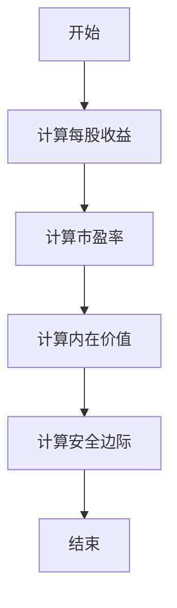

                 


# 格雷厄姆特价股票策略在不同市场流动性条件下的效果

> 关键词：格雷厄姆策略，特价股票，市场流动性，内在价值，安全边际，价值投资

> 摘要：本文详细分析了格雷厄姆特价股票策略在不同市场流动性条件下的效果，探讨了流动性对股票估值的影响，以及如何通过数学模型和算法优化来提升策略的有效性。通过实际案例分析和系统设计，为投资者提供了在不同流动性条件下应用格雷厄姆策略的实践指导。

---

## 第一部分: 格雷厄姆特价股票策略概述

### 第1章: 价值投资与格雷厄姆策略

#### 1.1 价值投资的起源与发展
##### 1.1.1 价值投资的定义与核心理念
价值投资是一种以基本面分析为基础的投资策略，强调以低于内在价值的价格买入优质资产。其核心理念是寻找市场中的“特价”股票，即那些被市场低估的公司股票。

##### 1.1.2 格雷厄姆投资体系的形成
本杰明·格雷厄姆是价值投资的鼻祖，他的投资体系以“安全边际”和“内在价值”为核心。格雷厄姆认为，股票的价值可以通过对公司财务状况的深入分析来确定，而市场价格往往会偏离这个内在价值。

##### 1.1.3 格雷厄姆策略在现代投资中的地位
尽管格雷厄姆的投资理论提出于20世纪，但其核心思想至今仍被广泛应用于股票投资中。格雷厄姆策略强调长期投资、价值发现和风险控制，为现代投资者提供了重要的理论基础。

#### 1.2 格雷厄姆特价股票策略的核心概念
##### 1.2.1 特价股票的定义与特征
特价股票是指那些市场价格低于其内在价值的股票。这类股票通常具有以下特征：
1. 低市盈率（P/E比率）。
2. 低市净率（P/B比率）。
3. 高股息率。
4. 公司财务状况稳健。

##### 1.2.2 格雷厄姆的“安全边际”概念
安全边际是指股票的市场价格与内在价值之间的差距。格雷厄姆认为，只有当市场价格低于内在价值，并且存在一定的安全边际时，才值得买入股票。

##### 1.2.3 内在价值的计算方法
内在价值是通过分析公司的财务数据（如收益、现金流、资产等）来估算的。格雷厄姆常用的方法是将公司的收益与账面价值相结合，计算出一个合理的内在价值。

#### 1.3 市场流动性对股票价格的影响
##### 1.3.1 市场流动性的定义与分类
市场流动性是指市场中买卖资产的容易程度。高流动性市场中，资产可以快速以合理价格买卖；低流动性市场中，买卖可能困难，且价格波动较大。

##### 1.3.2 流动性对股票估值的影响
在高流动性市场中，股票价格通常更接近内在价值；而在低流动性市场中，价格可能严重偏离内在价值。因此，在不同流动性条件下，格雷厄姆策略的效果可能有所不同。

##### 1.3.3 不同流动性条件下的市场表现
在高流动性市场中，格雷厄姆策略可能更容易找到低估的股票；在低流动性市场中，投资者可能需要更灵活地调整策略，以应对价格波动。

---

### 第2章: 格雷厄姆策略的数学模型与算法原理

#### 2.1 格雷厄姆策略的核心算法
##### 2.1.1 内在价值计算公式
$$
\text{内在价值} = \frac{\text{每股收益} \times (5 + \text{市盈率})}{\text{股息率}}
$$

##### 2.1.2 安全边际计算公式
$$
\text{安全边际} = \text{内在价值} \times (1 - \text{安全边际率})
$$

#### 2.2 市场流动性对策略的影响
##### 2.2.1 流动性与股票价格的关系
在高流动性市场中，股票价格波动较小，价格接近内在价值；在低流动性市场中，价格波动较大，可能偏离内在价值。

##### 2.2.2 流动性对安全边际的影响
在低流动性市场中，安全边际可能需要更大，以应对价格波动的风险。

##### 2.2.3 流动性对内在价值的修正方法
在低流动性市场中，可以通过调整市盈率和市净率来修正内在价值的计算。

#### 2.3 算法流程图


---

### 第3章: 格雷厄姆策略的系统架构设计

#### 3.1 系统功能设计
##### 3.1.1 数据采集模块
- 采集股票的财务数据（收益、现金流、资产等）。
- 采集市场数据（市盈率、市净率、股息率等）。

##### 3.1.2 内在价值计算模块
- 根据财务数据计算内在价值。
- 使用数学模型调整内在价值，以适应不同流动性条件。

##### 3.1.3 安全边际计算模块
- 根据调整后的内在价值计算安全边际。
- 设置安全边际率，以应对不同流动性条件下的风险。

##### 3.1.4 流动性分析模块
- 分析市场流动性对股票价格的影响。
- 调整安全边际和内在价值，以适应不同流动性条件。

#### 3.2 系统架构设计


#### 3.3 系统接口设计
- 数据接口：与财务数据源和市场数据源对接。
- 计算接口：与内在价值计算模块和安全边际计算模块对接。
- 输出接口：输出调整后的内在价值和安全边际。

---

## 第二部分: 格雷厄姆策略的项目实战

### 第4章: 项目实战与案例分析

#### 4.1 环境安装
- 安装Python和必要的库（如pandas、numpy、scipy）。
- 安装数据分析工具（如Excel、SQL）。

#### 4.2 核心代码实现
##### 4.2.1 内在价值计算
```python
import pandas as pd
import numpy as np

def calculate_intrinsic_value(eps, pe_ratio, dividend_yield):
    return (eps * (5 + pe_ratio)) / dividend_yield
```

##### 4.2.2 安全边际计算
```python
def calculate_margin_of_safety(intrinsic_value, safety_ratio):
    return intrinsic_value * (1 - safety_ratio)
```

#### 4.3 实际案例分析
##### 4.3.1 高流动性市场中的应用
- 选取某高流动性市场的股票，计算其内在价值和安全边际。
- 对比市场价格与内在价值，判断是否满足格雷厄姆策略的条件。

##### 4.3.2 低流动性市场中的应用
- 选取某低流动性市场的股票，计算其内在价值和安全边际。
- 根据流动性调整安全边际率，重新计算安全边际。

#### 4.4 案例分析总结
- 高流动性市场中，格雷厄姆策略的有效性较高。
- 低流动性市场中，需要适当调整安全边际率，以应对价格波动风险。

---

## 第三部分: 格雷厄姆策略的最佳实践

### 第5章: 最佳实践与注意事项

#### 5.1 最佳实践
- 定期调整策略，以适应市场流动性变化。
- 结合技术分析，提高策略的有效性。
- 保持投资纪律，避免情绪化决策。

#### 5.2 小结
格雷厄姆特价股票策略在不同流动性条件下的效果取决于市场流动性对股票价格的影响。通过调整内在价值和安全边际的计算方法，可以提高策略的有效性。

#### 5.3 注意事项
- 风险提示：市场流动性变化可能影响策略效果。
- 投资者需根据自身风险承受能力调整策略参数。

#### 5.4 拓展阅读
- 格雷厄姆的《 Intelligent Investor》。
- 现代投资组合理论的相关书籍。

---

## 作者：AI天才研究院/AI Genius Institute & 禅与计算机程序设计艺术 /Zen And The Art of Computer Programming

---

通过以上内容，我们详细探讨了格雷厄姆特价股票策略在不同市场流动性条件下的效果，并通过数学模型、算法设计和实际案例分析，为投资者提供了实践指导。希望本文能够帮助读者更好地理解和应用格雷厄姆策略，实现长期稳健的投资收益。

