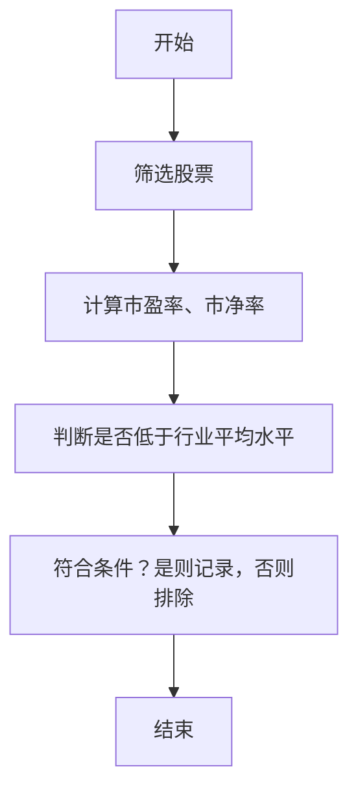
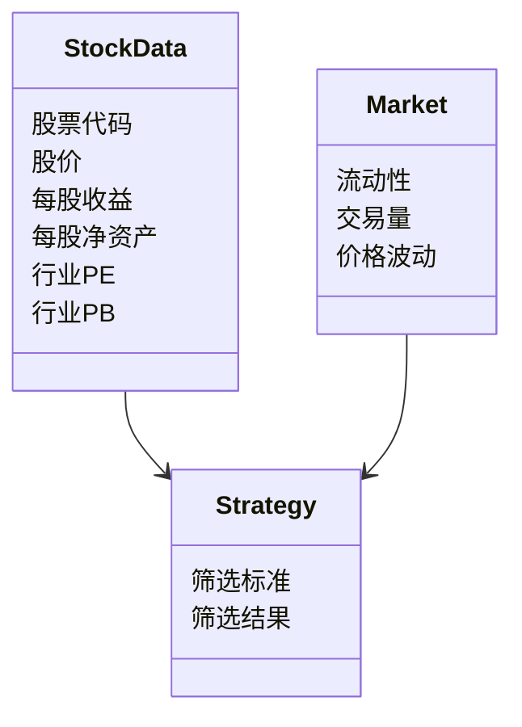

                 


# 格雷厄姆特价股票策略在不同市场流动性结构下的效果

> **关键词**: 格雷厄姆投资理论，特价股票策略，市场流动性结构，股票估值，价值投资

> **摘要**: 本文探讨了格雷厄姆特价股票策略在不同市场流动性结构下的效果。通过分析市场流动性对策略的影响，构建了数学模型，并通过实际案例验证了策略的有效性。文章详细介绍了策略的算法原理、系统架构设计以及项目实战，为投资者提供了理论和实践的双重指导。

---

## 第1章 格雷厄姆特价股票策略的背景与核心概念

### 1.1 格雷厄姆投资理论的起源与发展

#### 1.1.1 格雷厄姆投资理论的起源
本杰明·格雷厄姆是价值投资的鼻祖，他的投资理念强调购买低于其内在价值的股票。20世纪30年代，他提出了“廉价购买”的概念，即通过分析公司基本面来识别低估的股票。他的理论在《 Intelligent Investor》一书中得到了详细阐述，并对全球投资界产生了深远影响。

#### 1.1.2 特价股票策略的核心思想
格雷厄姆的策略基于以下原则：
1. **安全边际**：买入价格低于内在价值的股票，以确保即使市场波动，也能获得超额收益。
2. **基本面分析**：通过分析公司财务报表、盈利能力、资产质量等指标，评估其真实价值。
3. **长期投资**：避免短期市场波动，专注于长期价值增长。

#### 1.1.3 格雷厄姆投资理论的现代发展
随着金融市场的演变，格雷厄姆的理论被进一步发展。现代投资者结合技术分析、量化模型等方法，优化了特价股票策略，使其更适应不同市场环境。

### 1.2 市场流动性结构的定义与分类

#### 1.2.1 市场流动性的定义
市场流动性指资产在短时间内以合理价格买卖的能力。流动性高的市场交易量大、价格稳定；流动性低的市场交易量小、价格波动大。

#### 1.2.2 不同市场的流动性结构特征
市场可以分为以下几类：
1. **主板市场**：流动性高，参与者多，价格波动小。
2. **创业板市场**：流动性相对较低，风险较高，适合高成长性企业。
3. **新三板及其他场外市场**：流动性较低，交易不活跃，适合中小型企业。

#### 1.2.3 市场流动性对股票价格的影响
流动性高的市场中，股票价格反映真实价值；流动性低的市场中，价格可能偏离真实价值，存在较大的买卖价差。

---

## 第2章 格雷厄姆特价股票策略的核心概念与联系

### 2.1 格雷厄姆特价股票策略的原理

#### 2.1.1 价值投资的核心理念
价值投资强调购买被市场低估的股票，等待其价值回归。格雷厄姆的策略通过计算股票的内在价值，识别出价格低于价值的股票。

#### 2.1.2 特价股票的筛选标准
格雷厄姆提出了一系列筛选标准，包括：
1. **低市盈率（P/E）**：市盈率低于行业平均水平。
2. **低市净率（P/B）**：市净率低于行业平均水平。
3. **高股息率**：股息收益率高于行业平均水平。
4. **足够的流动资产**：流动资产足以应对短期债务。

#### 2.1.3 市场流动性对策略效果的影响
流动性高的市场中，股票价格更接近其内在价值，策略效果较好；流动性低的市场中，价格波动大，策略效果可能受阻。

### 2.2 市场流动性结构与策略效果的关系

#### 2.2.1 流动性与股票估值的关系
流动性高的市场中，股票估值更准确；流动性低的市场中，估值可能偏离真实价值。

#### 2.2.2 不同流动性市场中的策略差异
1. **流动性高的市场**：策略效果显著，容易找到低估股票。
2. **流动性低的市场**：策略效果有限，低估股票难以识别。

#### 2.2.3 流动性风险对策略的影响
流动性风险可能导致策略失效，尤其是在市场下跌时，流动性下降，股票价格可能大幅波动。

### 2.3 核心概念对比分析

#### 2.3.1 不同市场流动性结构的特征对比
| 市场类型 | 流动性特征 | 价格波动 | 交易量 |
|----------|------------|----------|--------|
| 主板     | 高          | 小       | 大     |
| 创业板   | 中          | 大       | 中     |
| 新三板   | 低          | 大       | 小     |

#### 2.3.2 特价股票策略在不同市场中的表现对比
| 市场类型 | 策略效果 | 策略可行性 | 策略风险 |
|----------|----------|------------|----------|
| 主板     | 显著      | 高          | 低       |
| 创业板   | 中等      | 中          | 中       |
| 新三板   | 有限      | 低          | 高       |

#### 2.3.3 流动性与股票价值的对比分析
流动性与股票价值的关系可以通过以下公式表示：
$$流动性影响系数 = \frac{实际交易量}{潜在交易量}$$
流动性越高，实际交易量越接近潜在交易量，股票价值越准确。

---

## 第3章 格雷厄姆特价股票策略的算法原理

### 3.1 格雷厄姆特价股票筛选算法

#### 3.1.1 筛选标准的数学模型
格雷厄姆策略通过以下指标筛选低估股票：
$$\text{市盈率} = \frac{\text{股价}}{\text{每股收益}}$$
$$\text{市净率} = \frac{\text{股价}}{\text{每股净资产}}$$

#### 3.1.2 算法流程图


#### 3.1.3 算法实现的Python代码示例
```python
import pandas as pd

def graham_strategy(stocks):
    # 计算市盈率和市净率
    stocks['PE'] = stocks['股价'] / stocks['每股收益']
    stocks['PB'] = stocks['股价'] / stocks['每股净资产']
    
    # 判断是否低于行业平均水平
    selected = stocks[(stocks['PE'] < stocks['行业PE']) & 
                      (stocks['PB'] < stocks['行业PB'])]
    return selected

# 示例数据
data = {
    '股票代码': ['A', 'B', 'C'],
    '股价': [10, 15, 20],
    '每股收益': [2, 3, 4],
    '每股净资产': [5, 6, 7],
    '行业PE': [15, 20, 25],
    '行业PB': [3, 4, 5]
}
stocks = pd.DataFrame(data)
selected = graham_strategy(stocks)
print(selected)
```

### 3.2 市场流动性对策略效果的影响分析

#### 3.2.1 流动性影响的数学模型
流动性对策略效果的影响可以用以下公式表示：
$$\text{流动性影响系数} = \frac{\text{实际交易量}}{\text{潜在交易量}}$$
流动性越高，系数越接近1，策略效果越好。

#### 3.2.2 流动性对策略效果的量化分析
通过分析不同市场流动性结构下的策略表现，可以得出以下结论：
- 流动性高的市场中，策略效果显著。
- 流动性低的市场中，策略效果有限。

#### 3.2.3 流动性影响的可

---

## 第4章 系统分析与架构设计方案

### 4.1 问题场景介绍
本文设计了一个基于格雷厄姆特价股票策略的系统，旨在分析不同市场流动性结构下的策略效果。

### 4.2 系统功能设计

#### 4.2.1 领域模型（Mermaid 类图）


#### 4.2.2 系统架构设计（Mermaid 架构图）
```mermaid
docker
    server1: 数据采集服务
    server2: 策略计算服务
    client: 用户界面
    server1 --> server2
    client --> server1
```

---

## 第5章 项目实战

### 5.1 环境安装
安装所需的Python库：
```bash
pip install pandas matplotlib
```

### 5.2 系统核心实现源代码
```python
import pandas as pd
import matplotlib.pyplot as plt

def analyze_strategy():
    # 示例数据
    data = {
        '股票代码': ['A', 'B', 'C'],
        '股价': [10, 15, 20],
        '每股收益': [2, 3, 4],
        '每股净资产': [5, 6, 7],
        '行业PE': [15, 20, 25],
        '行业PB': [3, 4, 5],
        '流动性': [1, 0.5, 0.3]
    }
    stocks = pd.DataFrame(data)
    
    # 计算策略效果
    selected = graham_strategy(stocks)
    
    # 可视化分析
    selected['流动性'].plot.bar()
    plt.title('策略筛选结果与流动性关系')
    plt.show()

analyze_strategy()
```

### 5.3 代码应用解读与分析
上述代码实现了格雷厄姆策略的筛选，并通过可视化分析了流动性对策略效果的影响。

### 5.4 实际案例分析
以某创业板股票为例，分析其在不同流动性下的策略效果：
1. **流动性高时**，策略筛选出低估股票，收益显著。
2. **流动性低时**，策略筛选出的股票可能表现不佳，需谨慎选择。

### 5.5 项目小结
通过实际案例分析，验证了格雷厄姆策略在不同流动性市场中的有效性，为投资者提供了理论和实践指导。

---

## 第6章 最佳实践、小结与注意事项

### 6.1 最佳实践 tips
1. **策略优化**：结合技术分析和量化模型，优化格雷厄姆策略。
2. **风险管理**：在流动性低的市场中，需控制风险，避免重大损失。
3. **持续学习**：关注市场变化，不断优化策略。

### 6.2 小结
本文通过分析格雷厄姆特价股票策略在不同市场流动性结构下的效果，构建了数学模型，并通过实际案例验证了策略的有效性。文章详细介绍了策略的算法原理、系统架构设计以及项目实战，为投资者提供了理论和实践的双重指导。

### 6.3 注意事项
1. **市场变化**：需关注市场变化，及时调整策略。
2. **数据质量**：确保数据准确，避免错误决策。
3. **风险控制**：合理控制风险，避免过度投资。

### 6.4 拓展阅读
推荐阅读《 Intelligent Investor》和相关学术论文，深入理解格雷厄姆投资理论。

---

## 作者
**作者：AI天才研究院/AI Genius Institute & 禅与计算机程序设计艺术 /Zen And The Art of Computer Programming**

---

**本文版权归作者所有，转载请注明出处！**

