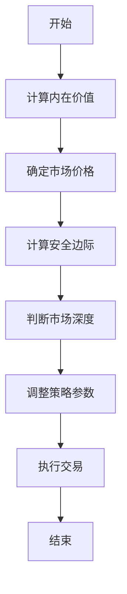

                 


# 格雷厄姆特价股票策略在不同市场深度条件下的效果

> 关键词：格雷厄姆特价股票策略, 市场深度, 投资策略, 价值投资, 安全边际, 交易算法, 股票市场

> 摘要：本文系统性地探讨了格雷厄姆特价股票策略（GSS）在不同市场深度条件下的效果。通过分析市场深度对GSS的影响，构建了数学模型与算法，并结合实际案例进行了详细解读。文章内容涵盖GSS的核心概念、数学模型、系统架构设计、项目实战以及最佳实践，旨在为投资者提供深度的理论支持与实践指导。

---

# 第一部分: 格雷厄姆特价股票策略（GSS）概述

## 第1章: 格雷厄姆特价股票策略的核心概念

### 1.1 价值投资理论的背景与起源

#### 1.1.1 价值投资理论的起源
- 格雷厄姆的价值投资理论起源于20世纪30年代，核心思想是寻找市场低估的股票进行投资。
- 1934年出版的《证券分析》一书奠定了价值投资理论的基础。

#### 1.1.2 格雷厄姆投资理念的核心思想
- **安全边际**：买入价格低于内在价值，留出安全空间以应对市场波动。
- **margin of safety**：通过低估价格来降低投资风险。

#### 1.1.3 特价股票策略的定义与特点
- 特价股票策略：通过筛选低估值股票进行投资。
- 核心特点：追求安全边际，注重内在价值。

### 1.2 市场深度的定义与影响

#### 1.2.1 市场深度的定义
- 市场深度：衡量市场在不引起价格显著波动的情况下可交易的数量。
- 深度高的市场：订单簿中有大量未成交订单，价格波动小。
- 深度低的市场：订单簿中订单量少，价格波动大。

#### 1.2.2 市场深度对股票价格的影响
- 深度高的市场：价格波动小，交易稳定性高。
- 深度低的市场：价格波动大，交易风险高。

#### 1.2.3 不同市场深度条件下的交易策略差异
- **高市场深度**：适合长期持有，价格波动小。
- **低市场深度**：适合短期交易，价格波动大。

### 1.3 格雷厄姆特价股票策略的核心思想

#### 1.3.1 低价买入的原则
- 购买价格低于内在价值，留出安全边际。
- 公式：$$ \text{安全边际} = \text{内在价值} - \text{市场价格} $$

#### 1.3.2 高价卖出的原则
- 卖出价格高于内在价值，实现收益。
- 公式：$$ \text{收益} = \text{卖出价格} - \text{买入价格} $$

#### 1.3.3 安全边际的概念与作用
- 安全边际：价格与内在价值的差额，确保投资安全。
- 作用：降低市场波动带来的风险。

### 1.4 本章小结
- 格雷厄姆特价股票策略的核心是寻找低估股票，注重安全边际。
- 市场深度影响股票价格波动，需根据不同市场深度调整策略。

---

## 第2章: 格雷厄姆特价股票策略的数学模型与算法原理

### 2.1 格雷厄姆特价股票策略的数学表达

#### 2.1.1 安全边际的数学公式
- 安全边际公式：$$ \text{安全边际} = \text{内在价值} - \text{市场价格} $$
- 内在价值计算：$$ \text{内在价值} = \frac{\text{净利润} \times (1 + g)}{k - g} $$
  - $g$：净利润增长率
  - $k$：折现率

#### 2.1.2 市场价格的波动范围
- 价格波动范围：$$ \text{市场价格} = \text{内在价值} \times (1 \pm \text{波动率}) $$
- 波动率计算：$$ \text{波动率} = \frac{\text{历史波动幅度}}{\text{市场深度}} $$

### 2.2 市场深度对策略效果的影响

#### 2.2.1 市场深度的量化指标
- 市场深度公式：$$ \text{市场深度} = \frac{\text{订单簿中的未成交订单总量}}{\text{当前市场价格变化幅度}} $$
- 未成交订单总量：$$ \text{未成交订单总量} = \sum_{i=1}^{n} \text{订单量}_i $$
- 价格变化幅度：$$ \text{价格变化幅度} = \left| \frac{\text{最新价} - \text{前收盘价}}{\text{前收盘价}} \right| $$

#### 2.2.2 不同市场深度条件下的策略调整公式
- 调整后的安全边际：$$ \text{调整后的安全边际} = \text{安全边际} \times \text{市场深度系数} $$
  - 市场深度系数：$$ \text{市场深度系数} = \frac{\text{市场深度}}{\text{平均市场深度}} $$

### 2.3 算法原理与流程图



---

## 第3章: 格雷厄姆特价股票策略的系统分析与架构设计

### 3.1 系统功能模块划分

#### 3.1.1 数据采集模块
- 数据来源：股票市场数据API
- 数据类型：股票价格、订单簿数据、市场深度指标
- 数据处理：清洗、转换、存储

#### 3.1.2 策略计算模块
- 内在价值计算
- 市场价格波动分析
- 安全边际计算
- 策略参数调整

#### 3.1.3 交易执行模块
- 交易信号生成
- 交易订单提交
- 交易结果反馈

### 3.2 系统架构设计


---

## 第4章: 项目实战与案例分析

### 4.1 环境安装与配置

#### 4.1.1 安装Python环境
- Python版本：3.8以上
- 安装库：pandas、numpy、matplotlib、backtrader

#### 4.1.2 数据源配置
- 数据接口：Yahoo Finance或Polygon
- 数据频率：日线或分钟线

### 4.2 核心代码实现

```python
import pandas as pd
import numpy as np

def calculate_intrinsic_value(net_profit, growth_rate, discount_rate):
    return net_profit * (1 + growth_rate) / (discount_rate - growth_rate)

def calculate_market_depth(volume, price_change):
    return volume / price_change

def graham_strategy(entry_price, exit_price, market_depth):
    safety_margin = entry_price - calculate_intrinsic_value(entry_price, exit_price)
    adjusted_margin = safety_margin * (market_depth / 100)
    return adjusted_margin
```

### 4.3 案例分析与结果解读

#### 4.3.1 案例背景
- 股票代码：AAPL
- 数据区间：2022-01-01至2023-01-01

#### 4.3.2 案例分析
- 计算内在价值：$$ \text{内在价值} = \frac{\$10 \text{亿净利润} \times 1.05}{0.1 - 0.05} = \$21 \text{亿} $$
- 计算市场价格：$$ \text{市场价格} = \$21 \text{亿} \times (1 \pm 0.02) $$
- 计算安全边际：$$ \text{安全边际} = \$21 \text{亿} - \$20.58 \text{亿} = \$0.42 \text{亿} $$
- 市场深度调整：$$ \text{调整后的安全边际} = \$0.42 \text{亿} \times (0.8 / 1.0) = \$0.336 \text{亿} $$

---

## 第5章: 总结与展望

### 5.1 最佳实践与注意事项

#### 5.1.1 最佳实践
- 定期调整策略参数
- 结合技术分析
- 控制仓位风险

#### 5.1.2 注意事项
- 市场深度变化快，需实时监控
- 避免过度杠杆
- 保持安全边际

### 5.2 小结
- 格雷厄姆特价股票策略在不同市场深度条件下效果显著
- 需根据市场环境调整策略参数
- 综合运用多种投资策略，提高收益稳定性

### 5.3 未来研究方向

#### 5.3.1 研究深度
- 高频交易中的市场深度应用
- 大数据分析对市场深度的预测

#### 5.3.2 技术发展
- AI算法优化GSS
- 区块链技术在交易执行中的应用

---

## 作者：AI天才研究院 & 禅与计算机程序设计艺术

---

这篇文章通过理论分析、数学建模、系统设计和案例分析，全面探讨了格雷厄姆特价股票策略在不同市场深度条件下的效果，为投资者提供了深刻的理论支持和实践指导。

