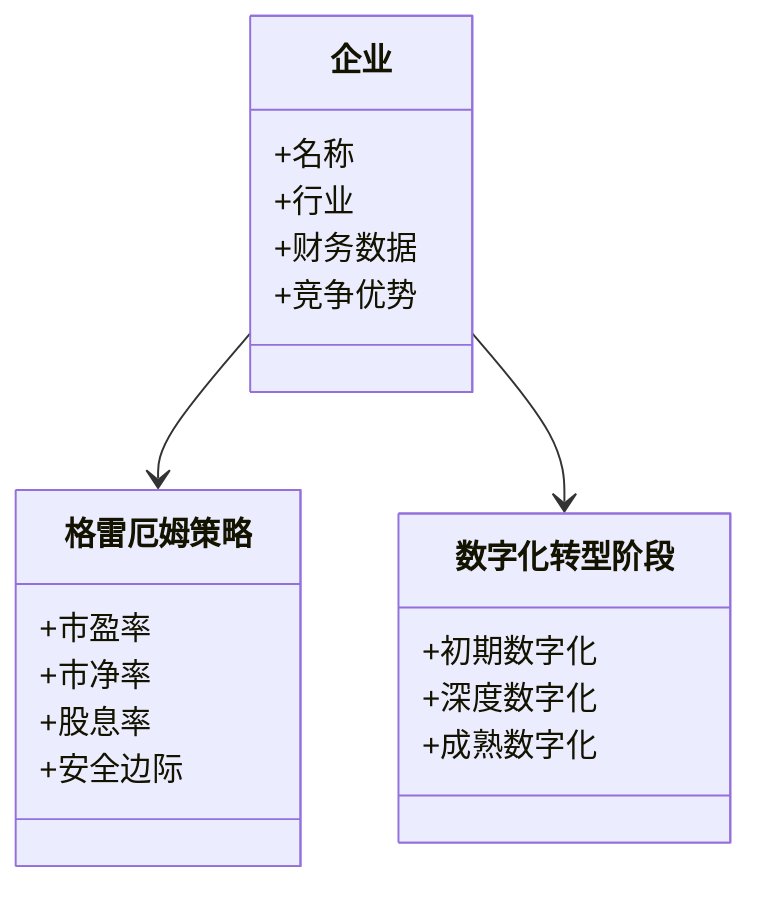
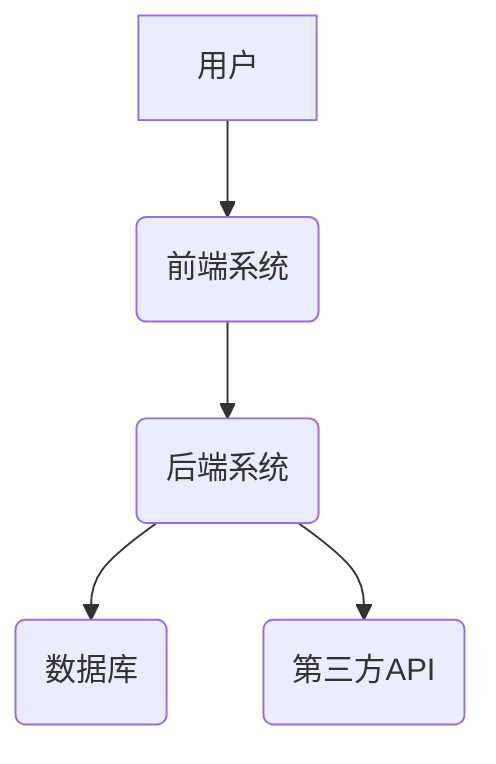
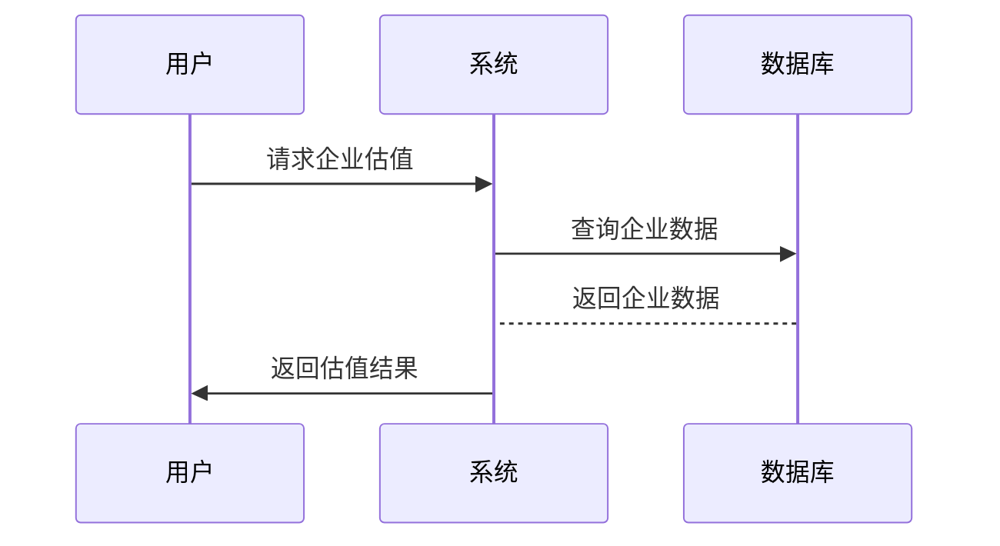

                 


# 格雷厄姆特价股票策略在不同数字企业文化演化路径的适应

## 关键词：格雷厄姆策略，数字企业文化，价值投资，股票分析，数字化转型

## 摘要：格雷厄姆的特价股票策略是一种基于价值投资的选股方法，其核心在于寻找市场低估的股票。随着数字技术的快速发展，企业正经历着深刻的数字化转型，不同类型的数字企业在文化演化路径上展现出不同的特征。本文将分析格雷厄姆策略在不同数字企业（科技型、平台型、传统转型型）中的适应性，探讨其在企业文化演化中的应用，为投资者提供新的视角和策略选择。

---

## 第一部分：格雷厄姆特价股票策略基础

### 第1章：格雷厄姆投资理论的核心理念

#### 1.1 价值投资的基本原则

##### 1.1.1 企业的内在价值

格雷厄姆认为，股票的内在价值是其未来现金流的现值。通过分析企业的财务数据，如净利润、ROE（净资产收益率）和负债情况，可以估算出企业的内在价值。

- 净利润：企业的盈利能力是价值评估的核心指标。
- ROE：衡量企业使用股东资金的效率。
- 负债情况：评估企业的财务健康状况。

##### 1.1.2 市场波动与安全边际

市场波动导致股票价格与内在价值的偏离。投资者应寻找价格低于内在价值的股票，并建立安全边际（即以低于内在价值的价格买入，以抵御短期波动风险）。

##### 1.1.3 股票筛选的量化标准

格雷厄姆提出了具体的筛选标准，如：

- 市盈率低于某个阈值。
- 市净率低于某个阈值。
- 股息率稳定且合理。

#### 1.2 格雷厄姆策略的核心步骤

1. **确定企业的内在价值**：通过基本面分析估算企业的未来现金流。
2. **评估市场价格与内在价值的偏离**：计算安全边际。
3. **筛选符合标准的股票**：选择价格低于内在价值的股票进行投资。

---

### 第2章：数字企业文化演化路径

#### 2.1 数字企业的定义与分类

##### 2.1.1 科技型企业

- 核心竞争力：技术创新、研发投入。
- 文化特征：强调创新、快速迭代、员工自主性高。

##### 2.1.2 平台型企业

- 核心竞争力：构建生态系统、网络效应。
- 文化特征：注重合作、用户中心、数据驱动。

##### 2.1.3 传统转型型企业

- 核心竞争力：传统业务的数字化改造。
- 文化特征：变革阻力大、适应性较慢、依赖既有模式。

---

## 第二部分：格雷厄姆策略在数字企业文化演化中的适应性分析

### 第3章：科技型企业的策略适应性

#### 3.1 科技企业的价值评估挑战

##### 3.1.1 高研发投入与未来收益的不确定性

科技企业的研发投入可能需要较长时间才能转化为收益，这增加了内在价值评估的难度。

##### 3.1.2 技术更新周期短

技术的快速迭代可能导致企业的竞争优势迅速变化，影响其长期价值评估。

##### 3.1.3 高估值与市场泡沫

科技企业的高增长预期可能导致市场价格远高于内在价值，增加了安全边际的获取难度。

#### 3.2 格雷厄姆策略的调整与应用

##### 3.2.1 调整估值模型

在科技企业的价值评估中，需要考虑研发投入的未来收益潜力。例如，可以采用DCF模型（ discounted cash flow model）来估算其未来现金流。

##### 3.2.2 强调研发投入与竞争优势

关注企业的研发团队规模、专利数量以及技术领先性，以评估其长期竞争优势。

##### 3.2.3 选择性投资

在高估值的科技企业中，寻找那些具有强大护城河和持续创新能力的企业，以降低投资风险。

---

### 第4章：平台型企业的策略适应性

#### 4.1 平台企业的价值评估挑战

##### 4.1.1 网络效应的不确定性

平台的价值往往取决于用户数量和网络效应，但用户增长的可持续性难以预测。

##### 4.1.2 数据驱动的业务模式

平台型企业依赖数据进行精准营销和用户体验优化，这增加了其估值的复杂性。

##### 4.1.3 高估值与市场泡沫

由于平台的高增长潜力，其市场价格可能远高于内在价值，增加了安全边际的获取难度。

#### 4.2 格雷厄姆策略的调整与应用

##### 4.2.1 重视用户粘性和网络效应

在评估平台企业时，需要关注其用户粘性和网络效应的强弱，这直接影响其长期价值。

##### 4.2.2 调整估值模型

可以采用用户生命周期价值（CLV）模型来估算平台企业的未来现金流。

##### 4.2.3 选择性投资

在高估值的平台企业中，寻找那些具有强大用户基础和持续创新能力强的企业，以降低投资风险。

---

### 第5章：传统转型型企业的策略适应性

#### 5.1 传统转型企业的价值评估挑战

##### 5.1.1 变革阻力

传统企业在向数字化转型过程中，可能面临组织结构、管理方式和员工观念的调整，这会影响其转型的成功率。

##### 5.1.2 技术依赖性

传统企业转型依赖外部技术供应商，这增加了其转型的不确定性和风险。

##### 5.1.3 资金与资源的限制

转型需要大量资金和资源投入，这可能影响企业的短期财务表现。

#### 5.2 格雷厄姆策略的调整与应用

##### 5.2.1 强调转型能力

在评估传统转型企业时，需要关注其管理层的转型能力和员工的适应性。

##### 5.2.2 调整估值模型

可以采用分阶段估值模型，分别评估企业在转型前后的价值变化。

##### 5.2.3 选择性投资

在转型期，寻找那些具有明确转型战略和较强执行能力的企业，以降低投资风险。

---

## 第三部分：案例分析与投资策略

### 第6章：案例分析

#### 6.1 科技企业的案例

以某科技公司为例，分析其研发投入、技术创新能力和市场表现，评估其是否符合格雷厄姆策略的筛选标准。

#### 6.2 平台企业的案例

以某平台企业为例，分析其用户增长潜力、网络效应和数据驱动能力，评估其是否符合格雷厄姆策略的筛选标准。

#### 6.3 传统转型企业的案例

以某传统转型企业为例，分析其转型战略、资金投入和管理能力，评估其是否符合格雷厄姆策略的筛选标准。

---

### 第7章：系统分析与架构设计

#### 7.1 系统功能设计

##### 7.1.1 领域模型

使用Mermaid绘制领域模型类图，展示企业的核心业务流程和关键实体之间的关系。



##### 7.1.2 系统架构设计

使用Mermaid绘制系统架构图，展示系统的模块划分和功能分配。



##### 7.1.3 系统接口设计

定义系统接口，例如：

- `GET /api/company/{id}`：获取企业详细信息。
- `POST /api/valuation`：提交企业估值请求。

##### 7.1.4 系统交互设计

使用Mermaid绘制交互序列图，展示用户与系统之间的交互流程。



---

### 第8章：项目实战

#### 8.1 环境安装

- 安装Python和相关库（如pandas、numpy、scipy）。
- 安装数据分析工具（如Jupyter Notebook）。

#### 8.2 核心实现

##### 8.2.1 数据获取与预处理

```python
import pandas as pd
import requests

url = 'https://api.example.com/companies'
response = requests.get(url)
data = response.json()
df = pd.DataFrame(data)
```

##### 8.2.2 格雷厄姆策略筛选

```python
def graham_screen(df):
    df['市盈率'] = df['市盈率'].astype(float)
    df['市净率'] = df['市净率'].astype(float)
    df['股息率'] = df['股息率'].astype(float)
    return df[(df['市盈率'] < 15) & (df['市净率'] < 2) & (df['股息率'] > 2)]
```

##### 8.2.3 数字化转型阶段分析

```python
def determine_stage(company_data):
    if company_data['研发投入占比'] > 10%:
        return '深度数字化'
    elif company_data['数字化转型计划'] == '进行中':
        return '初期数字化'
    else:
        return '成熟数字化'
```

---

## 第四部分：总结与展望

### 第9章：总结

#### 9.1 核心观点回顾

- 格雷厄姆策略在不同数字企业中的适应性取决于企业的文化特征和转型阶段。
- 科技型企业适合高研发投入和创新能力的筛选，平台型企业适合网络效应和用户粘性的评估，传统转型型企业适合转型能力和资金投入的分析。

#### 9.2 投资策略建议

- 根据企业的数字化转型阶段，调整格雷厄姆策略的筛选标准。
- 重视企业的核心竞争力和长期价值，而非短期市场波动。

---

### 第10章：展望

#### 10.1 未来研究方向

- 探讨格雷厄姆策略在新兴数字企业类型中的应用。
- 结合人工智能技术，优化数字企业价值评估模型。

#### 10.2 最佳实践 tips

- 在投资决策中，结合定量分析和定性分析，全面评估企业的价值。
- 定期复盘投资组合，根据企业的数字化转型进展进行动态调整。

---

## 作者：AI天才研究院/AI Genius Institute & 禅与计算机程序设计艺术 /Zen And The Art of Computer Programming

---

通过以上内容，我们可以看到格雷厄姆特价股票策略在不同数字企业文化演化路径中的适应性是复杂而多变的。投资者需要结合企业的具体特征和数字化转型阶段，灵活调整策略，以实现长期稳健的投资收益。

