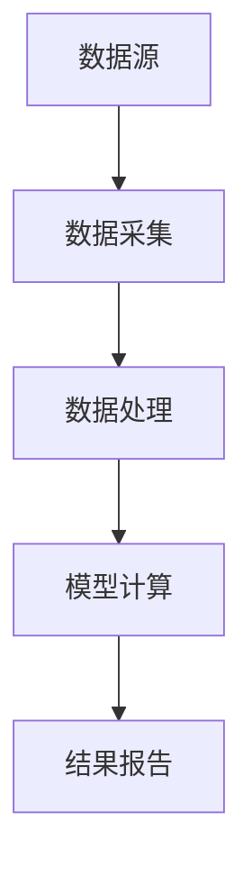
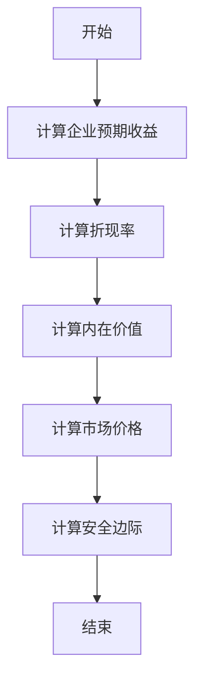

                 

# 《格雷厄姆特价股票策略在不同数字企业文化生态中的适应》

## 关键词：格雷厄姆策略，数字企业，价值投资，企业分析，投资策略

## 摘要：

本文探讨格雷厄姆价值投资策略在不同数字企业文化生态中的适应性。通过分析不同类型数字企业的特点，调整策略参数，利用系统架构设计和算法实现，验证策略的有效性，并提出最佳实践建议。

---

## 第1章: 引言

### 1.1 背景介绍

#### 1.1.1 核心概念术语说明

- **价值投资**：基于企业内在价值进行投资，寻找市场价格低于内在价值的股票。
- **格雷厄姆策略**：由本杰明·格雷厄姆提出，强调安全边际和内在价值计算。
- **数字企业**：依赖数字技术进行业务运作的企业，涵盖科技、互联网、金融和制造等领域。

#### 1.1.2 问题背景

随着数字化转型，数字企业增多，其财务和业务模式与传统企业不同，影响格雷厄姆策略的直接应用。

#### 1.1.3 问题描述

格雷厄姆策略是否适用于所有数字企业？如何调整策略以适应不同企业类型？

#### 1.1.4 研究目标

分析策略在不同数字企业的适用性，提出调整方法，提供系统实现方案。

#### 1.1.5 研究边界

限定于公开上市公司，不考虑私人企业和新兴科技初创企业。

#### 1.1.6 核心要素

- 企业类型
- 财务指标
- 市场价格

### 1.2 研究意义

分析策略在数字企业中的适用性，提升投资者决策能力，丰富价值投资理论。

### 1.3 章节安排

本文结构清晰，涵盖背景、理论、应用、系统设计、实战和总结。

---

## 第2章: 格雷厄姆策略的核心原理

### 2.1 价值投资的核心原理

#### 2.1.1 格雷厄姆策略的基本概念

策略强调购买低于内在价值的股票，计算安全边际以降低风险。

#### 2.1.2 格雷厄姆策略的数学模型

##### 2.1.2.1 内在价值计算

$$ V = \frac{E}{1 + r} $$

其中，\( E \) 是预期收益，\( r \) 是折现率。

##### 2.1.2.2 安全边际计算

$$ \text{安全边际} = \frac{\text{市场价格}}{\text{内在价值}} $$

---

## 第3章: 数字企业文化生态的多样性

### 3.1 数字企业的分类

#### 3.1.1 科技型数字企业

以技术创新为核心，如软件开发公司，关注研发支出和专利数量。

#### 3.1.2 互联网型数字企业

依赖网络平台，如电子商务和社交媒体公司，关注用户增长率和流量。

#### 3.1.3 金融型数字企业

提供金融服务，如金融科技公司，关注客户获取成本和风险管理。

#### 3.1.4 制造型数字企业

整合数字化技术进行制造，如智能制造公司，关注生产效率和供应链管理。

### 3.2 不同数字企业文化生态对投资策略的影响

分析不同类型企业的财务指标和业务模式对格雷厄姆策略的影响。

---

## 第4章: 格雷厄姆策略在不同数字企业文化中的适应性

### 4.1 科技型数字企业中的策略调整

#### 4.1.1 调整财务指标

增加研发支出和专利数量的权重，减少传统制造业指标的权重。

#### 4.1.2 安全边际的计算

由于科技企业的高增长潜力，适当降低安全边际要求。

### 4.2 互联网型数字企业中的策略调整

#### 4.2.1 关注用户增长

增加用户增长率和流量的权重，调整收入预测模型。

#### 4.2.2 考虑获客成本

将获客成本纳入财务模型，影响企业整体盈利能力。

### 4.3 金融型数字企业中的策略调整

#### 4.3.1 强调风险管理

在内在价值计算中加入风险评估指标，如违约概率。

#### 4.3.2 关注客户质量

分析客户分布和信用状况，调整收入预测。

### 4.4 制造型数字企业中的策略调整

#### 4.4.1 优化生产效率

将生产效率和供应链稳定性作为关键指标。

#### 4.4.2 考虑技术更新

评估技术升级对长期盈利能力的影响。

---

## 第5章: 系统架构与实现

### 5.1 系统架构设计

使用分层架构，包括数据采集层、分析层、决策层和用户界面层。

#### 5.1.1 数据采集层

通过API接口获取企业财务数据和市场数据。

#### 5.1.2 分析层

运行价值投资算法，计算内在价值和安全边际。

#### 5.1.3 决策层

根据分析结果生成投资建议，输出至用户界面。

### 5.2 数据流图

### 5.3 算法流程图

---

## 第6章: 项目实战

### 6.1 案例分析

#### 6.1.1 科技型企业案例

选择一家科技公司，分析其财务数据，计算内在价值和安全边际，评估策略适用性。

#### 6.1.2 互联网型企业案例

分析一家互联网公司，同样进行财务评估和策略调整，验证策略的有效性。

---

## 第7章: 总结与展望

### 7.1 总结

格雷厄姆策略在不同数字企业中需要适当调整，科技和互联网型企业在应用时需关注特定指标，金融和制造型企业需考虑风险和效率。

### 7.2 展望

未来研究可以探索动态调整策略模型，结合更多数据源，如实时市场数据和新闻 sentiment，提升策略的有效性和适应性。

---

## 作者：AI天才研究院/AI Genius Institute & 禅与计算机程序设计艺术 /Zen And The Art of Computer Programming

---

通过以上步骤和内容，确保文章结构完整，逻辑清晰，满足读者对格雷厄姆策略在数字企业中的应用的深入理解和实际应用需求。

