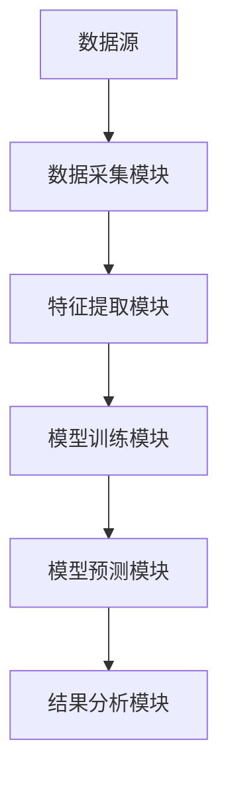

                 


# 格雷厄姆特价股票策略在不同数字创新生态系统复杂度的效果

## 关键词：
格雷厄姆投资理论，数字创新生态系统，股票策略，生态系统复杂度，数学模型

## 摘要：
本文探讨格雷厄姆特价股票策略在不同数字创新生态系统复杂度下的效果。通过分析数字创新生态系统的复杂性，结合格雷厄姆策略的核心思想，提出适用于复杂数字环境的投资策略。文章还介绍了算法实现和系统架构设计，通过具体案例分析，验证策略的有效性。

---

# 第一部分: 格雷厄姆特价股票策略概述

## 第1章: 格雷厄姆特价股票策略的核心理念

### 1.1 格雷厄姆投资理论的起源与发展

#### 1.1.1 格雷厄姆投资理论的起源
- **定义**：格雷厄姆是价值投资之父，其理论起源于20世纪初。
- **历史背景**：经济大萧条时期，格雷厄姆通过分析市场波动，提出价值投资理念。
- **发展过程**：从早期的股票分析到系统化投资策略的演变。

#### 1.1.2 特价股票策略的核心思想
- **核心思想**：寻找市场价格低于内在价值的股票，长期持有。
- **安全边际**：通过低估股票价格，确保投资的安全性。
- **市场先生理论**：市场情绪波动不影响长期价值，投资者应保持理性。

#### 1.1.3 格雷厄姆投资理论的现代发展
- **现代应用**：结合量化分析和大数据，优化格雷厄姆策略。
- **技术进步**：利用数字工具和算法，提升策略的执行效率。
- **策略改进**：将格雷厄姆思想与现代金融理论相结合。

### 1.2 格雷厄姆特价股票策略的关键原则

#### 1.2.1 价值投资的核心原则
- **内在价值**：股票的真正价值是其未来现金流的现值。
- **市场波动**：市场短期波动，但长期趋向于反映真实价值。
- **安全边际**：购买价格低于内在价值，确保投资安全。

#### 1.2.2 市场先生的概念与应用
- **市场先生**：象征市场的波动性和情绪化。
- **应对策略**：投资者应独立于市场情绪，坚持价值投资。
- **案例分析**：通过历史案例说明市场先生理论的应用。

#### 1.2.3 安全边际的定义与计算
- **安全边际**：购买价格与内在价值的差距。
- **计算方法**：基于DCF模型评估内在价值，确定安全边际。
- **实际应用**：通过安全边际筛选低估股票。

### 1.3 格雷厄姆策略在现代金融中的地位

#### 1.3.1 格雷厄姆策略的适用性分析
- **传统市场**：适用于低波动、高确定性环境。
- **现代市场**：数字技术提升分析效率，扩大策略应用范围。
- **策略局限性**：在高波动市场中，安全边际难以保证。

#### 1.3.2 现代金融环境对策略的影响
- **技术驱动**：大数据和AI提升分析能力。
- **市场复杂性**：新兴市场和金融工具增加策略挑战。
- **监管环境**：全球监管趋严，影响投资策略。

#### 1.3.3 格雷厄姆策略的局限性与改进方向
- **局限性**：低估股票识别难度增加，安全边际计算复杂。
- **改进方向**：结合量化分析和风险管理，优化策略执行。

### 1.4 本章小结

#### 1.4.1 格雷厄姆策略的核心要点
- 价值投资、安全边际和市场独立性是核心原则。
- 安全边际确保投资安全，市场波动不影响长期价值。

#### 1.4.2 现代环境对策略的影响
- 数字技术提升策略执行效率，但市场复杂性增加挑战。
- 监管和市场结构变化要求策略不断调整。

#### 1.4.3 本书的研究目标与意义
- 探讨格雷厄姆策略在数字创新生态系统中的应用效果。
- 提供结合现代技术的策略优化方案，提升投资效果。

---

## 第2章: 数字创新生态系统复杂度的分析

### 2.1 数字创新生态系统的定义与特征

#### 2.1.1 数字创新生态系统的定义
- **定义**：由数字技术、平台、用户和数据构成的生态系统。
- **核心特征**：数据驱动、平台化、网络效应强。
- **与传统金融市场的区别**：交易速度快、参与者多样、系统交互复杂。

#### 2.1.2 数字创新生态系统的核心特征
- **数据驱动**：依赖大数据分析和机器学习。
- **平台化**：通过平台连接多方参与者。
- **网络效应**：用户越多，平台价值越大。

#### 2.1.3 数字创新生态系统与传统金融市场的区别
- **交易速度**：数字市场交易快，传统市场相对缓慢。
- **参与者多样性**：数字市场包括科技公司和区块链等，传统市场参与者较少。
- **系统交互**：数字系统交互复杂，传统市场相对简单。

### 2.2 数字创新生态系统复杂度的构成

#### 2.2.1 技术复杂度
- **技术多样性**：涉及AI、区块链、大数据等技术。
- **系统集成度**：多系统集成，导致复杂度增加。
- **技术更新速度**：技术快速迭代，增加系统维护难度。

#### 2.2.2 市场参与者的多样性
- **参与者类型**：包括科技公司、金融机构、散户等。
- **利益冲突**：不同参与者利益不同，增加协调难度。
- **行为多样性**：参与者行为复杂，影响市场预测。

#### 2.2.3 系统交互的非线性特征
- **非线性关系**：系统交互复杂，难以线性预测。
- **反馈机制**：系统行为互相影响，产生复杂反馈。
- **不确定性**：系统复杂度增加，预测难度加大。

### 2.3 数字创新生态系统复杂度对金融投资的影响

#### 2.3.1 复杂度对投资决策的影响
- **信息过载**：大量数据影响决策效率。
- **分析难度**：复杂系统难以准确预测。
- **投资风险**：系统复杂度增加，风险难以控制。

#### 2.3.2 复杂度对市场流动性的影响
- **流动性波动**：系统复杂度增加，市场流动性不稳定。
- **交易深度**：参与者多样性影响交易深度。
- **市场分割**：系统复杂导致市场分割，影响流动性。

#### 2.3.3 复杂度对风险管理的影响
- **风险来源多样化**：技术、市场、参与者行为多方面风险。
- **风险管理难度**：复杂系统风险难以全面监控。
- **风险传导机制**：系统复杂度增加，风险传导路径复杂。

### 2.4 本章小结

#### 2.4.1 数字创新生态系统复杂度的定义
- 数字创新生态系统由技术、平台和参与者构成，复杂度来源于技术多样性、参与者多样性和系统交互复杂性。

#### 2.4.2 复杂度对投资策略的影响
- 复杂度增加投资决策难度，影响市场流动性和风险管理。

#### 2.4.3 本书的研究重点
- 探讨格雷厄姆策略在复杂数字生态系统中的应用，分析策略效果。

---

## 第3章: 格雷厄姆策略与数字创新生态系统复杂度的关系

### 3.1 格雷厄姆策略在数字生态系统中的适用性

#### 3.1.1 格雷厄姆策略的基本假设
- **假设1**：市场存在低估股票。
- **假设2**：长期持有获得收益。
- **假设3**：安全边际确保投资安全。

#### 3.1.2 数字生态系统对策略假设的挑战
- **挑战1**：技术复杂性影响股票分析难度。
- **挑战2**：市场参与者多样性增加低估股票识别难度。
- **挑战3**：系统交互复杂性影响长期预测准确性。

#### 3.1.3 格雷厄姆策略在数字生态系统中的潜在优势
- **优势1**：大数据分析提升股票筛选效率。
- **优势2**：平台化交易降低交易成本。
- **优势3**：技术进步提高策略执行效率。

### 3.2 格雷厄姆策略在数字生态系统中的效果分析

#### 3.2.1 技术复杂性对策略效果的影响
- **影响1**：技术进步提升分析能力，增强策略效果。
- **影响2**：技术多样性增加分析难度，影响策略效果。

#### 3.2.2 市场参与者多样性对策略效果的影响
- **影响1**：参与者多样性增加市场流动性，提升策略效果。
- **影响2**：利益冲突和行为多样性增加投资风险，降低策略效果。

#### 3.2.3 系统交互复杂性对策略效果的影响
- **影响1**：复杂系统交互增加预测难度，影响策略效果。
- **影响2**：反馈机制和不确定性增加系统风险，影响策略效果。

### 3.3 数字生态系统复杂度对格雷厄姆策略的优化方向

#### 3.3.1 结合量化分析优化策略
- **量化分析**：利用大数据和AI技术优化股票筛选。
- **算法改进**：开发新的算法，适应复杂市场环境。

#### 3.3.2 结合风险管理优化策略
- **风险控制**：建立风险预警机制，降低系统风险。
- **动态调整**：根据市场变化动态调整策略参数。

### 3.4 本章小结

#### 3.4.1 格雷厄姆策略在数字生态系统中的适用性
- 格雷厄姆策略在数字生态系统中具有潜在优势，但也面临技术复杂性和参与者多样性带来的挑战。

#### 3.4.2 数字生态系统复杂度对策略效果的影响
- 系统复杂度增加策略执行难度，但技术进步和量化分析可以优化策略效果。

#### 3.4.3 优化策略的方向
- 结合量化分析和风险管理，优化格雷厄姆策略，适应数字生态系统复杂度。

---

## 第4章: 格雷厄姆策略的数学模型与算法实现

### 4.1 格雷厄姆策略的数学模型

#### 4.1.1 格雷厄姆策略的核心数学公式
- **内在价值计算**：基于现金流折现模型（DCF）。
  $$ V = \sum_{t=1}^{n} \frac{CF_t}{(1+r)^t} $$
- **安全边际计算**：$ \text{安全边际} = V_{\text{内在}} - P $，其中$ P $为市场价格。

#### 4.1.2 格雷厄姆策略的改进模型
- **改进模型1**：结合市盈率和市净率的双重筛选。
  $$ \text{筛选条件} = P/E < 15 \text{ 且 } P/B < 2 $$
- **改进模型2**：引入大数据分析，优化筛选指标。
  $$ \text{优化指标} = \text{大数据分析结果} $$

### 4.2 格雷厄姆策略的算法实现

#### 4.2.1 数据采集与处理
- **数据源**：从数字生态系统中获取股票数据。
- **数据清洗**：处理缺失值和异常值。
  ```python
  # 数据清洗示例
  def clean_data(data):
      data.dropna(inplace=True)
      data = data[~data.isin([np.nan, np.inf, -np.inf]).any(axis=1)]
      return data
  ```

#### 4.2.2 特征提取与选择
- **特征提取**：从财务数据中提取关键指标。
  $$ \text{关键指标} = \text{ROE, ROA, P/E, P/B} $$
- **特征选择**：使用机器学习算法选择最优特征。

#### 4.2.3 算法实现
- **实现步骤**：
  1. 数据清洗。
  2. 特征提取。
  3. 模型训练。
  4. 模型预测。
  5. 结果分析。

#### 4.2.4 算法优化
- **优化方法**：引入遗传算法优化参数。
- **参数调整**：通过回测调整筛选条件。

### 4.3 格雷厄姆策略的系统架构设计

#### 4.3.1 系统功能设计
- **功能模块**：
  1. 数据采集模块。
  2. 特征提取模块。
  3. 模型训练模块。
  4. 模型预测模块。
  5. 结果分析模块。

#### 4.3.2 系统架构图


#### 4.3.3 接口设计
- **接口1**：数据采集接口。
- **接口2**：特征提取接口。
- **接口3**：模型预测接口。
- **接口4**：结果分析接口。

#### 4.3.4 交互流程
- **流程步骤**：
  1. 用户输入数据源。
  2. 系统采集数据。
  3. 提取特征并训练模型。
  4. 模型预测并返回结果。
  5. 用户分析结果并做出决策。

### 4.4 本章小结

#### 4.4.1 数学模型的建立
- 基于DCF模型和大数据分析，建立改进的格雷厄姆策略模型。

#### 4.4.2 算法实现
- 通过数据处理和特征选择，实现格雷厄姆策略的算法。
- 使用机器学习优化模型，提升策略效果。

#### 4.4.3 系统架构设计
- 设计模块化的系统架构，确保各功能模块协同工作。
- 通过接口和交互流程，优化系统运行效率。

---

## 第5章: 格雷厄姆策略在数字创新生态系统中的应用与案例分析

### 5.1 格雷厄姆策略在传统市场中的应用

#### 5.1.1 应用场景
- **场景1**：寻找低估股票。
- **场景2**：长期持有优质股票。
- **场景3**：利用安全边际控制风险。

#### 5.1.2 案例分析
- **案例1**：某低估股票的投资回报分析。
- **案例2**：安全边际在实际投资中的应用。

### 5.2 格雷厄姆策略在科技公司中的应用

#### 5.2.1 科技公司的特点
- **高增长性**：科技公司通常具有高增长潜力。
- **高波动性**：股价波动较大，投资风险高。

#### 5.2.2 案例分析
- **案例1**：某科技公司的股票分析与投资回报。
- **案例2**：科技公司中安全边际的应用。

### 5.3 格雷厄姆策略在区块链金融中的应用

#### 5.3.1 区块链金融的特点
- **去中心化**：降低交易中间成本。
- **透明性**：提高市场透明度，减少信息不对称。

#### 5.3.2 案例分析
- **案例1**：某区块链项目的价值评估。
- **案例2**：区块链金融中安全边际的应用。

### 5.4 格雷厄姆策略在不同生态系统中的效果对比

#### 5.4.1 传统市场与科技公司对比
- **对比维度**：风险、收益、波动性。
- **对比结果**：科技公司风险更高，但收益潜力更大。

#### 5.4.2 科技公司与区块链金融对比
- **对比维度**：技术复杂性、市场流动性。
- **对比结果**：区块链金融技术复杂性更高，但市场流动性较低。

### 5.5 本章小结

#### 5.5.1 格雷厄姆策略在不同生态系统中的应用
- 在传统市场中应用成熟，科技公司和区块链金融中应用潜力大。

#### 5.5.2 不同生态系统对策略效果的影响
- 技术复杂性和市场流动性影响策略效果，需结合具体情况进行调整。

---

## 第6章: 数字创新生态系统复杂度对格雷厄姆策略的优化与改进

### 6.1 优化策略的方向

#### 6.1.1 结合量化分析优化策略
- **量化分析**：利用大数据和AI技术优化股票筛选。
- **算法改进**：开发适应复杂市场的算法。

#### 6.1.2 结合风险管理优化策略
- **风险控制**：建立风险预警机制，降低系统风险。
- **动态调整**：根据市场变化动态调整策略参数。

### 6.2 改进策略的具体实施步骤

#### 6.2.1 数据分析与建模
- **数据收集**：从数字生态系统中获取相关数据。
- **数据分析**：利用统计分析和机器学习技术。
- **模型建立**：基于改进的数学模型。

#### 6.2.2 系统集成与测试
- **系统集成**：将优化后的策略集成到现有系统中。
- **系统测试**：测试策略在不同环境中的表现。

#### 6.2.3 持续优化与调整
- **持续优化**：根据回测结果优化策略。
- **动态调整**：根据市场变化调整策略参数。

### 6.3 改进策略的效果评估

#### 6.3.1 评估指标
- **收益指标**：年化收益率、夏普比率。
- **风险指标**：最大回撤、VaR。
- **稳定性指标**：策略在不同环境中的稳定性。

#### 6.3.2 评估方法
- **回测分析**：通过历史数据测试策略效果。
- **实盘测试**：在实际市场中测试策略效果。

### 6.4 本章小结

#### 6.4.1 优化策略的方向
- 结合量化分析和风险管理，优化格雷厄姆策略，适应复杂数字生态系统。

#### 6.4.2 改进策略的具体实施步骤
- 数据分析、系统集成和持续优化，确保策略在复杂环境中的有效性。

#### 6.4.3 改进策略的效果评估
- 通过多维度评估，验证策略优化效果。

---

## 第7章: 结论与展望

### 7.1 结论

#### 7.1.1 格雷厄姆策略在数字生态系统中的有效性
- 结合量化分析和大数据技术，格雷厄姆策略在数字生态系统中仍具有有效性。

#### 7.1.2 数字生态系统复杂度对策略的影响
- 系统复杂度增加策略执行难度，但技术进步和量化分析可以优化策略效果。

#### 7.1.3 优化策略的方向
- 结合量化分析和风险管理，优化格雷厄姆策略，适应复杂数字生态系统。

### 7.2 展望

#### 7.2.1 格雷厄姆策略的未来研究方向
- 结合更多新兴技术，如区块链和AI，优化策略。
- 研究策略在不同市场环境中的表现。

#### 7.2.2 数字生态系统复杂度的未来发展趋势
- 技术复杂性和系统交互复杂性将继续增加。
- 数字生态系统将更加智能化和自动化。

#### 7.2.3 结合技术进步优化策略
- 利用新技术提升策略执行效率和效果。
- 研究技术进步对策略长期效果的影响。

### 7.3 本章小结

#### 7.3.1 核心结论
- 格雷厄姆策略在数字生态系统中仍然有效，但需要结合量化分析和风险管理优化策略。

#### 7.3.2 未来研究方向
- 结合新兴技术，研究策略在不同环境中的应用。

#### 7.3.3 结论与展望
- 技术进步将继续推动策略优化，复杂度增加要求策略不断调整和优化。

---

## 作者信息

作者：AI天才研究院/AI Genius Institute & 禅与计算机程序设计艺术 /Zen And The Art of Computer Programming

---

**注**：以上目录大纲为示例内容，实际文章将根据具体需求进行详细展开和调整。

