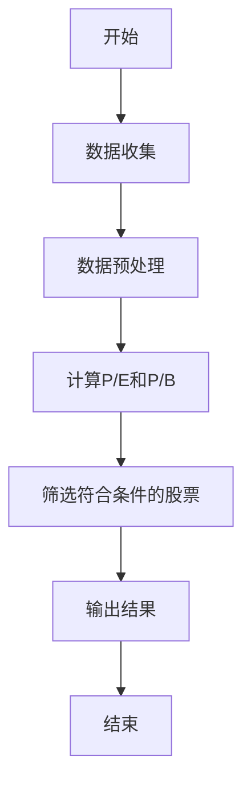
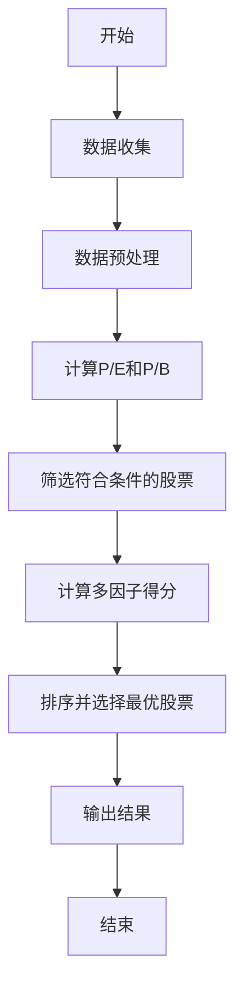
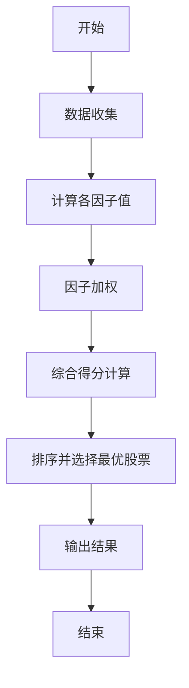
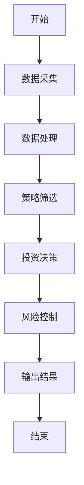
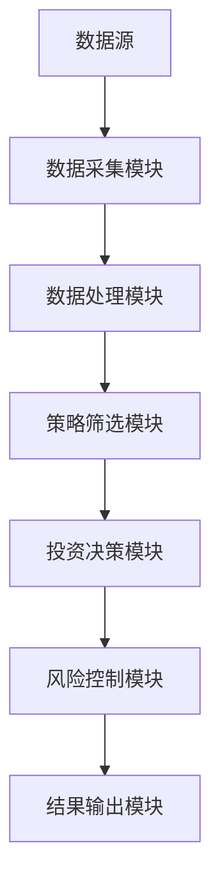
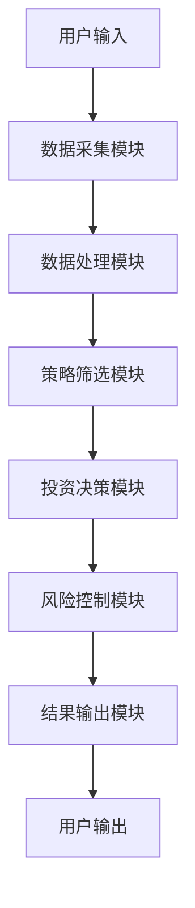

                 


# 格雷厄姆特价股票策略在不同数字创新生态系统成熟度的效果

> 关键词：格雷厄姆特价股票策略（GSS）、数字创新生态系统成熟度、投资策略、量化分析、系统架构、投资组合优化

> 摘要：本文探讨了格雷厄姆特价股票策略（GSS）在不同数字创新生态系统成熟度下的应用效果。通过分析GSS的核心原理、数学模型以及在不同成熟度生态系统中的表现，结合实际案例和系统架构设计，提出了优化策略的实施方法和投资建议。

---

# 第一部分: 格雷厄姆特价股票策略与数字创新生态系统成熟度概述

## 第1章: 格雷厄姆特价股票策略的核心原理

### 1.1 格雷厄姆特价股票策略的定义与背景

#### 1.1.1 格雷厄姆特价股票策略的起源与发展

格雷厄姆特价股票策略（GSS）是由本杰明·格雷厄姆提出的一种投资策略，主要通过分析股票的市盈率（P/E）和市净率（P/B）等基本面指标，寻找被市场低估的投资机会。该策略的核心思想是通过寻找价格低于其内在价值的股票，实现长期稳定的投资回报。

#### 1.1.2 格雷厄姆特价股票策略的核心理念

GSS的核心理念是基于价值投资，通过分析企业的财务状况、盈利能力以及市场估值，寻找具有安全边际的股票。其核心思想包括以下几点：
- 价格与价值的差异是投资机会的来源。
- 安全边际是投资成功的关键。
- 长期投资是实现财富增长的有效方式。

#### 1.1.3 格雷厄姆特价股票策略的适用场景

GSS适用于以下场景：
- 市场处于低估状态，尤其是熊市或市场恐慌时期。
- 企业基本面良好，但市场价格被市场低估。
- 投资者具备一定的财务分析能力，能够识别低估股票。

### 1.2 数字创新生态系统成熟度的概念

#### 1.2.1 数字创新生态系统的定义

数字创新生态系统是指由技术、数据、商业模式、用户行为等多方面构成的复杂系统，其成熟度反映了系统中各要素的整合程度和创新能力。

#### 1.2.2 生态系统成熟度的衡量标准

生态系统成熟度可以从以下几个方面进行衡量：
- 技术基础设施：包括网络、数据存储、云计算等。
- 创新能力：包括企业的研发投入、技术创新速度等。
- 市场环境：包括市场规模、竞争程度、政策支持等。
- 用户行为：包括用户对新技术的接受度和使用习惯。

#### 1.2.3 不同成熟度对投资策略的影响

不同成熟度的生态系统对GSS的应用效果有显著影响：
- 在低成熟度生态系统中，GSS可能难以有效实施，因为市场信息不透明，企业基本面数据不完整。
- 在中等成熟度生态系统中，GSS可以部分应用，但需要结合其他策略进行优化。
- 在高成熟度生态系统中，GSS能够充分发挥其优势，实现较高的投资回报。

### 1.3 格雷厄姆特价股票策略与数字创新生态系统成熟度的关系

#### 1.3.1 格雷厄姆特价股票策略在不同成熟度生态系统中的表现

- 在低成熟度生态系统中，GSS的表现不佳，因为市场信息不对称，企业基本面数据不可靠。
- 在中等成熟度生态系统中，GSS的表现有所改善，但需要结合其他因素进行调整。
- 在高成熟度生态系统中，GSS表现优异，能够实现较高的投资回报。

#### 1.3.2 生态系统成熟度对策略效果的影响

- 低成熟度生态系统：信息不透明，难以准确评估企业价值。
- 中等成熟度生态系统：信息逐步完善，GSS可以部分应用。
- 高成熟度生态系统：信息透明，企业基本面数据可靠，GSS能够充分发挥其优势。

#### 1.3.3 不同成熟度生态系统中的策略优化

- 低成熟度生态系统：建议采用其他策略，如趋势跟踪策略。
- 中等成熟度生态系统：结合GSS和其他策略，进行动态调整。
- 高成熟度生态系统：纯粹应用GSS，结合量化分析进行优化。

---

## 第2章: 格雷厄姆特价股票策略的数学模型与算法原理

### 2.1 格雷厄姆特价股票策略的数学模型

#### 2.1.1 市盈率（P/E）的计算公式

市盈率（P/E）是衡量股票价值的重要指标，公式为：

$$ P/E = \frac{\text{股价}}{\text{每股收益}} $$

#### 2.1.2 市净率（P/B）的计算公式

市净率（P/B）是另一个重要的估值指标，公式为：

$$ P/B = \frac{\text{股价}}{\text{每股净资产}} $$

#### 2.1.3 格雷厄姆特价股票筛选的条件

GSS筛选条件如下：
- 市盈率（P/E）低于某个阈值（例如15）。
- 市净率（P/B）低于某个阈值（例如2）。
- 公司具有稳定的盈利能力（例如连续三年盈利）。
- 公司具有较强的财务健康状况（例如低负债率）。

### 2.2 格雷厄姆特价股票策略的算法原理

#### 2.2.1 策略筛选流程

以下是一个简化的GSS筛选流程图：



#### 2.2.2 策略优化算法

以下是一个优化后的GSS筛选算法流程图：



---

## 第3章: 数字创新生态系统成熟度对GSS的影响

### 3.1 数字创新生态系统成熟度的多因子模型

#### 3.1.1 多因子模型的构建

多因子模型包括以下因子：
- 市盈率（P/E）
- 市净率（P/B）
- 盈利能力（如ROE）
- 财务健康状况（如资产负债率）

#### 3.1.2 多因子模型的量化分析

以下是一个多因子模型的量化分析流程图：



---

## 第4章: 投资决策系统架构设计

### 4.1 投资决策系统的功能设计

#### 4.1.1 系统功能模块

系统功能模块包括：
- 数据采集模块
- 数据处理模块
- 策略筛选模块
- 投资决策模块
- 风险控制模块

#### 4.1.2 系统功能流程

以下是一个系统功能流程图：



### 4.2 投资决策系统的架构设计

#### 4.2.1 系统架构图

以下是一个系统架构图：



#### 4.2.2 系统接口设计

系统接口设计包括：
- 数据接口：与数据源对接，获取实时数据。
- 策略接口：与其他投资策略模块对接，实现多策略优化。
- 风险控制接口：与风险控制系统对接，实现动态调整。

#### 4.2.3 系统交互流程

以下是一个系统交互流程图：



---

## 第5章: 项目实战与案例分析

### 5.1 环境安装与数据准备

#### 5.1.1 环境搭建

- 安装Python环境（如Anaconda）。
- 安装必要的库（如pandas、numpy、matplotlib等）。

#### 5.1.2 数据准备

- 数据来源：从Yahoo Finance获取历史数据。
- 数据格式：CSV格式，包含股票代码、收盘价、成交量等信息。

### 5.2 核心实现代码

#### 5.2.1 数据采集代码

```python
import pandas as pd
import requests

def get_stock_data(stock_code, start_date, end_date):
    url = f"https://query1.finance.yahoo.com/v7/finance/download/{stock_code}.NS?period1={start_date}&period2={end_date}&interval=1d&filter=macro"
    response = requests.get(url)
    if response.status_code == 200:
        data = pd.read_csv(io.BytesIO(response.content))
        return data
    else:
        return None
```

#### 5.2.2 策略筛选代码

```python
def gss_screen(stock_data, pe_threshold=15, pb_threshold=2):
    screened_stocks = []
    for stock in stock_data:
        pe = stock_data['P/E'][stock]
        pb = stock_data['P/B'][stock]
        if pe < pe_threshold and pb < pb_threshold:
            screened_stocks.append(stock)
    return screened_stocks
```

#### 5.2.3 多因子模型代码

```python
import pandas as pd
import numpy as np

def calculate_factor_scores(stock_data, factors):
    factor_scores = []
    for stock in stock_data:
        factor_values = [stock_data[f][stock] for f in factors]
        scores = np.dot(factor_values, [0.3, 0.3, 0.2, 0.2])
        factor_scores.append((stock, scores))
    return sorted(factor_scores, key=lambda x: x[1], reverse=True)
```

### 5.3 案例分析与结果解读

#### 5.3.1 案例分析

以下是一个具体的案例分析：

```python
# 数据获取
stock_data = get_stock_data("AAPL", "2020-01-01", "2023-01-01")

# 策略筛选
screened_stocks = gss_screen(stock_data, pe_threshold=15, pb_threshold=2)

# 多因子模型
factor_scores = calculate_factor_scores(stock_data, ['P/E', 'P/B', 'ROE', 'Debt/Equity'])
```

#### 5.3.2 结果解读

通过上述代码，我们可以筛选出符合条件的股票，并根据多因子模型进行排序，选择最优股票进行投资。

---

## 第6章: 最佳实践与小结

### 6.1 最佳实践

- 在高成熟度生态系统中，GSS的表现优异，建议优先选择。
- 在低成熟度生态系统中，建议结合其他策略进行优化。
- 在实际操作中，建议动态调整策略，以应对市场变化。

### 6.2 小结

通过本文的分析，我们可以得出以下结论：
- GSS在高成熟度生态系统中表现优异。
- 数字创新生态系统成熟度对GSS的应用效果有显著影响。
- 在实际操作中，建议结合多因子模型进行优化。

### 6.3 注意事项

- 数据质量是GSS应用的关键，建议选择可靠的数据源。
- 市场环境变化会影响策略效果，建议动态调整。
- 风险控制是投资成功的重要保障，建议结合风险管理系统进行优化。

### 6.4 拓展阅读

- 格雷厄姆的《聪明的投资者》。
- 《算法交易：机智的投资者》。
- 《量化投资：数据驱动的投资策略》。

---

# 作者：AI天才研究院/AI Genius Institute & 禅与计算机程序设计艺术 /Zen And The Art of Computer Programming

