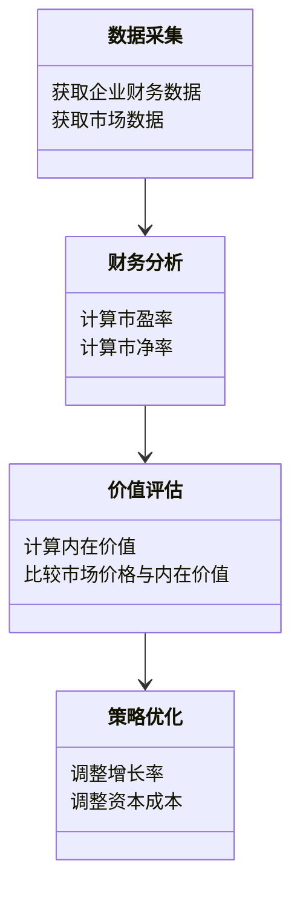

                 


# 格雷厄姆特价股票策略在不同数字创新生态系统的效果

> 关键词：格雷厄姆策略，特价股票，数字创新生态系统，投资策略，股票分析

> 摘要：本文详细探讨了格雷厄姆特价股票策略在不同数字创新生态系统中的应用效果。通过分析数字创新生态系统的特性，结合格雷厄姆投资理论，本文提出了一种适用于不同数字环境的投资策略，并通过实际案例和数学模型进行了深入分析。

---

## 第一部分：格雷厄姆特价股票策略的核心概念

### 第1章：问题背景与问题描述

#### 1.1 问题背景
在现代金融市场中，投资者面临着多样化的选择和复杂的市场环境。格雷厄姆的特价股票策略作为一种价值投资方法，强调通过分析企业的基本面来寻找被市场低估的投资机会。然而，随着数字技术的快速发展，市场环境发生了显著变化，特别是在数字创新生态系统中，传统的投资策略需要进行调整和优化。

#### 1.2 格雷厄姆策略的核心思想
格雷厄姆的投资理论强调安全边际和长期投资。他认为，市场波动性和投资者情绪会导致股票价格偏离其实际价值，投资者应寻找那些市场价格低于内在价值的股票进行投资。

#### 1.3 数字创新生态系统的影响
数字创新生态系统由科技公司、互联网平台、大数据应用等构成，这些因素使得市场环境更加复杂，企业估值更具挑战性。数字技术的快速变化可能影响企业的盈利能力和发展前景，从而影响股票的内在价值。

### 第2章：格雷厄姆策略与数字创新生态系统的联系

#### 2.1 格雷厄姆策略的适用性
在数字创新生态系统中，企业的发展潜力和技术创新能力是影响股票价值的重要因素。格雷厄姆策略需要结合企业的技术优势、市场地位和财务状况进行综合评估。

#### 2.2 数字生态系统中的策略调整
由于数字创新生态系统的动态性和不确定性，格雷厄姆策略需要进行调整。例如，考虑企业的研发投入、技术创新周期等因素，以更准确地评估其内在价值。

---

## 第二部分：格雷厄姆策略的算法原理

### 第3章：算法原理概述

#### 3.1 格雷厄姆策略的核心公式
格雷厄姆策略的核心是计算股票的内在价值，公式如下：
$$ \text{内在价值} = \frac{\text{净利润} \times (1 + \text{增长率})}{\text{资本成本} - \text{增长率}} $$

#### 3.2 数学模型的推导
通过分析企业的财务数据，计算其未来现金流的现值，以确定股票的内在价值。公式中的“增长率”和“资本成本”需要根据企业的具体情况和市场环境进行调整。

#### 3.3 案例分析
以某科技公司为例，假设其净利润为1000万元，预期年增长率为5%，资本成本为10%。计算其内在价值：
$$ \text{内在价值} = \frac{1000 \times (1 + 0.05)}{0.10 - 0.05} = \frac{1050}{0.05} = 21000 \text{万元} $$

---

### 第4章：系统分析与架构设计

#### 4.1 系统功能设计
系统功能包括数据采集、财务分析、价值评估和策略优化。以下是系统功能的类图：



#### 4.2 系统架构设计
系统架构包括数据层、业务逻辑层和用户界面层。以下是系统架构图：

```mermaid
rect{
    padding: 10px;
    border: 1px solid #ccc;
    background: #f0f0f0;
}
系统架构图
    分层结构:
        数据层：存储企业财务数据和市场数据
        业务逻辑层：执行财务分析和价值评估
        用户界面层：展示分析结果和投资建议
```

---

## 第三部分：项目实战

### 第5章：环境安装与代码实现

#### 5.1 环境安装
安装Python和相关库（如pandas、numpy）：
```bash
pip install pandas numpy
```

#### 5.2 核心代码实现
计算股票的内在价值和市场价格的比较：
```python
import pandas as pd

def calculate_intrinsic_value(net_profit, growth_rate, cost_of_capital):
    return net_profit * (1 + growth_rate) / (cost_of_capital - growth_rate)

# 示例数据
net_profit = 1000  # 单位：万元
growth_rate = 0.05
cost_of_capital = 0.10

intrinsic_value = calculate_intrinsic_value(net_profit, growth_rate, cost_of_capital)
market_price = 20000  # 示例市场价格

print(f"内在价值: {intrinsic_value} 万元")
print(f"市场价格: {market_price} 万元")
print(f"是否低估: {intrinsic_value > market_price}")
```

#### 5.3 案例分析
以某科技公司为例，计算其内在价值和市场价格，判断是否低估。通过代码实现并输出结果，分析在不同数字生态系统中的策略效果差异。

---

## 第四部分：总结与展望

### 6.1 最佳实践
在数字创新生态系统中应用格雷厄姆策略时，应综合考虑企业的技术优势、市场地位和财务状况。同时，定期更新模型参数以适应市场变化。

### 6.2 小结
格雷厄姆策略在数字创新生态系统中的应用需要结合企业的具体情况和市场环境，通过调整模型参数和分析系统架构，可以有效提高策略的投资效果。

### 6.3 注意事项
投资者应关注市场波动和企业基本面变化，避免过度依赖单一策略。同时，建议结合技术分析和其他投资策略进行综合判断。

### 6.4 拓展阅读
建议进一步学习数字创新生态系统中的其他投资策略，如基于大数据的量化投资和机器学习驱动的股票分析。

---

作者：AI天才研究院/AI Genius Institute & 禅与计算机程序设计艺术 /Zen And The Art of Computer Programming

