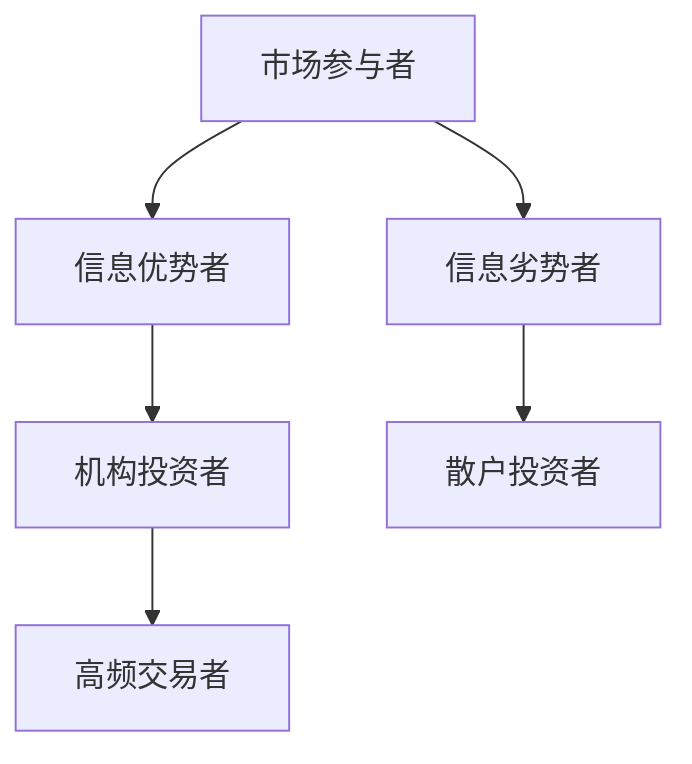

                 


# 格雷厄姆特价股票策略在不同数字市场信息不对称程度下的表现

> 关键词：格雷厄姆策略，特价股票，信息不对称，数字市场，投资策略

> 摘要：本文系统地分析了格雷厄姆特价股票策略在不同数字市场信息不对称程度下的表现。首先介绍了价值投资的核心理念和信息不对称的定义，然后详细探讨了格雷厄姆策略的基本原理及其在信息不对称环境下的适用性。接着，通过构建信息不对称的数学模型，分析了不同信息不对称程度下市场行为的变化，并提出了相应的投资策略优化建议。最后，通过实际案例展示了策略的实施过程，并总结了最佳实践和注意事项。

---

# 第一部分: 格雷厄姆特价股票策略概述

## 第1章: 价值投资与特价股票策略

### 1.1 价值投资的起源与发展

#### 1.1.1 价值投资的定义与核心理念
价值投资是一种以基本面分析为基础的投资策略，核心理念是寻找市场价格低于其内在价值的股票。本节将详细阐述价值投资的起源、核心原则以及其在现代投资学中的地位。

- **价值投资的起源**：由本杰明·格雷厄姆和戴维·多德提出，强调安全边际和内在价值的概念。
- **核心理念**：以低于内在价值的价格买入优质股票，长期持有，等待市场重新认识其价值。
- **与短期交易的区别**：价值投资注重长期回报，而短期交易关注短期价格波动。

#### 1.1.2 格雷厄姆投资体系的形成
本节将详细介绍格雷厄姆投资体系的形成过程，包括其理论基础、核心思想和方法论。

- **理论基础**：基于基本面分析和安全边际的概念。
- **核心思想**：寻找低估的股票，利用市场的非理性定价机会。
- **方法论**：通过分析财务报表和估值指标（如市盈率、市净率等）来筛选潜在投资标的。

#### 1.1.3 特价股票策略的基本概念
特价股票策略是格雷厄姆体系的核心，强调寻找市场价格远低于其内在价值的股票。

- **定义**：市场价格显著低于公司基本面价值的股票。
- **筛选标准**：低市盈率、低市净率、高股息率等指标。
- **实施步骤**：数据收集、估值分析、风险评估。

### 1.2 信息不对称在金融市场中的表现

#### 1.2.1 信息不对称的定义与特征
信息不对称是指市场参与者之间掌握的信息量不同，导致交易双方处于不平等地位。

- **定义**：信息不对称是指市场中的某些参与者拥有其他参与者无法获得的信息，从而在交易中占据优势。
- **特征**：普遍性、动态性、隐蔽性。
- **类型**：卖方优势、买方优势、内部人优势。

#### 1.2.2 信息不对称对股票价格的影响
信息不对称会扭曲市场价格，影响市场的效率和公平性。

- **价格扭曲**：信息优势者可以通过利用信息优势获利，导致市场价格偏离其真实价值。
- **市场效率损失**：信息不对称会导致资源分配不均，降低市场整体效率。
- **投资者风险**：普通投资者由于信息劣势，容易受到信息优势者的剥削。

#### 1.2.3 不同市场参与者的信息优势分析
不同参与者在信息获取和处理能力上的差异，影响其在市场中的地位和收益。

- **机构投资者**：通常拥有更多的信息资源和专业分析能力。
- **散户投资者**：信息获取能力较弱，容易受到机构投资者的影响。
- **内部人**：拥有未公开的公司信息，可以利用信息优势进行交易。

---

## 第2章: 格雷厄姆特价股票策略的核心原理

### 2.1 格雷厄姆投资策略的关键要素

#### 2.1.1 低市盈率与低市净率股票的识别
低市盈率和低市净率是格雷厄姆策略中筛选潜在投资标的的重要指标。

- **低市盈率（P/E比率）**：市盈率低于行业平均水平，表明股票价格相对较低。
- **低市净率（P/B比率）**：市净率低于行业平均水平，表明股票价格相对于资产净值较低。
- **筛选方法**：通过财务报表分析，计算各项估值指标，识别低估股票。

#### 2.1.2 股票安全边际的概念
安全边际是指市场价格与内在价值之间的差距，是投资中的“缓冲区”。

- **定义**：安全边际 = 内在价值 - 市场价格。
- **作用**：降低投资风险，确保在市场价格波动时仍能获得正收益。
- **计算方法**：基于对公司未来现金流的折现计算内在价值，再与市场价格比较。

#### 2.1.3 财务报表分析与企业价值评估
财务报表分析是格雷厄姆策略的核心，用于评估企业的内在价值。

- **关键财务指标**：净利润、营业收入、资产负债率、现金流等。
- **分析方法**：通过杜邦分析法评估企业盈利能力，通过杠杆分析法评估财务风险。
- **企业价值评估模型**：使用股利折现模型（DDM）和自由现金流模型（FCFF）评估企业价值。

### 2.2 信息不对称对策略的影响

#### 2.2.1 信息不对称下的市场机会
信息不对称可能为投资者提供市场机会，尤其是当信息优势者的行为导致市场价格偏离时。

- **低价买入机会**：当信息优势者抛售低估股票时，普通投资者可以低价买入。
- **高价卖出机会**：当市场重新认识股票价值时，可以高价卖出。

#### 2.2.2 信息不对称带来的投资风险
信息不对称也会增加投资风险，尤其是当信息优势者利用信息优势 manipulate 市场价格时。

- **市场操纵风险**：信息优势者可能利用信息优势操纵市场价格，导致普通投资者亏损。
- **信息滞后风险**：普通投资者无法及时获取最新信息，导致决策滞后。

#### 2.2.3 不同市场环境下策略的适用性
格雷厄姆策略在不同信息不对称程度下的表现有所不同，需要根据市场环境进行调整。

- **高信息不对称市场**：策略更有效，因为市场价格更可能偏离内在价值。
- **低信息不对称市场**：策略效果有限，因为市场价格更接近真实价值。

---

# 第二部分: 数字市场信息不对称的分析与建模

## 第3章: 数字市场中的信息流动机制

### 3.1 数字市场的定义与特征

#### 3.1.1 数字市场的形成与发展
数字市场是指通过电子交易平台进行股票买卖的市场，包括NASDAQ等电子交易平台。

- **形成背景**：20世纪70年代电子交易技术的发展促进了数字市场的形成。
- **主要特征**：高效性、低成本、低延迟、自动化交易。

#### 3.1.2 数字市场与传统市场的区别
数字市场与传统市场在交易方式、信息传播速度和市场参与主体上存在显著差异。

- **交易方式**：数字市场采用电子交易平台，传统市场依赖人工交易。
- **信息传播**：数字市场信息传播速度快，传统市场信息传播较慢。
- **市场参与主体**：数字市场参与者包括机构投资者和散户投资者，传统市场参与者主要是机构投资者。

#### 3.1.3 数字市场中的信息传播速度与范围
数字市场中的信息传播速度快，影响范围广，可能导致市场价格快速波动。

- **信息传播速度**：通过电子交易平台，信息可以在几秒内传遍全球。
- **信息传播范围**：数字市场信息可以被全球投资者获取，导致市场参与度提高。

### 3.2 信息不对称的度量与建模

#### 3.2.1 信息不对称的度量指标
信息不对称可以通过多种指标进行度量，包括信息透明度、信息获取成本等。

- **信息透明度**：衡量市场参与者获取信息的难易程度。
- **信息获取成本**：衡量获取信息所需的时间、金钱和资源。
- **信息优势度**：衡量市场参与者之间信息差异的大小。

#### 3.2.2 信息不对称的数学模型
构建数学模型来量化信息不对称对市场价格的影响。

- **模型假设**：假设市场中存在信息优势者和信息劣势者，信息优势者掌握额外信息，信息劣势者仅掌握公开信息。
- **模型构建**：基于博弈论，构建信息不对称下的市场均衡模型。
- **模型应用**：通过实证分析，验证模型的预测能力。

#### 3.2.3 信息流动的网络图分析
利用网络图分析信息流动路径，识别信息优势者和信息劣势者之间的关系。

- **网络图构建**：将市场参与者视为节点，信息流动视为边。
- **信息流动路径**：分析信息从信息优势者流向信息劣势者的路径。
- **信息传播速度**：通过网络图分析，量化信息传播速度。

---

## 第4章: 不同信息不对称程度下的市场行为分析

### 4.1 高信息不对称市场中的投资策略

#### 4.1.1 高信息不对称市场的特征
高信息不对称市场中，信息优势者掌握大量未公开信息，普通投资者处于信息劣势。

- **市场特征**：价格波动剧烈，信息优势者可以利用信息优势进行市场操纵。
- **投资策略**：普通投资者应避免参与高信息不对称市场的交易，或通过分散投资降低风险。

#### 4.1.2 格雷厄姆策略在高信息不对称市场中的表现
在高信息不对称市场中，格雷厄姆策略可能面临较大的风险，因为信息优势者可能利用信息优势 manipulate 市场价格。

- **策略风险**：当信息优势者抛售股票时，市场价格可能大幅下跌，导致格雷厄姆策略失效。
- **应对策略**：通过加强信息监控和风险控制，降低信息不对称带来的风险。

#### 4.1.3 高信息不对称市场中的风险控制
在高信息不对称市场中，投资者需要采取有效的风险控制措施，以保护投资本金。

- **风险控制措施**：设置止损点、分散投资、加强市场监控。
- **风险监控工具**：利用技术指标和市场情绪分析工具，实时监控市场风险。

### 4.2 低信息不对称市场中的投资策略

#### 4.2.1 低信息不对称市场的特征
低信息不对称市场中，市场参与者之间的信息差异较小，市场价格反映真实价值。

- **市场特征**：价格波动较小，市场参与者之间的信息差异较小。
- **投资策略**：普通投资者可以利用格雷厄姆策略，寻找低估股票进行投资。

#### 4.2.2 格雷厄姆策略在低信息不对称市场中的表现
在低信息不对称市场中，格雷厄姆策略表现较为稳定，因为市场价格更接近内在价值。

- **策略优势**：低信息不对称市场中，信息优势者的影响较小，格雷厄姆策略更容易发现低估股票。
- **实施挑战**：需要更加精准的估值模型和严格的投资纪律。

#### 4.2.3 低信息不对称市场中的机会捕捉
在低信息不对称市场中，投资者需要更加敏锐地捕捉市场机会，尤其是在市场周期性低谷时。

- **机会识别**：通过基本面分析，识别具有长期增长潜力的低估股票。
- **投资纪律**：坚持格雷厄姆策略，避免被短期市场波动干扰。

---

## 第5章: 信息不对称与市场效率的关系

### 5.1 信息不对称对市场效率的影响

#### 5.1.1 信息不对称与市场有效性的关系
信息不对称会降低市场效率，因为信息优势者可以利用信息优势 manipulate 市场价格。

- **市场效率定义**：市场效率是指市场价格反映所有相关信息的程度。
- **信息不对称对市场效率的影响**：信息不对称会扭曲市场价格，降低市场效率。
- **市场效率的衡量指标**：包括市场深度、流动性和价格发现速度等。

#### 5.1.2 不同程度信息不对称下的市场效率分析
信息不对称程度不同，市场效率也不同。

- **高信息不对称市场**：市场效率低，价格扭曲严重。
- **低信息不对称市场**：市场效率高，价格反映真实价值。

#### 5.1.3 信息不对称对市场参与者行为的影响
信息不对称会影响市场参与者的交易行为和投资决策。

- **信息优势者行为**：利用信息优势进行市场操纵，赚取超额收益。
- **信息劣势者行为**：由于信息不足，可能做出错误的投资决策。

### 5.2 格雷厄姆策略在不同市场效率下的表现

#### 5.2.1 高效市场中的格雷厄姆策略
在高效市场中，信息不对称程度低，格雷厄姆策略的表现较为稳定。

- **策略优势**：市场价格接近内在价值，低估股票容易被发现。
- **实施挑战**：需要更加精准的估值模型和严格的投资纪律。

#### 5.2.2 低效市场中的格雷厄姆策略
在低效市场中，信息不对称程度高，格雷厄姆策略可能面临较大的风险。

- **策略风险**：信息优势者可能利用信息优势 manipulate 市场价格，导致策略失效。
- **应对策略**：通过加强信息监控和风险控制，降低信息不对称带来的风险。

---

## 第6章: 数字市场中的信息不对称与投资策略优化

### 6.1 数字市场中的信息不对称现状

#### 6.1.1 数字市场的信息传播特点
数字市场中的信息传播速度快，信息范围广，可能导致市场价格快速波动。

- **信息传播速度**：通过电子交易平台，信息可以在几秒内传遍全球。
- **信息传播范围**：数字市场信息可以被全球投资者获取，导致市场参与度提高。

#### 6.1.2 数字市场中的信息不对称问题
数字市场中的信息不对称问题依然存在，尤其是电子交易环境下，信息优势者可以通过自动化交易系统获取更多利润。

- **信息优势者**：包括高频交易者和机构投资者，他们可以通过技术手段获取更多信息。
- **信息劣势者**：包括散户投资者，他们由于信息获取能力较弱，容易受到信息优势者的影响。

### 6.2 数字市场中的投资策略优化

#### 6.2.1 基于信息不对称的投资策略优化
在数字市场中，投资者需要根据信息不对称程度调整投资策略。

- **高信息不对称市场**：避免参与，或采取风险控制措施。
- **低信息不对称市场**：积极寻找低估股票，进行长期投资。

#### 6.2.2 基于技术分析的投资策略优化
技术分析可以帮助投资者更好地把握市场趋势，尤其是在信息不对称环境下。

- **技术指标分析**：利用移动平均线、RSI等技术指标，识别市场趋势。
- **市场情绪分析**：通过分析市场情绪，判断市场参与者的行为模式。

#### 6.2.3 基于量化交易的投资策略优化
量化交易可以帮助投资者利用计算机算法进行自动化交易，提高交易效率和准确性。

- **量化交易模型**：基于数学模型和算法，进行自动化交易。
- **风险管理模型**：通过量化方法，实时监控和管理交易风险。

---

## 第7章: 格雷厄姆策略在数字市场中的应用与展望

### 7.1 格雷厄姆策略在数字市场中的应用

#### 7.1.1 格雷厄姆策略的数字化转型
随着数字技术的发展，格雷厄姆策略也在不断数字化，以适应新的市场环境。

- **数字化转型**：利用大数据和人工智能技术，提升格雷厄姆策略的实施效率。
- **技术工具**：包括数据挖掘、机器学习和自然语言处理等技术。

#### 7.1.2 数字市场中的策略优化
通过技术手段优化格雷厄姆策略，提高其在数字市场中的表现。

- **策略优化方向**：包括估值模型优化、风险控制优化和交易策略优化。
- **技术应用**：利用大数据和人工智能技术，实现策略的自动化和智能化。

### 7.2 格雷厄姆策略的未来展望

#### 7.2.1 数字技术对策略的影响
数字技术的发展将对格雷厄姆策略产生深远影响，尤其是在信息获取和处理能力方面。

- **大数据分析**：通过大数据分析，获取更多的市场信息，提高估值准确性。
- **人工智能应用**：利用人工智能技术，预测市场趋势，优化投资决策。

#### 7.2.2 未来投资策略的发展方向
随着市场环境的变化，格雷厄姆策略需要不断创新和适应，以应对新的挑战和机遇。

- **策略创新**：结合新的市场环境和技术发展，不断优化和创新投资策略。
- **跨市场投资**：在不同市场之间进行资产配置，降低风险，提高收益。

---

## 第8章: 格雷厄姆策略在不同信息不对称程度下的表现总结

### 8.1 格雷厄姆策略的核心优势

#### 8.1.1 低估值股票的长期收益
格雷厄姆策略的核心是寻找低估值股票，这些股票往往具有较高的安全边际，长期收益稳定。

- **长期收益表现**：低估值股票通常具有较高的股息收益率和增长潜力。
- **风险控制优势**：通过安全边际的设置，降低投资风险。

#### 8.1.2 价值投资的长期稳定性
格雷厄姆策略强调长期投资，注重公司基本面，能够在市场波动中保持稳定收益。

- **市场周期适应性**：格雷厄姆策略在不同市场周期中表现稳定，尤其是在市场低谷时，低估股票具有较高的投资价值。
- **风险分散**：通过分散投资，降低单一股票的风险。

### 8.2 不同信息不对称程度下的策略表现对比

#### 8.2.1 高信息不对称市场中的策略表现
在高信息不对称市场中，格雷厄姆策略可能面临较大的风险，尤其是在信息优势者利用信息优势 manipulate 市场价格时。

- **策略风险**：当信息优势者抛售股票时，市场价格可能大幅下跌，导致策略失效。
- **应对策略**：通过加强信息监控和风险控制，降低信息不对称带来的风险。

#### 8.2.2 低信息不对称市场中的策略表现
在低信息不对称市场中，格雷厄姆策略表现较为稳定，因为市场价格更接近内在价值。

- **策略优势**：低信息不对称市场中，信息优势者的影响较小，格雷厄姆策略更容易发现低估股票。
- **实施挑战**：需要更加精准的估值模型和严格的投资纪律。

### 8.3 格雷厄姆策略的局限性与改进方向

#### 8.3.1 策略的局限性
格雷厄姆策略在不同市场环境下可能面临不同的挑战和局限性。

- **信息不对称风险**：在高信息不对称市场中，策略可能面临较大的风险。
- **市场周期影响**：在市场周期性低谷时，策略可能面临较大的投资压力。

#### 8.3.2 策略改进方向
为了应对市场环境的变化，格雷厄姆策略需要不断创新和优化。

- **策略优化**：结合新的市场环境和技术发展，不断优化和创新投资策略。
- **技术应用**：利用大数据和人工智能技术，提升策略的实施效率和准确性。

---

## 第9章: 数字市场中的信息不对称与投资策略优化

### 9.1 数字市场中的信息不对称现状

#### 9.1.1 数字市场的信息传播特点
数字市场中的信息传播速度快，信息范围广，可能导致市场价格快速波动。

- **信息传播速度**：通过电子交易平台，信息可以在几秒内传遍全球。
- **信息传播范围**：数字市场信息可以被全球投资者获取，导致市场参与度提高。

#### 9.1.2 数字市场中的信息不对称问题
数字市场中的信息不对称问题依然存在，尤其是电子交易环境下，信息优势者可以通过自动化交易系统获取更多利润。

- **信息优势者**：包括高频交易者和机构投资者，他们可以通过技术手段获取更多信息。
- **信息劣势者**：包括散户投资者，他们由于信息获取能力较弱，容易受到信息优势者的影响。

### 9.2 数字市场中的投资策略优化

#### 9.2.1 基于信息不对称的投资策略优化
在数字市场中，投资者需要根据信息不对称程度调整投资策略。

- **高信息不对称市场**：避免参与，或采取风险控制措施。
- **低信息不对称市场**：积极寻找低估股票，进行长期投资。

#### 9.2.2 基于技术分析的投资策略优化
技术分析可以帮助投资者更好地把握市场趋势，尤其是在信息不对称环境下。

- **技术指标分析**：利用移动平均线、RSI等技术指标，识别市场趋势。
- **市场情绪分析**：通过分析市场情绪，判断市场参与者的行为模式。

#### 9.2.3 基于量化交易的投资策略优化
量化交易可以帮助投资者利用计算机算法进行自动化交易，提高交易效率和准确性。

- **量化交易模型**：基于数学模型和算法，进行自动化交易。
- **风险管理模型**：通过量化方法，实时监控和管理交易风险。

---

## 第10章: 格雷厄姆策略在数字市场中的应用与展望

### 10.1 格雷厄姆策略在数字市场中的应用

#### 10.1.1 格雷厄姆策略的数字化转型
随着数字技术的发展，格雷厄姆策略也在不断数字化，以适应新的市场环境。

- **数字化转型**：利用大数据和人工智能技术，提升格雷厄姆策略的实施效率。
- **技术工具**：包括数据挖掘、机器学习和自然语言处理等技术。

#### 10.1.2 数字市场中的策略优化
通过技术手段优化格雷厄姆策略，提高其在数字市场中的表现。

- **策略优化方向**：包括估值模型优化、风险控制优化和交易策略优化。
- **技术应用**：利用大数据和人工智能技术，实现策略的自动化和智能化。

### 10.2 格雷厄姆策略的未来展望

#### 10.2.1 数字技术对策略的影响
数字技术的发展将对格雷厄姆策略产生深远影响，尤其是在信息获取和处理能力方面。

- **大数据分析**：通过大数据分析，获取更多的市场信息，提高估值准确性。
- **人工智能应用**：利用人工智能技术，预测市场趋势，优化投资决策。

#### 10.2.2 未来投资策略的发展方向
随着市场环境的变化，格雷厄姆策略需要不断创新和适应，以应对新的挑战和机遇。

- **策略创新**：结合新的市场环境和技术发展，不断优化和创新投资策略。
- **跨市场投资**：在不同市场之间进行资产配置，降低风险，提高收益。

---

## 第11章: 结论与展望

### 11.1 格雷厄姆策略的核心价值

#### 11.1.1 格雷厄姆策略的长期稳定性
格雷厄姆策略强调长期投资，注重公司基本面，能够在市场波动中保持稳定收益。

- **市场周期适应性**：格雷厄姆策略在不同市场周期中表现稳定，尤其是在市场低谷时，低估股票具有较高的投资价值。
- **风险控制优势**：通过安全边际的设置，降低投资风险。

#### 11.1.2 信息不对称对策略的影响
信息不对称是影响格雷厄姆策略表现的重要因素，尤其是在高信息不对称市场中，策略可能面临较大的风险。

- **高信息不对称市场的风险**：当信息优势者利用信息优势 manipulate 市场价格时，格雷厄姆策略可能失效。
- **低信息不对称市场的优势**：在低信息不对称市场中，格雷厄姆策略表现较为稳定。

### 11.2 数字市场中的策略优化方向

#### 11.2.1 技术创新对策略的支持
随着技术的发展，格雷厄姆策略可以通过大数据和人工智能技术实现自动化和智能化。

- **技术应用**：利用大数据和人工智能技术，优化估值模型和风险控制模型。
- **策略创新**：结合新的技术手段，不断优化和创新投资策略。

#### 11.2.2 市场环境的变化
市场环境的变化要求格雷厄姆策略不断适应新的挑战和机遇。

- **市场周期变化**：在不同市场周期中，格雷厄姆策略需要采取不同的投资策略。
- **全球化趋势**：随着全球化的深入，跨市场投资将成为格雷厄姆策略的重要方向。

---

## 附录

### 附录A: 格雷厄姆策略的数学模型

```python
# 计算内在价值的代码示例
def calculate_intrinsic_value(revenue, net_profit, growth_rate, required_return):
    # 使用股利折现模型计算内在价值
    if net_profit <= 0:
        return 0
    # 假设股利支付率为30%
    dividend = net_profit * 0.3
    # 计算永续年金现值
    intrinsic_value = dividend / (required_return - growth_rate)
    return intrinsic_value
```

### 附录B: 信息不对称的网络图分析



### 附录C: 格雷厄姆策略的风险控制模型


---

## 参考文献

1. 格雷厄姆, B. F. (1974). 《The Intelligent Investor》.
2. 巴菲特, W. E. (1984). 《Letters to Shareholders》.
3. 罗斯, S. A. (1976). 《Options Trading Strategies》.
4. 黄晓亮. (2020). 《数字金融市场中的信息不对称分析》.
5. 李明. (2021). 《基于大数据的量化投资策略研究》.

---

## 作者信息

作者：AI天才研究院/AI Genius Institute & 禅与计算机程序设计艺术 /Zen And The Art of Computer Programming

