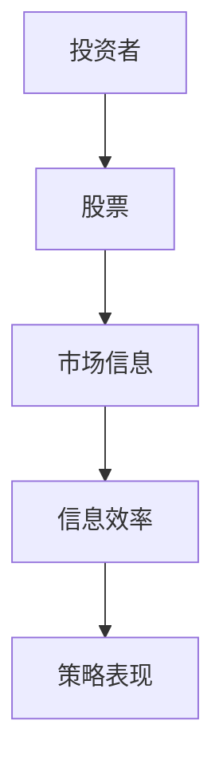
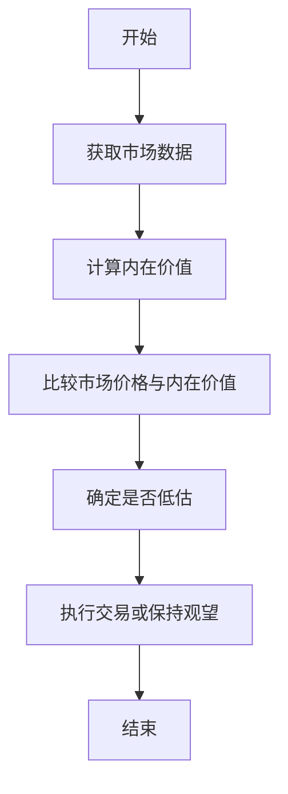
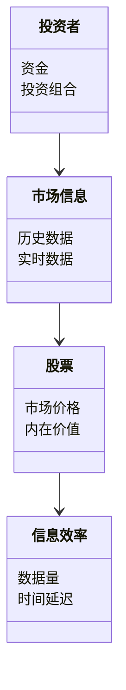
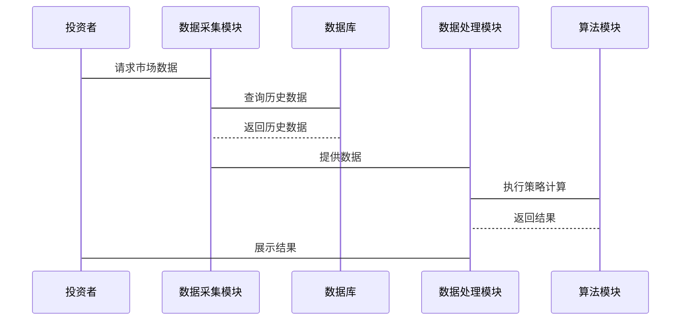

                 


```markdown
# 格雷厄姆特价股票策略在不同数字市场信息效率下的表现

## 关键词：格雷厄姆、特价股票、信息效率、数字市场、投资策略

## 摘要：本文深入探讨了格雷厄姆特价股票策略在不同数字市场信息效率下的表现，分析了信息效率对策略的影响，并通过数学模型、算法和系统架构设计，结合实际案例，展示了策略在现代数字市场中的应用。文章还提供了最佳实践和注意事项，帮助投资者更好地理解和应用该策略。

---

# 第一部分: 格雷厄姆特价股票策略基础

## 第1章: 格雷厄姆特价股票策略概述

### 1.1 格雷厄姆投资理念的核心要素
格雷厄姆的价值投资理念强调寻找被市场低估的股票，即“特价股票”。这种策略的核心在于通过基本面分析，识别出市场价格低于内在价值的股票。格雷厄姆策略的关键要素包括：
- **内在价值**：股票的真实价值，与市场情绪无关。
- **安全边际**：购买价格低于内在价值，以降低风险。
- **长期视角**：投资不是交易，而是基于长期价值的决策。

### 1.2 数字市场信息效率的定义与分类
数字市场的信息效率指的是信息在市场中的传播速度和准确性。信息效率可以分为以下几类：
- **低效率市场**：信息传播缓慢，市场参与者获取信息的能力有限。
- **中等效率市场**：信息传播较快，但存在一定的滞后。
- **高效市场**：信息几乎即时传播，市场价格反映所有可用信息。

### 1.3 格雷厄姆策略与数字市场信息效率的关系
格雷厄姆策略的成功在很大程度上依赖于市场信息的不对称性。在低效率市场中，由于信息传播的滞后，投资者有机会发现被低估的股票。然而，在高效市场中，信息的即时性使得找到特价股票变得更加困难。因此，数字市场信息效率对格雷厄姆策略的表现有直接影响。

---

## 第2章: 格雷厄姆策略的核心概念与联系

### 2.1 核心概念原理
格雷厄姆策略的核心在于识别市场低估的股票，这需要对公司的财务状况、行业地位和市场环境进行深入分析。数字市场信息效率则影响投资者获取信息的能力，从而影响策略的实施效果。

### 2.2 核心概念属性特征对比表格
以下是格雷厄姆策略与数字市场信息效率的核心概念对比：

| 特性 | 格雷厄姆策略 | 数字市场信息效率 |
|------|--------------|------------------|
| 核心目标 | 寻找低估股票 | 提高信息传播效率 |
| 依赖因素 | 历史数据、基本面分析 | 数据量、算法速度 |
| 优缺点 | 高收益潜力，但周期长 | 提高决策速度，但可能增加波动性 |

### 2.3 ER实体关系图（Mermaid）



---

## 第3章: 格雷厄姆策略的数学模型与算法分析

### 3.1 数学模型与公式
格雷厄姆策略的核心是内在价值的计算。以下是相关公式：

#### 3.1.1 内在价值计算公式
$$ V = \frac{E}{PE} $$
其中，$V$ 为内在价值，$E$ 为每股收益，$PE$ 为市盈率。

#### 3.1.2 市场信息效率的衡量公式
$$ E = \frac{I}{T} $$
其中，$E$ 为信息效率，$I$ 为信息量，$T$ 为时间。

### 3.2 算法流程图（Mermaid）



### 3.3 算法实现（Python代码）

```python
import pandas as pd
import numpy as np

def calculate_intrinsic_value(data):
    # 假设data为包含每股收益(EPS)和市盈率(PE)的DataFrame
    data['内在价值'] = data['EPS'] / data['PE']
    return data

# 示例数据
data = {
    '公司': ['A', 'B', 'C'],
    'EPS': [10, 15, 20],
    'PE': [15, 10, 12]
}
df = pd.DataFrame(data)

# 计算内在价值
result = calculate_intrinsic_value(df)
print(result)
```

---

## 第4章: 系统分析与架构设计方案

### 4.1 项目介绍
为了实现格雷厄姆策略在数字市场中的应用，我们设计了一个基于信息效率的股票筛选系统。该系统包括数据采集、分析、策略执行和结果展示四个模块。

### 4.2 系统功能设计（领域模型）



### 4.3 系统架构设计（架构图）


### 4.4 系统接口设计
系统接口包括：
- 数据接口：从数据库获取股票数据。
- 策略接口：执行格雷厄姆策略并返回结果。
- 展示接口：将结果展示给投资者。

### 4.5 系统交互流程图（Mermaid）



---

## 第5章: 项目实战

### 5.1 环境安装
需要安装以下工具和库：
- Python 3.x
- Pandas
- NumPy
- Matplotlib
- Seaborn

### 5.2 核心代码实现
以下是格雷厄姆策略的核心代码：

```python
import pandas as pd

def calculate_intrinsic_value(data):
    data['内在价值'] = data['EPS'] / data['PE']
    return data

# 示例数据
data = {
    '公司': ['A', 'B', 'C'],
    'EPS': [10, 15, 20],
    'PE': [15, 10, 12]
}
df = pd.DataFrame(data)

# 计算内在价值
result = calculate_intrinsic_value(df)
print(result)
```

### 5.3 实际案例分析
以某公司为例，计算其内在价值并与市场价格进行比较。如果市场价格低于内在价值，则认为该股票是特价股票。

### 5.4 项目总结
通过实战可以发现，格雷厄姆策略在数字市场中的应用需要结合高效的算法和准确的数据获取能力。信息效率的提升可以显著提高策略的执行效果。

---

## 第6章: 最佳实践与注意事项

### 6.1 投资建议
- **长期投资**：格雷厄姆策略适合长期投资者。
- **风险管理**：设置止损点以控制风险。
- **持续学习**：市场环境不断变化，需持续更新知识和策略。

### 6.2 小结
本文通过理论分析、数学建模、系统设计和实战案例，全面探讨了格雷厄姆策略在数字市场中的表现。信息效率是影响策略效果的关键因素，投资者需结合市场环境灵活调整策略。

### 6.3 拓展阅读
- 《The Intelligent Investor》 by Benjamin Graham
- 《Fooled by Randomness》 by Nassim Nicholas Taleb

---

# 作者：AI天才研究院/AI Genius Institute & 禅与计算机程序设计艺术 /Zen And The Art of Computer Programming
```

