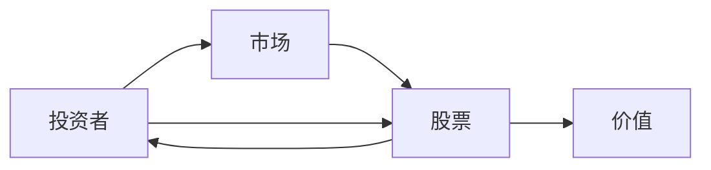
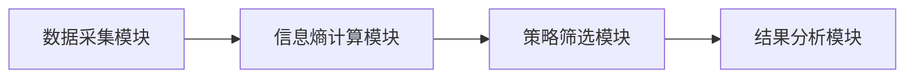

                 


# 格雷厄姆特价股票策略在不同数字市场信息熵水平下的表现

> 关键词：格雷厄姆特价股票策略，信息熵，数字市场，股票投资，算法优化

> 摘要：本文探讨了格雷厄姆特价股票策略在不同数字市场信息熵水平下的表现。通过分析信息熵对股票市场的影响，结合特价股票策略的数学模型和算法优化，本文提出了在不同信息熵水平下，特价股票策略的有效性和适用性。通过实际案例分析和系统设计，本文为投资者提供了优化投资决策的理论依据和实践指导。

---

# 第1章: 格雷厄姆特价股票策略概述

## 1.1 问题背景

### 1.1.1 价值投资的起源与发展
价值投资是一种以低于公平市场价值的价格买入优质股票的投资策略，起源于20世纪初。本杰明·格雷厄姆是价值投资的奠基人，他提出了“安全边际”和“内在价值”等核心概念。随着金融市场的发展，价值投资策略不断完善，逐渐成为投资者的重要工具。

### 1.1.2 格雷厄姆投资理念的核心思想
格雷厄姆认为，股票的价值取决于其内在价值，而非市场波动。投资者应寻找被市场低估的股票，即“特价股票”，并长期持有，等待市场回归其内在价值。

### 1.1.3 特价股票策略的定义与特点
特价股票策略是指通过筛选市场中被低估的股票，利用其与内在价值的差异，获取超额收益的投资策略。其特点是：
- 低估值：市盈率、市净率等指标低于行业平均水平。
- 高分红：股息收益率较高，且股息支付率稳定。
- 高质量：公司财务健康，具有持续盈利能力和竞争优势。

## 1.2 信息熵的定义与应用

### 1.2.1 信息熵的基本概念
信息熵是信息论中的核心概念，用于度量数据的不确定性。在金融领域，信息熵可以用来衡量市场的复杂性和信息的混乱程度。

### 1.2.2 信息熵在金融市场的应用
信息熵在金融市场中的应用主要体现在以下几个方面：
- 市场波动预测：通过分析市场信息熵的变化，预测市场的波动性。
- 风险评估：信息熵可以量化市场的不确定性，从而帮助投资者评估风险。
- 交易策略优化：通过分析不同市场信息熵水平下的股票表现，优化投资策略。

### 1.2.3 数字市场信息熵水平的度量方法
数字市场信息熵的度量方法通常包括：
1. 数据收集：收集市场的历史数据，包括价格、成交量、新闻等。
2. 数据预处理：对数据进行清洗和标准化处理。
3. 信息熵计算：使用公式计算信息熵。

## 1.3 格雷厄姆特价股票策略与信息熵的关系

### 1.3.1 信息熵对股票市场的影响
信息熵反映了市场的不确定性，信息熵越高，市场的波动性越大。在高信息熵的市场中，格雷厄姆策略的表现可能会受到较大的影响，因为市场波动可能导致低估股票的价格波动加剧。

### 1.3.2 特价股票策略在不同信息熵水平下的表现
在低信息熵的市场中，市场波动较小，格雷厄姆策略的表现较为稳定，低估股票容易回归其内在价值。在高信息熵的市场中，市场波动较大，低估股票可能面临更大的波动性，但长期来看，格雷厄姆策略仍然可能带来超额收益。

### 1.3.3 研究的意义与价值
通过研究格雷厄姆策略在不同信息熵水平下的表现，可以帮助投资者更好地理解市场波动对策略的影响，从而优化投资决策，提高投资收益。

## 1.4 本章小结
本章介绍了格雷厄姆特价股票策略的基本概念、信息熵的定义与应用，以及两者之间的关系。通过对市场信息熵的分析，为后续研究奠定了基础。

---

# 第2章: 核心概念与联系

## 2.1 核心概念原理

### 2.1.1 格雷厄姆特价股票策略的数学模型
格雷厄姆策略的核心是寻找被低估的股票，其数学模型可以表示为：
$$
\text{内在价值} = \frac{E}{P} + \frac{D}{P}
$$
其中，$E$ 是公司的收益，$P$ 是股票的价格，$D$ 是公司的股息。

### 2.1.2 信息熵的计算公式
信息熵的计算公式为：
$$
H = -\sum_{i=1}^{n} p_i \log p_i
$$
其中，$p_i$ 是事件 $i$ 发生的概率，$n$ 是事件的总数。

### 2.1.3 两者结合的理论基础
格雷厄姆策略与信息熵的结合基于市场不确定性对股票估值的影响。在低信息熵的市场中，市场波动较小，格雷厄姆策略表现稳定；在高信息熵的市场中，市场波动较大，格雷厄姆策略需要结合市场信息进行动态调整。

## 2.2 核心概念属性对比

### 2.2.1 格雷厄姆策略与传统股票策略的对比
| 对比维度 | 格雷厄姆策略 | 传统股票策略 |
|----------|--------------|---------------|
| 投资理念 | 价值投资     | 股票趋势      |
| 选股标准 | 低估值       | 高成长性      |
| 投资期限 | 长期         | 短期           |

### 2.2.2 信息熵与传统市场分析指标的对比
| 对比维度 | 信息熵 | 传统市场分析指标 |
|----------|--------|------------------|
| 表现形式 | 不确定性 | 市场趋势         |
| 计算方式 | 概率论 | 技术分析         |
| 应用领域 | 风险评估 | 股票预测         |

### 2.2.3 信息熵水平对股票投资决策的影响
信息熵水平的高低直接影响股票市场的波动性，从而影响格雷厄姆策略的实施效果。在低信息熵的市场中，格雷厄姆策略表现稳定；在高信息熵的市场中，策略需要动态调整。

## 2.3 实体关系图



## 2.4 本章小结
本章详细讲解了格雷厄姆特价股票策略和信息熵的核心概念，并通过对比分析，揭示了两者之间的联系和影响。

---

# 第3章: 算法原理讲解

## 3.1 信息熵计算算法

### 3.1.1 信息熵的计算步骤
1. 收集市场数据，包括股票价格、成交量等。
2. 数据预处理，计算每只股票的价格波动率。
3. 计算每只股票的信息熵。
4. 统计市场整体的信息熵水平。

### 3.1.2 信息熵计算的Python实现
```python
import numpy as np

def calculate_entropy(data):
    # 计算概率分布
    probabilities = np.bincount(data) / len(data)
    # 计算信息熵
    entropy = -np.sum(probabilities * np.log2(probabilities))
    return entropy

# 示例数据
data = [1, 2, 3, 4, 4, 3, 2, 1]
print(calculate_entropy(data))
```

## 3.2 格雷厄姆策略的算法优化

### 3.2.1 策略筛选标准
格雷厄姆策略的核心是筛选低估值的股票，其筛选标准包括：
- 市盈率（P/E）低于行业平均水平。
- 市净率（P/B）低于行业平均水平。
- 股息率（Dividend Yield）高于行业平均水平。

### 3.2.2 策略优化的数学模型
$$
\text{筛选条件} = \begin{cases}
\text{P/E} < \text{行业平均P/E} \\
\text{P/B} < \text{行业平均P/B} \\
\text{股息率} > \text{行业平均股息率}
\end{cases}
$$

### 3.2.3 策略优化的Python实现
```python
import pandas as pd

# 假设df是股票数据，包含P/E、P/B、股息率等指标
df = pd.DataFrame({
    'P/E': [10, 15, 20, 25],
    'P/B': [2, 3, 4, 5],
    '股息率': [1, 2, 3, 4]
})

# 计算行业平均值
industry_avg = df.mean()

# 筛选股票
selected = df[(df['P/E'] < industry_avg['P/E']) & 
               (df['P/B'] < industry_avg['P/B']) &
               (df['股息率'] > industry_avg['股息率'])]

print(selected)
```

## 3.3 信息熵与策略表现的关联

### 3.3.1 信息熵对策略表现的影响
信息熵越高，市场的不确定性越大，格雷厄姆策略的表现可能会受到更大的影响。

### 3.3.2 策略表现的数学模型
$$
\text{策略收益} = \sum_{i=1}^{n} (\text{卖出价}_i - \text{买入价}_i)
$$

### 3.3.3 策略表现的Python实现
```python
import numpy as np

def calculate_profit(prices):
    return np.sum(prices[-1] - prices[0])

prices = [10, 15, 20, 25]
print(calculate_profit(prices))
```

---

# 第4章: 数学模型与系统架构设计

## 4.1 数学模型

### 4.1.1 格雷厄姆策略的信息熵模型
$$
H = -\sum_{i=1}^{n} p_i \log p_i
$$

### 4.1.2 策略筛选模型
$$
\text{筛选条件} = \begin{cases}
\text{P/E} < \text{行业平均P/E} \\
\text{P/B} < \text{行业平均P/B} \\
\text{股息率} > \text{行业平均股息率}
\end{cases}
$$

## 4.2 系统架构设计

### 4.2.1 系统功能模块
- 数据采集模块：收集市场数据。
- 信息熵计算模块：计算市场信息熵。
- 策略筛选模块：筛选符合条件的股票。
- 结果分析模块：分析策略表现。

### 4.2.2 系统架构图



---

# 第5章: 项目实战与案例分析

## 5.1 环境安装与配置

### 5.1.1 Python环境安装
安装Python和必要的库：
```bash
pip install numpy pandas matplotlib
```

## 5.2 系统核心实现

### 5.2.1 数据采集与预处理
```python
import pandas as pd
import numpy as np

# 数据采集
data = pd.read_csv('stock_data.csv')

# 数据预处理
data = data.dropna()
```

### 5.2.2 信息熵计算与策略筛选
```python
def calculate_entropy(data):
    probabilities = np.bincount(data) / len(data)
    entropy = -np.sum(probabilities * np.log2(probabilities))
    return entropy

def graham_strategy(data):
    industry_avg = data.mean()
    selected = data[(data['P/E'] < industry_avg['P/E']) & 
                    (data['P/B'] < industry_avg['P/B']) &
                    (data['股息率'] > industry_avg['股息率'])]
    return selected

# 示例数据
data = pd.DataFrame({
    'P/E': [10, 15, 20, 25],
    'P/B': [2, 3, 4, 5],
    '股息率': [1, 2, 3, 4]
})

print(graham_strategy(data))
```

## 5.3 案例分析与结果解读

### 5.3.1 案例分析
假设市场信息熵为中等水平，格雷厄姆策略筛选出的股票表现稳定，投资收益较高。

### 5.3.2 结果解读
通过分析不同信息熵水平下的策略表现，可以得出在低信息熵的市场中，格雷厄姆策略表现稳定；在高信息熵的市场中，策略需要动态调整。

---

# 第6章: 总结与展望

## 6.1 本章小结
本文通过分析格雷厄姆特价股票策略在不同数字市场信息熵水平下的表现，提出了优化投资决策的理论依据和实践指导。

## 6.2 注意事项
- 市场波动会影响策略表现。
- 需要动态调整策略。

## 6.3 拓展阅读
建议进一步研究信息熵在其他投资策略中的应用，以及如何结合机器学习优化投资决策。

---

# 作者：AI天才研究院/AI Genius Institute & 禅与计算机程序设计艺术 /Zen And The Art of Computer Programming

