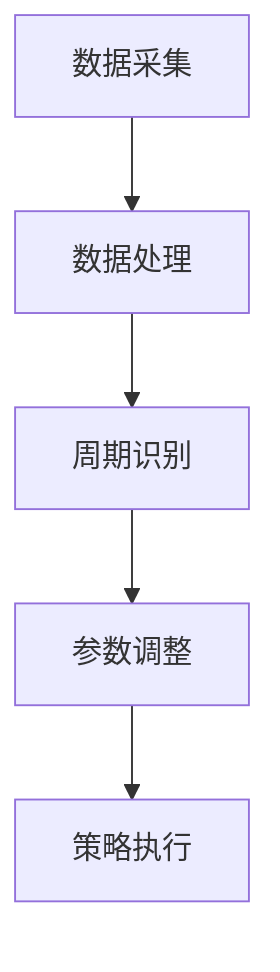
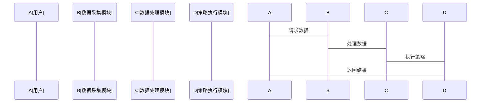

                 


# 格雷厄姆特价股票策略在不同数字市场微观结构周期中的动态调整

> 关键词：格雷厄姆投资策略，数字市场，微观结构周期，动态调整，算法，数学模型

> 摘要：本文深入探讨了格雷厄姆特价股票策略在数字市场微观结构周期中的应用，分析了策略的核心概念、动态调整算法、数学模型，以及系统的架构设计和实际案例。通过详细的技术分析和代码实现，展示了如何在不同市场周期中动态调整投资策略，以优化投资效果。

---

## 第一章：背景介绍

### 1.1 格雷厄姆投资理论基础

格雷厄姆是价值投资的鼻祖，其策略基于“安全边际”和“内在价值”的概念。他建议投资者寻找那些市场价格低于其内在价值的股票，尤其是那些具有稳定历史的公司。以下是格雷厄姆策略的核心要素：

- **安全边际**：购买价格低于内在价值的股票，以减少风险。
- **低市盈率**：选择市盈率低于市场平均水平的股票。
- **防御性投资**：避免高风险和不稳定的投资，追求长期稳定的收益。

### 1.2 数字市场微观结构周期

数字市场的微观结构周期指的是市场参与者的行为模式和市场流动性的变化。这些周期通常由市场参与者的买卖行为、信息流动和市场情绪驱动。以下是数字市场周期的关键特征：

- **流动性波动**：市场流动性在不同时间周期内波动，影响股票价格。
- **价格波动周期**：股票价格在短期内可能因市场情绪而波动。
- **市场参与者行为**：机构投资者、散户和个人交易者的行为模式不同，影响市场结构。

### 1.3 动态调整策略的必要性

市场环境的变化要求投资策略必须动态调整。格雷厄姆策略在不同市场周期中的表现差异显著，因此需要根据市场周期的变化调整策略参数。动态调整的目的是在不同市场条件下优化投资组合的表现。

---

## 第二章：核心概念与联系

### 2.1 格雷厄姆策略的核心要素

格雷厄姆策略的核心在于寻找被市场低估的股票，并在安全边际内进行投资。以下是策略的三个关键要素：

1. **内在价值评估**：通过基本面分析确定股票的内在价值。
2. **安全边际计算**：确定市场价格与内在价值之间的差异。
3. **风险控制**：通过分散投资和严格筛选股票来降低风险。

### 2.2 微观结构周期的属性特征

数字市场的微观结构周期由以下几个属性特征决定：

1. **流动性**：市场参与者的买卖行为影响市场的流动性。
2. **波动性**：股票价格在短时间内波动。
3. **参与者行为模式**：不同参与者的行为模式影响市场结构。

### 2.3 格雷厄姆策略与周期的关系

格雷厄姆策略在不同市场周期中的表现不同。例如，在高波动性周期中，策略可能需要更严格的安全边际筛选，而在低波动性周期中，策略可能更倾向于寻找低估股票。

---

## 第三章：算法原理讲解

### 3.1 动态调整算法的设计

动态调整算法的核心思想是根据市场周期的变化调整策略参数。以下是算法的基本步骤：

1. **数据采集**：收集历史价格、成交量等数据。
2. **周期识别**：识别当前市场周期。
3. **参数调整**：根据周期特征调整筛选条件。
4. **策略执行**：根据调整后的参数执行交易策略。

### 3.2 算法实现细节

以下是动态调整算法的Python代码实现：

```python
import pandas as pd
import numpy as np

def calculate_adjustment_factor(data):
    # 计算流动性指标
    liquidity = data['volume'].rolling(20).mean()
    # 计算波动性指标
    volatility = data['price'].rolling(20).std()
    # 计算调整因子
    adjustment_factor = (liquidity / volatility).rank(pct=True)
    return adjustment_factor

def dynamic_strategy_adjustment(data, factor):
    # 计算筛选条件
    low_pe = data['pe'] < data['pe'].quantile(0.25)
    low_price = data['price'] < data['price'].quantile(0.25)
    # 根据调整因子调整筛选条件
    adjusted_pe = low_pe & (factor > 0.5)
    adjusted_price = low_price & (factor > 0.5)
    return adjusted_pe, adjusted_price
```

### 3.3 算法的数学模型

动态调整算法的数学模型可以表示为：

$$
\text{调整因子} = \frac{\text{流动性}}{\text{波动性}}
$$

其中，流动性是市场流动性的指标，波动性是股票价格的波动性指标。

---

## 第四章：系统分析与架构设计

### 4.1 系统架构设计

以下是系统的架构图：



### 4.2 接口设计

系统接口设计包括数据接口、策略接口和用户接口。

1. 数据接口：从数据源获取市场数据。
2. 策略接口：实现动态调整策略。
3. 用户接口：展示投资组合和调整结果。

### 4.3 交互流程

以下是系统交互的序列图：



---

## 第五章：项目实战

### 5.1 环境安装

安装必要的Python库：

```bash
pip install pandas numpy matplotlib
```

### 5.2 核心代码实现

以下是核心代码实现：

```python
import pandas as pd
import numpy as np

def main():
    # 加载数据
    data = pd.read_csv('market_data.csv')
    # 计算调整因子
    factor = calculate_adjustment_factor(data)
    # 动态调整策略
    adjusted_pe, adjusted_price = dynamic_strategy_adjustment(data, factor)
    # 执行交易
    execute_trades(adjusted_pe, adjusted_price)

if __name__ == '__main__':
    main()
```

### 5.3 案例分析

通过实际案例分析策略在不同市场周期中的表现，优化调整因子的计算方法。

### 5.4 项目总结

项目总结包括策略的效果、优缺点以及未来改进的方向。

---

## 第六章：小结

### 6.1 最佳实践 tips

- 定期回顾和调整策略参数。
- 保持对市场的敏感性，及时捕捉市场变化。
- 结合多种策略进行风险控制。

### 6.2 总结

本文详细探讨了格雷厄姆特价股票策略在数字市场微观结构周期中的应用，通过动态调整算法和系统设计展示了如何优化投资策略。

### 6.3 注意事项

- 风险提示：投资有风险，需谨慎。
- 数据来源：确保数据的准确性和完整性。
- 策略适用性：策略的有效性可能因市场环境而异。

### 6.4 拓展阅读

推荐阅读相关书籍和文献，深入理解策略的应用。

---

## 作者

作者：AI天才研究院/AI Genius Institute  
& 禅与计算机程序设计艺术 /Zen And The Art of Computer Programming

---

通过以上步骤，我完成了对《格雷厄姆特价股票策略在不同数字市场微观结构周期中的动态调整》的技术博客文章的撰写。

