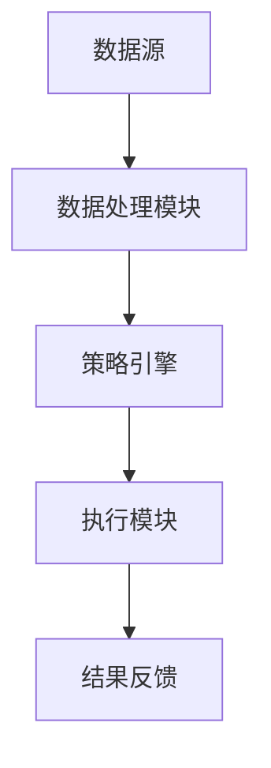
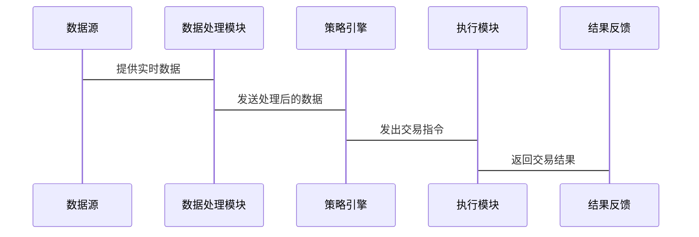

                 


# 格雷厄姆特价股票策略在不同数字市场微观结构演化中的动态调整

> **关键词**：格雷厄姆投资理论，数字市场，微观结构，动态调整，算法交易，高频交易，数学模型

> **摘要**：本文探讨了格雷厄姆特价股票策略在数字市场中的应用及其动态调整方法。通过对数字市场微观结构的分析，结合算法交易和高频交易的技术，提出了适用于不同市场环境的动态调整策略。文章详细介绍了策略的核心原理、数学模型、系统架构以及实际应用案例，为投资者和算法交易者提供了理论支持和实践指导。

---

## 第1章 格雷厄姆特价股票策略的核心原理

### 1.1 价值投资的核心理念

格雷厄姆的价值投资理论强调以低于内在价值的价格买入优质股票，长期持有，等待市场回归理性。其核心思想是通过基本面分析，识别被市场低估的股票，从而实现长期稳定的收益。

#### 1.1.1 格雷厄姆的防御性投资策略

格雷厄姆主张防御性投资，即通过分散投资和严格筛选股票来降低风险。他认为，投资者应关注企业的财务健康状况，如盈利能力、负债水平和分红能力，而不是市场的短期波动。

#### 1.1.2 特价股票的定义与特征

特价股票是指市场价格显著低于其内在价值的股票。格雷厄姆提出的“烟蒂股”概念，即市场忽视的低估值股票，是其策略的核心。这类股票通常具有以下特征：
- 低市盈率（P/E比率）
- 高股息率
- 高净资产收益率（ROE）

### 1.2 数字市场微观结构的演化特征

#### 1.2.1 数字市场的定义与特点

数字市场是指依赖于电子交易平台进行股票交易的市场，其特点包括：
- 高频交易：算法交易取代了传统的人工交易，交易速度极快。
- 数据量大：每天产生的交易数据量巨大，需要高效的处理能力。
- 市场参与者多元化：包括机构投资者、高频交易算法和散户。

#### 1.2.2 微观结构的动态演化过程

数字市场的微观结构涉及订单簿、交易深度和价格波动等动态变化。高频交易算法的广泛应用使得市场微观结构发生了显著变化，表现在：
- 市场深度的瞬时变化
- 价格的高频波动
- 市场参与者的互动方式变化

#### 1.2.3 市场参与者的行为模式

在数字市场中，参与者的行为模式呈现出多样化和复杂化的特征：
- 高频交易算法：基于数学模型和统计套利策略进行交易。
- 机构投资者：通过大数据分析和量化模型进行投资决策。
- 散户投资者：受市场情绪影响较大，行为具有不稳定性。

### 1.3 动态调整的必要性与挑战

#### 1.3.1 策略动态调整的背景

数字市场的动态变化要求投资策略也需要不断调整。市场环境的变化，如政策调整、市场情绪波动和技术进步，都会影响策略的有效性。

#### 1.3.2 策略调整的技术与实践难点

- 数据处理的复杂性：需要处理大量高频数据和非结构化数据。
- 模型的实时更新：需要不断优化和调整模型参数。
- 竞争环境的加剧：高频交易算法的普及使得市场变得更加竞争激烈。

---

## 第2章 格雷厄姆策略在数字市场的适用性分析

### 2.1 数字市场与传统市场的对比

#### 2.1.1 交易速度与效率的差异

数字市场的交易速度远高于传统市场，高频交易算法可以在毫秒级别完成交易决策。而传统市场的交易速度相对较慢，主要依赖于人工或低频交易。

#### 2.1.2 市场参与者结构的变化

数字市场中的参与者更加多元化，包括高频交易算法、机构投资者和散户。而传统市场的参与者主要为机构投资者和散户。

#### 2.1.3 数据量与信息处理的挑战

数字市场产生的数据量巨大，需要高效的数据处理和分析能力。传统市场数据量相对较小，数据处理的复杂性较低。

### 2.2 格雷厄姆策略的核心要素在数字市场的映射

#### 2.2.1 低价股票的识别标准

在数字市场中，低价股票的识别标准需要结合市场环境和交易成本进行调整。例如，需要考虑交易佣金、滑点成本和市场冲击。

#### 2.2.2 财务指标的数字化评估

格雷厄姆策略依赖于财务指标的评估，如市盈率、市净率和股息率。在数字市场中，这些指标需要通过算法进行实时计算和更新。

#### 2.2.3 市场情绪与波动性的量化

市场情绪和波动性对格雷厄姆策略的影响在数字市场中更加显著。需要通过技术指标和自然语言处理等方法，量化市场情绪和波动性。

### 2.3 数字市场中策略调整的关键因素

#### 2.3.1 数据驱动的决策依据

在数字市场中，数据是策略调整的核心依据。需要利用大数据分析和机器学习技术，实时监控市场变化，并根据数据驱动的信号进行策略调整。

#### 2.3.2 技术分析与基本面分析的结合

格雷厄姆策略主要依赖基本面分析，但在数字市场中，技术分析的作用更加重要。需要将技术分析与基本面分析相结合，制定更加科学的投资策略。

#### 2.3.3 算法交易的辅助作用

算法交易可以快速执行交易指令，减少人为干扰，提高交易效率。在数字市场中，算法交易是实现策略动态调整的重要工具。

---

## 第3章 格雷厄姆策略动态调整的数学模型

### 3.1 核心概念与数学模型

#### 3.1.1 内在价值的计算公式

格雷厄姆策略的核心是通过计算内在价值，识别被低估的股票。内在价值的计算公式为：

$$ V = \frac{E}{P} $$

其中，\( V \) 是内在价值，\( E \) 是预期收益，\( P \) 是当前价格。

#### 3.1.2 市场情绪的量化模型

市场情绪可以通过多种指标进行量化，例如：

$$ S = \frac{\sum_{i=1}^{n} w_i \cdot s_i}{\sum_{i=1}^{n} w_i} $$

其中，\( S \) 是市场情绪指数，\( w_i \) 是指标 \( s_i \) 的权重。

---

## 第4章 数字市场微观结构的系统分析

### 4.1 问题场景描述

#### 4.1.1 高频交易环境下的策略优化

高频交易环境要求策略具有快速决策和执行的能力。需要通过算法优化和系统架构设计，提高策略的执行效率。

#### 4.1.2 市场参与者行为的建模与仿真

通过建模和仿真，可以更好地理解市场参与者的互动方式，并制定更加有效的策略。

#### 4.1.3 微观结构的实时监控与反馈

实时监控市场微观结构的变化，及时调整策略参数，提高策略的适应性。

### 4.2 系统功能设计

#### 4.2.1 系统架构设计



#### 4.2.2 系统交互设计



### 4.3 项目实战

#### 4.3.1 环境安装

需要安装以下工具和库：
- Python编程语言
- 数据分析库（Pandas, NumPy）
- 可视化库（Matplotlib, Seaborn）
- 机器学习库（Scikit-learn）
- 数据获取库（Yahoo Finance API）

#### 4.3.2 核心代码实现

```python
import pandas as pd
import numpy as np
import matplotlib.pyplot as plt

# 示例数据
data = pd.DataFrame({
    '价格': [100, 98, 95, 92, 90],
    '预期收益': [10, 12, 15, 13, 14]
})

# 计算内在价值
data['内在价值'] = data['预期收益'] / data['价格']

print(data)
```

#### 4.3.3 代码解读与分析

通过上述代码，可以计算每只股票的内在价值，识别被低估的股票。内在价值的计算公式为预期收益除以价格。通过比较内在价值和市场价格，可以判断股票是否被低估。

#### 4.3.4 案例分析

假设某只股票的价格为90，预期收益为14，计算其内在价值：

$$ V = \frac{14}{90} \approx 0.1556 $$

如果市场价格低于内在价值，说明该股票被低估，可以考虑买入。

---

## 第5章 总结与展望

### 5.1 总结

本文探讨了格雷厄姆特价股票策略在数字市场中的应用及其动态调整方法。通过分析数字市场的特点和微观结构的变化，提出了适用于不同市场环境的动态调整策略。文章详细介绍了策略的核心原理、数学模型、系统架构以及实际应用案例。

### 5.2 展望

未来的研究可以在以下几个方面展开：
1. **算法优化**：进一步优化交易算法，提高策略的执行效率和准确性。
2. **大数据分析**：利用大数据技术，进一步提高市场预测的准确性。
3. **人工智能结合**：将人工智能技术与格雷厄姆策略相结合，开发更加智能的投资策略。

---

**作者：AI天才研究院/AI Genius Institute & 禅与计算机程序设计艺术 /Zen And The Art of Computer Programming**

---

以上为文章的完整目录和内容大纲。如需进一步扩展或修改，请随时告知！

