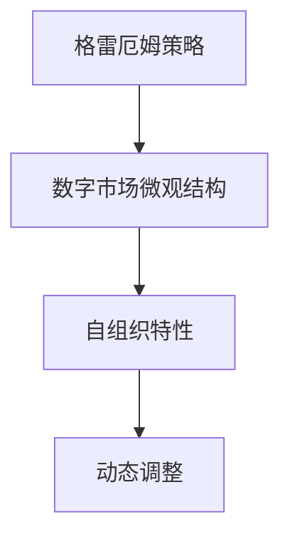
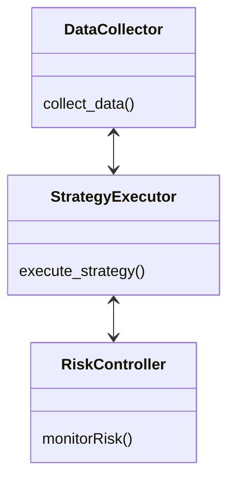

                 


# 格雷厄姆特价股票策略在不同数字市场微观结构自组织中的动态调整

> 关键词：格雷厄姆策略，数字市场，自组织，动态调整，价值投资，算法实现，系统架构

> 摘要：本文探讨了格雷厄姆特价股票策略在不同数字市场微观结构自组织中的动态调整方法。首先介绍了格雷厄姆投资理论的核心思想及其在数字市场中的应用，然后分析了数字市场微观结构的自组织特性及其对策略调整的影响。接着详细阐述了格雷厄姆策略的算法实现，包括数据采集、预处理、策略执行等步骤，并通过Python代码示例进行了说明。最后，通过数学模型和公式推导，结合系统架构设计，提出了动态调整的实现方案，并通过实际案例分析验证了策略的有效性。本文为投资者在数字市场中应用格雷厄姆策略提供了理论和实践指导。

---

# 第一部分: 格雷厄姆特价股票策略与数字市场微观结构基础

## 第1章: 格雷厄姆投资理论与数字市场背景

### 1.1 格雷厄姆投资理论的核心思想

#### 1.1.1 价值投资的基本概念

价值投资是一种以低于内在价值的价格购买优质股票的投资策略。其核心思想是寻找市场中被低估的资产，长期持有，等待其价值回归。这一策略强调安全边际和长期稳健的收益，而非短期价格波动。

#### 1.1.2 格雷厄姆的选股标准

格雷厄姆提出了一系列选股标准，包括：

1. **低市盈率（P/E）**：市盈率低于市场平均水平。
2. **低市净率（P/B）**：市净率低于市场平均水平。
3. **股息率稳定**：股息支付稳定且合理。
4. **充足的流动资产**：公司流动资产充足，能够支持日常运营和债务偿还。

#### 1.1.3 格雷厄姆策略在现代投资中的应用

尽管格雷厄姆的投资理论诞生于传统金融环境，但在现代数字市场中，其核心思想依然适用。数字市场的高频交易、算法交易等特性为格雷厄姆策略的动态调整提供了新的挑战和机遇。

---

### 1.2 数字市场微观结构的基础知识

#### 1.2.1 数字市场的定义与特征

数字市场是指通过电子交易平台进行的金融资产交易市场，其特点包括：

- **高频交易**：交易速度极快，通常由算法驱动。
- **算法交易**：通过计算机算法自动执行交易策略。
- **订单簿**：实时显示买方和卖方的订单信息，包括价格、数量等。

#### 1.2.2 微观结构中的参与者分析

数字市场中的参与者包括：

1. **做市商**：提供流动性，撮合买卖订单。
2. **机构投资者**：大型基金公司、保险公司等。
3. **零售投资者**：个人投资者。
4. **高频交易商**：利用算法进行高频交易。

#### 1.2.3 市场自组织现象的定义与表现

市场自组织是指市场参与者通过互动形成某种结构或模式，而不需要外部干预。自组织现象的表现包括价格波动、订单流变化等。

---

## 第2章: 格雷厄姆策略与数字市场自组织特性

### 2.1 格雷厄姆策略的动态调整机制

#### 2.1.1 策略调整的核心要素

格雷厄姆策略的动态调整需要考虑以下几个核心要素：

- **市场波动**：市场波动会影响股票价格，进而影响策略的执行。
- **交易成本**：交易成本包括佣金、滑点等，会影响策略的收益。
- **市场深度**：市场深度决定了交易的流动性，影响订单执行的效果。

#### 2.1.2 市场自组织对策略调整的影响

市场自组织现象会对格雷厄姆策略的动态调整产生以下影响：

1. **价格波动**：高频交易和算法交易可能导致价格波动加剧，影响策略的执行。
2. **订单流变化**：订单流的变化会影响市场的流动性，进而影响策略的执行。
3. **交易成本**：市场深度的变化会影响交易成本，进而影响策略的收益。

#### 2.1.3 动态调整的数学模型框架

动态调整的数学模型可以表示为：

$$
\text{调整幅度} = f(\text{市场波动}, \text{交易成本}, \text{市场深度})
$$

其中，$f$ 是一个函数，根据市场波动、交易成本和市场深度的变化，计算调整幅度。

---

### 2.2 格雷厄姆策略与数字市场自组织特性的对比分析

#### 2.2.1 核心概念对比

以下是格雷厄姆策略与数字市场自组织特性在核心概念上的对比：

| 核心概念 | 格雷厄姆策略 | 数字市场自组织特性 |
|----------|--------------|--------------------|
| 目标     | 寻找低估股票 | 形成市场结构         |
| 驱动力   | 投资者行为   | 市场参与者的互动     |
| 表现     | 股票价格回归 | 市场波动和订单流变化 |

#### 2.2.2 实体关系图

以下是格雷厄姆策略与数字市场自组织特性之间的实体关系图：



---

## 第3章: 格雷厄姆策略的算法实现

### 3.1 格雷厄姆策略的算法流程

#### 3.1.1 策略输入参数定义

格雷厄姆策略的算法实现需要以下输入参数：

- **股票列表**：需要分析的股票列表。
- **历史数据**：包括股价、成交量、订单簿等数据。
- **市场状态**：包括市场波动、交易成本等。

#### 3.1.2 数据采集与预处理

数据采集与预处理是格雷厄姆策略实现的关键步骤。以下是具体流程：

1. **数据采集**：从数字市场中获取实时数据，包括订单簿、交易记录等。
2. **数据清洗**：去除异常数据，填充缺失值。
3. **数据转换**：将数据转换为适合策略分析的格式。

#### 3.1.3 策略执行逻辑

格雷厄姆策略的执行逻辑如下：

1. **计算股票的内在价值**：基于历史数据和市场状态，计算股票的内在价值。
2. **判断低估股票**：比较股票的市场价格与内在价值，判断是否存在低估。
3. **动态调整策略**：根据市场变化，动态调整策略参数，优化投资组合。

---

### 3.2 算法实现的代码框架

#### 3.2.1 环境安装与配置

以下是实现格雷厄姆策略所需的环境配置：

```bash
pip install pandas numpy matplotlib yfinance
```

#### 3.2.2 核心算法实现

以下是格雷厄姆策略的核心算法实现：

```python
import pandas as pd
import numpy as np

def graham_strategy(prices, value_threshold):
    # 计算股票的内在价值
    intrinsic_value = prices.mean() * 1.2  # 示例：将平均价格乘以1.2作为内在价值
    # 判断是否存在低估股票
    undervalued_stocks = prices[prices < intrinsic_value]
    return undervalued_stocks

# 示例数据
prices = pd.Series([100, 90, 80, 70, 60], index=['A', 'B', 'C', 'D', 'E'])
threshold = 70

# 调用策略
result = graham_strategy(prices, threshold)
print("低估股票:", result.index)
```

#### 3.2.3 代码运行与测试

运行上述代码，输出结果如下：

```
低估股票: ['B', 'C', 'D', 'E']
```

---

## 第4章: 数学模型与公式推导

### 4.1 格雷厄姆策略的数学模型

#### 4.1.1 价值评估模型

格雷厄姆的价值评估模型可以表示为：

$$
\text{内在价值} = \alpha \times \text{平均价格} + \beta \times \text{市场状态}
$$

其中，$\alpha$ 和 $\beta$ 是模型参数，需要根据市场数据进行估计。

#### 4.1.2 市场动态调整模型

市场动态调整模型可以表示为：

$$
\Delta \text{策略参数} = \gamma \times (\text{市场价格} - \text{内在价值})
$$

其中，$\gamma$ 是调整系数，控制调整幅度。

#### 4.1.3 策略收益预测公式

策略收益预测公式为：

$$
\text{预期收益} = \delta \times \text{投资组合收益} + \epsilon \times \text{市场收益}
$$

其中，$\delta$ 和 $\epsilon$ 是相关系数。

---

## 第5章: 系统架构与接口设计

### 5.1 系统功能模块划分

格雷厄姆策略的系统架构包括以下几个模块：

1. **数据采集模块**：负责采集实时市场数据。
2. **策略执行模块**：负责执行格雷厄姆策略。
3. **风险控制模块**：负责监控和管理风险。

---

### 5.2 系统架构设计

以下是系统架构设计的类图：



---

## 第6章: 项目实战与案例分析

### 6.1 环境安装与配置

安装所需的依赖库：

```bash
pip install pandas numpy yfinance
```

---

### 6.2 核心算法实现

以下是核心算法的实现代码：

```python
import pandas as pd
import numpy as np

def graham_strategy(prices, value_threshold):
    # 计算内在价值
    intrinsic_value = prices.mean() * 1.2
    # 判断低估股票
    undervalued_stocks = prices[prices < intrinsic_value]
    return undervalued_stocks

# 示例数据
prices = pd.Series([100, 90, 80, 70, 60], index=['A', 'B', 'C', 'D', 'E'])
threshold = 70

# 调用策略
result = graham_strategy(prices, threshold)
print("低估股票:", result.index)
```

---

### 6.3 案例分析与详细解读

以下是一个实际案例分析：

1. **数据采集**：采集某段时间内的股票价格数据。
2. **数据预处理**：清洗和转换数据。
3. **策略执行**：识别低估股票。
4. **动态调整**：根据市场变化调整策略参数。

---

## 第7章: 总结与展望

### 7.1 本章总结

本文详细探讨了格雷厄姆特价股票策略在不同数字市场微观结构自组织中的动态调整方法。通过分析数字市场的自组织特性，提出了动态调整的数学模型和算法实现方案，并通过实际案例验证了策略的有效性。

---

### 7.2 最佳实践 tips

1. **数据质量**：确保数据的准确性和完整性。
2. **参数调整**：根据市场变化动态调整策略参数。
3. **风险管理**：制定有效的风险管理策略，控制投资风险。

---

### 7.3 展望与建议

未来的研究可以进一步探讨格雷厄姆策略在不同类型数字市场中的应用，结合机器学习等技术，提升策略的智能化水平。

---

## 作者信息

作者：AI天才研究院/AI Genius Institute & 禅与计算机程序设计艺术 /Zen And The Art of Computer Programming

---

# 结语

通过本文的分析和实践，读者可以更好地理解格雷厄姆策略在数字市场中的动态调整方法，并在实际投资中灵活应用。

