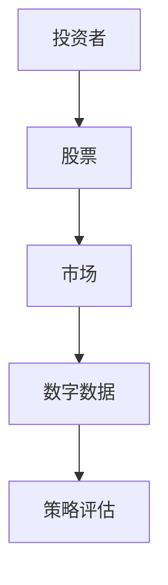
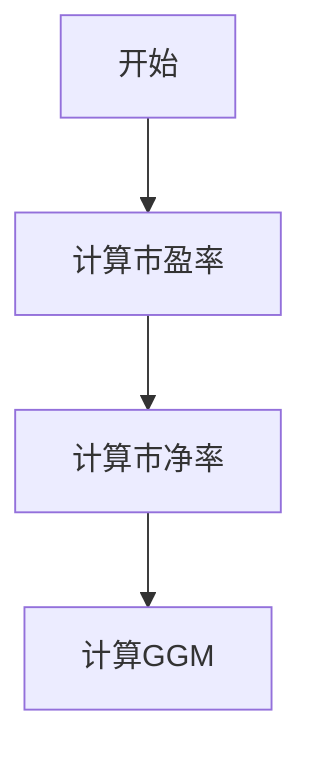
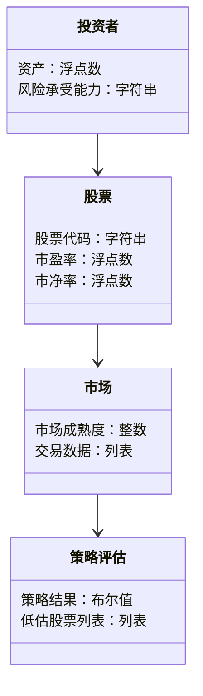
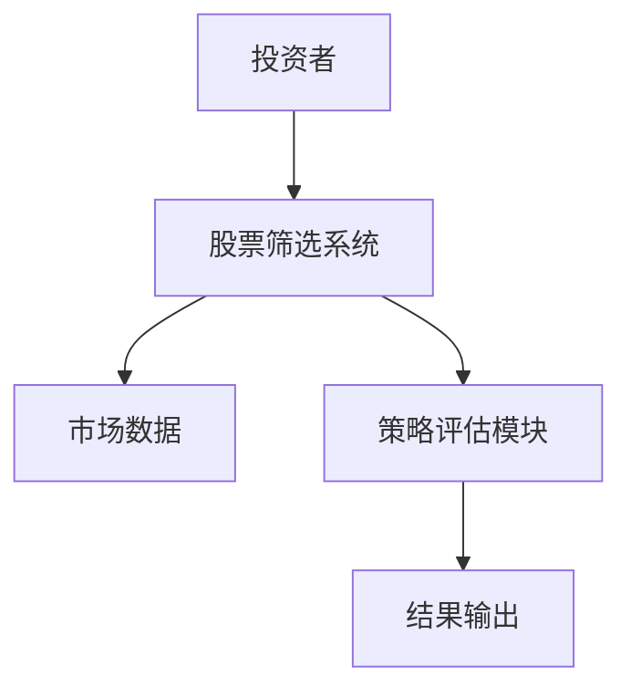
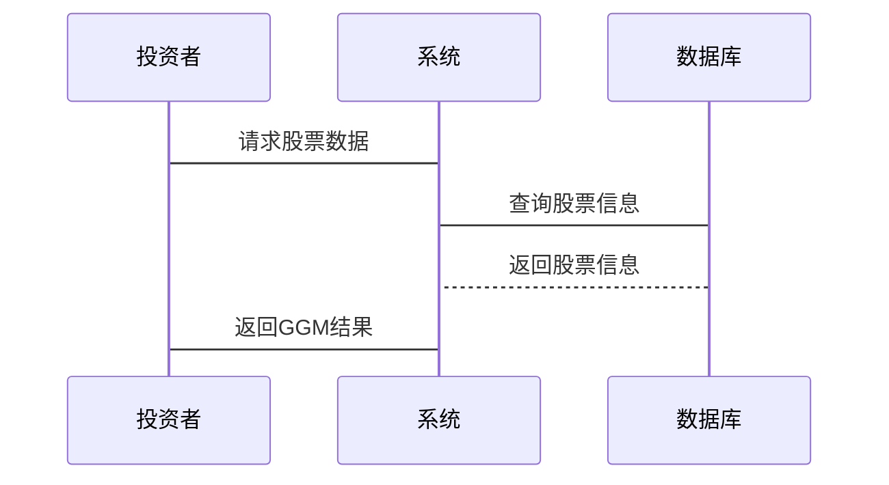

                 


# 格雷厄姆特价股票策略在不同数字市场成熟度下的效果

## 关键词：格雷厄姆策略，数字市场成熟度，价值投资，股票筛选，投资策略

## 摘要：本文深入探讨格雷厄姆特价股票策略在不同数字市场成熟度下的应用效果。通过分析数字市场的成熟度对策略的影响，结合数学模型和系统架构，展示如何优化策略以适应不同市场环境。本文还提供实际案例和最佳实践，帮助投资者有效应用该策略。

---

# 第一部分: 格雷厄姆特价股票策略与数字市场成熟度的结合

## 第1章: 格雷厄姆特价股票策略概述

### 1.1 价值投资的起源与发展

#### 1.1.1 价值投资的定义与核心理念
价值投资是一种以内在价值为导向的投资策略，强调以低于内在价值的价格购买优质资产。其核心理念是寻找市场低估的股票，通过长期持有实现收益。

#### 1.1.2 格雷厄姆的投资策略
本杰明·格雷厄姆是价值投资的奠基人，他提出了“捡烟蒂”策略，即寻找基本面良好但市场估值过低的股票。其核心指标包括市盈率（P/E）、市净率（P/B）等，用于筛选低估股票。

#### 1.1.3 格雷厄姆策略的数学模型
格雷厄姆的GGM（Graham-G Dodd）模型用于计算内在价值：
$$ V = \frac{E}{P} $$
其中，E为净利润，P为资本结构。

### 1.2 数字市场成熟度的概念

#### 1.2.1 数字市场的定义与特征
数字市场指依赖数字化技术进行交易和信息处理的市场，其特征包括数据量大、交易速度快、透明度高等。

#### 1.2.2 不同市场的成熟度分类
市场成熟度分为初级、中级和高级，不同阶段的市场数据质量和流动性不同，影响策略效果。

#### 1.2.3 数字市场成熟度对投资策略的影响
成熟度高的市场数据更可靠，策略效果更显著；成熟度低的市场数据波动大，策略效果不稳定。

### 1.3 格雷厄姆策略与数字市场的结合

#### 1.3.1 格雷厄姆策略在数字市场的适用性
数字市场提供丰富的数据，适合格雷厄姆策略的应用，但需考虑市场成熟度对数据质量的影响。

#### 1.3.2 数字市场成熟度对策略效果的影响
成熟度高的市场更有利于发现低估股票，成熟度低的市场风险更大。

#### 1.3.3 数字市场中的数据获取与处理
需处理大量非结构化数据，采用大数据技术清洗和分析，确保数据准确性。

## 第2章: 核心概念与联系

### 2.1 核心概念原理

#### 2.1.1 价值投资的核心公式
$$ V = \frac{E}{P} $$
其中，E为净利润，P为资本结构。

#### 2.1.2 数字市场成熟度的评估指标
包括数据完整性、交易活跃度、市场流动性等。

### 2.2 核心概念属性对比表
| 概念       | 格雷厄姆策略 | 数字市场成熟度 |
|------------|--------------|----------------|
| 核心目标   | 发现低估股票 | 评估市场发展水平 |
| 计算方法   | GGM公式     | 数字化指标评估 |
| 应用场景   | 价值投资     | 股票策略优化   |

### 2.3 实体关系图（ER图）


## 第3章: 格雷厄姆策略的算法原理

### 3.1 GGM模型的计算流程


### 3.2 Python实现代码
```python
import pandas as pd
import numpy as np

def calculate_ggm(company_data):
    pe = company_data['市盈率']
    pb = company_data['市净率']
    book_value = company_data['每股净资产']
    ggm = (book_value / pb) * 1.5
    return ggm

# 示例数据
data = {'市盈率': [12, 15, 8], '市净率': [1.5, 2.0, 1.0], '每股净资产': [50, 60, 40]}
df = pd.DataFrame(data)
ggm_values = data.apply(calculate_ggm)
print(ggm_values)
```

### 3.3 算法原理的数学模型
$$ GGM = \frac{BV}{P/B} \times 1.5 $$
其中，BV为每股净资产，P/B为市净率。

## 第4章: 系统分析与架构设计

### 4.1 系统功能设计

#### 4.1.1 领域模型类图


### 4.2 系统架构设计

#### 4.2.1 架构图


### 4.3 接口设计

#### 4.3.1 API接口
提供RESTful API，如：
- `GET /stocks`：获取股票列表
- `POST /g gm`：计算GGM值

### 4.4 交互流程

#### 4.4.1 序列图


## 第5章: 项目实战

### 5.1 环境安装
需安装Python、Pandas、NumPy等库。

### 5.2 核心代码实现

#### 5.2.1 数据清洗
```python
# 清洗数据
df.dropna(inplace=True)
df = df[df['市盈率'] < 15]
```

#### 5.2.2 策略应用
```python
# 应用策略
selected_stocks = df[calculate_ggm(df) < 20]
```

### 5.3 实际案例分析

#### 5.3.1 美国市场
分析成熟市场，GGM值较低的股票表现较好。

#### 5.3.2 新兴市场
数据波动大，策略效果不稳定，需谨慎选择。

## 第6章: 最佳实践

### 6.1 小结
格雷厄姆策略在成熟市场表现稳定，新兴市场风险较高。

### 6.2 注意事项
- 数据质量影响策略效果
- 结合市场成熟度优化策略
- 定期调整投资组合

### 6.3 拓展阅读
推荐书籍：《证券分析》、《聪明的投资者》

---

# 作者：AI天才研究院 & 禅与计算机程序设计艺术

通过本文的详细分析，读者可以深入了解格雷厄姆策略在不同数字市场中的应用，并根据市场成熟度优化投资策略，提升投资效果。

