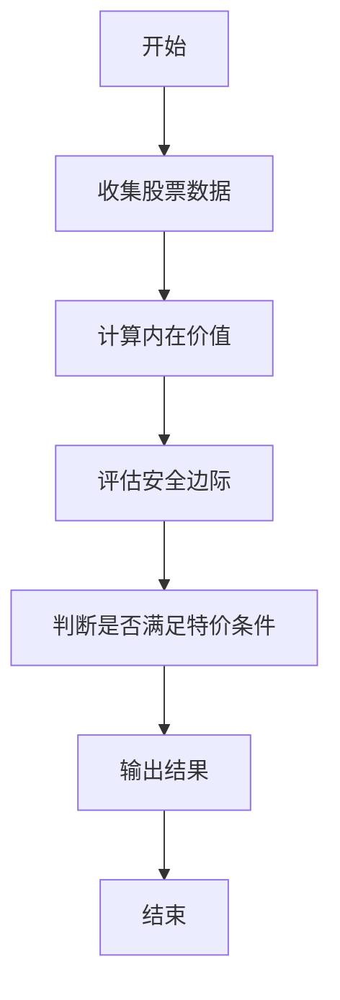
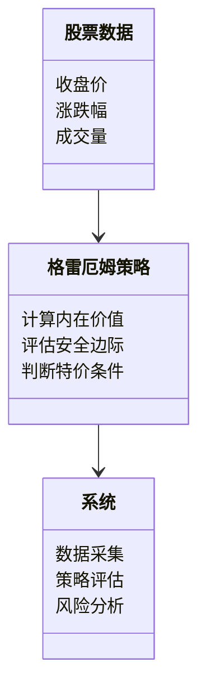
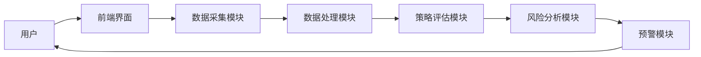

                 


# 格雷厄姆特价股票策略在不同数字监管沙盒环境中的表现

## 关键词：格雷厄姆策略，数字监管沙盒，股票估值，价值投资，安全边际

## 摘要

本文探讨了格雷厄姆特价股票策略在不同数字监管沙盒环境中的表现。首先，介绍了格雷厄姆策略的核心概念，包括内在价值、安全边际等。然后，分析了数字监管沙盒对策略实施的影响，包括数据获取、算法优化和监管合规性。接着，通过数学模型和算法流程图详细解释了策略的实现过程，并结合实际案例展示了策略在不同监管环境下的表现。最后，总结了策略在数字环境中的适应性及优化方向。

---

# 第1章: 格雷厄姆特价股票策略的背景与核心概念

## 1.1 格雷厄姆特价股票策略的背景

### 1.1.1 价值投资的起源与发展

价值投资是一种长期投资策略，起源于20世纪初。本杰明·格雷厄姆是该领域的先驱，他提出的“廉价购买”理念奠定了现代价值投资的基础。格雷厄姆认为，市场先生的情绪波动为理性投资者提供了低价买入优质资产的机会。随着数字化技术的发展，价值投资策略逐渐从手动分析转向基于算法的自动化分析。

### 1.1.2 特价股票的定义与特征

特价股票指的是市场价格低于其内在价值的股票。其核心特征包括：

- **低估性**：市场价格低于内在价值。
- **安全性**：具有较高的安全边际，即内在价值与市场价格之间的差距较大。
- **稳定性**：公司财务状况稳健，具有持续的盈利能力。

### 1.1.3 数字监管沙盒环境的现状

数字监管沙盒是一种模拟真实金融市场的数字化环境，允许投资者在受控的环境中测试和优化投资策略。与传统金融市场相比，数字监管沙盒具有以下特点：

- **低风险**：投资者可以在模拟环境中测试策略，避免实际损失。
- **高透明度**：所有交易数据和市场行为均可实时监控。
- **可定制性**：用户可以根据需求调整市场参数，如波动率、交易成本等。

## 1.2 格雷厄姆策略的核心概念

### 1.2.1 内在价值的计算方法

内在价值是格雷厄姆策略的核心概念，它反映了公司未来现金流的现值。计算内在价值的公式如下：

$$ V = \frac{C}{r} $$

其中，\( C \) 是公司未来产生的自由现金流，\( r \) 是折现率。

### 1.2.2 安全边际的定义与作用

安全边际是市场价格与内在价值之间的差额，用于降低投资风险。公式如下：

$$ \text{安全边际} = V - P $$

其中，\( V \) 是内在价值，\( P \) 是市场价格。安全边际越大，投资风险越小。

### 1.2.3 稀有低价股票的识别标准

格雷厄姆策略强调寻找具有以下特征的股票：

- **低市盈率**：市盈率低于市场平均水平。
- **低市净率**：市净率低于市场平均水平。
- **高股息率**：股息率高于市场平均水平。

---

# 第2章: 格雷厄姆策略与数字监管沙盒的关系

## 2.1 格雷厄姆策略在数字环境中的适用性

### 2.1.1 数字化对股票估值的影响

数字化技术的应用使得股票估值更加精确。通过大数据分析和机器学习算法，投资者可以更准确地预测公司未来现金流。

### 2.1.2 数字化对交易成本的影响

数字监管沙盒环境下，交易成本大幅降低。投资者可以通过在线交易平台以更低的手续费进行交易。

### 2.1.3 数字化对市场信息透明度的影响

数字化技术提高了市场信息的透明度，投资者可以更快速地获取市场数据，从而做出更明智的投资决策。

## 2.2 数字监管沙盒对格雷厄姆策略的影响

### 2.2.1 监管政策对股票估值的影响

数字监管沙盒环境下，监管政策的变化可能影响股票估值。例如，新的监管规则可能导致某些行业股票价值下降。

### 2.2.2 数字化监管对交易策略的影响

数字化监管要求投资者遵守更多的交易规则，例如限制高频交易和算法交易。这可能影响格雷厄姆策略的实施效果。

### 2.2.3 数字化监管环境下的策略调整

为了适应数字化监管环境，投资者需要动态调整策略参数。例如，根据市场波动率调整安全边际要求。

---

# 第3章: 格雷厄姆策略的数学模型与算法原理

## 3.1 内在价值计算的数学模型

### 3.1.1 现金流折现法的公式

$$ V = \sum_{t=1}^{n} \frac{CF_t}{(1 + r)^t} $$

其中，\( CF_t \) 是第 \( t \) 年的自由现金流，\( r \) 是折现率，\( n \) 是预测年数。

### 3.1.2 格雷厄姆安全边际的计算公式

$$ \text{安全边际} = V - P $$

其中，\( V \) 是内在价值，\( P \) 是市场价格。

## 3.2 算法流程图



## 3.3 算法实现代码

```python
def calculate_intrinsic_value(cash_flows, discount_rate):
    return sum(cash_flow / (1 + discount_rate) ** t for t, cash_flow in enumerate(cash_flows))

def calculate_margin_of_safety(intrinsic_value, market_price):
    return intrinsic_value - market_price

# 示例数据
cash_flows = [100, 120, 150]
discount_rate = 0.1

intrinsic_value = calculate_intrinsic_value(cash_flows, discount_rate)
market_price = 100
margin_of_safety = calculate_margin_of_safety(intrinsic_value, market_price)

print(f"内在价值: {intrinsic_value}")
print(f"市场价格: {market_price}")
print(f"安全边际: {margin_of_safety}")
```

---

# 第4章: 系统分析与架构设计

## 4.1 问题场景介绍

在数字监管沙盒环境下，投资者需要实时监控市场数据，并根据市场变化动态调整策略参数。系统需要具备以下功能：

- 数据采集：实时采集市场数据。
- 策略评估：根据市场数据评估股票是否满足特价条件。
- 风险分析：评估投资风险并生成预警信息。

## 4.2 系统功能设计

### 4.2.1 领域模型



### 4.2.2 系统架构设计



## 4.3 系统接口设计

系统接口包括：

- 数据接口：与数据源对接，获取实时市场数据。
- 用户接口：提供策略参数设置和结果展示功能。

---

# 第5章: 项目实战

## 5.1 环境安装

安装所需的库：

```bash
pip install pandas numpy matplotlib
```

## 5.2 核心代码实现

```python
import pandas as pd
import numpy as np

def calculate_intrinsic_value(cash_flows, discount_rate):
    return np.npv(discount_rate, cash_flows)

def calculate_margin_of_safety(intrinsic_value, market_price):
    return intrinsic_value - market_price

# 示例数据
data = {
    '公司': ['A', 'B', 'C'],
    '现金流': [[100, 120, 150], [80, 90, 100], [120, 130, 140]],
    '折现率': [0.1, 0.1, 0.1],
    '市场价格': [100, 90, 110]
}

df = pd.DataFrame(data)

# 计算内在价值和安全边际
df['内在价值'] = df.apply(lambda x: calculate_intrinsic_value(x['现金流'], x['折现率']), axis=1)
df['安全边际'] = df.apply(lambda x: calculate_margin_of_safety(x['内在价值'], x['市场价格']), axis=1)

print(df)
```

---

# 第6章: 最佳实践与总结

## 6.1 最佳实践

- **动态调整策略参数**：根据市场变化及时调整策略参数。
- **结合其他指标**：将格雷厄姆策略与其他技术指标结合使用，提高投资效果。
- **持续学习**：关注市场变化和监管政策，不断优化投资策略。

## 6.2 小结

格雷厄姆特价股票策略在数字监管沙盒环境中表现良好。通过数学模型和算法优化，投资者可以更准确地识别特价股票，并在模拟环境中测试和优化策略。然而，数字化监管环境也带来了新的挑战，投资者需要动态调整策略以适应市场变化。

## 6.3 注意事项

- **风险控制**：投资者需注意市场波动和监管政策变化带来的风险。
- **数据质量**：确保数据源的准确性和及时性。
- **技术实现**：代码实现需注意计算精度和效率问题。

## 6.4 拓展阅读

- 格雷厄姆的《 Intelligent Investor》
- 《算法交易：量化投资入门》
- 相关学术论文：《数字监管沙盒与投资策略优化》

---

作者：AI天才研究院/AI Genius Institute & 禅与计算机程序设计艺术/Zen And The Art of Computer Programming

--- 

希望这篇文章能满足您的需求！如果需要进一步调整或补充，请随时告知。

