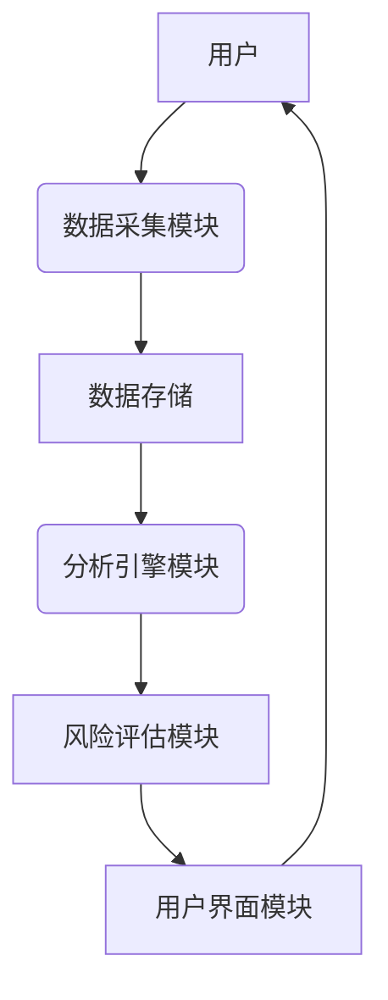
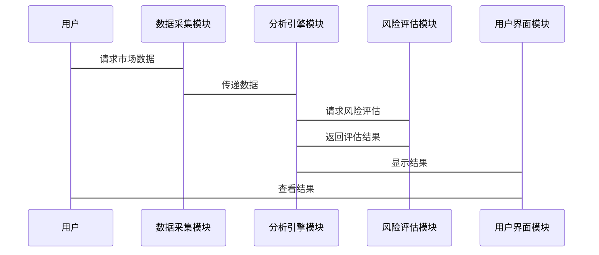

                 


```markdown
# 格雷厄姆特价股票策略在不同数字监管科技环境中的表现

> 关键词：格雷厄姆策略、数字监管科技、股票投资、算法实现、系统架构

> 摘要：本文深入探讨了格雷厄姆特价股票策略在不同数字监管科技环境中的表现。通过分析数字监管科技的核心概念、算法实现和系统架构，本文展示了如何将格雷厄姆策略与现代技术相结合，以优化投资决策。文章还通过具体案例分析，验证了该策略在不同监管环境下的实际应用效果，并提出了相应的优化建议。

---

## 第1章 格雷厄姆特价股票策略的核心原理

### 1.1 格雷厄姆投资理论的起源与发展

格雷厄姆特价股票策略由本杰明·格雷厄姆提出，是价值投资的基石。该策略强调购买低于其内在价值的股票，以获得长期稳定的收益。以下是其核心原理的详细分析：

- **起源与背景**：20世纪初，传统投资理论侧重于市场波动和技术分析，但未能提供长期稳定的回报。格雷厄姆通过分析市场泡沫和恐慌，提出了价值投资的概念。

- **核心思想**：格雷厄姆认为，股票的内在价值是其未来现金流的现值，应低于当前市场价格。投资者应寻找那些被市场低估的股票，长期持有以获得超额收益。

- **现代应用**：尽管提出已久，格雷厄姆策略在当今市场仍具有重要价值，尤其是在数字监管科技的环境下，技术手段为其提供了新的实现方式。

### 1.2 格雷厄姆策略的核心思想

- **安全边际**：格雷厄姆强调安全边际的重要性，即买入价格与内在价值之间的差距，以降低投资风险。

- **长期视角**：策略建议投资者关注长期收益，而非短期市场波动，从而避免情绪化决策。

- **分散投资**：通过分散投资于多个低估股票，降低单一投资的风险。

### 1.3 格雷厄姆策略与现代技术的结合

- **数据分析**：利用大数据技术，快速筛选出符合条件的股票，提高投资效率。

- **算法优化**：通过机器学习算法，优化内在价值计算模型，提高预测精度。

---

## 第2章 数字监管科技的定义与特点

### 2.1 数字监管科技的定义

数字监管科技（RegTech）是指利用先进的数字技术，如人工智能、区块链和大数据分析，来优化金融监管流程。它涵盖了从合规性检查到风险评估的各个方面。

### 2.2 数字监管科技的核心技术

- **人工智能（AI）**：用于预测市场趋势和识别异常交易。
- **区块链**：提供透明的交易记录，确保数据不可篡改。
- **大数据分析**：处理海量数据，提取有价值的信息。

### 2.3 数字监管科技的特点

- **高效性**：自动化处理流程，提高监管效率。
- **准确性**：利用先进技术，减少人为错误。
- **创新性**：引入新技术，推动监管方式的变革。

---

## 第3章 格雷厄姆策略在数字监管环境中的应用

### 3.1 格雷厄姆策略在数字监管环境中的适用性

- **技术优势**：数字监管科技提供了强大的数据分析能力，使格雷厄姆策略的实施更加高效。

- **数据丰富性**：现代技术能够获取更多的市场数据，为内在价值计算提供更全面的信息。

### 3.2 数字监管科技对格雷厄姆策略的影响

- **优化筛选过程**：通过算法快速筛选出符合条件的股票，节省时间和成本。
- **提高预测准确性**：利用机器学习模型，改进内在价值的估算方法。
- **降低风险**：通过实时监控，及时发现潜在风险，调整投资组合。

---

## 第4章 数字监管环境对格雷厄姆策略的影响

### 4.1 数字监管环境的分类

- **传统监管环境**：基于规则的监管，依赖人工审查。
- **半自动化监管环境**：部分流程自动化，但仍需人工干预。
- **完全自动化监管环境**：所有流程自动化，依赖AI和大数据技术。

### 4.2 不同数字监管环境对格雷厄姆策略的影响

- **传统环境**：效率较低，但策略仍适用。
- **半自动化环境**：提高了筛选速度，但部分环节仍需人工判断。
- **完全自动化环境**：实现全自动化，策略的实施更加精准和高效。

---

## 第5章 格雷厄姆策略的数学模型与算法实现

### 5.1 格雷厄姆策略的核心公式

内在价值计算公式：
$$
\text{内在价值} = \sum_{t=1}^{n} \frac{\text{现金流}_t}{(1 + r)^t}
$$

其中，r为折现率，n为预测的年数。

### 5.2 格雷厄姆策略的算法实现

以下是一个简单的Python代码示例，用于计算股票的内在价值：

```python
def calculate_intrinsic_value(cash_flows, discount_rate):
    n = len(cash_flows)
    iv = 0
    for t in range(n):
        iv += cash_flows[t] / (1 + discount_rate) ** t
    return iv

# 示例数据
cash_flows = [100, 150, 200, 250]
discount_rate = 0.10

iv = calculate_intrinsic_value(cash_flows, discount_rate)
print(f"内在价值：{iv:.2f}")
```

### 5.3 数学模型与实际应用

通过上述公式和算法，投资者可以快速计算股票的内在价值，从而判断其是否被低估。结合数字监管科技，投资者能够实时监控市场变化，动态调整投资策略。

---

## 第6章 数字监管科技中的算法优化

### 6.1 算法优化策略

- **动态调整折现率**：根据市场变化实时调整折现率，提高预测准确性。
- **机器学习模型**：利用回归分析和神经网络，优化内在价值的估算。

### 6.2 算法实现与优化

以下是一个优化后的Python代码示例，使用机器学习模型进行内在价值估算：

```python
import pandas as pd
from sklearn.linear_model import LinearRegression

# 示例数据
data = {
    '现金流': [100, 150, 200, 250],
    '年份': [1, 2, 3, 4]
}
df = pd.DataFrame(data)

# 训练模型
model = LinearRegression()
model.fit(df[['年份']], df['现金流'])

# 预测现金流
predicted_flows = model.predict(df[['年份']])

# 计算内在价值
discount_rate = 0.10
iv = sum(predicted_flows[t] / (1 + discount_rate) ** t for t in range(len(predicted_flows)))
print(f"优化后内在价值：{iv:.2f}")
```

---

## 第7章 系统分析与架构设计

### 7.1 问题场景介绍

投资者需要在不同数字监管环境下，利用格雷厄姆策略进行股票筛选和投资决策。系统需要具备数据采集、分析、风险评估等功能。

### 7.2 系统功能设计

- **数据采集模块**：收集市场数据，包括股票价格、财务指标等。
- **分析引擎模块**：应用格雷厄姆策略，计算内在价值，筛选低估股票。
- **风险评估模块**：评估投资风险，动态调整策略。
- **用户界面模块**：提供直观的界面，方便用户查看和操作。

### 7.3 系统架构设计

以下是系统架构的mermaid图：



### 7.4 系统交互设计

以下是系统交互的mermaid图：



---

## 第8章 项目实战与案例分析

### 8.1 环境安装与配置

需要安装以下工具和库：

- Python 3.8+
- Pandas、NumPy、Scikit-learn
- Mermaid图生成工具（如PlantUML）

### 8.2 核心系统实现

以下是一个完整的Python代码示例，实现格雷厄姆策略在数字监管环境中的应用：

```python
import pandas as pd
from sklearn.linear_model import LinearRegression

def calculate_intrinsic_value(cash_flows, discount_rate):
    n = len(cash_flows)
    iv = 0
    for t in range(n):
        iv += cash_flows[t] / (1 + discount_rate) ** t
    return iv

def main():
    # 示例数据
    data = {
        '现金流': [100, 150, 200, 250],
        '年份': [1, 2, 3, 4]
    }
    df = pd.DataFrame(data)
    
    # 训练模型
    model = LinearRegression()
    model.fit(df[['年份']], df['现金流'])
    
    # 预测现金流
    predicted_flows = model.predict(df[['年份']])
    
    # 计算内在价值
    discount_rate = 0.10
    iv = sum(predicted_flows[t] / (1 + discount_rate) ** t for t in range(len(predicted_flows)))
    print(f"优化后内在价值：{iv:.2f}")
    
    # 判断是否低估
    stock_price = 50
    if iv > stock_price:
        print("股票被低估，值得投资。")
    else:
        print("股票未被低估，不建议投资。")

if __name__ == "__main__":
    main()
```

### 8.3 案例分析与详细讲解

假设我们有一个股票，其现金流预测如下：

| 年份 | 现金流 |
|------|--------|
| 1    | 100    |
| 2    | 150    |
| 3    | 200    |
| 4    | 250    |

假设折现率为10%，则内在价值为：

$$
\text{内在价值} = \frac{100}{1.1} + \frac{150}{1.1^2} + \frac{200}{1.1^3} + \frac{250}{1.1^4} \approx 372.02
$$

如果股票当前价格为50，则其被严重低估，值得投资。

### 8.4 项目小结

通过上述案例，我们可以看到格雷厄姆策略在数字监管环境中的应用潜力。结合机器学习算法，可以显著提高内在价值的计算精度，从而优化投资决策。

---

## 第9章 最佳实践与总结

### 9.1 最佳实践

- **持续学习**：市场环境不断变化，需持续更新知识和技能。
- **风险管理**：严格控制风险，避免过度集中投资。
- **技术结合**：充分利用数字监管科技，提高投资效率。

### 9.2 小结

格雷厄姆特价股票策略在数字监管科技环境下表现出色。通过结合现代技术，投资者能够更高效、精准地实施该策略，实现长期稳定的收益。

### 9.3 注意事项

- **数据质量**：确保数据来源可靠，避免错误分析。
- **模型优化**：定期更新和优化算法，适应市场变化。
- **合规性**：遵守相关法律法规，确保投资行为合法。

### 9.4 拓展阅读

- 推荐阅读《The Intelligent Investor》（本杰明·格雷厄姆著）。
- 关注最新的数字监管科技发展，了解其对投资策略的影响。

---

## 作者

作者：AI天才研究院/AI Genius Institute & 禅与计算机程序设计艺术/Zen And The Art of Computer Programming

---

感谢您的阅读！如需进一步探讨或获取代码示例，请随时联系作者。
```

