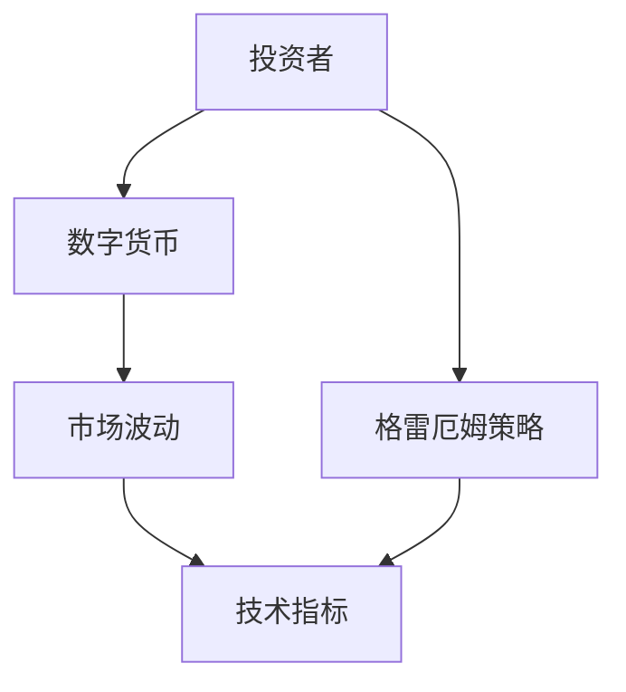
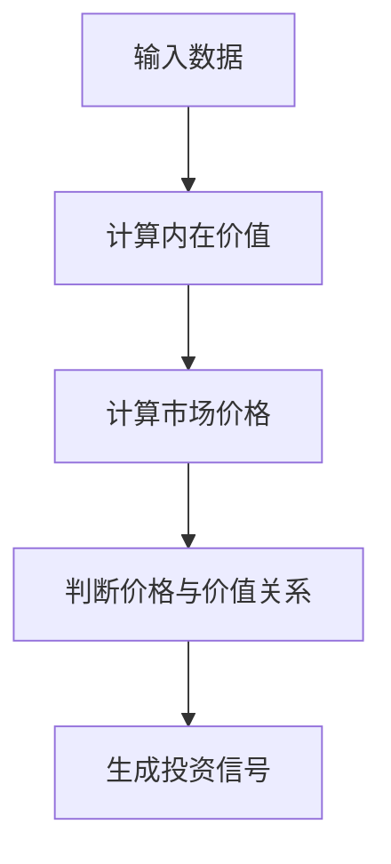
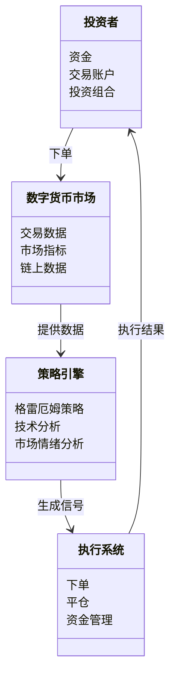
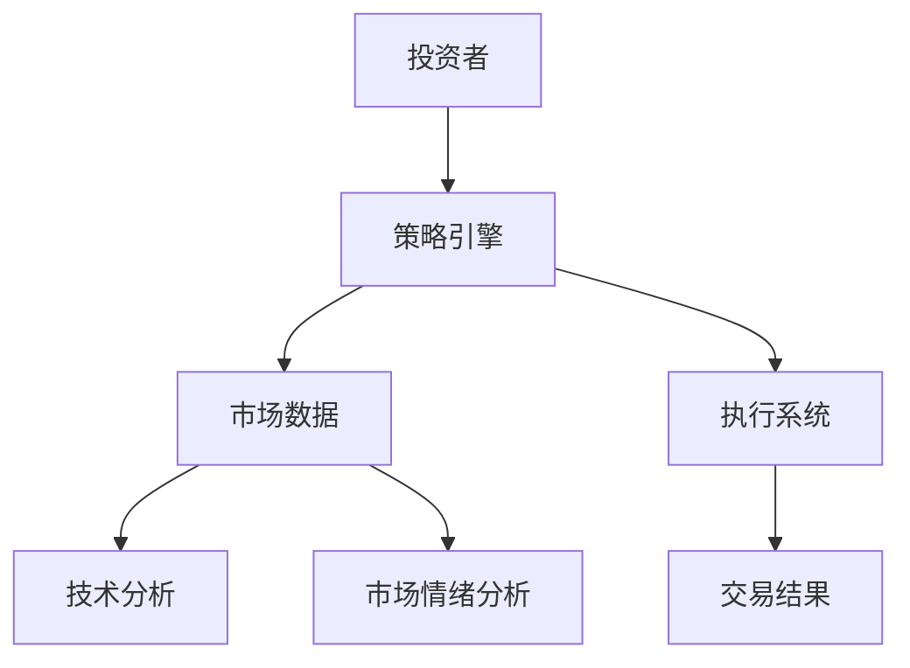

                 


# 格雷厄姆特价股票策略在不同数字货币竞争环境下的调整

> 关键词：格雷厄姆策略，数字货币，投资策略，市场分析，价值投资

> 摘要：本文将探讨格雷厄姆的价值投资策略在数字货币市场中的应用与调整。通过对数字货币市场特点的分析，结合格雷厄姆策略的核心理念，提出在不同竞争环境下的策略优化方法。本文将从背景介绍、核心概念、算法原理、系统架构、项目实战等多个方面展开详细分析。

---

## 第一部分: 格雷厄姆特价股票策略与数字货币市场的背景介绍

### 第1章: 格雷厄姆价值投资理论概述

#### 1.1 格雷厄姆价值投资的核心理念
格雷厄姆的价值投资理论是基于“安全边际”和“内在价值”的概念。他认为，投资者应以低于其内在价值的价格买入资产，并长期持有，以实现稳健的收益。

- **安全边际**：买入价格低于内在价值，确保投资的安全性。
- **内在价值**：资产在未来现金流的现值，与市场波动无关。
- **长期持有**：避免短期波动的影响，耐心等待价值实现。

#### 1.2 格雷厄姆投资策略的核心原则
格雷厄姆的策略强调：
1. 专注于基本面分析，而非市场情绪。
2. 寻找被市场低估的资产。
3. 分散投资以降低风险。
4. 长期持有，避免频繁交易。

### 第2章: 数字货币市场的特点与竞争环境

#### 2.1 数字货币市场的基本特点
数字货币市场相较于传统股票市场，具有以下特点：
- **高波动性**：市场价格波动剧烈，受市场情绪和技术指标影响较大。
- **去中心化**：交易不受传统金融机构的控制。
- **技术创新**：区块链技术的不断进化推动市场变化。
- **全球性**：24小时全球交易，无地域限制。

#### 2.2 数字货币市场的核心指标
在数字货币市场中，以下几个指标对投资者尤为重要：
- **市场资本化率（Market Cap）**：衡量市场的整体规模。
- **交易量（Volume）**：反映市场的活跃程度。
- **持币地址数（Address Count）**：分析市场参与度。
- **市场情绪指数（Sentiment Index）**：通过社交媒体和新闻判断市场情绪。

#### 2.3 格雷厄姆策略在数字货币市场中的适用性
传统股票市场与数字货币市场在以下几个方面存在显著差异：
- **市场波动性**：数字货币市场的波动远高于传统市场。
- **信息传播速度**：数字货币市场信息传播更快，市场反应更迅速。
- **市场参与者的多样性**：数字货币市场参与者包括机构投资者、散户和算法交易者。

### 第3章: 格雷厄姆策略在数字货币市场中的调整方向

#### 3.1 策略目标的调整
在数字货币市场中，格雷厄姆策略的目标需要调整为：
1. **短期套利机会**：利用市场波动性寻找短期收益。
2. **长期价值投资**：同时关注具有长期增长潜力的项目。

#### 3.2 策略工具的调整
- **技术分析**：引入K线图、成交量分析等技术指标。
- **市场情绪分析**：通过社交媒体和新闻数据判断市场情绪。
- **链上数据**：分析持币地址数、交易频率等链上指标。

#### 3.3 策略实施的调整
- **分散投资**：降低单一资产的风险。
- **动态调整**：根据市场变化及时调整投资组合。
- **风险管理**：设置止损点，控制最大回撤。

---

## 第二部分: 格雷厄姆策略在数字货币市场中的核心概念与联系

### 第4章: 核心概念与联系分析

#### 4.1 核心概念原理
格雷厄姆策略的核心原理是通过寻找低于内在价值的资产进行投资。在数字货币市场中，这一原理需要结合技术分析和市场情绪分析进行调整。

- **技术分析**：通过K线图、成交量等指标判断短期价格走势。
- **市场情绪分析**：通过社交媒体和新闻数据判断市场情绪，辅助判断价格波动的方向。

#### 4.2 核心概念属性特征对比表格
以下是格雷厄姆策略与数字货币市场的核心概念对比：

```mermaid
| 核心概念 | 格雷厄姆策略 | 数字货币市场 |
|---------|------------|-------------|
| 理论基础 | 价值投资   | 市场波动性   |
| 应用场景 | 传统股票   | 数字货币     |
| 调整重点 | 估值模型   | 技术指标     |
```

#### 4.3 ER实体关系图架构
以下是格雷厄姆策略与数字货币市场的实体关系图：



---

## 第三部分: 格雷厄姆策略在数字货币市场中的算法原理

### 第5章: 算法原理与数学模型

#### 5.1 算法原理
格雷厄姆策略在数字货币市场中的算法框架如下：



#### 5.2 数学模型
以下是格雷厄姆策略的数学模型：

$$
\text{内在价值} = \sum_{t=1}^{n} \frac{CF_t}{(1 + r)^t}
$$

其中：
- \( CF_t \) 是第 \( t \) 年的现金流。
- \( r \) 是折现率。

当市场价格低于内在价值时，触发买入信号。

---

## 第四部分: 格雷厄姆策略在数字货币市场中的系统架构设计

### 第6章: 系统架构设计

#### 6.1 系统功能设计
以下是系统功能设计的类图：



#### 6.2 系统架构设计
以下是系统架构设计的架构图：



---

## 第五部分: 格雷厄姆策略在数字货币市场中的项目实战

### 第7章: 项目实战

#### 7.1 环境安装
以下是项目实战的环境安装步骤：

1. 安装Python和必要的库（如Pandas、Matplotlib、Scikit-learn）。
2. 下载数字货币市场数据（如K线数据、链上数据）。
3. 配置交易账户和API。

#### 7.2 核心实现代码
以下是核心实现代码示例：

```python
import pandas as pd
import numpy as np

# 加载数据
data = pd.read_csv('market_data.csv')

# 计算内在价值
def calculate_intrinsic_value(data):
    cash_flows = data['CF']
    discount_rate = 0.1
    present_value = sum(cash_flows / (1 + discount_rate)**i for i in range(len(cash_flows)))
    return present_value

# 判断买入信号
def generate_signal(data, threshold):
    price = data['Price']
    value = calculate_intrinsic_value(data)
    if price < value:
        return '买入'
    else:
        return '观望'

# 示例调用
data = pd.DataFrame({
    'Price': [10, 20, 30],
    'CF': [100, 200, 300]
})
print(generate_signal(data, 0.9))
```

#### 7.3 案例分析
以下是实际案例分析：

假设我们选择比特币作为投资标的，根据格雷厄姆策略，我们计算其内在价值，并与市场价格进行比较。当市场价格低于内在价值时，我们选择买入。

---

## 小结

本文详细探讨了格雷厄姆策略在数字货币市场中的应用与调整。通过分析数字货币市场的特点，结合格雷厄姆策略的核心理念，提出了在不同竞争环境下的策略优化方法。我们通过技术分析、市场情绪分析和链上数据分析，构建了一个完整的系统架构，并通过实际案例展示了策略的实现过程。

---

## 注意事项

1. **风险管理**：在实际操作中，投资者应严格控制风险，设置止损点。
2. **数据质量**：数据的准确性和及时性对策略的有效性至关重要。
3. **策略调整**：市场环境不断变化，投资者需要根据实际情况调整策略。

---

## 最佳实践 Tips

1. **分散投资**：降低单一资产的风险。
2. **长期持有**：耐心等待价值实现。
3. **持续学习**：关注市场动态和技术发展。

---

## 拓展阅读

1. **《The Intelligent Investor》**：格雷厄姆的经典著作，深入阐述价值投资理念。
2. **《Digital Asset Exchange》**：了解数字货币市场的运作机制。
3. **《Algorithmic Trading》**：学习算法交易的技术与策略。

---

作者：AI天才研究院/AI Genius Institute & 禅与计算机程序设计艺术 /Zen And The Art of Computer Programming

