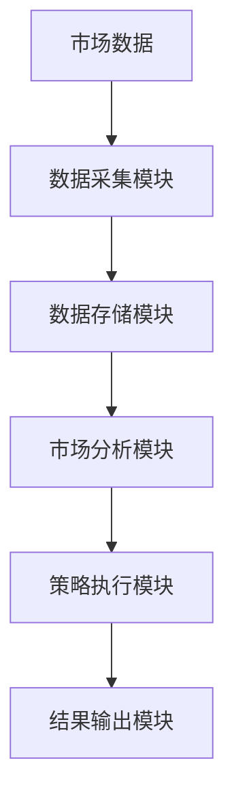
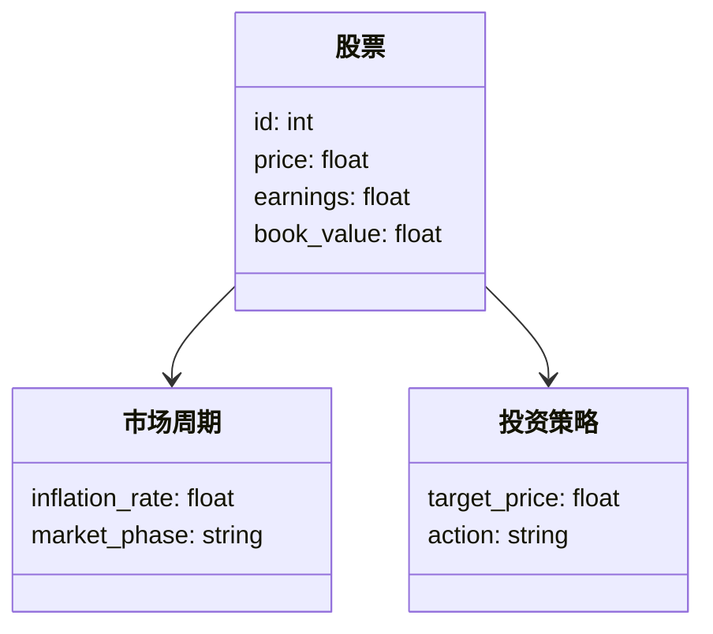

                 


# 格雷厄姆特价股票策略在不同数字通胀与通缩周期环境中的效果

## 关键词：
- 格雷厄姆投资理论
- 特价股票策略
- 数字通胀
- 数字通缩
- 市场周期分析

## 摘要：
本文探讨了格雷厄姆的特价股票策略在数字通胀和通缩周期中的应用效果。通过分析经济周期对股市的影响，结合数学模型和系统架构设计，展示了如何优化投资策略。文章详细讲解了策略的数学模型、系统架构，并通过实际案例验证了策略的有效性，为投资者提供了实用的指导。

---

## 第一部分：格雷厄姆投资理论与特价股票策略

### 第1章：格雷厄姆投资理论与特价股票策略

#### 1.1 格雷厄姆投资理论的核心思想

##### 1.1.1 价值投资的基本原理
格雷厄姆的价值投资理论强调以低于股票内在价值的价格买入股票。他认为市场先生（Market先生）的情绪波动为投资者提供了机会，尤其是在市场恐慌时，优质股票可能被低估。

##### 1.1.2 特价股票的定义与特征
特价股票是指市场价格低于其内在价值的股票。这些股票通常具有较高的安全边际，适合长期投资。格雷厄姆关注的是企业的基本面，而非市场的短期波动。

##### 1.1.3 格雷厄姆策略的历史背景
格雷厄姆的投资策略诞生于20世纪初，经历了多次经济周期的考验。他的方法在1929年大萧条和后续的经济危机中表现出了较强的抗跌性。

#### 1.2 数字通胀与通缩周期的基本概念

##### 1.2.1 数字通胀的定义与表现形式
数字通胀是指在数字经济环境下，货币供应量增加导致的价格水平上升。这通常由央行的货币政策、技术创新和市场需求变化引起。

##### 1.2.2 数字通缩的定义与表现形式
数字通缩是指在数字经济环境下，货币供应量减少或技术进步导致价格水平下降。这种情况可能由紧缩性货币政策、技术瓶颈突破或市场供过于求引起。

##### 1.2.3 通胀与通缩周期对股市的影响
在通胀周期，高通胀可能导致股市波动加剧，企业成本上升，利润减少。在通缩周期，需求下降可能导致企业盈利下滑，但低通胀也可能带来货币政策宽松，股市可能反弹。

#### 1.3 格雷厄姆策略在数字经济中的适用性

##### 1.3.1 数字经济时代投资环境的变化
数字经济时代，企业的价值评估需要考虑技术、数据和商业模式等因素。传统的财务指标可能不足以反映企业的真正价值。

##### 1.3.2 格雷厄姆策略的现代应用
格雷厄姆策略的核心思想依然适用，但需要结合数字经济的特点进行调整。例如，关注具有强大护城河和技术优势的企业。

##### 1.3.3 特价股票策略的核心目标与边界
格雷厄姆策略的目标是通过购买廉价股票获得超额收益。在数字经济中，这需要结合企业创新能力、市场份额和财务健康状况进行综合评估。

---

### 第2章：格雷厄姆策略的数学模型与算法原理

#### 2.1 格雷厄姆策略的数学模型

##### 2.1.1 股票内在价值的计算公式
格雷厄姆的内在价值计算公式：
$$ V = \frac{E}{P} $$
其中，V为股票的内在价值，E为每股收益，P为市盈率。

##### 2.1.2 市盈率与市净率的对比分析
市盈率（P/E）和市净率（P/B）是常用的估值指标：
$$ P/E = \frac{Price}{Earnings} $$
$$ P/B = \frac{Price}{Book\ Value} $$

通过对比P/E和P/B，可以评估股票的相对价值。

#### 2.2 数字通胀与通缩周期的量化指标

##### 2.2.1 通胀率的计算公式
$$ Inflation\ Rate = \frac{CPI_{current} - CPI_{previous}}{CPI_{previous}} \times 100\% $$

##### 2.2.2 通缩率的计算公式
$$ Deflation\ Rate = \frac{CPI_{previous} - CPI_{current}}{CPI_{previous}} \times 100\% $$

##### 2.2.3 市场周期判断模型
通过CPI指数和GDP增长率判断市场所处的周期阶段。

#### 2.3 格雷厄姆策略在不同周期中的适用性分析

##### 2.3.1 通货膨胀周期中的策略调整
在通胀周期，应选择具有较强抗通胀能力的行业，如能源和原材料。同时，提高安全边际，避免高估值股票。

##### 2.3.2 通货紧缩周期中的策略优化
在通缩周期，应关注具有高分红和稳定收益的企业。同时，利用市场低估的机会，增加仓位。

##### 2.3.3 综合模型的构建与验证
结合通胀/通缩指标和股票估值指标，构建综合模型，判断策略的有效性。

---

### 第3章：格雷厄姆策略在数字通胀与通缩周期中的系统架构设计

#### 3.1 系统功能设计

##### 3.1.1 数据采集模块
收集市场数据，包括股票价格、财务指标、通胀指数等。

##### 3.1.2 市场分析模块
分析市场周期，判断当前所处的经济环境。

##### 3.1.3 策略执行模块
根据分析结果，执行买入或卖出操作。

#### 3.2 系统架构设计

##### 3.2.1 数据流图


##### 3.2.2 实体关系图


#### 3.3 系统接口设计

##### 3.3.1 数据接口
提供API接口，供数据采集模块调用。

##### 3.3.2 策略接口
定义策略执行模块的接口，包括买入和卖出操作。

##### 3.3.3 输

---

## 第四部分：项目实战与案例分析

### 第4章：格雷厄姆策略的实战应用

#### 4.1 项目环境安装
安装必要的金融分析工具和数据源，如Python的pandas和numpy库。

#### 4.2 核心实现代码

##### 4.2.1 数据采集模块
```python
import pandas as pd

def get_stock_data(tickers):
    data = pd.DataFrame()
    for ticker in tickers:
        data[ticker] = pd.get_dataYahoo(ticker)
    return data
```

##### 4.2.2 市场周期判断
```python
def get_inflation_rate(previous_cpi, current_cpi):
    return ((current_cpi - previous_cpi) / previous_cpi) * 100
```

##### 4.2.3 策略执行模块
```python
def graham_strategy(stock_data, inflation_rate):
    undervalued_stocks = []
    for ticker in stock_data.columns:
        pe = stock_data[ticker]['pe']
        pb = stock_data[ticker]['pb']
        if (pe < 15 or pb < 2) and inflation_rate < 5:
            undervalued_stocks.append(ticker)
    return undervalued_stocks
```

#### 4.3 实际案例分析

##### 4.3.1 2008年金融危机后的市场
在2008年金融危机后，通缩压力增大，格雷厄姆策略帮助投资者找到低估的股票，如某些金融企业的股票。

##### 4.3.2 数字经济时代的案例
在数字经济时代，选择具有强大技术优势和护城河的企业，如科技巨头，可能表现更好。

#### 4.4 项目小结
通过实战案例验证了格雷厄姆策略的有效性，特别是在通缩周期中表现突出。

---

## 第五部分：总结与展望

### 第5章：总结与展望

#### 5.1 核心总结
格雷厄姆策略在不同经济周期中表现各异，但在数字经济时代依然具有较强的适用性。通过系统架构设计和数学模型优化，可以进一步提升策略的有效性。

#### 5.2 投资策略优化建议
根据市场环境调整策略，注重企业基本面和市场周期的结合，同时利用技术手段优化投资决策。

#### 5.3 未来展望
随着数字化转型的深入，格雷厄姆策略需要不断创新，结合新兴技术和市场变化，为投资者提供更有效的指导。

---

## 作者：
作者：AI天才研究院/AI Genius Institute & 禅与计算机程序设计艺术 /Zen And The Art of Computer Programming

