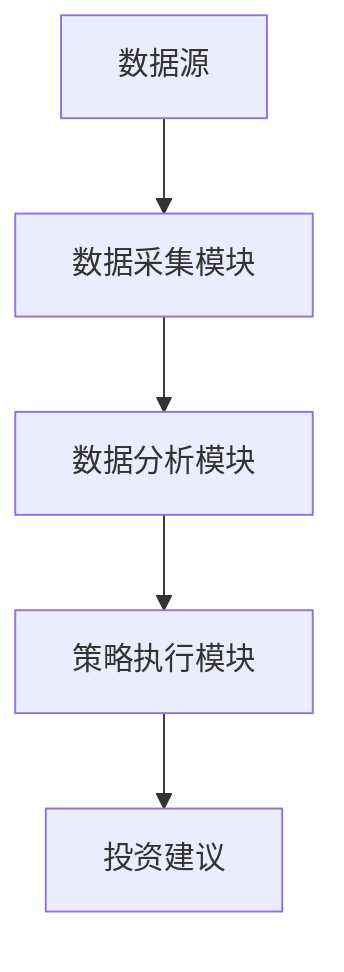

                 

# 格雷厄姆特价股票策略在不同数字通胀与通缩预期环境中的效果

> 关键词：格雷厄姆策略，数字通胀，通缩预期，股票投资，价值投资

> 摘要：本文深入分析了格雷厄姆的价值投资策略在不同经济环境下（数字通胀与通缩）的应用效果。通过数学模型和系统架构设计，探讨了格雷厄姆策略在不同经济周期中的表现，并结合实际案例进行详细解读，为投资者提供了科学的决策依据。

---

# 第1章: 格雷厄姆投资理论的核心概念

## 1.1 价值投资的定义与核心理念

价值投资是一种基于对公司内在价值评估的投资策略，强调以低于内在价值的价格买入优质资产。格雷厄姆的价值投资理论主要包括以下几个核心概念：

1. **安全边际**：买入价格远低于内在价值，以降低风险。
2. **内在价值**：基于公司基本面分析得出的合理估值。
3. **长期视角**：关注长期收益，而非短期波动。

### 核心公式：内在价值计算

$$ V = \frac{E}{(1 - g)} $$

其中，\( V \) 为内在价值，\( E \) 为年收益，\( g \) 为增长率。

## 1.2 特价股票的识别标准

格雷厄姆的特价股票筛选标准包括以下几个方面：

1. **低市盈率（P/E）**：通常低于市场平均水平。
2. **低市净率（P/B）**：低于行业平均水平。
3. **高股息率**：股息收入占股价比例较高。
4. **财务健康状况**：低负债率，稳定的收益来源。

## 1.3 数字通胀与通缩的经济背景

### 1.3.1 数字通胀的定义与特征

数字通胀是指由于货币供应增加、技术进步或市场预期变化等因素导致价格水平普遍上涨。其主要特征包括：

- 货币供应量增加。
- 资产价格泡沫化。
- 消费者价格指数（CPI）上升。

### 1.3.2 数字通缩的定义与特征

数字通缩是指价格水平普遍下降，通常发生在经济衰退或技术瓶颈突破时。其主要特征包括：

- 货币供应量减少。
- 资产价格下跌。
- 消费者价格指数（CPI）下降。

### 1.3.3 经济周期对股市的影响

经济周期波动对股市有直接影响，尤其是通胀和通缩环境对股票估值的影响更为显著。在通胀环境下，企业盈利能力可能下降，但在通缩环境下，企业可能面临更大的经营压力。

---

# 第2章: 格雷厄姆策略在数字通胀环境中的应用

## 2.1 通胀环境下股票估值的变化

### 2.1.1 股票估值的变化

在通胀环境下，企业的盈利能力和股价可能会受到双重影响。一方面，通胀可能导致企业成本上升，利润下降；另一方面，通胀预期可能导致投资者要求更高的回报率，从而压低股价。

### 2.1.2 格雷厄姆策略的适用性分析

在通胀环境下，格雷厄姆的低市盈率和低市净率策略仍然有效，但需要调整筛选标准，以适应通胀环境下的估值变化。例如，可以适当降低市盈率和市净率的门槛，以避免高估。

### 2.1.3 通胀环境下的选股策略优化

在通胀环境下，建议投资者关注以下行业：

1. **防御性行业**：如公用事业、医疗保健等，这些行业的需求相对稳定。
2. **周期性行业**：如能源、原材料等，这些行业可能在通胀初期受益。

---

# 第3章: 格雷厄姆策略在数字通缩环境中的应用

## 3.1 通缩环境下股票估值的变化

### 3.1.1 股票估值的变化

在通缩环境下，企业的盈利能力可能进一步受到挤压，但由于成本下降，部分行业可能会受益。此外，通缩可能导致市场情绪低迷，股价被低估。

### 3.1.2 格雷厄姆策略的适用性分析

在通缩环境下，格雷厄姆的策略仍然适用，但需要关注企业的盈利能力和财务健康状况。由于通缩可能导致企业利润下降，因此需要更加严格地筛选财务健康的企业。

### 3.1.3 通缩环境下的选股策略优化

在通缩环境下，建议投资者关注以下行业：

1. **防御性行业**：如公用事业、医疗保健等。
2. **具有竞争优势的企业**：如龙头公司，这些公司在通缩环境中更具竞争力。

---

# 第4章: 格雷厄姆策略的数学模型与公式

## 4.1 格雷厄姆策略的核心公式

### 4.1.1 内在价值公式

$$ V = \frac{E}{(1 - g)} $$

其中，\( V \) 为内在价值，\( E \) 为年收益，\( g \) 为增长率。

### 4.1.2 市盈率公式

$$ P/E = \frac{P}{E} $$

其中，\( P \) 为股价，\( E \) 为每股收益。

## 4.2 数字通胀通缩环境下的模型调整

### 4.2.1 通胀环境下的模型调整

在通胀环境下，需要调整内在价值模型，考虑通胀对收益和成本的影响。例如，可以通过引入通胀预期因子来调整增长率 \( g \)。

$$ V_{\text{inflation}} = \frac{E \times (1 + \pi)}{1 - g} $$

其中，\( \pi \) 为通胀率。

### 4.2.2 通缩环境下的模型调整

在通缩环境下，同样需要考虑通缩对收益和成本的影响。例如，可以通过引入通缩预期因子来调整增长率 \( g \)。

$$ V_{\text{deflation}} = \frac{E \times (1 - \pi)}{1 - g} $$

其中，\( \pi \) 为通缩率。

---

# 第5章: 格雷厄姆策略的系统架构与实现

## 5.1 系统架构设计

### 5.1.1 系统功能模块

1. **数据采集模块**：收集股票数据、经济指标等。
2. **数据分析模块**：计算市盈率、市净率等指标。
3. **策略执行模块**：根据格雷厄姆策略筛选股票并生成投资建议。

### 5.1.2 系统架构图

---

# 第6章: 实战案例分析

## 6.1 通胀环境下的案例分析

### 6.1.1 案例背景

假设当前处于通胀环境，CPI上涨，市场预期利率上升。

### 6.1.2 策略筛选

使用格雷厄姆策略筛选低市盈率、低市净率的股票，重点关注防御性行业。

### 6.1.3 投资组合构建

根据筛选结果，构建投资组合，分散投资以降低风险。

## 6.2 通缩环境下的案例分析

### 6.2.1 案例背景

假设当前处于通缩环境，CPI下降，市场预期利率下降。

### 6.2.2 策略筛选

使用格雷厄姆策略筛选具有竞争优势的公司，重点关注防御性行业。

### 6.2.3 投资组合构建

根据筛选结果，构建投资组合，注重企业的财务健康状况。

---

# 第7章: 总结与展望

## 7.1 本文总结

本文系统性地分析了格雷厄姆价值投资策略在不同经济环境下的应用效果，通过数学模型和系统架构设计，为投资者提供了科学的决策依据。

## 7.2 最佳实践 tips

1. 在通胀环境下，关注防御性行业和低市盈率股票。
2. 在通缩环境下，关注具有竞争优势的企业。
3. 定期调整投资组合，以适应经济环境的变化。

## 7.3 未来展望

未来的研究可以进一步结合机器学习和大数据技术，优化格雷厄姆策略在不同经济环境下的应用效果。

---

# 作者：AI天才研究院 & 禅与计算机程序设计艺术

---

通过本文的详细分析，读者可以更好地理解格雷厄姆价值投资策略在不同经济环境下的应用，并能够在实际投资中灵活运用这些策略。

