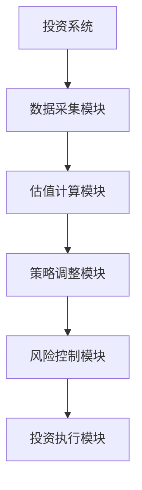
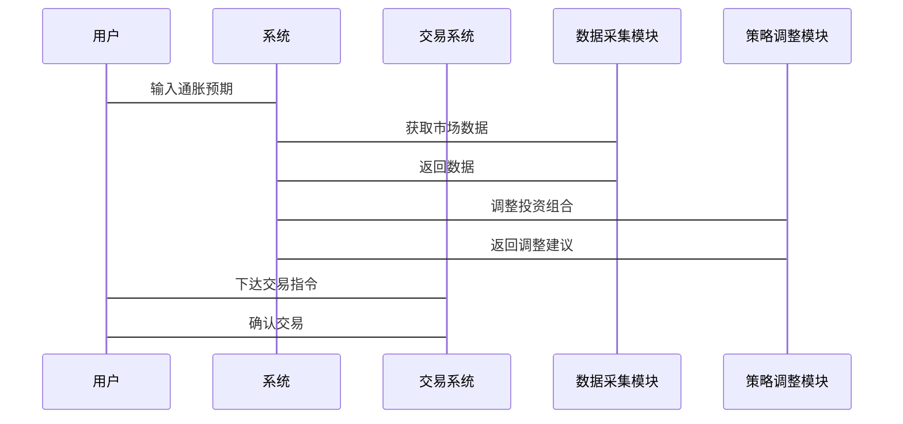

                 


# 格雷厄姆特价股票策略在不同数字通胀预期环境中的效果

> **关键词**：格雷厄姆策略，数字通胀，特价股票，投资策略，经济模型

> **摘要**：本文探讨了格雷厄姆特价股票策略在不同数字通胀预期环境下的表现和效果。通过分析数字通胀对经济和股票市场的影响，结合格雷厄姆投资理论，本文提出在数字通胀环境下调整投资策略的方法，并通过数学模型和实际案例验证其有效性。文章还讨论了数字通胀对投资策略的影响，以及如何在数字通胀环境下优化投资组合，降低风险，实现长期收益。

---

## 第1章：背景介绍

### 1.1 格雷厄姆投资理论的核心理念

格雷厄姆是价值投资的鼻祖，其核心理念是寻找市场估值低于内在价值的股票，长期持有，等待市场回归理性。格雷厄姆策略强调安全边际，即买入价格远低于内在价值的股票，以降低投资风险。

#### 格雷厄姆策略的核心要素

| 核心要素 | 描述 |
|----------|------|
| 安全边际 | 买入价格低于内在价值的部分，确保即使市场波动，也能避免重大损失。 |
| 内在价值 | 股票的真实价值，基于公司财务状况和未来盈利能力计算。 |
| 市场估值 | 市场对股票的定价，通常受情绪和短期因素影响。 |

### 1.2 数字通胀的背景与影响

数字通胀是指数字货币（如比特币）或由技术驱动的通货膨胀现象。数字通胀的影响包括货币贬值、资产价格波动和经济不确定性增加。本文将分析数字通胀对格雷厄姆策略的影响，并探讨在不同通胀预期下的策略调整方法。

---

## 第2章：数字通胀的经济分析

### 2.1 数字通胀对股票市场的潜在影响

数字通胀可能导致货币供应增加，进而推高资产价格。然而，这种影响并非线性，且不同行业和公司的股票可能受到不同影响。

#### 数字通胀对股票价格的影响机制

| 机制 | 描述 |
|------|------|
| 货币供应增加 | 刺激投资需求，推高股价。 |
| 利率下降 | 降低融资成本，企业盈利改善，股价上升。 |
| 通货膨胀预期 | 投资者寻求更高回报，可能导致股市泡沫。 |

### 2.2 格雷厄姆策略在数字通胀环境中的适用性

数字通胀可能导致市场波动加剧，传统格雷厄姆策略可能需要调整。例如，增加对防御性股票的配置，或者缩短投资期限。

---

## 第3章：格雷厄姆特价股票策略的数学模型与分析

### 3.1 格雷厄姆策略的核心数学模型

格雷厄姆策略依赖于以下几个关键指标：

1. **市净率（P/B）**：股价与每股净资产的比率。格雷厄姆建议买入P/B小于2的股票。
2. **市盈率（P/E）**：股价与每股收益的比率。格雷厄姆建议买入P/E低于15的股票。
3. **股息率**：股价与每股股息的比率。格雷厄姆建议买入股息率高于5%的股票。

#### 数学模型对比分析

| 指标 | 定义 | 适用场景 |
|------|------|----------|
| P/B | 股价/每股净资产 | 评估资产安全性 |
| P/E | 股价/每股收益 | 评估成长潜力 |
| 股息率 | 每股股息/股价 | 评估收益稳定性 |

---

## 第4章：数字通胀环境下的策略调整

### 4.1 数字通胀对格雷厄姆策略的影响

数字通胀可能导致以下问题：

1. **货币贬值**：购买力下降，影响股票的实际回报。
2. **市场波动**：通胀预期可能导致股价短期剧烈波动。
3. **估值偏差**：传统估值指标可能失效，需调整安全边际。

#### 策略调整方法

| 调整措施 | 描述 |
|----------|------|
| 提高安全边际 | 买入价格低于内在价值30%以上的股票。 |
| 优化资产配置 | 增加抗通胀资产（如黄金、房地产信托）的配置。 |
| 灵活调整仓位 | 根据通胀预期变化，动态调整股票仓位。 |

---

## 第5章：系统分析与架构设计方案

### 5.1 问题场景介绍

在数字通胀环境下，如何实时监控市场变化，动态调整投资组合，是投资者面临的重要挑战。本文提出一个基于格雷厄姆策略的自动化投资系统，能够根据通胀预期和市场数据，自动优化投资组合。

### 5.2 系统功能设计

- **数据采集模块**：实时采集市场数据，包括股价、通胀指标等。
- **估值计算模块**：根据格雷厄姆模型计算股票的内在价值。
- **策略调整模块**：根据通胀预期和市场变化，调整投资组合。
- **风险控制模块**：实时监控市场风险，触发止损机制。

### 5.3 系统架构设计

以下为系统的架构图：



### 5.4 系统接口设计

- 数据接口：从金融数据源获取实时数据。
- 用户接口：提供通胀预期输入和投资组合调整建议。
- 执行接口：向交易系统发送买卖指令。

### 5.5 系统交互设计

以下为系统的交互流程图：



---

## 第6章：项目实战

### 6.1 环境安装

需要安装以下工具：

- Python 3.8+
- Pandas, NumPy, Matplotlib 等数据分析库。
- 金融数据API（如Yahoo Finance API）。

### 6.2 核心代码实现

以下是一个基于格雷厄姆策略的Python实现示例：

```python
import pandas as pd
import numpy as np

# 示例数据：假设我们有股票的市盈率和市净率数据
data = {
    '股票代码': ['AAPL', 'GOOGL', 'MSFT'],
    'P/E': [15, 16, 14],
    'P/B': [3, 2.5, 4]
}

df = pd.DataFrame(data)

# 格雷厄姆筛选条件：P/E < 15 且 P/B < 2
selected_stocks = df[(df['P/E'] < 15) & (df['P/B'] < 2)]
print("符合条件的股票：", selected_stocks['股票代码'].tolist())
```

### 6.3 代码解读与分析

上述代码从数据源获取股票的P/E和P/B比率，筛选出符合格雷厄姆条件的股票。在数字通胀环境下，可以进一步加入通胀预期指标，动态调整筛选条件。

### 6.4 实际案例分析

假设当前通胀预期较高，我们可以调整筛选条件，降低P/E和P/B的阈值，以提高安全边际。

### 6.5 项目小结

通过代码实现，我们可以自动化筛选符合格雷厄姆策略的股票，并根据通胀预期动态调整策略，提高投资效率。

---

## 第7章：最佳实践与小结

### 7.1 最佳实践

- 定期回顾和调整投资组合，以适应市场变化。
- 结合技术分析和基本面分析，制定更全面的投资策略。
- 使用自动化工具，提高投资效率和决策准确性。

### 7.2 小结

本文系统地分析了格雷厄姆特价股票策略在数字通胀环境下的表现，并提出了相应的调整方法。通过数学模型和系统设计，帮助投资者在不同经济环境下优化投资组合，降低风险，实现长期收益。

### 7.3 注意事项

- 数字通胀的影响具有不确定性，需谨慎评估。
- 投资需结合市场实际情况，避免机械套用模型。
- 定期复盘和调整策略，以应对市场变化。

### 7.4 拓展阅读

- 格雷厄姆的《证券分析》
- 现代投资组合理论
- 数字通胀与货币政策的相关研究

---

**作者：AI天才研究院/AI Genius Institute & 禅与计算机程序设计艺术 /Zen And The Art of Computer Programming**

