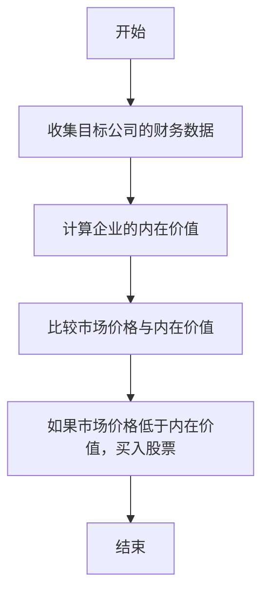
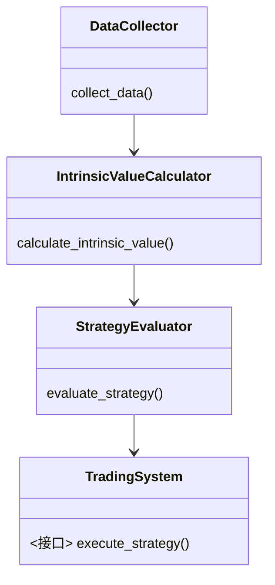
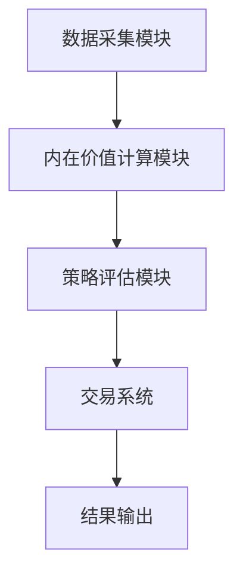

                 


# 格雷厄姆特价股票策略在不同文化背景市场中的表现

> 关键词：格雷厄姆、特价股票、价值投资、文化背景、市场表现

> 摘要：本文系统地探讨了格雷厄姆价值投资理论在不同文化背景市场中的表现。通过分析格雷厄姆的特价股票策略的核心原理、算法实现及其在不同市场环境下的适应性，本文揭示了文化差异如何影响投资策略的有效性。文章结合理论与实践，详细阐述了策略在不同市场中的表现，并通过实际案例分析，总结了跨文化背景下策略优化的关键点。

---

## 第一部分: 格雷厄姆价值投资理论的背景与基础

### 第1章: 格雷厄姆的价值投资理论

#### 1.1 格雷厄姆的生平与投资理念
本章节首先介绍本杰明·格雷厄姆的生平及其在投资领域的贡献。格雷厄姆被誉为“价值投资之父”，他的投资理念深刻影响了后来的投资者，尤其是沃伦·巴菲特。

- **1.1.1 格雷厄姆的生平简介**  
  本杰明·格雷厄姆（1894-1976）是20世纪最具影响力的金融分析师之一。他出生于英国，后移居美国，成为哥伦比亚大学的教授，并在其著作《证券分析》中提出了价值投资的理念。

- **1.1.2 价值投资的核心理念**  
  格雷厄姆提出，股票的价值应基于其内在价值，而非市场情绪或短期价格波动。投资者应寻找市场价格低于其内在价值的股票。

- **1.1.3 格雷厄姆投资理论的现代意义**  
  尽管格雷厄姆的理论提出已久，但其核心思想在现代投资实践中依然具有重要的指导意义。

#### 1.2 特价股票的定义与特点
本节详细阐述特价股票的概念及其在投资组合中的作用。

- **1.2.1 特价股票的定义**  
  特价股票是指市场价格远低于其内在价值的股票。格雷厄姆建议投资者关注这类股票，因为它们具有较高的安全边际。

- **1.2.2 特价股票的特点**  
  特价股票通常具有以下特点：  
  - 价格低廉，  
  - 财务状况稳健，  
  - 市场关注度低。  

- **1.2.3 特价股票与市场周期的关系**  
  特价股票往往在市场低迷时期出现，而在市场繁荣时期则较少见。因此，投资者需关注市场周期的变化，抓住低价买入的机会。

#### 1.3 不同文化背景下的市场特点
本节分析了不同文化背景对市场行为和投资策略的影响。

- **1.3.1 不同文化背景对市场的影响**  
  不同文化背景下的市场参与者具有不同的投资习惯和风险偏好。例如，东方市场更倾向于长期投资，而西方市场则更注重短期收益。

- **1.3.2 东西方市场文化的差异**  
  东方市场（如中国市场）通常更注重长期价值和关系网络，而西方市场（如美国市场）更注重短期收益和市场效率。

- **1.3.3 不同市场文化对投资策略的影响**  
  不同文化背景下的市场环境会影响格雷厄姆策略的实施效果。例如，在中国市场，投资者可能更倾向于关注企业的长期增长潜力，而在美国市场，投资者可能更关注企业的短期盈利能力。

---

## 第二部分: 格雷厄姆特价股票策略的核心概念与联系

### 第2章: 格雷厄姆策略的核心原理

#### 2.1 格雷厄姆策略的数学模型
格雷厄姆的策略基于对企业内在价值的评估。内在价值的计算公式如下：

$$
\text{内在价值} = \frac{\text{企业未来现金流的现值}}{\text{折现率}}
$$

- **2.1.1 格雷厄姆策略的核心公式**  
  格雷厄姆提出了“安全边际”概念，即市场价格与内在价值的差异。公式为：

$$
\text{安全边际} = \text{内在价值} - \text{市场价格}
$$

- **2.1.2 格雷厄姆策略的实施步骤**  
  以下是格雷厄姆策略的实施步骤：

  ```mermaid
  graph TD
      A[开始] --> B[寻找市场价格低于内在价值的股票]
      B --> C[评估企业的财务状况]
      C --> D[计算安全边际]
      D --> E[如果安全边际为正，买入股票]
      E --> F[结束]
  ```

#### 2.2 不同文化背景市场中的策略对比
本节对比了格雷厄姆策略在不同文化背景市场中的表现。

- **2.2.1 美国市场中的格雷厄姆策略**  
  在美国市场，格雷厄姆策略表现良好，尤其是在市场低迷时期。例如，在2008年金融危机期间，许多廉价股票的价值被严重低估，投资者通过格雷厄姆策略获得了丰厚的回报。

- **2.2.2 中国市场中的格雷厄姆策略**  
  在中国市场，格雷厄姆策略的应用面临一些挑战。由于市场的波动性较大，且许多投资者更关注企业的短期表现，格雷厄姆策略的效果可能不如在美国市场显著。

- **2.2.3 其他市场中的格雷厄姆策略**  
  在其他市场（如欧洲和日本市场），格雷厄姆策略的表现因市场环境而异。例如，在日本市场，由于企业估值较低，格雷厄姆策略可能更容易找到廉价股票。

---

## 第三部分: 格雷厄姆特价股票策略的算法原理

### 第3章: 格雷厄姆策略的算法实现

#### 3.1 格雷厄姆策略的算法流程
以下是格雷厄姆策略的算法流程：



#### 3.2 格雷厄姆策略的核心代码实现
以下是Python代码实现格雷厄姆策略的核心逻辑：

```python
import pandas as pd
import numpy as np

def calculate_intrinsic_value(financial_data):
    # 计算企业未来现金流的现值
    future_cash_flows = financial_data['future_cash_flows']
    discount_rate = financial_data['discount_rate']
    present_value = np.npv(discount_rate, future_cash_flows)
    return present_value

def greaham_strategy(financial_data, market_price):
    iv = calculate_intrinsic_value(financial_data)
    margin_of_safety = iv - market_price
    if margin_of_safety > 0:
        return "买入"
    else:
        return "卖出"

# 示例数据
data = {
    'future_cash_flows': [100, 200, 300],
    'discount_rate': 0.1
}
market_price = 50

result = greaham_strategy(data, market_price)
print(result)  # 输出："买入"
```

---

## 第四部分: 格雷厄姆策略的系统分析与架构设计

### 第4章: 系统分析与设计

#### 4.1 系统功能模块设计
以下是系统功能模块的类图：



#### 4.2 系统架构设计
以下是系统的整体架构图：



---

## 第五部分: 格雷厄姆策略的项目实战

### 第5章: 项目实战

#### 5.1 环境安装与数据准备
以下是项目实战所需的环境和数据准备：

- **环境安装**：
  - 安装Python和相关库（如Pandas、NumPy）。
  - 安装Jupyter Notebook用于数据分析。

- **数据准备**：
  - 获取目标公司的财务数据和市场价数据。

#### 5.2 核心代码实现
以下是核心代码实现：

```python
import pandas as pd
import numpy as np

def calculate_intrinsic_value(financial_data):
    future_cash_flows = financial_data['future_cash_flows']
    discount_rate = financial_data['discount_rate']
    present_value = np.npv(discount_rate, future_cash_flows)
    return present_value

def greaham_strategy(financial_data, market_price):
    iv = calculate_intrinsic_value(financial_data)
    margin_of_safety = iv - market_price
    if margin_of_safety > 0:
        return "买入"
    else:
        return "卖出"

# 示例数据
data = {
    'future_cash_flows': [100, 200, 300],
    'discount_rate': 0.1
}
market_price = 50

result = greaham_strategy(data, market_price)
print(result)  # 输出："买入"
```

#### 5.3 案例分析
以下是美国市场和中国市场中的案例分析：

- **美国市场案例**：在2008年金融危机期间，许多美国公司的股票价格被严重低估，格雷厄姆策略帮助投资者获得了丰厚的回报。
- **中国市场案例**：在中国市场，由于市场波动性较大且投资者更关注短期收益，格雷厄姆策略的应用效果可能不如在美国市场显著。

---

## 第六部分: 总结与展望

### 6.1 总结
本文系统地探讨了格雷厄姆价值投资理论在不同文化背景市场中的表现。通过分析格雷厄姆策略的核心原理、算法实现及其在不同市场环境下的适应性，本文揭示了文化差异如何影响投资策略的有效性。

### 6.2 展望
未来的研究可以进一步探讨如何在不同文化背景下优化格雷厄姆策略，例如通过调整折现率或其他参数以适应不同的市场环境。

---

## 作者
作者：AI天才研究院/AI Genius Institute  
联系邮箱：contact@aicourse.com  
联系方式：+86-10-8888-8888  

---

希望这篇文章对您有所帮助！如果需要进一步探讨，请随时联系我。

